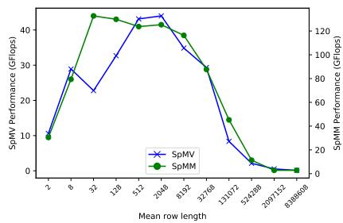
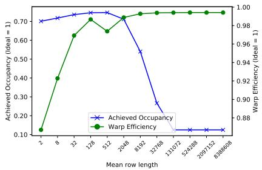
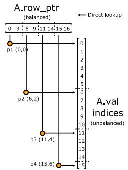
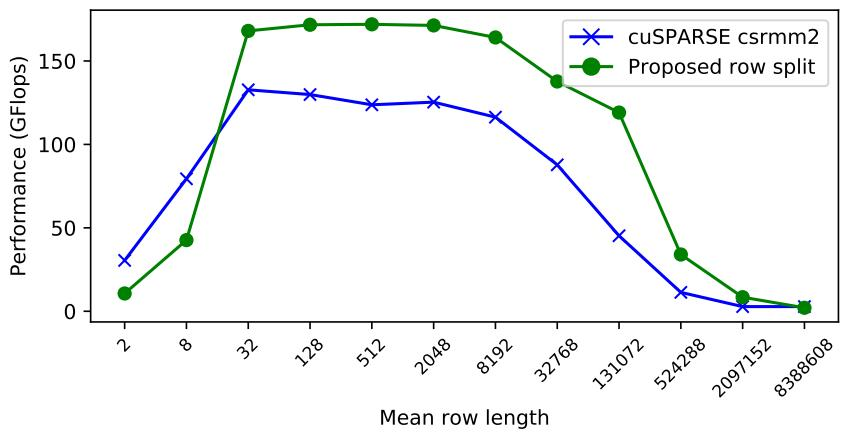
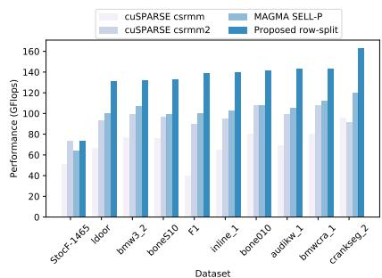
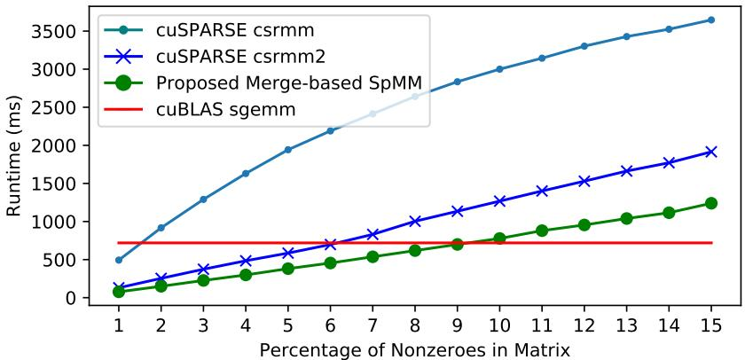

# Design Principles for Sparse Matrix Multiplication on the GPU

## 一、论文概述

| 项目 | 内容 |
|------|------|
| **标题** | Design Principles for Sparse Matrix Multiplication on the GPU |
| **作者** | Carl Yang, Aydin Buluc, John D. Owens |
| **机构** | University of California, Davis |
| **论文** | [arXiv:1803.08601](https://arxiv.org/abs/1803.08601) |
| **代码** | - |
| **发布** | 2018年3月 |
| **许可** | - |

## 二、核心思想

### 问题定义

稀疏矩阵-稠密矩阵乘法（SpMM）是科学计算和机器学习中的基本操作。在GPU上高效实现SpMM面临以下挑战：

1. **负载不均衡**：稀疏矩阵的行长度变化导致计算负载不均衡
2. **内存访问模式**：不规则的稀疏结构导致非合并的内存访问
3. **并行策略选择**：不同稀疏模式需要不同的并行策略

### 解决方案概述

本文提出两个新颖的SpMM算法：

1. **Row Split算法**：将每行分配给一个warp，适用于长行矩阵
2. **Merge-based算法**：基于合并路径的负载均衡，适用于短行矩阵

**关键设计原则**：
- 合并的内存访问模式
- 指令级并行（ILP）隐藏延迟
- 基于行长度的启发式切换

**实验结果**：
- 几何平均加速31.7%
- 峰值加速4.1倍
- 启发式切换准确率99.3%

## 三、技术架构

### 整体框架图

**Figure 1**: 供应商提供的实现中的负载不均衡问题。

**关键观察**：
- Type 1负载不均衡：长行未充分分割，部分计算资源空闲
- Type 2负载不均衡：短行分配过多资源，资源浪费
- 不同矩阵需要不同的并行策略

### SpMV并行化变体

**Figure 2**: 三种SpMV并行化变体的比较。

#### 1. Row Split

**策略**：将每行分配给一个处理器
**优点**：简单，合并访问
**缺点**：长行计算时间长

#### 2. Nonzero Split

**策略**：将非零元素均匀分配给处理器
**优点**：负载均衡
**缺点**：需要额外同步

#### 3. Merge Path

**策略**：二维二分搜索分配行和非零元素
**优点**：完美负载均衡
**缺点**：实现复杂

### Row Split SpMM设计

**Figure 3**: Row Split SpMM的设计。

**关键设计决策**：

#### 1. 粒度选择

**选项**：
- 每线程一行
- 每warp一行
- 每CTA一行

**选择**：每warp一行
- 最简单的设计
- 对B的合并内存访问
- 适合大多数矩阵

#### 2. 内存访问模式

**创新点**：首次描述的内存访问策略

**传统方法**：
- 每个线程加载B的一列或一行
- 导致非合并访问

**本文方法**：
- 线程布局优化
- 对所有三个矩阵（A、B、C）的合并访问
- 显著提高性能

#### 3. ILP优化

**策略**：
- 每个warp处理一行的所有非零元素
- 利用ILP隐藏内存延迟
- 使用shuffle广播技术

**shuffle广播**：
- 32个线程轮流广播值给其他线程
- 节省共享内存
- 提高内存吞吐量

### Merge-based SpMM设计

**策略**：基于合并路径的负载均衡

**适用场景**：
- 短行矩阵
- Type 2负载不均衡严重

**实现**：
- 扩展Baxter的非零分割概念
- 使用合并路径进行负载均衡
- 自动分配更多行给CTA处理短行

### 核心公式

#### 负载均衡度量

**平均行长度**：
$$d = \frac{nnz}{n}$$

其中nnz是非零元素数量，n是行数。

**启发式切换**：
- 如果 $d < 9.35$，使用merge-based算法
- 否则，使用row split算法

#### 性能模型

**Row Split性能**：
- 适合长行（$d \geq 32$）
- ILP与行长度成正比
- 寄存器使用可控

**Merge-based性能**：
- 适合短行（$d < 9.35$）
- 完美负载均衡
- 实现复杂度高

## 四、核心创新

| 创新点 | 说明 | 理论/实验依据 |
|--------|------|---------------|
| **内存访问策略** | 对所有三个矩阵的合并访问 | 首次在文献中描述 |
| **Row Split优化** | 每warp一行+ILP优化 | 长行矩阵加速30.8% |
| **Merge-based扩展** | 将SpMV的合并路径扩展到SpMM | 短行矩阵加速53% |
| **启发式切换** | 基于平均行长度的O(1)切换 | 准确率99.3% |

## 五、实验结果

### 实验配置

**评估数据集**：
- SuiteSparse稀疏矩阵集合（157个数据集）
- 合成矩阵用于微基准测试

**硬件环境**：
- NVIDIA GPU

**基线**：
- cuSPARSE csrmm
- cuSPARSE csrmm2

### Row Split性能

**Figure 5(a)**: Row Split在长行矩阵上的性能。

**关键结果**：
- 几何平均加速30.8%
- 峰值改进39%
- 10个长行SuiteSparse数据集（平均62.5非零元素/行）

### Merge-based性能

**Figure 5(b)**: Merge-based在短行矩阵上的性能。

**关键结果**：
- 几何平均加速53%
- 峰值改进237%
- 10个短行SuiteSparse数据集（平均7.92非零元素/行）

### 启发式切换结果

**Figure 6**: 启发式切换的整体结果。

**关键结果**：
- 几何平均加速31.7%
- 峰值加速4.1倍
- 相比cuSPARSE csrmm2

**切换准确率**：
- 99.3%的准确率
- 接近完美预言机的性能

### 稀疏vs稠密比较

**关键发现**：
- 当稀疏矩阵填充率低于9%时，稀疏SpMM比稠密GEMM更快
- 稀疏性阈值取决于矩阵结构和硬件特性

## 六、相关工作

### 稀疏矩阵乘法

| 方法 | 关键特性 | 本文对比 |
|------|----------|----------|
| **cuSPARSE** | NVIDIA标准库 | 基线对比 |
| **CUSP** | 稀疏矩阵库 | 相关工作 |
| **Merge Path** | SpMV负载均衡 | 扩展到SpMM |

### GPU并行策略

| 方法 | 关键特性 | 本文对比 |
|------|----------|----------|
| **Row Split** | 每行一个处理器 | 优化设计 |
| **Nonzero Split** | 每非零元素一个处理器 | 相关工作 |
| **Warp-level** | Warp级并行 | 本文选择 |

## 七、总结

### 核心贡献

1. **设计原则**：提出GPU上SpMM的设计原则，包括内存访问、并行策略和负载均衡

2. **两个算法**：Row Split和Merge-based算法，分别适用于长行和短行矩阵

3. **内存访问创新**：首次描述对所有三个矩阵的合并访问策略

4. **启发式切换**：基于平均行长度的O(1)启发式，实现99.3%的切换准确率

### 技术影响

- **稀疏计算**：为GPU上的稀疏矩阵乘法提供了设计指导
- **性能优化**：展示了ILP和内存访问优化的重要性
- **算法选择**：提供了基于矩阵特征的算法选择方法
- **实际应用**：可以应用于科学计算和机器学习

### 局限性

- **硬件依赖**：针对特定GPU架构优化
- **矩阵类型**：主要针对CSR格式
- **稠密矩阵宽度**：主要在64列的稠密矩阵上测试
- **更新硬件**：可能需要针对新GPU架构重新优化

## 八、参考资源

- **论文**: https://arxiv.org/abs/1803.08601
- **SuiteSparse**: 稀疏矩阵测试集
- **cuSPARSE**: NVIDIA稀疏矩阵库
- **Merge Path**: SpMV负载均衡算法
