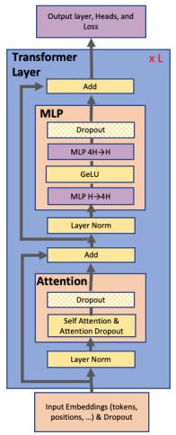
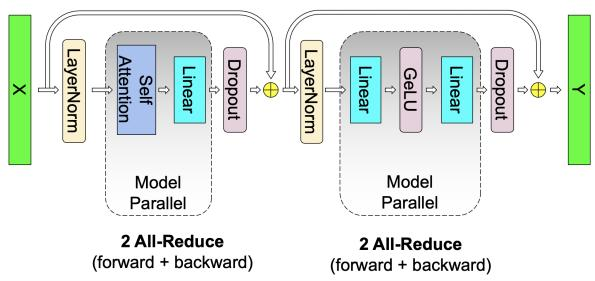
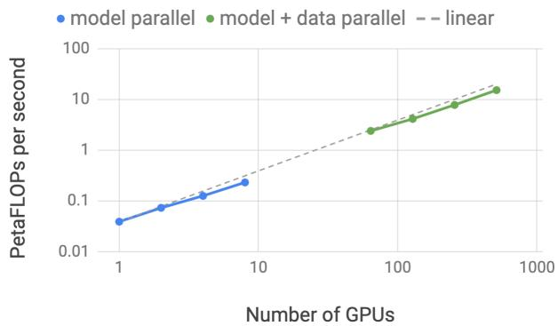
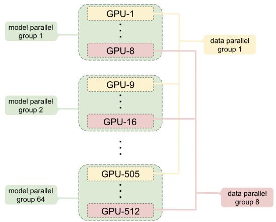
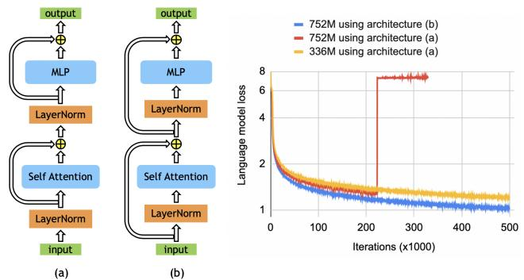
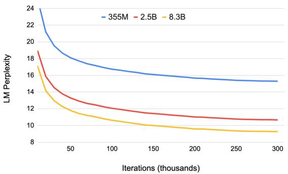
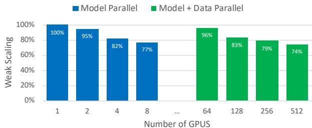

# Megatron-LM: Training Multi-Billion Parameter Language Models Using Model Parallelism

## 一、论文概述

| 项目 | 内容 |
|------|------|
| **标题** | Megatron-LM: Training Multi-Billion Parameter Language Models Using Model Parallelism |
| **作者** | Mohammad Shoeybi, Mostofa Patwary, Raul Puri, Patrick LeGresley, Jared Casper, Bryan Catanzaro |
| **机构** | NVIDIA |
| **论文** | [arXiv:1909.08053](https://arxiv.org/abs/1909.08053) |
| **代码** | [Megatron-LM](https://github.com/NVIDIA/Megatron-LM) |
| **发布** | 2019年9月 |
| **许可** | - |

## 二、核心思想

### 问题定义

训练大型 Transformer 模型能够推进 NLP 应用的最新技术水平，但由于内存限制，训练非常大的模型相当困难。主要挑战包括：

1. **内存限制**：模型参数、梯度和优化器状态无法放入单个 GPU
2. **计算效率**：需要在多个设备上高效并行计算
3. **通信开销**：设备间通信可能成为瓶颈

### 解决方案概述

Megatron-LM 提出了一种简单高效的层内模型并行方法：

- **张量并行**：将矩阵运算分片到多个 GPU
- **无需新编译器**：仅需在原生 PyTorch 中插入少量通信操作
- **与流水线并行正交**：可与流水线并行结合使用
- **大规模验证**：使用 512 GPU 训练 8.3B 参数模型

## 三、技术架构

### 整体框架图

### 核心公式

#### 自注意力层并行

对于查询、键、值的计算：

$$Q = XW_Q, \quad K = XW_K, \quad V = XW_V$$

**列并行**：将 $W_Q, W_K, W_V$ 按列分片到不同 GPU

$$W_Q = [W_{Q1}, W_{Q2}, ..., W_{QN}]$$

每个 GPU $i$ 计算：
$$Q_i = XW_{Qi}$$

**行并行**：输出投影矩阵 $W_O$ 按行分片

$$W_O = \begin{bmatrix} W_{O1} \\ W_{O2} \\ \vdots \\ W_{ON} \end{bmatrix}$$

最终输出需要 AllReduce：
$$\text{Output} = \sum_{i=1}^{N} Q_i W_{Oi}$$

#### MLP 层并行

第一个线性层按列并行：
$$Y = \text{GeLU}(XW_1)$$

$$W_1 = [W_{11}, W_{12}, ..., W_{1N}]$$

第二个线性层按行并行：
$$Z = YW_2$$

$$W_2 = \begin{bmatrix} W_{21} \\ W_{22} \\ \vdots \\ W_{2N} \end{bmatrix}$$

#### 通信操作

每个 Transformer 层在前向和后向传播中共有 4 个通信操作：

| 位置 | 操作 | 说明 |
|------|------|------|
| 自注意力后 | AllReduce | 聚合输出投影结果 |
| MLP 后 | AllReduce | 聚合第二个线性层结果 |
| 自注意力反向 | AllReduce | 聚合梯度 |
| MLP 反向 | AllReduce | 聚合梯度 |

### 模型并行缩放

#### 弱缩放实验

- **模型并行**：每个 GPU 约 1B 参数
- **模型+数据并行**：8 路模型并行 + 64 路数据并行

**结果**：
- 模型并行：512 GPU 时达到 15.1 PetaFLOPS
- 缩放效率：76%（相比单 GPU 39 TeraFLOPS）
- 单 GPU 效率：峰值 FLOPS 的 30%

### 混合并行

#### 分层组织

1. **模型并行组**：机内 8 GPU（NVLink 高带宽）
2. **数据并行组**：机间 64 GPU（InfiniBand）

**优势**：
- 模型并行通信在高带宽域内
- 数据并行通信可与计算重叠

### BERT 架构改进

#### 问题

原始 BERT 架构在大模型上训练不稳定。

#### 解决方案

调整 Layer Normalization 的位置：
- **原始**：Layer Norm 在残差连接之后
- **改进**：Layer Norm 在残差连接之前（Pre-Norm）

**效果**：752M 参数模型训练更稳定，损失更低

## 四、核心创新

| 创新点 | 说明 | 理论/实验依据 |
|--------|------|---------------|
| **层内张量并行** | 将矩阵运算分片到多个 GPU | 仅需 4 个 AllReduce 操作 |
| **列并行 + 行并行** | 自注意力和 MLP 的高效分片 | 最小化通信量 |
| **混合并行** | 模型并行 + 数据并行 | 76% 缩放效率 |
| **Pre-Norm 架构** | 调整 Layer Normalization 位置 | 大模型训练更稳定 |
| **原生 PyTorch 实现** | 无需新编译器或库修改 | 易于使用和扩展 |

## 五、实验结果

### 实验设置

| 配置 | 说明 |
|------|------|
| **GPU** | 最多 512 × V100 32GB |
| **模型** | GPT-2 (8.3B), BERT (3.9B) |
| **基线** | 单 GPU 训练 |
| **精度** | FP16 混合精度 |

### 缩放性能

| 指标 | 值 |
|------|-----|
| **最大模型** | 8.3B 参数 |
| **GPU 数** | 512 |
| **持续性能** | 15.1 PetaFLOPS |
| **缩放效率** | 76% |
| **单 GPU 效率** | 39 TeraFLOPS (30% 峰值) |

### 验证集困惑度

**观察**：
- 更大的语言模型收敛更快
- 更大的模型收敛到更低的验证困惑度
- 8.3B 模型显著优于较小模型

### 下游任务结果

| 模型 | 数据集 | 结果 | 之前 SOTA |
|------|--------|------|-----------|
| GPT-2 8.3B | WikiText103 | 10.8 PPL | 15.8 PPL |
| GPT-2 8.3B | LAMBADA | 66.5% 准确率 | 63.2% |
| BERT 3.9B | RACE | 90.9% 准确率 | 89.4% |

**结论**：更大的模型能够推进 NLP 任务的最新技术水平。

### 缩放效率分析

**模型并行缩放**：
- 2 GPU → 8 GPU：接近线性缩放
- 8 GPU → 512 GPU：效率略有下降

**模型+数据并行缩放**：
- 64 GPU → 512 GPU：保持较高效率
- 总计 76% 缩放效率

## 六、相关工作

### 模型并行方法

| 方法 | 关键特性 | Megatron-LM 对比 |
|------|----------|------------------|
| **流水线并行** | 层间分割 | 正交，可结合 |
| **数据并行** | 数据分割 | 互补，混合使用 |
| **专家并行** | 专家分割 | 不同维度 |
| **张量并行** | 张量分割 | 本文核心贡献 |

### 大模型训练

| 方法 | 模型规模 | 关键技术 |
|------|----------|----------|
| **GPT-2** | 1.5B | 标准 Transformer |
| **T5** | 11B | 编码器-解码器 |
| **Megatron-LM** | 8.3B | 张量并行 |
| **GPT-3** | 175B | 数据并行为主 |

## 七、总结

### 核心贡献

1. **层内张量并行**：简单高效的 Transformer 并行方法
2. **列/行并行设计**：最小化通信量的矩阵分片策略
3. **混合并行**：模型并行与数据并行的有效结合
4. **大规模验证**：512 GPU 上训练 8.3B 参数模型
5. **开源实现**：Megatron-LM 成为大模型训练的标准工具

### 技术影响

- **奠基性工作**：成为后续大模型训练的基础
- **广泛应用**：被 GPT-3、PaLM 等模型采用
- **生态系统**：催生 Megatron-Core、Megatron-DeepSpeed 等
- **工业标准**：NVIDIA 大模型训练的核心技术

### 局限性

- **仅层内并行**：未涉及流水线并行
- **通信开销**：AllReduce 在大规模集群上可能成为瓶颈
- **内存限制**：仍需与数据并行结合支持更大模型
- **架构依赖**：针对 Transformer 架构优化

## 八、参考资源

- **论文**: https://arxiv.org/abs/1909.08053
- **Megatron-LM**: https://github.com/NVIDIA/Megatron-LM
- **Megatron-Core**: https://github.com/NVIDIA/Megatron-Core
- **Megatron-DeepSpeed**: https://github.com/microsoft/Megatron-DeepSpeed
