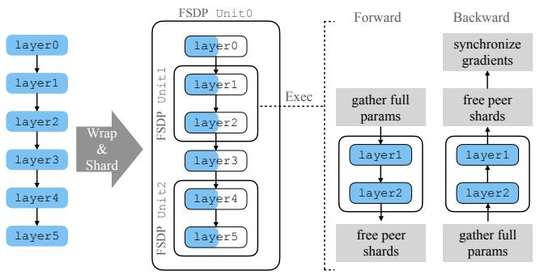
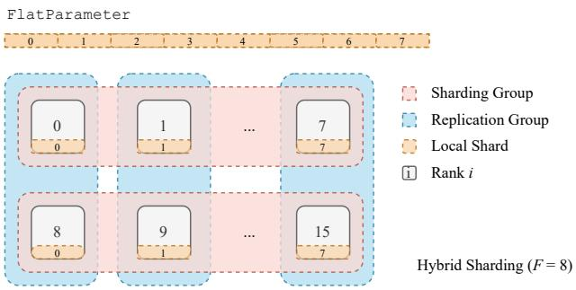
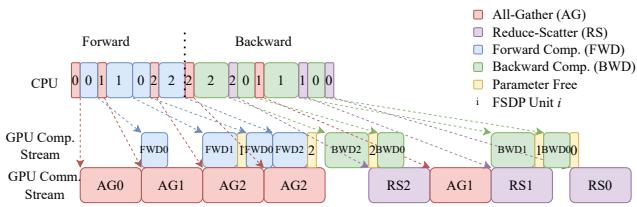
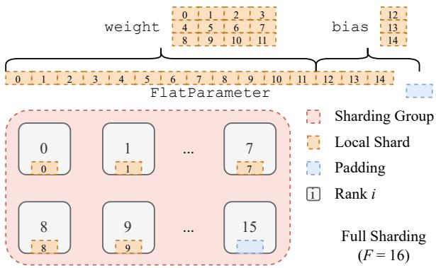
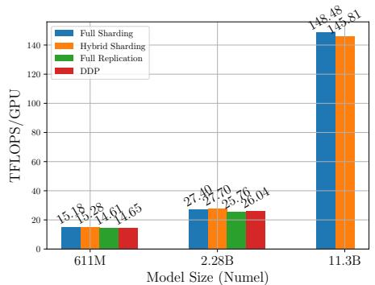
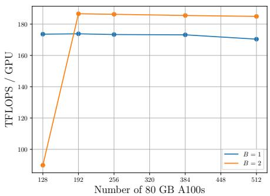
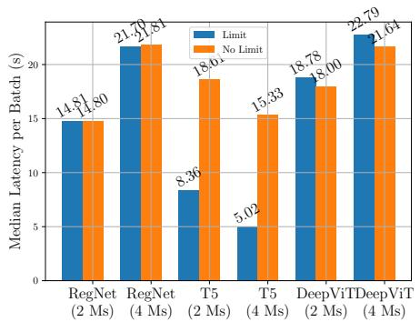
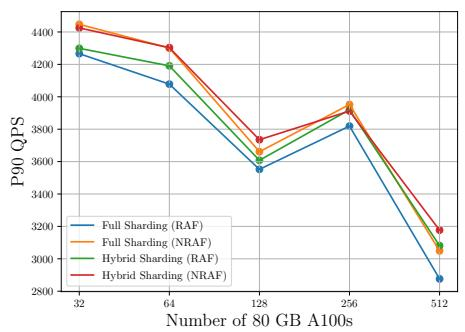

# PyTorch FSDP: Experiences on Scaling Fully Sharded Data Parallel

## 一、论文概述

| 项目 | 内容 |
|------|------|
| **标题** | PyTorch FSDP: Experiences on Scaling Fully Sharded Data Parallel |
| **作者** | Yanli Zhao, Andrew Gu, Rohan Varma, Liang Luo, Chien-Chin Huang, Min Xu, Less Wright, Hamid Shojanazeri, Myle Ott, Sam Shleifer, Alban Desmaison, Can Balioglu, Pritam Damania, Bernard Nguyen, Geeta Chauhan, Yuchen Hao, Ajit Mathews, Shen Li |
| **机构** | Meta AI |
| **论文** | [arXiv:2304.11277](https://arxiv.org/abs/2304.11277) |
| **代码** | [PyTorch FSDP](https://github.com/pytorch/pytorch/blob/main/torch/distributed/fsdp/) |
| **发布** | 2023年4月 (PVLDB 2023) |
| **许可** | - |

## 二、核心思想

### 问题定义

大型模型在各领域展现出卓越性能，但训练这些模型的能力仍局限于少数高级用户和行业领导者。现有分布式训练技术面临以下挑战：

1. **用户体验**：分布式训练的用户体验与本地训练差异大，学习门槛高
2. **硬件异构性**：现代 GPU 集群存在高带宽岛（机内）和低带宽网状（机间）的层次结构
3. **资源利用率**：非计算操作导致的 GPU 停机时间影响效率
4. **内存规划**：频繁的内存碎片整理会显著减慢训练速度

### 解决方案概述

PyTorch FSDP（Fully Sharded Data Parallel）提出了一种工业级的大模型训练解决方案：

- **参数分片**：将模型参数分片到所有设备，每设备仅持有一个分片
- **按需收集**：计算前通过 AllGather 收集完整参数，计算后立即释放
- **与 PyTorch 核心协同设计**：与 Tensor 实现、调度器系统、CUDA 内存缓存分配器紧密集成
- **灵活的分片策略**：支持全分片、混合分片等多种策略

## 三、技术架构

### 整体框架图



### 核心公式

#### 参数分片

假设模型有 $\mathcal{P}$ 个参数，分片因子为 $S$（通常等于 GPU 数量）：

1. **展平**：将所有参数展平并连接为一个 1D 张量 `FlatParameter`
2. **分片**：将 `FlatParameter` 分成 $S$ 个等大小的块
3. **分配**：每个 rank 持有一个块

$$\text{FlatParameter} = \text{concat}(\text{flatten}(p_1), \text{flatten}(p_2), ..., \text{flatten}(p_\mathcal{P}), \text{padding})$$

$$\text{shard}_i = \text{FlatParameter}[i \times \frac{|\text{FlatParameter}|}{S} : (i+1) \times \frac{|\text{FlatParameter}|}{S}]$$

#### AllGather 通信

计算前需要收集完整参数：

$$\text{unsharded\_params} = \text{AllGather}(\text{sharded\_params})$$

#### ReduceScatter 通信

反向传播后需要分片梯度：

$$\text{sharded\_grads} = \text{ReduceScatter}(\text{unsharded\_grads})$$

### FSDP 工作流程

#### 前向传播

1. **Unit 1 计算前**：AllGather 收集 Unit 1 的完整参数
2. **Unit 1 计算**：使用完整参数进行前向计算
3. **Unit 1 计算后**：释放其他 rank 的参数分片
4. **Unit 2 计算前**：AllGather 收集 Unit 2 的完整参数
5. ...

#### 反向传播

1. **Unit 2 反向前**：AllGather 收集 Unit 2 的完整参数
2. **Unit 2 反向**：计算梯度
3. **Unit 2 反向后**：ReduceScatter 分片梯度，释放完整参数
4. **Unit 1 反向前**：AllGather 收集 Unit 1 的完整参数
5. ...

### 分片策略

#### 全分片（Full Sharding）



- **分片因子** $S = N$（GPU 数量）
- **内存节省**：最大，每设备仅存储 $1/N$ 的参数
- **通信开销**：最大，每次计算前需要 AllGather

#### 混合分片（Hybrid Sharding）



- **分片组**：将 GPU 分成多个分片组
- **组内分片**：组内进行参数分片
- **组间复制**：组间进行数据复制
- **优势**：减少跨机通信，利用机内高带宽

**示例**：16 GPU 分成 2 个分片组（每组 8 GPU），8 个复制组

### 通信优化



#### 通信效率关键因素

1. **大消息大小**：AllGather 大小低于 33M 元素时，通信时间急剧增加
2. **合并通信**：将多个小参数的通信合并为一次大通信

**实验发现**：
- 固定总通信量为 $2^{30} \approx 1B$ FP32 元素
- 减小每次 AllGather 的大小（增加调用次数）
- 当 AllGather 大小 < 33M 元素时，总通信时间急剧增加

### 计算-通信重叠


#### 挑战

FSDP 的前向传播中，AllGather 必须在计算之后发起（因为不知道下一个 FlatParameter 是什么），这与 DDP 的 AllReduce 可以在计算之前发起不同。

#### 解决方案

使用独立的 CUDA 流发起 AllGather，绕过默认流中的虚假依赖：

```python
# 使用独立 CUDA 流
all_gather_stream = torch.cuda.Stream()
with torch.cuda.stream(all_gather_stream):
    all_gather(params)
# 默认流等待 AllGather 完成
default_stream.wait_stream(all_gather_stream)
```

### 延迟初始化

#### 问题

大模型可能无法在单个 GPU 上初始化，因为内存不足。

#### 解决方案

1. **虚拟设备**：在虚拟设备上创建模型实例，记录初始化操作
2. **逐 Unit 初始化**：将模型分解为 FSDP unit，逐个在真实 GPU 上初始化
3. **重放操作**：重放记录的初始化操作

### 内存规划

#### FlatParameter 设计

将多个参数合并为一个 FlatParameter：
- **合并通信**：减少通信调用次数
- **均匀分片**：确保每个 rank 的内存使用均衡
- **梯度继承**：梯度与 FlatParameter 共享分片结构

#### 内存限制

- **限制未分片参数的内存块数量**
- **必要时暂停 CPU 执行**
- **使用 CUDA 内存统计信息监控碎片**

## 四、核心创新

| 创新点 | 说明 | 理论/实验依据 |
|--------|------|---------------|
| **与 PyTorch 核心协同设计** | 与 Tensor、调度器、CUDA 分配器集成 | 非侵入式用户体验 |
| **延迟初始化** | 虚拟设备 + 逐 Unit 初始化 | 支持无法单 GPU 初始化的大模型 |
| **混合分片** | 组内分片 + 组间复制 | 减少跨机通信 |
| **独立 CUDA 流** | 绕过默认流的虚假依赖 | 实现计算-通信重叠 |
| **FlatParameter** | 合并多个参数的通信 | 提高通信效率 |
| **可配置分片策略** | 全分片、混合分片等 | 适应不同硬件拓扑 |

## 五、实验结果

### 实验设置

| 配置 | 说明 |
|------|------|
| **GPU** | 最多 512 × A100 80GB |
| **模型** | T5 (611M - 11B), GPT-175B, DHEN 推荐模型 |
| **基线** | DDP (Distributed Data Parallel) |
| **框架** | PyTorch 2.0 |

### T5 模型结果



| 模型 | FSDP TFLOPS | DDP TFLOPS | 备注 |
|------|-------------|------------|------|
| T5-611M | ~125 | ~125 | 性能相当 |
| T5-2.28B | ~150 | ~150 | 性能相当 |
| T5-11B | ~175 | OOM | DDP 内存不足 |

**结论**：FSDP 在小模型上与 DDP 性能相当，同时支持 DDP 无法处理的大模型。

### 后向预取加速

| 模型 | 无预取 TFLOPS | 有预取 TFLOPS | 加速比 |
|------|---------------|---------------|--------|
| GPT-175B | ~150 | ~177 | 1.18x |

**结论**：后向预取带来约 18% 的加速，且在不同 GPU 集群规模下保持一致。

### GPT-175B 可扩展性



| GPU 数 | TFLOPS | GPU 硬件利用率 |
|--------|--------|---------------|
| 128 | ~173 | ~55% |
| 256 | ~180 | ~58% |
| 512 | ~186 | ~60% |

**结论**：GPT-175B 模型从 128 到 512 GPU 实现近线性 TFLOPS 可扩展性。

### T5-11B 可扩展性



| GPU 数 | TFLOPS | 备注 |
|--------|--------|------|
| 8 | ~175 | 最高效率 |
| 64 | ~170 | 略有下降 |
| 512 | ~163 | 通信开始超过计算 |

**观察**：从 8 到 512 GPU，TFLOPS 下降约 7%，表明通信开销逐渐增大。

### DHEN 推荐模型



- **全分片 + RAF**：最小内存占用，但 QPS 较低
- **混合分片 + NRAF**：较高 QPS，内存占用较大
- **GPU 增加**：峰值内存持续下降

### 内存碎片问题

**问题**：128 GPU + batch size 2 时，反向传播占迭代延迟的 85.56%（正常约 67%）

**原因**：128 GPU 时每个 GPU 需要容纳更大的模型分片，更容易触发 CUDA 内存碎片整理

**监控**：使用 `torch.cuda.memory_stats()` 的 `num_alloc_retries` 键检测

## 六、相关工作

### 分布式训练方法

| 方法 | 关键特性 | FSDP 对比 |
|------|----------|-----------|
| **DDP** | 模型复制，AllReduce 梯度 | FSDP 支持更大模型 |
| **ZeRO** | 参数分片，按需收集 | FSDP 与 PyTorch 原生集成 |
| **Megatron-LM** | 张量并行，流水线并行 | FSDP 更通用，不依赖特定架构 |
| **GPipe** | 流水线并行 | FSDP 更灵活 |

### PyTorch 分布式生态

| 组件 | 功能 |
|------|------|
| **DDP** | 数据并行，模型复制 |
| **FSDP** | 全分片数据并行，参数分片 |
| **RPC** | 远程过程调用 |
| **ProcessGroup** | 集合通信抽象 |

## 七、总结

### 核心贡献

1. **工业级 FSDP 实现**：与 PyTorch 核心协同设计的全分片数据并行
2. **延迟初始化**：支持无法单 GPU 初始化的大模型
3. **混合分片**：适应硬件异构性的灵活分片策略
4. **通信优化**：FlatParameter 设计和计算-通信重叠
5. **大规模验证**：在 512 GPU 上验证 GPT-175B 的近线性可扩展性

### 技术影响

- **民主化大模型训练**：降低大模型训练的技术门槛
- **PyTorch 生态集成**：成为 PyTorch 2.0 的核心功能
- **工业应用**：被 Meta 及众多公司用于生产环境
- **研究基础**：为后续分布式训练研究提供基础

### 局限性

- **通信开销**：在大规模集群上通信开销逐渐增大
- **内存碎片**：接近 GPU 内存容量时可能触发碎片整理
- **分片策略选择**：需要根据具体硬件拓扑选择合适的分片策略
- **调试复杂性**：分布式训练的调试仍然具有挑战性

## 八、参考资源

- **论文**: https://arxiv.org/abs/2304.11277
- **PyTorch FSDP**: https://github.com/pytorch/pytorch/blob/main/torch/distributed/fsdp/
- **ZeRO**: https://arxiv.org/abs/1910.02054
- **Megatron-LM**: https://arxiv.org/abs/1909.08053
- **DDP**: https://pytorch.org/docs/stable/generated/torch.nn.parallel.DistributedDataParallel.html
