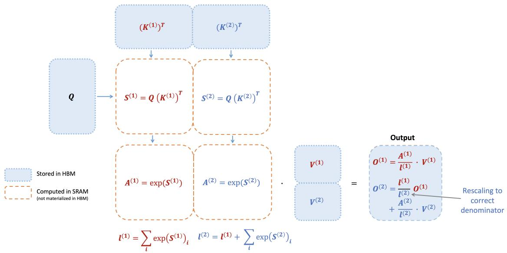
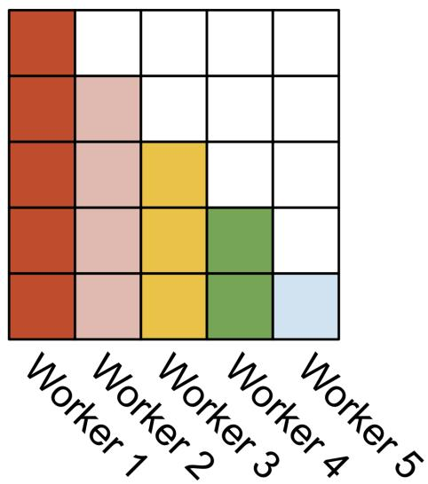
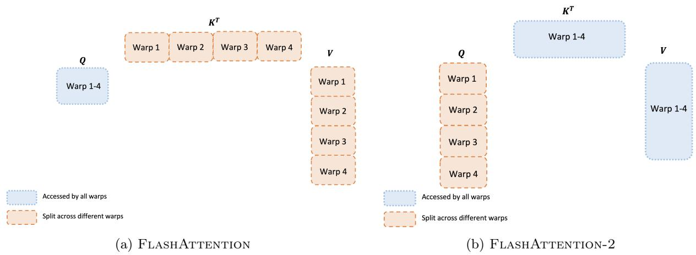

# FlashAttention-2: Faster Attention with Better Parallelism and Work Partitioning

## 一、论文概述

| 项目 | 内容 |
|------|------|
| **标题** | FlashAttention-2: Faster Attention with Better Parallelism and Work Partitioning |
| **作者** | Tri Dao |
| **机构** | Stanford University, Together AI |
| **论文** [arXiv:2307.08691](https://arxiv.org/abs/2307.08691) |
| **代码** | [flash-attention](https://github.com/Dao-AILab/flash-attention) |
| **发布** | 2023年7月 |
| **许可** | BSD 3-Clause |

## 二、核心思想

### 问题定义

将 Transformer 扩展到更长序列长度是近年来的主要问题。注意力层是扩展到更长序列的主要瓶颈，因为其运行时间和内存随序列长度二次方增长。

**FlashAttention 的局限**：
- 虽然实现了线性内存和 2-4x 加速
- 但仅达到理论最大 FLOPs/s 的 25-40%
- 远未达到优化矩阵乘法（GEMM）操作的效率

### 解决方案概述

FlashAttention-2 通过更好的工作分配解决这些问题：

1. **减少非矩阵乘法 FLOPs**：调整算法以减少非 matmul FLOPs
2. **跨线程块并行化**：即使对于单个头，也将注意力计算并行化到不同线程块
3. **减少共享内存通信**：在线程块内，在不同 warp 之间分配工作以减少共享内存通信

**结果**：相比 FlashAttention 约 2x 加速，达到理论最大 FLOPs/s 的 50-73%

## 三、技术架构

### 核心公式

#### 标准注意力

$$\text{Attention}(Q, K, V) = \text{Softmax}\left(\frac{QK^\top}{\sqrt{d}}\right)V$$

其中 $Q, K, V \in \mathbb{R}^{N \times d}$，$N$ 是序列长度，$d$ 是头维度。

#### FlashAttention 前向传播



**分块计算**：将 $K$ 和 $V$ 分成块，逐块计算注意力

```
for each block K_j, V_j:
    S_j = Q @ K_j^T / sqrt(d)
    P_j = softmax(S_j)
    O_j = P_j @ V_j
    // 重新缩放并累积
```

**关键优化**：
- 避免在 HBM 中存储完整的 $S$ 和 $P$ 矩阵
- 使用在线 softmax 策略累积结果
- 内存复杂度从 $O(N^2)$ 降至 $O(N)$

### 并行化策略



#### 前向传播

**线程块分配**：每个线程块负责注意力矩阵的一行块

- 线程块 $i$ 负责 $Q$ 的第 $i$ 个块
- 遍历所有 $K, V$ 块
- 累积输出

#### 反向传播

**线程块分配**：每个线程块负责注意力矩阵的一列块

- 线程块 $j$ 负责 $K, V$ 的第 $j$ 个块
- 遍历所有 $Q$ 块
- 累积梯度

### Warp 分配



#### FlashAttention 的问题

在 FlashAttention 中，warp 之间需要通过共享内存通信来累积结果，导致：
- 额外的共享内存读写
- 降低效率

#### FlashAttention-2 的改进

**前向传播**：
- 每个 warp 独立处理一部分 $Q$ 块
- 遍历所有 $K, V$ 块
- 在寄存器中累积结果，无需共享内存通信

**反向传播**：
- 每个 warp 独立处理一部分 $K$ 块
- 遍历所有 $Q$ 块
- 在寄存器中累积梯度

### 减少非 Matmul FLOPs

**FlashAttention 的问题**：
- 在线 softmax 需要频繁的缩放和更新
- 非 matmul FLOPs 占比较高

**FlashAttention-2 的改进**：
- 重新组织计算顺序
- 将缩放操作推迟到累积结束
- 减少非 matmul FLOPs

### 因果掩码优化

**问题**：因果掩码需要跳过约一半的计算

**优化**：
- 在块级别判断是否需要计算
- 如果块完全在掩码区域，跳过整个块
- 如果块部分在掩码区域，只计算必要的部分

## 四、核心创新

| 创新点 | 说明 | 理论/实验依据 |
|--------|------|---------------|
| **跨线程块并行化** | 即使单个头也并行化到多个线程块 | 提高 occupancy |
| **减少共享内存通信** | Warp 间在寄存器中累积 | 消除共享内存读写 |
| **减少非 matmul FLOPs** | 重新组织计算顺序 | 更接近 GEMM 效率 |
| **因果掩码优化** | 块级别跳过计算 | 进一步加速因果注意力 |
| **2x 加速** | 相比 FlashAttention | 达到 50-73% 理论峰值 |

## 五、实验结果

### 实验设置

| 配置 | 说明 |
|------|------|
| **GPU** | A100 80GB |
| **模型** | GPT 风格模型 |
| **基线** | FlashAttention, PyTorch SDPA, cuDNN |
| **序列长度** | 512 - 16K |

### 核心结果

| 指标 | FlashAttention | FlashAttention-2 | 提升 |
|------|----------------|------------------|------|
| **FLOPs 利用率** | 25-40% | 50-73% | ~2x |
| **训练速度** | ~115 TFLOPS/s | ~225 TFLOPS/s | ~2x |
| **模型 FLOPs 利用率** | ~36% | ~72% | ~2x |

### 与其他实现对比

| 实现 | A100 TFLOPS/s | 相对 FlashAttention-2 |
|------|---------------|----------------------|
| **FlashAttention-2** | 225 | 1.0x |
| PyTorch SDPA | ~150 | 0.67x |
| cuDNN | ~200 | 0.89x |
| FlashAttention | ~115 | 0.51x |

### 端到端训练速度

**GPT 风格模型训练**：
- FlashAttention-2 达到 225 TFLOPS/s per A100
- 72% 模型 FLOPs 利用率
- 接近 GEMM 操作的效率

### 内存节省

| 序列长度 | 标准注意力 | FlashAttention-2 | 节省 |
|----------|-----------|------------------|------|
| 1K | ~4MB | ~1MB | 75% |
| 4K | ~64MB | ~4MB | 94% |
| 16K | ~1GB | ~16MB | 98% |

## 六、相关工作

### 注意力优化方法

| 方法 | 关键特性 | FlashAttention-2 对比 |
|------|----------|----------------------|
| **FlashAttention** | 分块计算，IO 感知 | FlashAttention-2 约 2x 更快 |
| **FlashAttention-3** | 异步优化，FP8 支持 | 后续改进 |
| **Ring Attention** | 分布式注意力 | 互补，可结合使用 |
| **Striped Attention** | 条纹分区 | 互补，可结合使用 |

### GPU 优化技术

| 技术 | 说明 |
|------|------|
| **分块计算** | 避免在 HBM 中存储中间结果 |
| **在线 Softmax** | 逐块累积 softmax 统计量 |
| **寄存器累积** | 在寄存器中累积结果，避免共享内存 |
| **线程块并行化** | 提高 GPU 占用率 |

## 七、总结

### 核心贡献

1. **2x 加速**：相比 FlashAttention 约 2x 加速
2. **高效率**：达到理论最大 FLOPs/s 的 50-73%
3. **更好的并行性**：跨线程块并行化注意力计算
4. **更少的通信**：减少 warp 间共享内存通信
5. **广泛应用**：成为大模型训练的标准组件

### 技术影响

- **标准组件**：成为 PyTorch、HuggingFace 等框架的默认注意力实现
- **长序列训练**：使更长序列的训练更加高效
- **广泛应用**：被几乎所有主流大模型采用
- **生态系统**：催生 FlashAttention-3、FlashDecoding 等后续工作

### 局限性

- **硬件依赖**：针对 NVIDIA GPU 优化
- **实现复杂性**：需要精心的 CUDA 优化
- **序列长度**：虽然内存线性，但计算仍是二次方
- **精度**：使用 FP16/BF16，可能影响某些任务精度

## 八、参考资源

- **论文**: https://arxiv.org/abs/2307.08691
- **代码**: https://github.com/Dao-AILab/flash-attention
- **FlashAttention**: https://arxiv.org/abs/2205.14135
- **FlashAttention-3**: https://arxiv.org/abs/2407.08691
