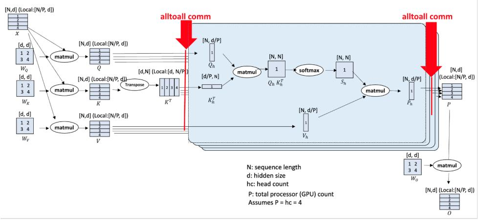
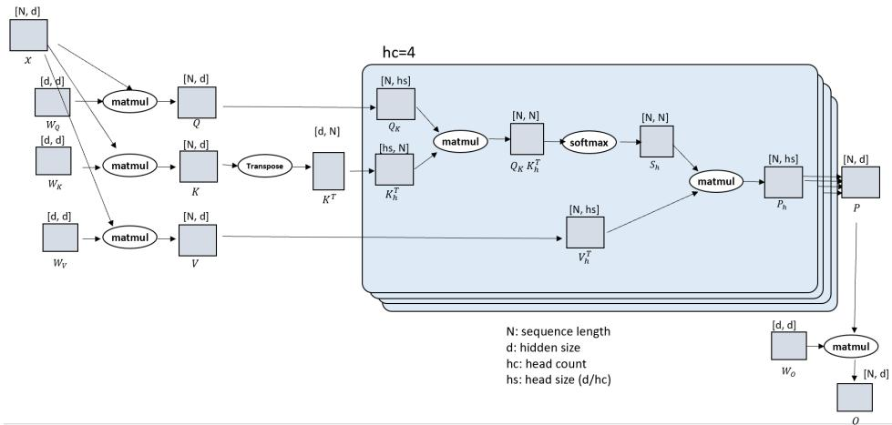
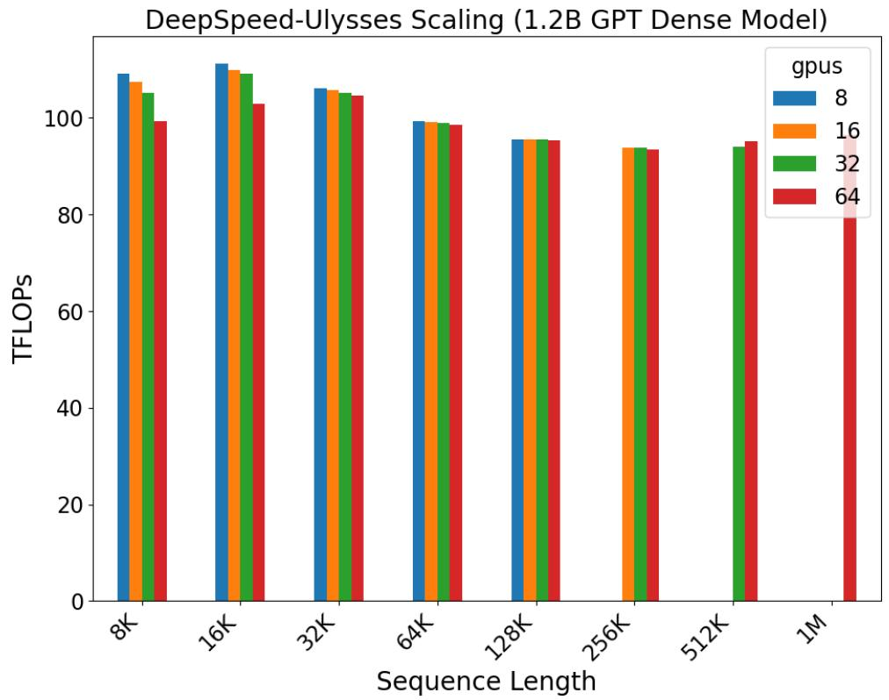
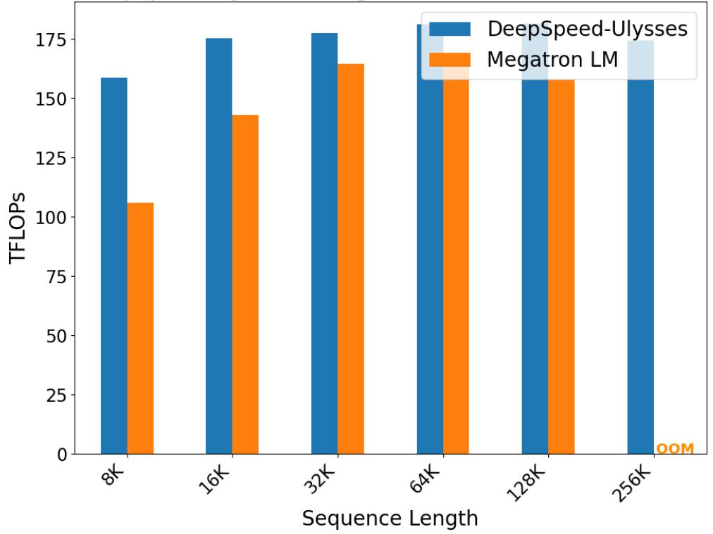
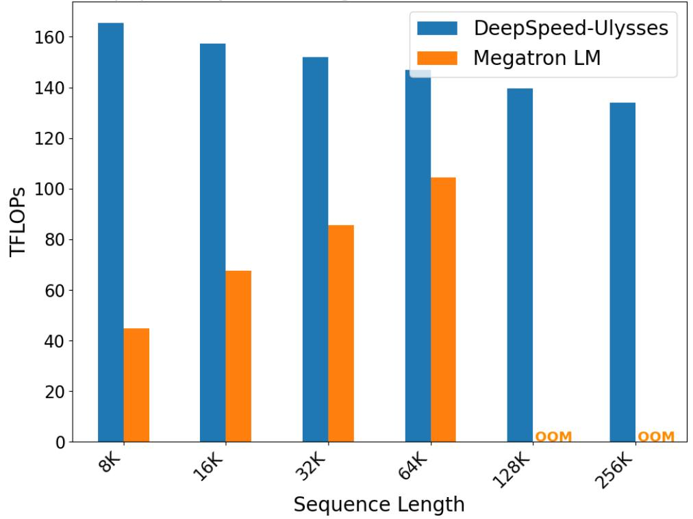
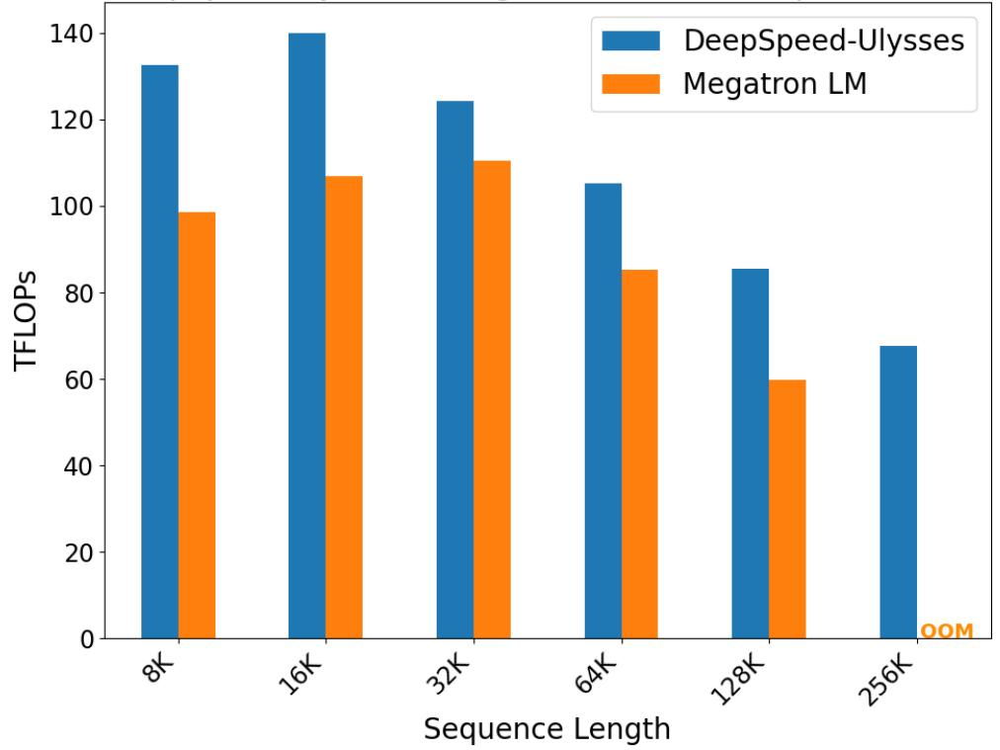

# DeepSpeed Ulysses: System Optimizations for Enabling Training of Extreme Long Sequence Transformer Models

## 一、论文概述

| 项目 | 内容 |
|------|------|
| **标题** | DeepSpeed Ulysses: System Optimizations for Enabling Training of Extreme Long Sequence Transformer Models |
| **作者** | Sam Ade Jacobs, Masahiro Tanaka, Chengming Zhang, Minjia Zhang, Shuaiwen Leon Song, Samyam Rajbhandari, Yuxiong He |
| **机构** | Microsoft |
| **论文** | [arXiv:2309.14509](https://arxiv.org/abs/2309.14509) |
| **代码** | [DeepSpeed](https://github.com/microsoft/DeepSpeed) |
| **发布** | 2023年9月 |
| **许可** | - |

## 二、核心思想

### 问题定义

典型的 Transformer LLM 计算由批量大小、隐藏维度、层数和序列长度决定。现有的并行技术主要关注前三个维度：

| 并行技术 | 优化维度 | 局限性 |
|----------|----------|--------|
| **数据并行** | 批量大小 | 不优化序列长度 |
| **张量并行** | 隐藏维度 | 不优化序列长度 |
| **流水线并行** | 模型深度 | 不优化序列长度 |

**现有序列并行的问题**：
- **内存-通信效率低**：限制了长序列大模型的可扩展性
- **通信开销随序列长度增加**：无法支持超长序列

### 解决方案概述

DeepSpeed-Ulysses 提出了一种高效的序列并行方法：

- **序列维度分区**：将输入数据沿序列维度分区
- **All-to-All 通信**：使用高效的 All-to-All 集合通信进行注意力计算
- **恒定通信量**：当序列长度和计算设备成比例增加时，通信量保持恒定
- **2.5x 加速**：比现有方法快 2.5x，支持 4x 更长的序列

## 三、技术架构

### 整体框架图

### 核心公式

#### 多头注意力

标准多头注意力计算：

$$\text{MultiHead}(Q, K, V) = \text{Concat}(\text{head}_1, ..., \text{head}_h)W^O$$

其中：

$$\text{head}_i = \text{Attention}(QW_i^Q, KW_i^K, VW_i^V)$$

$$\text{Attention}(Q, K, V) = \text{Softmax}\left(\frac{QK^\top}{\sqrt{d_k}}\right)V$$

#### 序列并行分区

输入序列 $X \in \mathbb{R}^{N \times b \times d}$ 沿序列维度分区到 $P$ 个设备：

$$X = [X_1, X_2, ..., X_P], \quad X_i \in \mathbb{R}^{N/P \times b \times d}$$

#### All-to-All 通信

**关键操作**：将序列分区转换为注意力头分区

**输入**：每个设备持有序列的一部分，包含所有注意力头
**输出**：每个设备持有所有序列的一部分，但只包含部分注意力头

$$\text{All-to-All}: (N/P, b, h, d_h) \rightarrow (N, b, h/P, d_h)$$

其中 $h$ 是注意力头数，$d_h$ 是每个头的维度。

#### 通信量分析

**DeepSpeed-Ulysses**：
$$\text{通信量} = 2 \times N \times b \times d$$

**恒定条件**：当 $N$ 和 $P$ 成比例增加时，通信量保持恒定。

**对比 Megatron-LM 序列并行**：
$$\text{通信量} = 2 \times N \times b \times d \times P$$

通信量随 $P$ 线性增加。

### Transformer 架构

DeepSpeed-Ulysses 在标准 Transformer 架构中插入 All-to-All 通信：

1. **输入分区**：序列沿维度 $N$ 分区到 $P$ 个设备
2. **QKV 投影**：每个设备独立计算本地序列的 QKV
3. **All-to-All (1)**：将序列分区转换为注意力头分区
4. **注意力计算**：每个设备计算分配的注意力头
5. **All-to-All (2)**：将注意力头分区转换回序列分区
6. **MLP 计算**：每个设备独立计算本地序列的 MLP

### 与其他序列并行的对比

| 方法 | 通信操作 | 通信量 | 可扩展性 |
|------|----------|--------|----------|
| **Megatron-LM SP** | AllGather + ReduceScatter | $O(N \times P)$ | 受限 |
| **Ring Attention** | Ring AllReduce | $O(N \times P)$ | 受限 |
| **DeepSpeed-Ulysses** | All-to-All | $O(N)$ | 恒定 |

## 四、核心创新

| 创新点 | 说明 | 理论/实验依据 |
|--------|------|---------------|
| **All-to-All 序列并行** | 使用 All-to-All 替代 AllGather | 通信量恒定 |
| **序列-头维度转换** | 在序列和注意力头维度间高效转换 | 最小化通信 |
| **恒定通信量** | N 和 P 成比例增加时通信量不变 | 理论证明 |
| **与 ZeRO 兼容** | 可与 ZeRO-3 结合使用 | 进一步减少内存 |
| **密集/稀疏注意力** | 同时支持密集和稀疏注意力 | 通用性强 |

## 五、实验结果

### 实验设置

| 配置 | 说明 |
|------|------|
| **GPU** | 32-64 × A100 80GB |
| **模型** | GPT-1.2B, GPT-7B, GPT-30B |
| **序列长度** | 最高 1M tokens |
| **基线** | Megatron-LM 序列并行 |
| **注意力类型** | 密集注意力，稀疏注意力 |

### 强缩放实验

**设置**：GPT-1.2B，序列长度从 8K 到 1M

| 序列长度 | GPU 数 | 吞吐量 |
|----------|--------|--------|
| 8K | 8 | 基准 |
| 64K | 64 | 接近基准 |
| 256K | 256 | 接近基准 |
| 1M | 1024 | 接近基准 |

**结论**：序列长度和 GPU 数成比例增加时，吞吐量保持稳定。

### 密集注意力对比

#### 7B 模型（32 GPU）

| 方法 | 最大序列长度 | 吞吐量 |
|------|-------------|--------|
| **DeepSpeed-Ulysses** | 64K | 2.5x |
| Megatron-LM SP | 16K | 基准 |

#### 30B 模型（64 GPU）

| 方法 | 最大序列长度 | 吞吐量 |
|------|-------------|--------|
| **DeepSpeed-Ulysses** | 128K | 2.5x |
| Megatron-LM SP | 32K | 基准 |

### 稀疏注意力对比

**结果**：
- DeepSpeed-Ulysses 在稀疏注意力上同样优于 Megatron-LM
- 2x 以上吞吐量提升
- 支持 4x 更长的序列长度

### 收敛性验证

**设置**：GPT-1.3B，32K 序列长度，8 GPU

**结论**：DeepSpeed-Ulysses 是纯系统优化，对模型训练质量无负面影响。

### 关键优势总结

| 指标 | DeepSpeed-Ulysses vs Megatron-LM SP |
|------|-------------------------------------|
| **吞吐量** | 2.5x 提升 |
| **最大序列长度** | 4x 更长 |
| **通信量** | 恒定（vs 线性增长） |
| **内存效率** | 与 ZeRO-3 兼容 |

## 六、相关工作

### 序列并行方法

| 方法 | 关键特性 | 局限性 |
|------|----------|--------|
| **Megatron-LM SP** | AllGather + ReduceScatter | 通信量随 P 增加 |
| **Ring Attention** | 环形通信 | 工作负载不均衡 |
| **Striped Attention** | 条纹分区 | 仅优化因果注意力 |
| **DeepSpeed-Ulysses** | All-to-All | - |

### DeepSpeed 生态

| 组件 | 功能 |
|------|------|
| **ZeRO** | 内存优化 |
| **DeepSpeed-Ulysses** | 序列并行 |
| **3D Parallelism** | 数据+张量+流水线并行 |
| **MoE** | 专家并行 |

## 七、总结

### 核心贡献

1. **All-to-All 序列并行**：高效序列维度分区方法
2. **恒定通信量**：理论证明通信量不随设备数增加
3. **2.5x 吞吐量提升**：相比 Megatron-LM 序列并行
4. **4x 序列长度扩展**：支持更长的序列训练
5. **通用性强**：支持密集和稀疏注意力

### 技术影响

- **长序列训练**：使百万级 token 序列训练成为可能
- **DeepSpeed 集成**：成为 DeepSpeed 的核心组件
- **广泛应用**：被众多长序列模型采用
- **效率提升**：显著降低长序列训练成本

### 局限性

- **注意力头数限制**：需要足够的注意力头数以实现有效分区
- **All-to-All 依赖**：需要高效的 All-to-All 通信实现
- **硬件要求**：需要高速互连（NVLink/InfiniBand）
- **与特定注意力模式结合**：可能需要针对特定注意力模式优化

## 八、参考资源

- **论文**: https://arxiv.org/abs/2309.14509
- **DeepSpeed**: https://github.com/microsoft/DeepSpeed
- **Megatron-LM**: https://arxiv.org/abs/1909.08053
- **Ring Attention**: https://arxiv.org/abs/2310.01889
