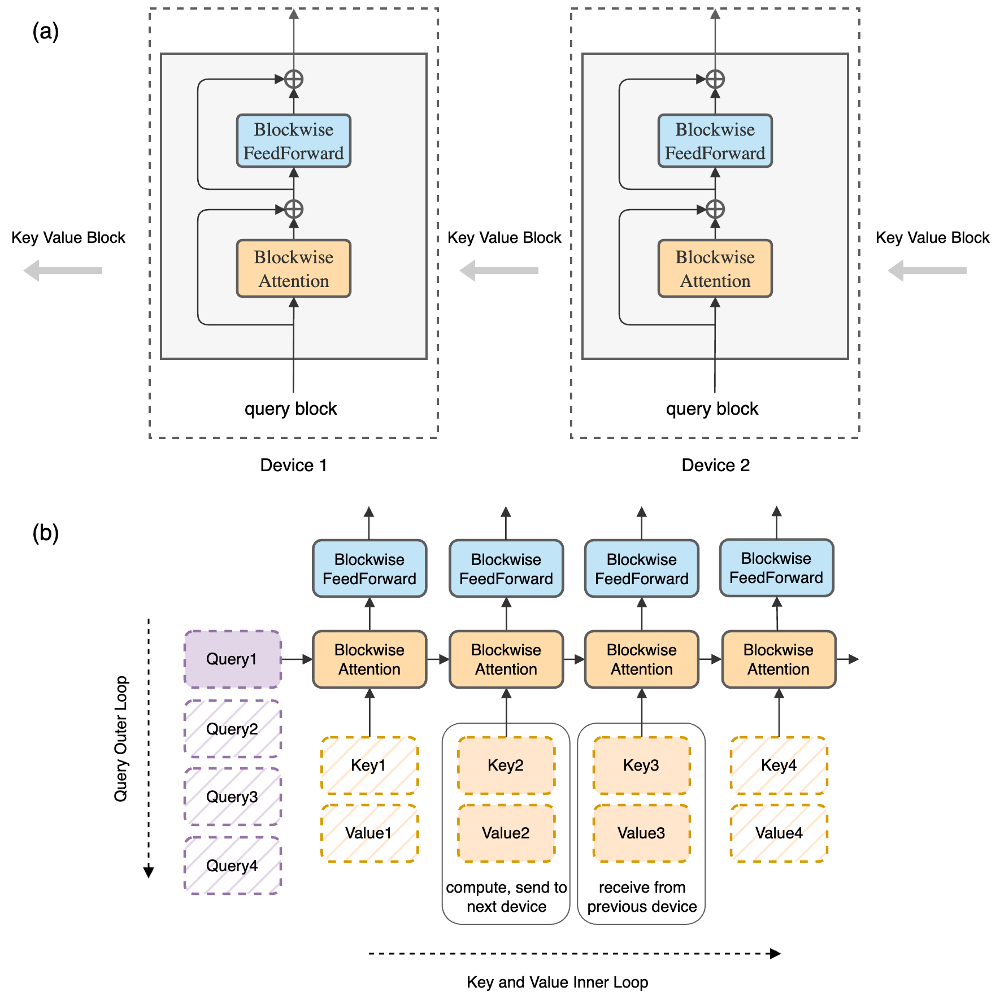
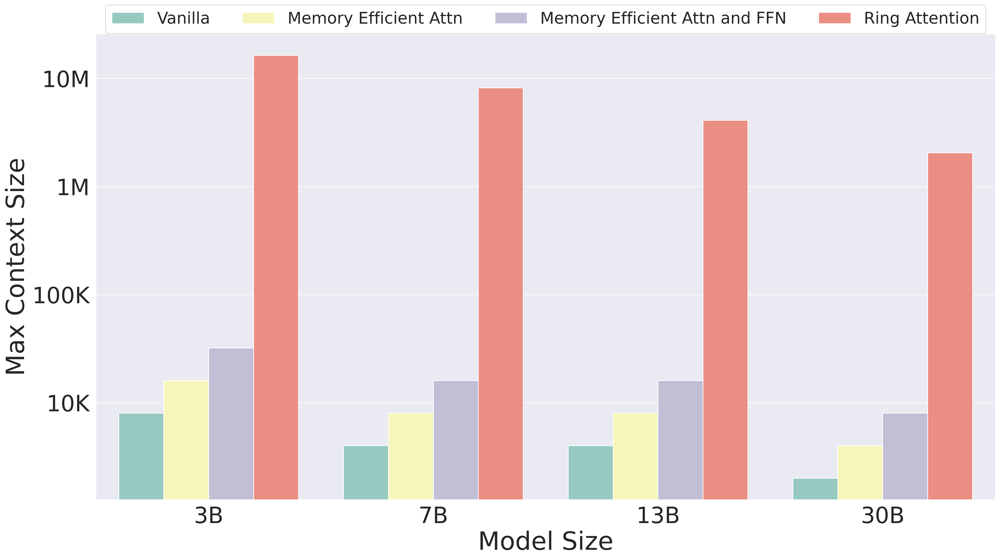
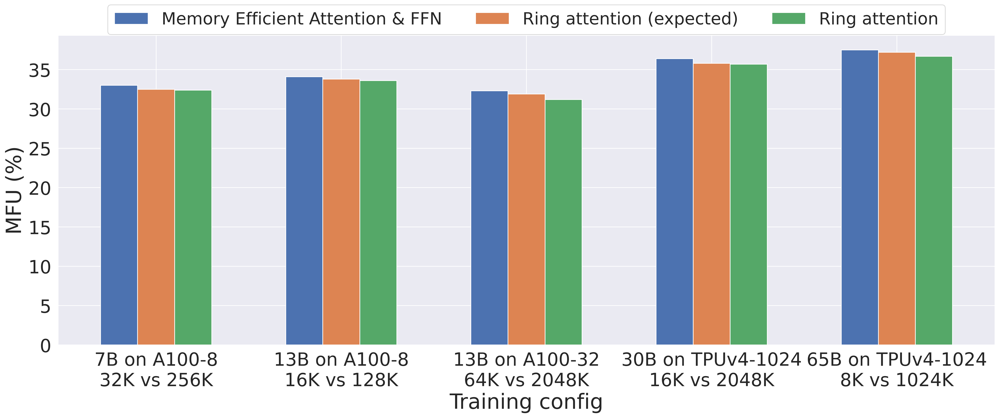
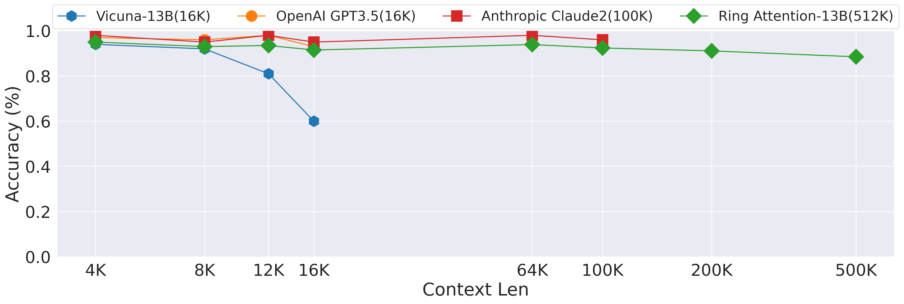

# Ring Attention with Blockwise Transformers for Near-Infinite Context

## 一、论文概述

| 项目 | 内容 |
|------|------|
| **标题** | Ring Attention with Blockwise Transformers for Near-Infinite Context |
| **作者** | Hao Liu, Matei Zaharia, Pieter Abbeel |
| **机构** | UC Berkeley |
| **论文** | [arXiv:2310.01889](https://arxiv.org/abs/2310.01889) |
| **代码** | [llm_large_context](https://github.com/lhao499/llm_large_context) |
| **发布** | 2023年10月 |
| **许可** | - |

## 二、核心思想

### 问题定义

Transformer 的自注意力机制具有二次方的内存成本，限制了其处理长序列的能力：

- **内存瓶颈**：处理 1 亿 token 需要超过 1000GB 内存（隐藏维度 1024）
- **硬件限制**：现代 GPU/TPU 通常只有不到 100GB HBM
- **存储需求**：每层输出需要存储，因为自注意力需要所有元素的交互

### 解决方案概述

Ring Attention 提出了一种分布式长序列处理方法：

- **分块计算**：利用分块注意力和前馈网络的计算
- **环形通信**：设备形成环形拓扑，KV 块在环中传递
- **通信-计算重叠**：KV 块的通信与注意力计算完全重叠
- **线性扩展**：上下文长度随设备数线性扩展

## 三、技术架构

### 整体框架图



### 核心公式

#### 自注意力

$$\text{Attention}(Q, K, V) = \text{softmax}\left(\frac{QK^\top}{\sqrt{d}}\right)V$$

其中 $Q, K, V \in \mathbb{R}^{s \times d}$，$s$ 是序列长度，$d$ 是头维度。

#### 前馈网络

$$\text{FFN}(x) = \max(0, xW_1 + b_1)W_2 + b_2$$

#### 分块注意力

将序列分成 $N$ 个块，每个设备持有一个块：

$$Q = [Q_0, Q_1, ..., Q_{N-1}], \quad K = [K_0, K_1, ..., K_{N-1}], \quad V = [V_0, V_1, ..., V_{N-1}]$$

设备 $i$ 持有 $Q_i, K_i, V_i$。

#### 环形通信

在环形拓扑中，设备 $i$ 在计算注意力时：
1. 使用本地 $Q_i$ 和当前持有的 $K_j, V_j$ 计算注意力
2. 将 $K_j, V_j$ 发送给下一个设备
3. 从上一个设备接收 $K_{j-1}, V_{j-1}$

### 环形注意力算法

```
for i = 0 to N-1 do  // 外循环：迭代次数
    for each device j in parallel do  // 并行执行
        k = (j - i) mod N
        // 计算 Q_j 与 K_k, V_k 的注意力
        Out_j += BlockwiseAttention(Q_j, K_k, V_k)
        // 发送 K_k, V_k 到下一个设备
        send K_k, V_k to device (j+1) mod N
        // 从上一个设备接收 K_{k-1}, V_{k-1}
        receive K_{k-1}, V_{k-1} from device (j-1) mod N
    end for
end for
```

### 内存分析

| 方法 | 每层激活内存 | 最大序列长度 |
|------|-------------|-------------|
| **标准 Transformer** | $O(s^2)$ | 受限于单设备内存 |
| **分块 Transformer (BPT)** | $2bsh$ | 受限于单设备内存 |
| **Ring Attention** | $2bsh/N$ | $N$ 倍于单设备 |

其中 $b$ 是批量大小，$s$ 是序列长度，$h$ 是隐藏维度，$N$ 是设备数。

### 通信-计算重叠

**关键条件**：块计算时间 > 块传输时间

**重叠策略**：
1. 设备在计算注意力时，同时发送当前 KV 块
2. 设备在计算注意力时，同时接收下一个 KV 块
3. 只要计算时间大于传输时间，通信开销为零

### 排列不变性

**性质**：自注意力对 KV 块的顺序具有排列不变性

$$\text{Attention}(Q_i, [K_0, K_1, ..., K_{N-1}], [V_0, V_1, ..., V_{N-1}]) = \bigoplus_{j=0}^{N-1} \text{Attention}(Q_i, K_j, V_j)$$

其中 $\bigoplus$ 表示使用 lazy softmax 策略的累积。

## 四、核心创新

| 创新点 | 说明 | 理论/实验依据 |
|--------|------|---------------|
| **环形注意力** | KV 块在环形拓扑中传递 | 通信与计算完全重叠 |
| **分块计算** | 利用分块注意力和前馈网络 | 内存成本线性化 |
| **零通信开销** | 通信-计算重叠 | 只要计算时间 > 传输时间 |
| **线性扩展** | 上下文长度随设备数线性扩展 | 理论证明 |
| **精确算法** | 不牺牲注意力计算精度 | 排列不变性保证 |

## 五、实验结果

### 实验设置

| 配置 | 说明 |
|------|------|
| **硬件** | TPUv4-1024 |
| **模型** | 7B-65B 参数 |
| **序列长度** | 最高 100M+ tokens |
| **基线** | 标准 Transformer, BPT |

### 最大上下文长度



| 方法 | 最大上下文长度 |
|------|---------------|
| **标准 Transformer** | ~100K |
| **BPT** | ~100K |
| **Ring Attention** | ~100M+ (1024 设备) |

**结论**：Ring Attention 支持比基线长 500 倍以上的序列长度。

### 模型 FLOPS 利用率 (MFU)



| 模型 | 上下文长度 | MFU |
|------|-----------|-----|
| 7B | 4M | ~60% |
| 13B | 4M | ~65% |
| 65B | 4M | ~70% |

**结论**：Ring Attention 在大模型和长序列上保持高 MFU，开销可忽略。

### 长程检索任务



**任务**：长程检索（在长序列中检索特定信息）

**结果**：
- 随着上下文长度增加，准确率提升
- Ring Attention 能够利用更长的上下文信息

### 训练 FLOPS 成本

| 上下文长度 | 相对于 4K 的 FLOPS 成本比 |
|-----------|-------------------------|
| 32K | ~8x |
| 128K | ~32x |
| 512K | ~128x |
| 2M | ~512x |

## 六、相关工作

### 长序列处理方法

| 方法 | 关键特性 | 局限性 |
|------|----------|--------|
| **FlashAttention** | 分块计算，IO 感知 | 受限于单设备内存 |
| **BPT** | 分块注意力和前馈 | 受限于单设备内存 |
| **Ring Attention** | 环形通信，通信-计算重叠 | 需要高速互连 |
| **Striped Attention** | 条纹分区优化 | 仅适用于因果注意力 |

### 序列并行方法

| 方法 | 通信操作 | 通信开销 | 可扩展性 |
|------|----------|----------|----------|
| **Megatron-LM SP** | AllGather | 线性增长 | 受限 |
| **DeepSpeed Ulysses** | All-to-All | 恒定 | 好 |
| **Ring Attention** | Ring P2P | 零（重叠） | 最佳 |

## 七、总结

### 核心贡献

1. **环形注意力**：利用环形拓扑实现通信-计算重叠
2. **分块计算**：结合 BPT 实现内存线性化
3. **零通信开销**：通信完全被计算掩盖
4. **近无限上下文**：上下文长度随设备数线性扩展
5. **大规模验证**：在 TPUv4-1024 上验证百万级 token 序列

### 技术影响

- **长序列训练**：使百万级 token 训练成为可能
- **分布式注意力**：成为分布式注意力的标准方法
- **广泛应用**：被众多长序列模型和框架采用
- **研究基础**：启发了 Striped Attention 等后续工作

### 局限性

- **硬件依赖**：需要高速互连（NVLink/InfiniBand）
- **工作负载不均衡**：因果注意力中存在不均衡（由 Striped Attention 解决）
- **通信假设**：假设块计算时间 > 块传输时间
- **实现复杂性**：需要精心实现通信-计算重叠

## 八、参考资源

- **论文**: https://arxiv.org/abs/2310.01889
- **代码**: https://github.com/lhao499/llm_large_context
- **FlashAttention**: https://arxiv.org/abs/2205.14135
- **BPT**: https://arxiv.org/abs/2305.19370
- **Striped Attention**: https://arxiv.org/abs/2311.09431
