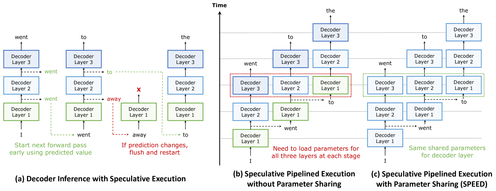
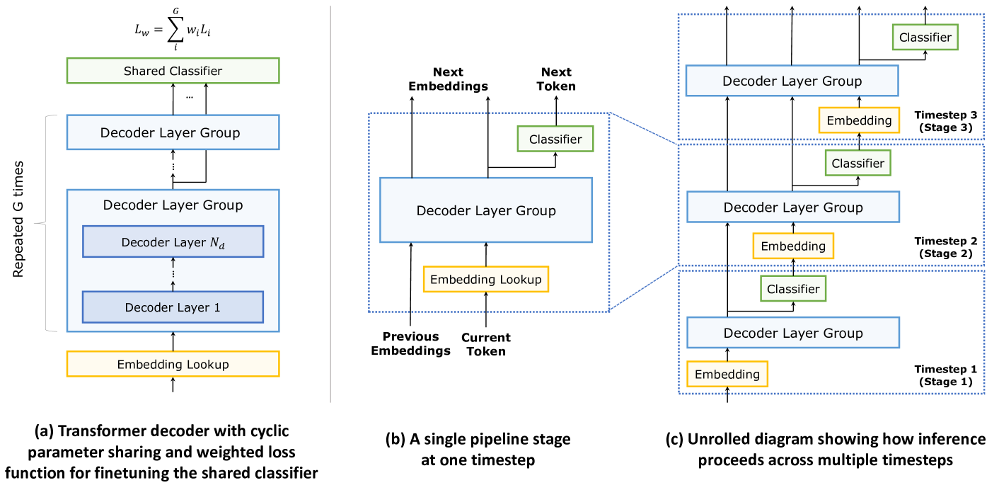
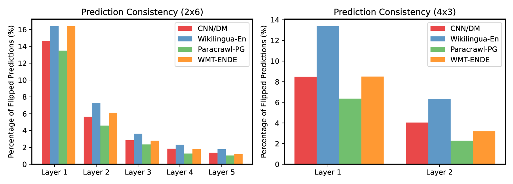
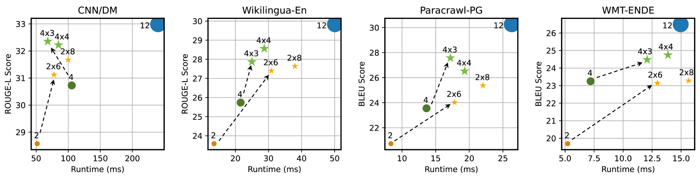

# SPEED: Speculative Pipelined Execution for Efficient Decoding

## 一、论文概述

| 项目 | 内容 |
|------|------|
| **标题** | SPEED: Speculative Pipelined Execution for Efficient Decoding |
| **作者** | Coleman Hooper, Sehoon Kim, Hiva Mohammadzadeh, Hasan Genc, Kurt Keutzer, Amir Gholami, Yakun Sophia Shao |
| **机构** | University of California, Berkeley |
| **论文** | [arXiv:2310.12072](https://arxiv.org/abs/2310.12072) |
| **代码** | - |
| **发布** | 2023年10月 |
| **许可** | - |

## 二、核心思想

### 问题定义

基于Transformer架构的生成式大语言模型（LLM）已成为各种NLP任务的主导基础模型。然而，由于这些模型的显著推理延迟，它们在实时场景中的应用受到很大限制。这主要是由于生成式LLM推理的自回归特性，每个token依赖于所有先前的输出token，因此token是顺序生成的。

### 解决方案概述

本文提出SPEED（Speculative Pipelined Execution for Efficient Decoding），通过使用基于早期层隐藏状态的预测值，在当前token的并行执行中推测性地执行多个未来token来提高推理效率。

**核心特点**：
- **推测执行**：使用早期预测值开始处理未来token
- **流水线化推理**：在序列长度维度上实现并行性
- **参数共享**：在采用参数共享的Transformer解码器中，可以分摊并行执行token的内存操作
- **保持精度**：通过完整的迭代确保模型精度不受影响

## 三、技术架构

### 整体框架图

**Figure 1**: 推测流水线执行与参数共享的方法概述。(a) 显示如何使用推测值开始后续token，以及如何在后续纠正任何不正确的预测。(b) 显示这种推测执行如何允许我们流水线化推理，从而在序列长度维度上实现并行性。(c) 显示在采用参数共享的网络中，推测流水线执行如何分摊序列长度维度上的内存操作，从而实现高效解码（SPEED）。

### 核心公式

#### 参数共享

参数共享方案对应于"CYCLE"配置。如果两个解码器层的组被共享三次，前向传递由交替通过层1和层2三次组成。

**共享损失函数**：

$$
L_{w} = \sum_{i=1}^{G} w_{i} L_{i}
$$

其中 $G$ 是解码器层组的数量，$L_{i}$ 和 $w_{i}$ 分别对应于第 $i$ 组的损失和应用的权重。

**默认权重方案**（线性权重）：

$$
w_{i} = i / (\sum_{i} i)
$$

这种权重方案故意将后面层的损失权重设置得更高，以确保最终输出精度不会下降。

### 推测流水线执行

**Figure 2**: 推测流水线执行方法的实现。(a) 显示参数如何在解码器层组之间循环共享，以及训练期间如何将每层的分类损失纳入共享损失函数。(b) 显示推理过程中的单个流水线阶段。(c) 显示多个流水线阶段的顺序进展。

**关键实现细节**：

1. **无效化逻辑**：当后续分类在当前阶段（即通过解码器层组之后）发生变化时，必须刷新并重新启动任何使用先前分类推测启动的未来迭代
2. **KV缓存管理**：确保当未来token被无效化时，对应于这些token的所有先前KV缓存更新也被无效化
3. **注意力模块修改**：内部逻辑需要修改以促进流水线化

### 推测预测翻转

**Figure 4**: 使用2x6和4x3配置进行推测流水线执行时，在每一层翻转的预测比例。

**关键发现**：
- 早期层的预测翻转率较高
- 随着层数增加，翻转率逐渐降低
- 这种模式对于不同配置（2x6和4x3）是一致的

## 四、核心创新

| 创新点 | 说明 | 理论/实验依据 |
|--------|------|---------------|
| **推测流水线执行** | 使用早期预测值并行处理多个token | 序列长度维度并行性 |
| **参数共享集成** | 在参数共享网络中分摊内存操作 | 内存操作减少 |
| **无效化逻辑** | 正确处理错误预测的推测执行 | 保持模型精度 |
| **KV缓存管理** | 支持推测执行的KV缓存无效化 | 确保正确性 |
| **共享损失函数** | 训练期间在各层使用共享分类器 | 早期预测能力 |

## 五、实验结果

### 精度与效率权衡

**Figure 3**: NVIDIA A5000 GPU上T5-Base使用推测执行的精度与效率权衡。星号对应使用推测流水线执行的参数共享配置，圆点对应基线配置（使用正常全长解码器或更浅的解码器）。点颜色表示具有相同参数数量的模型（点大小与解码器中的参数数量成比例）。箭头表示使用参数共享可以获得的精度提升，而不会产生通常会产生的完整延迟惩罚。

**实验配置**：
- 基线模型：T5-Base解码器（12层，隐藏维度768，12个注意力头，FFN维度2048）
- 参数共享配置：2x6（2层共享6次）、4x3（4层共享3次）等
- 预训练数据：C4
- 微调任务：翻译和摘要

### 关键结果

| 配置 | 参数数量 | 延迟 | 精度 |
|------|----------|------|------|
| 12层基线 | 100% | 基准 | 基准 |
| 2x6 + SPEED | ~33% | 接近浅解码器 | 显著高于浅解码器 |
| 4x3 + SPEED | ~50% | 接近浅解码器 | 显著高于浅解码器 |

**关键发现**：
- 使用参数共享和SPEED时，相对于基线12层解码器网络观察到显著加速
- 在除WMT-ENDE之外的所有基准测试中，实现了与无参数共享的更短解码器网络接近的运行时
- 参数共享配置比浅解码器基线获得了显著更高的精度
- 深化解码器（通过更多次共享参数）通常以最小的运行时惩罚提高精度

### 加速分析

**加速来源**：
1. **参数共享**：减少模型大小和内存占用
2. **推测执行**：在序列长度维度上实现并行性
3. **内存操作分摊**：在参数共享网络中分摊权重矩阵的内存操作

**限制因素**：
- 推测预测的准确性
- 错误预测的无效化开销
- 流水线气泡

## 六、相关工作

### 推测解码

| 方法 | 关键特性 | 本文对比 |
|------|----------|----------|
| **Speculative Decoding** | 使用草稿模型加速解码 | 方法参考 |
| **Draft-then-Verify** | 草稿-验证范式 | 概念相似 |

### 参数共享

| 方法 | 关键特性 | 本文对比 |
|------|----------|----------|
| **ALBERT** | 跨层参数共享 | 模型压缩参考 |
| **CYCLE配置** | 循环参数共享 | 核心方法 |

### 推理优化

| 方法 | 关键特性 | 本文对比 |
|------|----------|----------|
| **KV缓存** | 缓存先前计算 | 集成优化 |
| **FlashAttention** | 高效注意力实现 | 效率参考 |
| **量化** | 低精度推理 | 互补方法 |

## 七、总结

### 核心贡献

1. **SPEED方法**：提出推测流水线执行策略，实现序列长度维度上的并行性
2. **参数共享集成**：在参数共享网络中有效分摊内存操作
3. **无效化机制**：正确处理错误预测的推测执行，保持模型精度
4. **训练策略**：使用共享损失函数训练支持早期预测的分类器
5. **性能验证**：在多个任务上验证了精度和效率的权衡

### 技术影响

- **推理加速**：为Transformer解码器推理提供了新的加速方法
- **参数共享应用**：使参数共享不仅减少模型大小，还能加速推理
- **推测执行扩展**：将推测执行从token级别扩展到序列级别
- **边缘部署**：为资源受限设备上的LLM部署提供了新思路

### 局限性

- **预测准确性**：早期层的预测可能不准确，导致无效化开销
- **任务依赖性**：不同任务的预测准确性可能不同（如WMT-ENDE）
- **硬件要求**：需要足够的并行计算资源
- **模型架构**：主要在T5模型上验证，其他架构的泛化性需探索

## 八、参考资源

- **论文**: https://arxiv.org/abs/2310.12072
- **T5X**: https://github.com/google-research/t5x
- **JAX**: https://github.com/google/jax
- **ALBERT**: https://arxiv.org/abs/1909.11942
- **Speculative Decoding**: https://arxiv.org/abs/2211.17192
