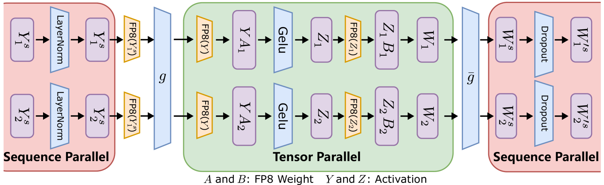
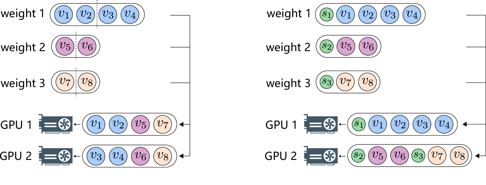
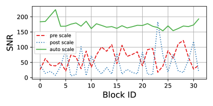
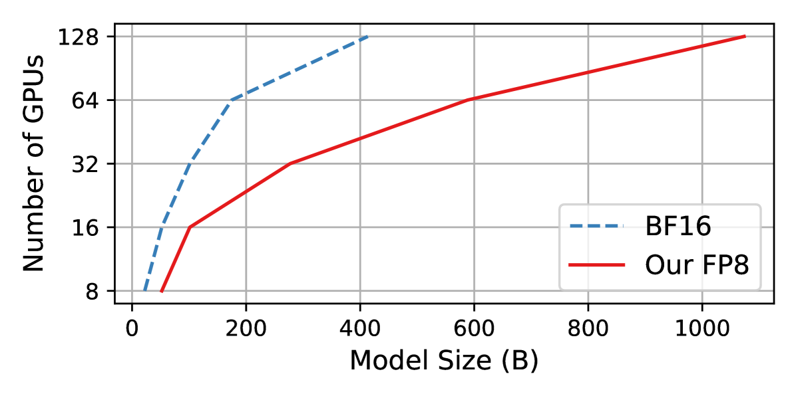
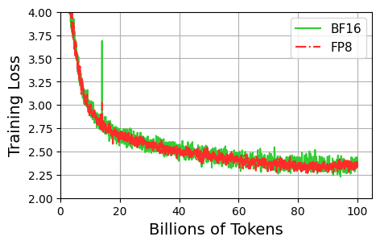

# FP8-LM: Training FP8 Large Language Models

## 一、论文概述

| 项目 | 内容 |
|------|------|
| **标题** | FP8-LM: Training FP8 Large Language Models |
| **作者** | Houwen Peng, Kan Wu, Yixuan Wei, Guoshuai Zhao, Yuxiang Yang, Ze Liu, Yifan Xiong, Ziyue Yang, Bolin Ni, Jingcheng Hu, Ruihang Li, Miaosen Zhang, Chen Li, Jia Ning, Ruizhe Wang, Zheng Zhang, Shuguang Liu, Joe Chau, Han Hu, Peng Cheng |
| **机构** | Microsoft Azure, Microsoft Research |
| **论文** | [arXiv:2310.18313](https://arxiv.org/abs/2310.18313) |
| **代码** | [MS-AMP](https://github.com/Azure/MS-AMP) |
| **发布** | 2023年10月 |
| **许可** | MIT |

## 二、核心思想

### 问题定义

训练大语言模型极其昂贵。低精度训练是最有前途的降低成本的方向之一：

- **FP8 优势**：理论上可实现 2x 加速、50-75% 内存节省、50-75% 通信节省
- **现有限制**：NVIDIA Transformer Engine 仅对 GEMM 计算使用 FP8，主权重和梯度仍使用高精度
- **挑战**：FP8 的动态范围和表示精度较低，容易导致训练不稳定

### 解决方案概述

FP8-LM 提出了一种新的 FP8 自动混合精度训练框架：

- **三级 FP8 利用**：逐步引入 8 位梯度、优化器状态和分布式学习
- **精度解耦**：将数据精度对不同参数的影响解耦
- **自动缩放**：动态调整张量缩放因子，防止关键信息丢失
- **端到端 FP8**：前向和反向传播都使用低精度 FP8

## 三、技术架构

### 整体框架图

### 核心公式

#### FP8 数据格式

FP8 有两种格式：
- **E4M3**：4 位指数，3 位尾数（用于前向传播）
- **E5M2**：5 位指数，2 位尾数（用于梯度）

#### 张量缩放

将高精度值缩放到 FP8 表示范围：

$$x_{\text{FP8}} = \text{Cast}_{\text{FP8}}\left(\frac{x}{s}\right)$$

其中 $s$ 是缩放因子。

#### 梯度 All-Reduce

**预缩放问题**：

$$g = \frac{g_1}{N} + \frac{g_2}{N} + \cdots + \frac{g_N}{N}$$

当 $N$ 很大时，除法可能导致数据下溢。

**后缩放**：

$$g = (g_1 + g_2 + \cdots + g_N) / N$$

先求和再除以 $N$，减少下溢风险。

**自动缩放**：动态调整缩放因子，保持梯度在 FP8 表示范围内。

### 三级 FP8 优化

#### Level 1: FP8 梯度和通信

- **FP8 梯度存储**：梯度使用 FP8 格式
- **FP8 All-Reduce**：梯度通信使用 FP8
- **节省**：通信开销减少 50-75%

#### Level 2: FP8 优化器

- **FP8 优化器状态**：动量和方差使用 FP8
- **FP8 权重更新**：权重更新使用 FP8
- **节省**：内存占用减少 50-75%

#### Level 3: FP8 分布式训练

- **FP8 张量并行**：激活值使用 FP8 通信
- **FP8 流水线并行**：流水线通信使用 FP8
- **FP8 序列并行**：序列并行通信使用 FP8
- **节省**：并行通信开销大幅减少

### ZeRO 优化

**原始 ZeRO**：将单个张量分割成多个分区，分布到不同设备

**FP8 ZeRO**：将每个张量整体分布到设备，同时考虑张量缩放

**优势**：
- 保持缩放因子的一致性
- 避免缩放因子的额外存储
- 简化分布式训练

### 精度解耦

**核心思想**：不同参数对精度的敏感度不同

| 参数 | 精度敏感度 | 推荐精度 |
|------|-----------|----------|
| **权重** | 高 | FP16/BF16 |
| **梯度** | 中 | FP8 |
| **优化器状态** | 低 | FP8 |
| **激活值** | 中 | FP8 |

### 自动缩放

**问题**：梯度值可能超出 FP8 表示范围

**解决方案**：动态调整缩放因子

1. **监控**：跟踪梯度的最大绝对值
2. **调整**：如果梯度接近范围边界，调整缩放因子
3. **更新**：每 N 步更新一次缩放因子

## 四、核心创新

| 创新点 | 说明 | 理论/实验依据 |
|--------|------|---------------|
| **三级 FP8 优化** | 逐步引入 FP8 到训练各环节 | 灵活的精度-效率权衡 |
| **精度解耦** | 不同参数使用不同精度 | 最大化 FP8 利用 |
| **自动缩放** | 动态调整缩放因子 | 防止梯度下溢/上溢 |
| **FP8 ZeRO** | 考虑缩放因子的 ZeRO | 简化分布式训练 |
| **端到端 FP8** | 前向和反向都使用 FP8 | 最大化效率提升 |

## 五、实验结果

### 实验设置

| 配置 | 说明 |
|------|------|
| **GPU** | H100 80GB |
| **模型** | GPT-7B, GPT-13B, GPT-175B |
| **基线** | BF16 (Megatron-LM), NVIDIA Transformer Engine |
| **任务** | 预训练, SFT, RLHF |

### 模型规模对比

**结论**：FP8 可以在相同硬件上训练更大的模型。

### 训练损失对比

| 模型 | FP8 损失 | BF16 损失 | 差异 |
|------|----------|-----------|------|
| GPT-7B | ~2.5 | ~2.5 | 无显著差异 |
| GPT-13B | ~2.3 | ~2.3 | 无显著差异 |
| GPT-175B | ~2.0 | ~2.0 | 无显著差异 |

**结论**：FP8 训练与 BF16 训练性能相当。

### 内存节省

| 模型 | BF16 内存 | FP8 内存 | 节省比例 |
|------|-----------|----------|----------|
| GPT-7B | ~60GB | ~43GB | 29% |
| GPT-175B | ~75GB | ~46GB | 39% |

### 训练速度

| 模型 | BF16 速度 | FP8 速度 | 加速比 |
|------|-----------|----------|--------|
| GPT-175B | 基准 | 1.75x | 75% 更快 |

**对比 NVIDIA Transformer Engine**：37% 更快

### 通信开销

| 通信类型 | BF16 | FP8 | 节省比例 |
|----------|------|-----|----------|
| 权重相关通信 | 基准 | - | 63-65% |

### SFT 和 RLHF

**SFT**：
- FP8 与 BF16 性能相当
- 训练速度提升 27%

**RLHF**：
- 模型权重减少 32%
- 优化器状态内存减少 62%

## 六、相关工作

### 低精度训练方法

| 方法 | 精度 | 范围 |
|------|------|------|
| **FP32** | 32 位 | 全精度 |
| **FP16/BF16** | 16 位 | 混合精度 |
| **FP8** | 8 位 | 本文重点 |
| **INT8** | 8 位整数 | 推理为主 |

### FP8 训练框架

| 框架 | FP8 范围 | 特点 |
|------|----------|------|
| **NVIDIA TE** | 仅 GEMM | 有限 FP8 利用 |
| **FP8-LM** | 端到端 | 最大化 FP8 利用 |

## 七、总结

### 核心贡献

1. **FP8 混合精度框架**：三级 FP8 优化，逐步引入 8 位训练
2. **精度解耦技术**：最大化 FP8 利用同时保持精度
3. **自动缩放方法**：动态调整防止梯度下溢/上溢
4. **大规模验证**：GPT-175B 训练验证有效性
5. **开源实现**：MS-AMP 框架

### 技术影响

- **成本降低**：训练速度提升 75%，内存节省 39%
- **效率提升**：比 NVIDIA Transformer Engine 快 37%
- **广泛应用**：适用于预训练、SFT、RLHF
- **下一代训练**：为 FP8 训练建立新范式

### 局限性

- **硬件依赖**：需要 H100 等支持 FP8 的 GPU
- **精度风险**：FP8 可能在某些任务上精度略低
- **实现复杂性**：需要精心实现缩放和通信
- **模型规模**：主要在 GPT 风格模型上验证

## 八、参考资源

- **论文**: https://arxiv.org/abs/2310.18313
- **MS-AMP**: https://github.com/Azure/MS-AMP
- **NVIDIA TE**: https://github.com/NVIDIA/TransformerEngine
- **Megatron-LM**: https://arxiv.org/abs/1909.08053
