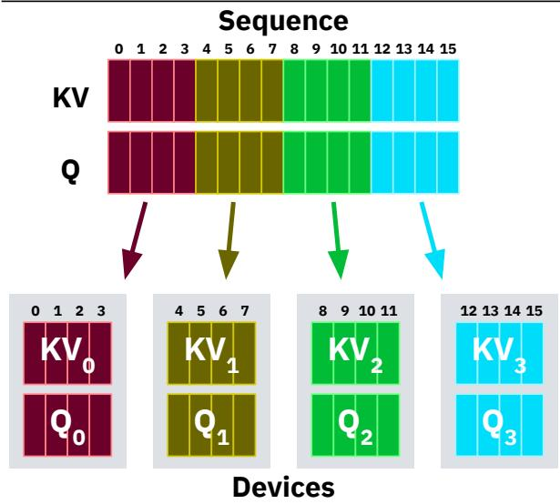
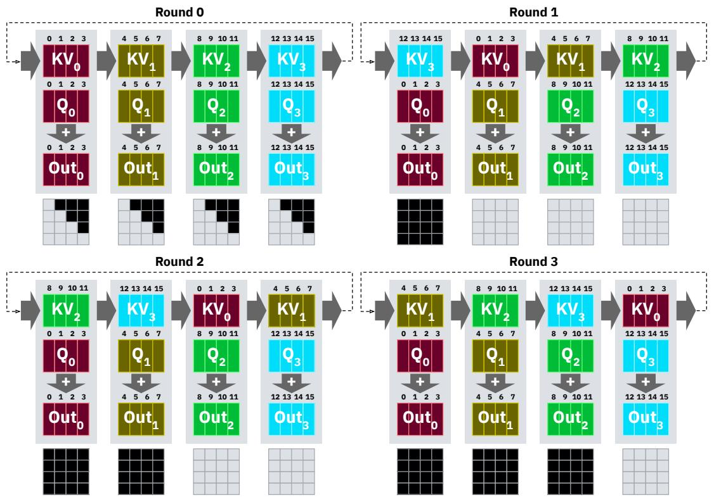
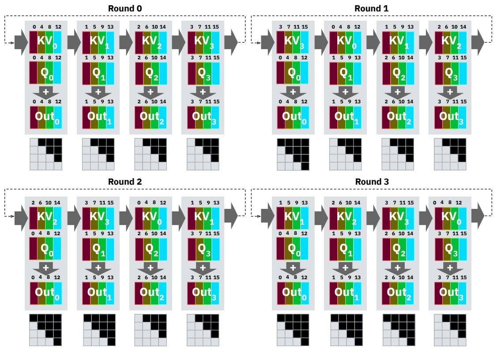
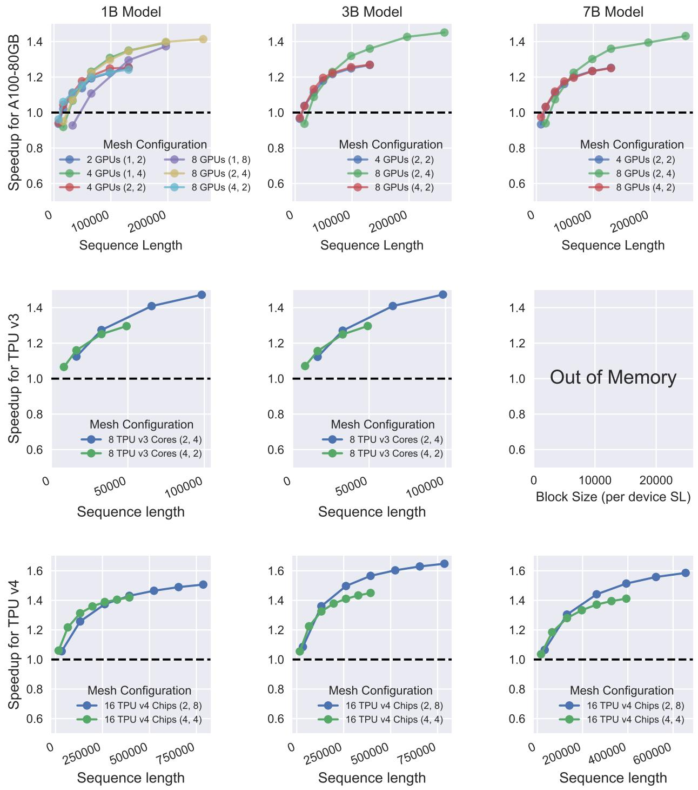
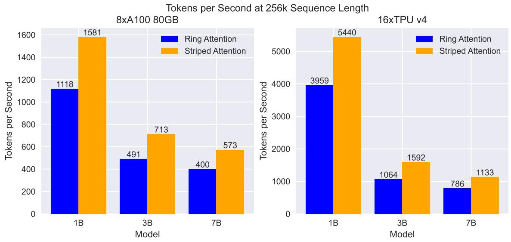
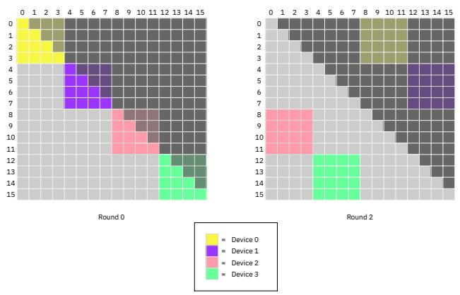
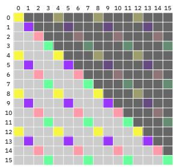

# Striped Attention: Faster Ring Attention for Causal Transformers

## 一、论文概述

| 项目 | 内容 |
|------|------|
| **标题** | Striped Attention: Faster Ring Attention for Causal Transformers |
| **作者** | William Brandon, Aniruddha Nrusimha, Kevin Qian, Zachary Ankner, Tian Jin, Zhiye Song, Jonathan Ragan-Kelley |
| **机构** | MIT CSAIL, MosaicML, MIT EECS |
| **论文** | [arXiv:2311.09431](https://arxiv.org/abs/2311.09431) |
| **代码** | 开源实现 |
| **发布** | 2023年11月 |
| **许可** | - |

## 二、核心思想

### 问题定义

Ring Attention 是一种分布式注意力算法，能够通过将自注意力计算分布到多个设备上来突破单设备内存瓶颈。然而，在因果 Transformer 模型中，Ring Attention 存在严重的**工作负载不均衡**问题：

- **三角形结构**：因果注意力的计算具有三角形结构（上三角被掩码）
- **不均衡分配**：连续分块导致某些设备的工作完全被掩码，而其他设备的工作完全不被掩码
- **性能瓶颈**：每轮迭代的延迟由最慢的设备决定，无法利用因果掩码节省计算

### 解决方案概述

Striped Attention 提出了一种简单的改进：

- **条纹分区**：将 token 按模运算均匀分布到各设备（而非连续分块）
- **均衡工作负载**：每个设备在每轮迭代中都有大约一半的计算被掩码
- **精确算法**：不牺牲注意力计算的精确性
- **利用置换等变性**：利用注意力计算的置换等变性确保输出正确

## 三、技术架构

### 核心公式

#### 因果自注意力

$$\operatorname{CausalAttn}(Q, K, V) = \operatorname{Softmax}(QK^\top + C)V$$

其中因果掩码矩阵 $C$：

$$C_{i,j} = \begin{cases} -\infty & \text{if } i < j \\ 0 & \text{if } i \geq j \end{cases}$$

#### Ring Attention 工作负载

Ring Attention 中设备 $j$ 在第 $k$ 轮的工作负载：

$$\operatorname{Work}_{\text{Ring}}(j, k) = \begin{cases} c^2 & \text{if } j \geq k \text{ (完全不被掩码)} \\ 0 & \text{if } j < k \text{ (完全被掩码)} \end{cases}$$

其中 $c$ 是每设备的块大小。

#### Striped Attention 工作负载

Striped Attention 中设备 $i$ 与块 $j$ 的交互：

$$\operatorname{Work}(i, j) = \begin{cases} \frac{c(c+1)}{2} & i \geq j \\ \frac{c(c-1)}{2} & i < j \end{cases}$$

**关键区别**：每个设备的工作负载都接近 $c^2/2$，而非 $c^2$ 或 $0$。

### 分区策略对比



| 策略 | 分区方式 | 工作负载均衡 |
|------|----------|-------------|
| **Ring Attention** | 连续子序列 | 严重不均衡 |
| **Striped Attention** | 条纹分布（模运算） | 近似均衡 |

**Ring Attention**：设备 0 持有 token 0-3，设备 1 持有 token 4-7，...

**Striped Attention**：设备 0 持有 token 0, 4, 8, 12，设备 1 持有 token 1, 5, 9, 13，...

### 算法行为对比

#### Ring Attention



- 第 0 轮：所有设备计算对角线块（部分掩码）
- 第 1-3 轮：部分设备工作完全被掩码，部分完全不被掩码
- **问题**：延迟由最慢设备决定，无法节省计算

#### Striped Attention



- 每轮：所有设备的工作负载都是上三角掩码
- **优势**：每轮都可以跳过约一半的计算

### GetMask 函数

#### Ring Attention

```
procedure GETMASKRINGATTENTION(j, k)
    if j < k then
        ∀x, y MASK[x, y] = -∞
    else if j = k then
        ∀x, y | y < x MASK[x, y] = -∞
    end if
end procedure
```

#### Striped Attention

```
procedure GETMASKSTRIPEDATTENTION(j, k)
    Initialize MASK ∈ R^(n_seq/N × n_seq/N)
    ∀x, y MASK[x, y] = 0
    if j < k then
        ∀x, y | y ≤ x MASK[x, y] = -∞
    else if j ≥ k then
        ∀x, y | y < x MASK[x, y] = -∞
    end if
    return MASK
end procedure
```

### 实现细节

#### 分块与分瓦片

- **块（Block）**：每设备持有的 token 子集
- **瓦片（Tile）**：块内进一步细分的计算单元
- **跳过策略**：如果瓦片完全被掩码，则跳过整个瓦片的计算

#### 瓦片大小选择

| 平台 | 瓦片大小 |
|------|----------|
| A100 GPU | 2048 queries × 4096 keys |
| TPU v3/v4 | 2048 queries × 2048 keys |

#### 位置编码处理

- **RoPE 等位置编码**：需要对位置 ID 进行相同的条纹置换
- **训练目标**：需要对目标 token ID 序列进行相同的置换

### 理论最大加速比

在极限情况下（块大小和设备数趋于无穷），Striped Attention 相对于 Ring Attention 的最大理论加速比趋近 **2x**。

**实际限制**：
- 瓦片粒度的跳过限制了小块大小下的加速
- 非注意力计算的开销
- 通信-计算重叠的不完美

## 四、核心创新

| 创新点 | 说明 | 理论/实验依据 |
|--------|------|---------------|
| **工作负载均衡** | 识别并解决 Ring Attention 的工作负载不均衡 | 每设备工作从 $c^2$ 或 0 变为约 $c^2/2$ |
| **条纹分区** | 按模运算均匀分布 token | 利用注意力的置换等变性 |
| **因果掩码优化** | 每轮都能跳过约一半计算 | 相比 Ring Attention 仅首轮可优化 |
| **精确算法** | 不牺牲计算精度 | 置换等变性保证输出正确 |
| **简单实现** | 仅需修改分区和掩码逻辑 | 易于扩展现有 Ring Attention 实现 |

## 五、实验结果

### 实验设置

| 配置 | 说明 |
|------|------|
| **GPU** | 8 × NVIDIA A100 80GB (NVLink) |
| **TPU** | 4 × TPU v3, 16 × TPU v4 |
| **模型** | 1B, 3B, 7B 参数 |
| **序列长度** | 8K - 256K (GPU), 最高 786K (TPU) |
| **并行配置** | 模型并行 1-4, 序列并行 2-8 |

### 核心结果



**256K 序列长度下的加速比**：

| 模型 | Mesh | A100 | TPUv4 |
|------|------|------|-------|
| 1B | (2, 4/8) | 1.41x | 1.39x |
| 3B | (2, 4/8) | 1.45x | 1.50x |
| 7B | (2, 4/8) | 1.43x | 1.44x |

**最大加速比**：
- **A100 GPU**：1.45x（3B 模型，256K 序列）
- **TPUv4**：1.65x（3B 模型，786K 序列）

### 训练吞吐量



Striped Attention 在所有模型配置下都实现了显著的吞吐量提升。

### 工作负载分布对比





**Ring Attention 第 2 轮**：部分设备工作完全被掩码（黑色），部分完全不被掩码

**Striped Attention**：每轮所有设备都有约一半的计算被掩码，工作负载均衡

### 理论 vs 实际加速比

| 模型 | 序列长度 | TMS | 实际加速比 |
|------|----------|-----|-----------|
| 1B | 16K | 1.46 | 0.95 |
| 1B | 64K | 1.65 | 1.22 |
| 1B | 256K | 1.72 | 1.41 |
| 3B | 256K | 1.71 | 1.45 |
| 7B | 256K | 1.70 | 1.43 |

**观察**：
- 序列长度越大，实际加速比越接近理论值
- 瓦片粒度限制了小序列长度下的加速效果

### 加速比随序列长度增长

| 序列长度 | 1B (2×8) | 3B (2×8) | 7B (2×8) |
|----------|----------|----------|----------|
| 32K | 1.06 | 1.09 | 1.07 |
| 131K | 1.26 | 1.36 | 1.30 |
| 262K | 1.37 | 1.50 | 1.44 |
| 524K | 1.47 | 1.60 | 1.56 |
| 786K | 1.51 | 1.65 | - |

## 六、相关工作

### 分布式注意力方法

| 方法 | 关键特性 | 本文对比 |
|------|----------|----------|
| **Ring Attention** | 环形拓扑，连续分块 | 基础方法，本文改进 |
| **DeepSpeed Ulysses** | All-to-All 通信优化 | 不同优化方向 |
| **LightSeq** | 通信-计算重叠优化 | 需要移动 Q 和 K |
| **FlashAttention** | 单设备高效注意力 | 可与本文结合 |

### 序列并行方法

| 方法 | 关键特性 | 局限性 |
|------|----------|--------|
| **Megatron-LM SP** | 张量并行+序列并行 | 通信开销大 |
| **FSDP** | 全分片数据并行 | 非专门优化注意力 |
| **Ring Attention** | 环形通信，计算-通信重叠 | 工作负载不均衡 |
| **Striped Attention** | 条纹分区，均衡负载 | 仅适用于因果注意力 |

## 七、总结

### 核心贡献

1. **识别问题**：发现 Ring Attention 在因果注意力中的工作负载不均衡
2. **提出方案**：Striped Attention 通过条纹分区实现工作负载均衡
3. **理论分析**：证明最大理论加速比趋近 2x
4. **实验验证**：在 A100 和 TPU 上实现 1.45x-1.65x 加速
5. **开源实现**：基于 JAX 的开源实现

### 技术影响

- **长序列训练**：使更长序列的训练更加高效
- **精确算法**：不牺牲计算精度，可直接替换 Ring Attention
- **简单实现**：易于集成到现有系统
- **广泛应用**：适用于所有因果 Transformer 模型

### 局限性

- **仅限因果注意力**：不适用于双向注意力（如 BERT）
- **瓦片粒度限制**：小序列长度下加速效果有限
- **通信开销**：假设高速互连（NVLink/InfiniBand）
- **实现优化**：当前实现可能未充分利用硬件特性

## 八、参考资源

- **论文**: https://arxiv.org/abs/2311.09431
- **Ring Attention**: https://arxiv.org/abs/2310.01889
- **FlashAttention**: https://arxiv.org/abs/2205.14135
- **FlashAttention-2**: https://arxiv.org/abs/2307.08691
- **Megatron-LM**: https://arxiv.org/abs/1909.08053
