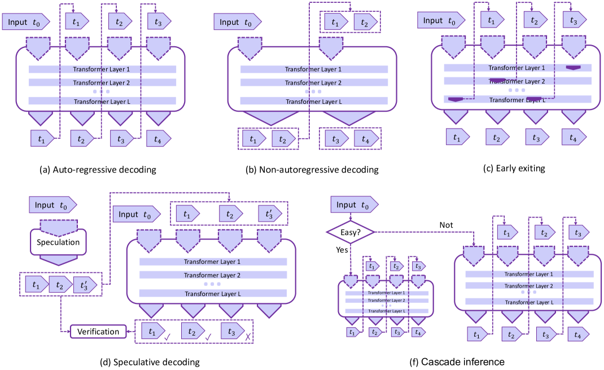
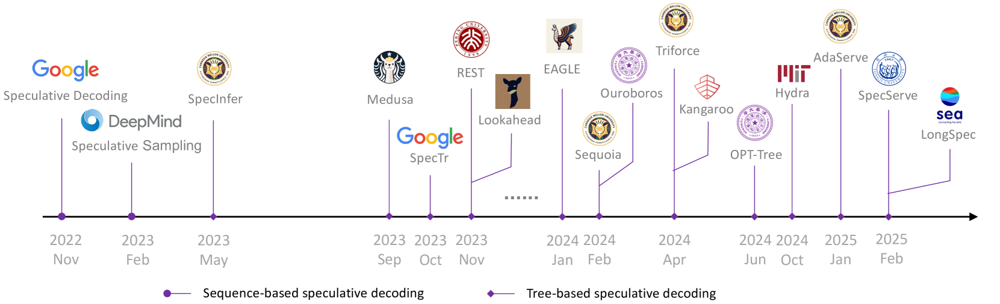
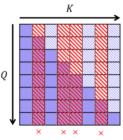

# 高效 LLM 服务综述：从算法到系统

## 一、论文概述

| 项目 | 内容 |
|------|------|
| **标题** | Towards Efficient Generative Large Language Model Serving: A Survey from Algorithms to Systems |
| **作者** | Xupeng Miao, Gabriele Oliaro, Zhihao Zhang, Xinhao Cheng, Hongyi Jin, Tianqi Chen, Zhihao Jia |
| **机构** | Purdue University, Carnegie Mellon University |
| **论文** | [arXiv:2312.15234](https://arxiv.org/abs/2312.15234) |
| **代码** | - |
| **发布** | 2023年12月（2025年7月更新） |
| **许可** | ACM Computing Surveys |

## 二、核心思想

### 问题定义

生成式大语言模型（LLMs）在 AI 领域处于前沿，但部署面临重大挑战：

1. **计算密集**：Transformer 自注意力机制 $O(L^2)$ 复杂度
2. **内存消耗大**：大规模参数和 KV 缓存
3. **低延迟需求**：实时应用要求快速响应
4. **高吞吐量**：需要处理大量并发请求

### 解决方案概述

本综述从 MLSys 视角全面分析高效 LLM 服务方法：

**分类体系**：
1. **算法创新**：解码算法、架构设计、模型压缩
2. **系统优化**：低比特量化、并行计算、内存管理、请求调度、内核优化

## 二、核心思想

### 问题定义

LLM 服务面临的核心挑战：

| 挑战 | 说明 |
|------|------|
| **延迟和响应时间** | 实时应用需要低延迟 |
| **内存占用和模型大小** | 大模型需要大量内存 |
| **可扩展性和吞吐量** | 需要处理多个并发请求 |
| **硬件兼容性和加速** | 适配不同硬件平台 |
| **精度和效率权衡** | 平衡模型大小和性能 |

### 解决方案分类

**算法创新**：
1. **解码算法**：非自回归解码、推测解码、早退、级联推理
2. **架构设计**：配置缩小、注意力简化、激活共享、条件计算、循环单元
3. **模型压缩**：知识蒸馏、网络剪枝

**系统优化**：
1. **低比特量化**：PTQ、QAT
2. **并行计算**：模型并行、序列并行、云扩展、去中心化推理
3. **内存管理**：KV 缓存优化
4. **请求调度**：批处理优化
5. **内核优化**：自动编译、注意力内核

## 三、技术架构

### 核心公式

#### 自注意力机制

$$\text{Attention}(Q, K, V) = \text{softmax}\left(\frac{QK^T}{\sqrt{d_k}}\right)V$$

**计算复杂度**：$O(L^2)$，其中 $L$ 为序列长度

#### 前馈网络

$$\text{FFN}(x) = \max(0, xW_1 + b_1)W_2 + b_2$$

**贡献**：显著的参数数量、内存占用和计算负载

#### 自回归解码

**算法**：
1. 初始化输入序列 $X_0$
2. 对于 $t = 1$ 到 $T$：
   - 预测下一个 token：$y_t = \text{argmax}_y P(y|X_{t-1})$
   - 更新序列：$X_t = X_{t-1} \oplus y_t$
   - 如果 $y_t$ 是 EOS，停止

### 解码算法

#### 非自回归解码

**目标**：并行生成输出 token，打破自回归依赖

**方法**：
- 假设输出 token 之间的条件独立性
- 半自回归解码：块级并行
- 迭代精炼：多轮改进输出

**局限**：输出质量通常不如自回归方法

#### 推测解码

**核心思想**：
1. 使用小型草稿模型高效预测多个 token
2. 使用原始 LLM 并行验证预测
3. 如果预测错误，回退机制生效

**关键优势**：
- 不改变输出质量
- 增加并行性
- 树状推测解码被广泛采用

#### 早退

**核心思想**：利用 LLM 的深层多层架构

**方法**：
- 早期层输出可能已足够推断目标分布
- 基于内部分类器发出预测
- 自适应计算：根据请求难度调整计算量

**局限**：内部表示信息可能不足

#### 级联推理

**核心思想**：使用不同规模的 LLM 最小化响应时间

**方法**：
- 根据查询复杂度分配到不同模型
- 学习型分配机制
- 成本和性能联合优化

### 架构设计

#### 注意力简化

**方法分类**：
- **选择性**：Top-k、排序
- **滑动窗口 + 膨胀**：LongNet
- **全局 token**：摘要 token、地标 token
- **基于哈希**：哈希注意力

**代表工作**：
- Scissorhands、H2O：选择重要 token
- StreamingLLM：初始 token + 滑动窗口
- TriForce：层次化推测解码

#### 激活共享

**方法**：
- **MQA**：不同头共享单组 K、V
- **GQA**：放松到多组，每组耦合一组 Q
- **MLA**：低秩联合压缩 K、V

**应用**：
- MQA：Falcon、PaLM、ChatGLM2-6B
- GQA：LLaMA-2、Mistral-7B
- MLA：DeepSeek V2、V3、R1

#### 条件计算

**Mixture of Experts (MoE)**：
- 将模型容量分区到多个"专家"
- 根据输入仅调用必要的专家
- 实现计算和内存效率

**挑战**：
- 动态性需要特殊系统优化
- 分布式通信和 GPU 内核实现

#### 循环单元

**方法**：
- RWKV、RetNet
- 线性注意力表示
- 线性递归单元

**优势**：
- 线性计算和内存复杂度
- 保持可并行训练属性

**局限**：是否能成功替代 Transformer 仍是开放问题

### 模型压缩

#### 知识蒸馏

**分类**：
- **白盒蒸馏**：访问整个教师模型参数
- **黑盒蒸馏**：基于 API 的蒸馏

**代表工作**：
- Alpaca、Vicuna、WizardLM
- 参数更少但性能有竞争力

#### 网络剪枝

**分类**：
- **结构化剪枝**：移除整个组件
- **非结构化剪枝**：50-60% 稀疏度
- **半结构化稀疏**：N:M 稀疏（2:4、4:8）

**加速**：
- NVIDIA 稀疏张量核心加速
- Flash-LLM：内存高效 SpMM

### 系统优化

#### 低比特量化

**分类**：
- **PTQ**：训练后量化
- **QAT**：量化感知训练

**精度**：
- W8A16：INT8 权重，FP16 激活
- W4A16：INT4 权重
- W8A8：INT8 权重和激活
- FP8：Hopper 架构支持

#### 并行计算

**方法**：
- **模型并行**：张量并行、流水线并行
- **序列并行**：序列维度分片
- **云扩展**：分布式推理
- **去中心化推理**：边缘设备

#### 内存管理

**KV 缓存优化**：
- PagedAttention：虚拟内存管理
- 动态内存分配
- 缓存淘汰策略

#### 请求调度

**方法**：
- 连续批处理
- 动态批处理
- 优先级调度

#### 内核优化

**方法**：
- 自动编译
- 变长序列优化
- 定制注意力内核
- 内核融合

## 四、核心创新

| 创新点 | 说明 | 理论/实验依据 |
|--------|------|---------------|
| **全面分类体系** | 从算法到系统的完整分类 | 覆盖所有主要方法 |
| **深度分析** | 每个方法的优缺点分析 | 理论和实验支撑 |
| **实践指导** | 为从业者提供选择指南 | 实际部署经验 |
| **未来方向** | 识别有前景的研究方向 | 基于当前趋势 |

## 五、实验结果

### 代表框架

| 框架 | 关键特性 | 适用场景 |
|------|----------|----------|
| **vLLM** | PagedAttention | 通用 LLM 服务 |
| **TensorRT-LLM** | NVIDIA 优化 | NVIDIA GPU |
| **DeepSpeed** | 微软优化 | 大规模推理 |
| **FlexGen** | 内存优化 | 内存受限场景 |
| **SpecInfer** | 推测解码 | 低延迟服务 |

### 性能对比

**延迟优化**：
- 推测解码：2-3x 加速
- 量化：1.5-2x 加速
- 内核优化：1.2-1.5x 加速

**吞吐量优化**：
- 连续批处理：2-5x 提升
- 并行计算：线性缩放
- 内存管理：1.5-2x 提升

## 六、相关工作

### 综述对比

| 综述 | 关键特性 | 局限性 |
|------|----------|--------|
| **本综述** | 从算法到系统全面覆盖 | - |
| **其他综述** | 仅覆盖部分方面 | 不够全面 |

### 与其他领域关系

- **模型压缩**：与传统模型压缩相关
- **分布式系统**：与分布式推理相关
- **硬件加速**：与硬件优化相关

## 七、总结

### 核心贡献

1. **全面分类体系**：从算法到系统的完整分类
2. **深度技术分析**：每个方法的优缺点
3. **实践指导**：为从业者提供选择指南
4. **未来方向**：识别有前景的研究方向

### 技术影响

- **研究价值**：为研究者提供全面参考
- **实践价值**：为从业者提供选择指南
- **教育价值**：为学生提供学习资源

### 未来方向

1. **算法-系统协同设计**：联合优化算法和系统
2. **硬件感知优化**：针对特定硬件的优化
3. **长上下文优化**：处理超长序列
4. **多模态优化**：支持多模态模型
5. **边缘部署**：在资源受限设备上部署

## 八、参考资源

- **论文**: https://arxiv.org/abs/2312.15234
- **vLLM**: https://github.com/vllm-project/vllm
- **TensorRT-LLM**: https://github.com/NVIDIA/TensorRT-LLM
- **DeepSpeed**: https://github.com/microsoft/DeepSpeed
- **FlexGen**: https://github.com/FMInference/FlexGen
- **SpecInfer**: https://github.com/CMU-DB/SpecInfer
