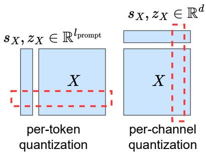
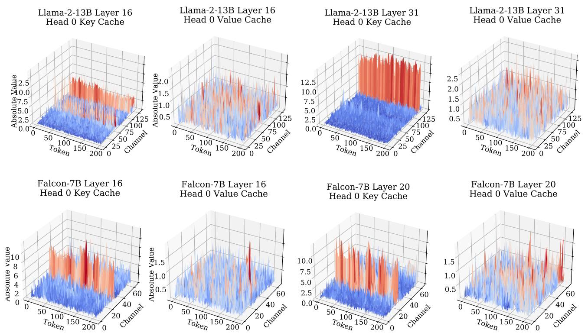
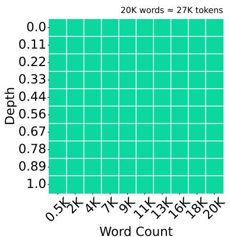
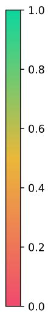
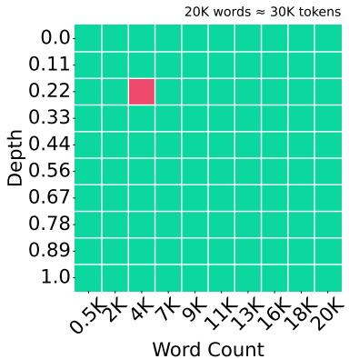

# KIVI: A Tuning-Free Asymmetric Quantization for KV Cache

## 一、论文概述

| 项目 | 内容 |
|------|------|
| **标题** | KIVI: A Tuning-Free Asymmetric Quantization for KV Cache |
| **作者** | Zirui Liu, Jiayi Yuan, Hongye Jin, Shaochen (Henry) Zhong, Zhaozhuo Xu, Vladimir Braverman, Beidi Chen, Xia Hu |
| **机构** | Rice University, Texas A&M University, Meta AI |
| **论文** | [arXiv:2402.02750](https://arxiv.org/abs/2402.02750) |
| **代码** | - |
| **发布** | 2024年2月 |
| **许可** | - |

## 二、核心思想

### 问题定义

大语言模型（LLM）推理中的键值（KV）缓存消耗大量内存，限制了长上下文推理和批量大小。量化是减少内存的有效方法，但现有方法存在以下问题：

1. **需要微调**：许多量化方法需要微调才能保持性能
2. **对称量化**：使用对称量化，未考虑KV缓存的分布特性
3. **精度损失**：量化可能导致显著的精度损失

### 解决方案概述

本文提出**KIVI**，一种免调优的非对称2-bit量化算法：

1. **关键观察**：键缓存和值缓存有不同的分布特性
2. **非对称策略**：键按通道量化，值按token量化
3. **免调优**：无需微调，可直接应用于现有模型

**实验结果**：
- 显著减少内存使用
- 保持有竞争力的生成质量
- 在困惑度评估和长上下文基准上表现良好

## 三、技术架构

### 整体框架图

**Figure 1**: 每token和每通道量化的定义。

**量化维度**：
- **每token量化**：沿token维度量化
- **每通道量化**：沿通道维度量化

### 核心观察

**Figure 2**: Llama-2-13B和Falcon-7B的键和值缓存的幅度分析。

**关键发现**：
1. **键缓存**：存在显著的异常通道（outlier channels）
2. **值缓存**：分布更均匀，跨通道变化小
3. **量化策略**：应根据分布特性选择不同的量化维度

### 非对称量化策略

**Figure 3**: KIVI算法概述。

**策略设计**：

#### 键缓存量化

**观察**：键缓存有显著的异常通道
**策略**：按通道量化（per-channel quantization）
**公式**：
$$K_{int} = \text{round}\left(\frac{K_{fp16}}{s_{channel}}\right) + z_{channel}$$

其中 $s_{channel}$ 和 $z_{channel}$ 是每通道的缩放因子和零点。

#### 值缓存量化

**观察**：值缓存分布更均匀
**策略**：按token量化（per-token quantization）
**公式**：
$$V_{int} = \text{round}\left(\frac{V_{fp16}}{s_{token}}\right) + z_{token}$$

其中 $s_{token}$ 和 $z_{token}$ 是每token的缩放因子和零点。

### 核心公式

#### 量化公式

**统一量化公式**：
$$X_{int} = \text{round}\left(\frac{X_{fp16}}{s}\right) + z$$

**反量化公式**：
$$X_{fp16} = (X_{int} - z) \times s$$

#### 缩放因子计算

**每通道缩放因子**（键缓存）：
$$s_{channel} = \frac{\max(X) - \min(X)}{2^b - 1}$$

**每token缩放因子**（值缓存）：
$$s_{token} = \frac{\max(X) - \min(X)}{2^b - 1}$$

其中b是量化位数（本文使用2-bit）。

### 2-bit量化

**量化级别**：4个级别（-2, -1, 0, 1）
**存储**：每元素仅需2-bit
**内存节省**：相比FP16减少8倍

## 四、核心创新

| 创新点 | 说明 | 理论/实验依据 |
|--------|------|---------------|
| **非对称量化** | 键按通道，值按token量化 | 分布特性分析 |
| **免调优** | 无需微调即可应用 | 直接部署 |
| **2-bit量化** | 极低比特量化 | 内存显著减少 |
| **分布感知** | 根据KV缓存分布选择策略 | 精度保持 |

## 五、实验结果

### 实验配置

**评估模型**：
- Llama-2-7B
- Llama-2-13B
- Falcon-7B
- Mistral-7B

**评估任务**：
- 困惑度评估
- 长上下文基准
- Needle-in-a-Haystack

### Needle-in-a-Haystack

**Figure 4**: Llama-3-8B-Instruct和Mistral-7B-Instruct-v0.2上的Needle-in-a-Haystack结果。

**关键结果**：
- KIVI在长上下文检索任务上表现良好
- 2-bit量化仍保持检索能力
- 适合长上下文推理

### 内存和吞吐量

**Figure 5**: 2-bit KIVI和16-bit基线之间的内存使用和吞吐量比较。

**关键结果**：
- 内存使用显著减少（约8倍）
- 吞吐量提高
- 支持更大的批量大小

### 困惑度评估

**关键发现**：
- 2-bit KIVI保持有竞争力的困惑度
- 在不同模型上都表现稳定
- 免调优方法有效

## 六、相关工作

### KV缓存量化

| 方法 | 关键特性 | 本文对比 |
|------|----------|----------|
| **GPTQ** | 权重量化 | 不同目标 |
| **AWQ** | 激活感知量化 | 相关工作 |
| **SqueezeLLM** | 稀疏量化 | 相关工作 |

### KV缓存优化

| 方法 | 关键特性 | 本文对比 |
|------|----------|----------|
| **H2O** | KV缓存驱逐 | 互补技术 |
| **SnapKV** | KV缓存压缩 | 互补技术 |
| **PagedAttention** | 分页KV缓存 | 互补技术 |

## 七、总结

### 核心贡献

1. **非对称量化策略**：根据键和值缓存的不同分布特性选择量化维度

2. **免调优方法**：无需微调即可将2-bit量化应用于现有模型

3. **显著内存节省**：KV缓存内存减少约8倍

4. **精度保持**：在困惑度和长上下文任务上保持有竞争力的性能

### 技术影响

- **内存优化**：显著减少KV缓存内存需求
- **长上下文推理**：支持更长的上下文窗口
- **批量推理**：支持更大的批量大小
- **部署简化**：免调优方法简化了部署流程

### 局限性

- **比特数限制**：2-bit量化可能不适用于所有任务
- **模型依赖**：不同模型可能需要不同的量化策略
- **分布假设**：假设键和值缓存的分布特性稳定
- **精度权衡**：极低比特量化可能影响某些任务的精度

## 八、参考资源

- **论文**: https://arxiv.org/abs/2402.02750
- **Llama-2**: Meta的语言模型
- **Falcon**: TII的语言模型
- **Mistral**: Mistral AI的语言模型
