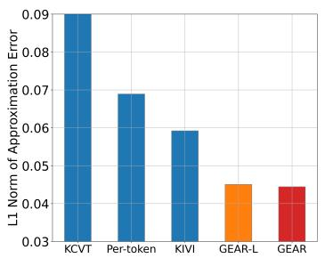
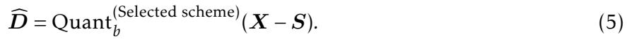
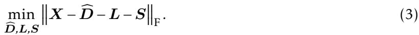
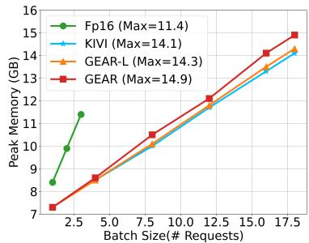
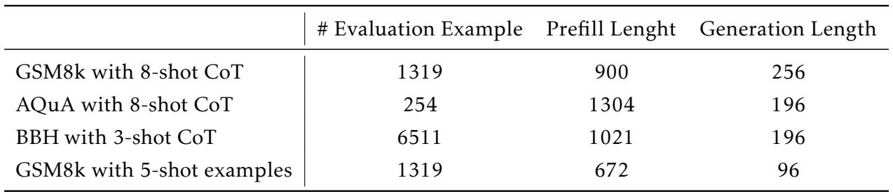

# GEAR: An Efficient KV Cache Compression Recipe for Near-Lossless Generative Inference of LLM

## 一、论文概述

| 项目 | 内容 |
|------|------|
| **标题** | GEAR: An Efficient KV Cache Compression Recipe for Near-Lossless Generative Inference of LLM |
| **作者** | Hao Kang, Qingru Zhang, Souvik Kundu, Geonhwa Jeong, Zaoxing Liu, Tushar Krishna, Tuo Zhao |
| **机构** | Georgia Institute of Technology |
| **论文** | [arXiv:2403.05527](https://arxiv.org/abs/2403.05527) |
| **代码** | [GitHub](https://github.com/HaoKang-Timmy/GEAR) |
| **发布** | 2024年3月 |
| **许可** | - |

## 二、核心思想

### 问题定义

键值（KV）缓存已成为加速大语言模型（LLM）推理生成速度的事实标准技术。然而，随着序列长度增加，不断增长的缓存需求已将LLM推理转变为内存受限问题，显著限制了系统吞吐量。现有方法依赖于丢弃不重要token或均匀量化所有条目，但这些方法通常会产生高近似误差。

### 解决方案概述

本文提出GEAR，一种高效的误差减少框架，通过增强量化方案与两个误差减少组件，在高压缩比率下实现近无损性能。

**核心组件**：
1. **量化骨干**：将大多数相似幅度的条目压缩到超低精度
2. **低秩矩阵**：近似量化误差
3. **稀疏矩阵**：修复离群条目的个别误差

**关键结果**：
- 2-bit压缩下保持与FP16缓存相似的精度
- 相比SOTA基线提升高达24.42%
- 峰值内存减少高达2.39×
- 吞吐量提升2.1×～5.07×

## 三、技术架构

### 核心公式

#### 近似误差最小化

给定张量 $X \in \{K_{t}, V_{t}\}$，目标是最小化近似误差：

$$
\min_{\widehat{D}, L, S} \|X - (\widehat{D} + L + S)\|_{F}^{2}
$$

其中：
- $\widehat{D}$：量化骨干
- $L$：低秩矩阵
- $S$：稀疏矩阵

#### 低秩近似

对残差 $R = X - (\widehat{D} + S)$ 应用逐头低秩分解：

$$
R_{h} = R[:, (h-1)d_{H}:hd_{H}] \in \mathbb{R}^{n \times d_{H}}
$$

假设 $R_{h}$ 的奇异值分解为 $\sum_{i=1}^{k} \sigma_{i} \pmb{u}_{i} \pmb{m}_{i}^{\top}$，其中 $\sigma_{1} \geq \cdots \geq \sigma_{k}$ 是奇异值。

**关键观察**：残差矩阵的谱在开始时迅速下降，表明残差中存在相干分量。

### 误差分析

**Figure 1**: (1a) 比较在GSM8k上将KV缓存压缩到2-bit时的近似误差。(1b) 显示压缩KV缓存后与FP16基线的预测logits差异，表明近似误差会沿步骤严重累积并显著偏离模型生成。(1c) 显示减少误差可以显著提高性能。

### 组件分析

**Figure 2**: (2a, 2b) 随机采样GSM8k示例并分析其KV缓存。(2a) 每种单独技术近似第一层Value缓存时的最小近似误差。(2b) 残差 $R_{h}$ 的谱迅速衰减。(2c) GEAR作为高效误差减少框架，与任何现成量化正交，可以增强它们以实现近无损精度。

### 性能分解

**Figure 3**: (3a) GEAR中每个组件的wall-clock时间百分比：稀疏和低秩组件引入的开销可忽略不计。(3b) GEAR显著减少峰值内存，允许比FP16更大的批大小。(3c) GEAR显著提高吞吐量。

## 四、核心创新

| 创新点 | 说明 | 理论/实验依据 |
|--------|------|---------------|
| **三组件集成** | 量化+低秩+稀疏的协同框架 | 近似误差最小化 |
| **逐头低秩分解** | 利用注意力头的多样性 | 谱衰减观察 |
| **稀疏离群补偿** | 修复离群条目的个别误差 | 误差减少 |
| **正交性设计** | 与任何现成量化方案正交 | 增强现有方法 |
| **轻量级版本GEAR-L** | 仅使用低秩近似 | 效率优先 |

## 五、实验结果

### 近似误差分析

**关键发现**：
- 单独使用任何一种方法在高压缩比率下都会导致显著增加的误差
- 低秩分量在误差减少中起着至关重要的作用
- 稀疏分量可以部分被量化的分组补偿

### 消融实验

**Figure 4**: 使用LLaMA3-8B在GSM8k-CoT下进行2-bit压缩的分析和消融研究。

**关键发现**：
- 小的稀疏比率（s = 2%）和小的秩（r = 4）足以实现近无损2-bit压缩
- 丢弃低秩分量会显著降低性能
- 丢弃稀疏矩阵会损害性能但不显著

### 内存与吞吐量

**Figure 5**: 在RTX Titan 24GB GPU上使用LLaMA2-7b的峰值内存和吞吐量比较。

**关键结果**：
- GEAR显著减少峰值内存，将最大服务数（批大小）从3增加到18
- 相比FP16基线，吞吐量提升高达5.07×

### KV缓存内存分布

**组件分析**：
- 量化整数：由量化位宽决定
- 缩放因子和零点：由量化算法的分组数决定
- FP16残差token的流式缓冲区
- 稀疏和低秩组件的开销

## 六、相关工作

### KV缓存压缩

| 方法 | 关键特性 | 本文对比 |
|------|----------|----------|
| **Token Dropping** | 丢弃不重要token | 误差分析 |
| **均匀量化** | 所有条目统一量化 | 改进基础 |
| **KIVI** | 分组量化 | 主要对比基准 |
| **KCVT** | 跨通道量化 | 兼容集成 |

### 低秩近似

| 方法 | 关键特性 | 本文对比 |
|------|----------|----------|
| **SVD分解** | 奇异值分解 | 核心技术 |
| **PCA** | 主成分分析 | 概念相似 |

### 稀疏近似

| 方法 | 关键特性 | 本文对比 |
|------|----------|----------|
| **稀疏矩阵** | 离群值提取 | 误差补偿 |
| **Outlier Detection** | 离群值检测 | 方法参考 |

## 七、总结

### 核心贡献

1. **GEAR框架**：提出高效的误差减少框架，集成量化、低秩和稀疏三种技术
2. **协同设计**：三种技术协同工作，充分利用各自优势
3. **近无损压缩**：在2-bit和4-bit压缩下实现近无损性能
4. **显著效率提升**：峰值内存减少2.39×，吞吐量提升5.07×
5. **正交性设计**：与任何现成量化方案正交，可增强现有方法

### 技术影响

- **KV缓存压缩**：为LLM推理中的KV缓存压缩提供了高效解决方案
- **内存效率**：显著减少LLM推理的内存占用
- **吞吐量提升**：通过减少内存占用提高系统吞吐量
- **工程实践**：提供了完整的压缩和推理方案

### 局限性

- **计算开销**：低秩和稀疏组件引入了额外的计算开销
- **超参数敏感**：稀疏比率和秩需要仔细调优
- **任务依赖性**：不同任务的压缩效果可能不同
- **硬件要求**：需要CUDA内核优化

## 八、参考资源

- **论文**: https://arxiv.org/abs/2403.05527
- **代码**: https://github.com/HaoKang-Timmy/GEAR
- **KIVI**: https://arxiv.org/abs/2402.02750
- **LLaMA**: https://arxiv.org/abs/2302.13971
- **FlashAttention**: https://arxiv.org/abs/2205.14135
