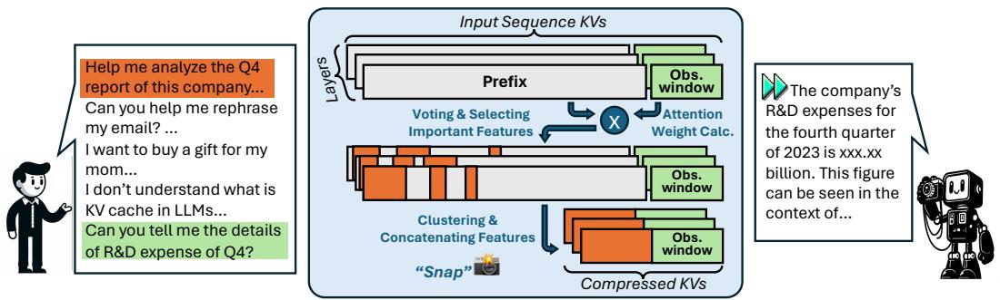
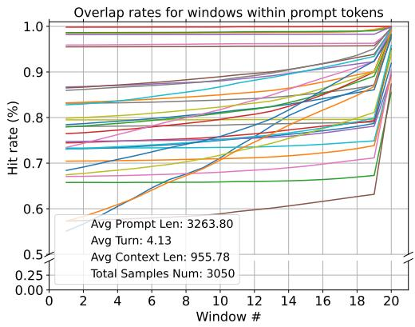
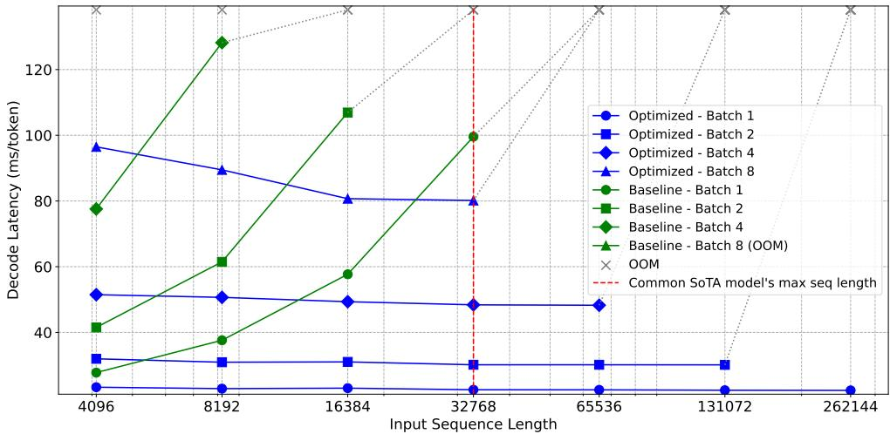
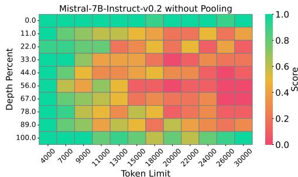

# SnapKV: LLM Inference at Million-Scale with Spatially-Compressive Key-Value Cache

## 一、论文概述

| 项目 | 内容 |
|------|------|
| **标题** | SnapKV: LLM Inference at Million-Scale with Spatially-Compressive Key-Value Cache |
| **作者** | Yuhong Li, Yingbing Huang, Bowen Yang, Bharat Vasan, Jianchao Tan, Hanchen Li, Liang Chen, Ying Wei |
| **机构** | Snap Inc., UIUC |
| **论文** | [arXiv:2404.14469](https://arxiv.org/abs/2404.14469) |
| **代码** | - |
| **发布** | 2024年4月 |
| **许可** | - |

## 二、核心思想

### 问题定义

大语言模型（LLM）推理中的键值（KV）缓存会随着序列长度线性增长，导致：
1. **内存消耗大**：长上下文推理需要大量内存存储KV缓存
2. **解码速度慢**：KV缓存越大，解码时的内存访问开销越大
3. **扩展性差**：难以支持百万级token的推理

### 解决方案概述

本文提出**SnapKV**，一种高效压缩KV缓存的方法：

1. **关键观察**：LLM在文本生成开始前就能识别重要的注意力模式
2. **预填充阶段压缩**：在预填充阶段识别并选择最重要的KV对
3. **空间压缩**：显著减少KV缓存大小，支持百万级token推理

**实验结果**：
- 解码加速3.6倍
- 显著减少KV缓存内存
- 在LongBench和Needle-in-a-Haystack上保持强性能

## 三、技术架构

### 整体框架图

**Figure 1**: SnapKV的简化工作流。橙色区域表示从输入序列中剪枝的KV缓存，蓝色区域表示从生成的token中剪枝的KV缓存。

**工作流程**：
1. **预填充阶段**：处理输入序列，识别重要位置
2. **KV选择**：选择最重要的KV对
3. **压缩缓存**：仅保留选中的KV对
4. **生成阶段**：使用压缩的KV缓存进行解码

### 核心观察

**Figure 2**: 不同窗口大小选择的输入序列注意力特征之间的重叠率。

**关键发现**：
- 注意力模式在不同层之间高度一致
- 重要位置在预填充阶段就可以识别
- 不同窗口大小的选择有很高的重叠率

### 注意力模式分析

**层间一致性**：
- 不同层的注意力头关注相似的位置
- 重要位置在层间传递
- 可以在早期层就识别重要位置

**位置重要性**：
- 某些位置（如最后一个token）始终重要
- 关键信息token获得高注意力分数
- 可以通过注意力分数选择重要位置

### 核心公式

#### 注意力分数计算

给定查询Q和键K：
$$A = \text{softmax}\left(\frac{QK^T}{\sqrt{d}}\right)$$

#### 重要性分数

对于每个位置i，计算重要性分数：
$$S_i = \sum_{h=1}^{H} \sum_{j=1}^{N} A_{ij}^h$$

其中H是注意力头数，N是序列长度。

#### KV选择

选择Top-K最重要的位置：
$$\text{selected} = \text{TopK}(S, K)$$

#### 压缩KV缓存

仅保留选中的KV对：
$$K_{compressed} = K[\text{selected}]$$
$$V_{compressed} = V[\text{selected}]$$

### 池化策略

**观察**：重要位置的选择可以通过池化操作进一步优化

**池化方法**：
- 对注意力分数进行平均池化
- 平滑噪声，提高选择稳定性
- 减少计算开销

## 四、核心创新

| 创新点 | 说明 | 理论/实验依据 |
|--------|------|---------------|
| **预填充阶段压缩** | 在生成前识别重要位置 | 注意力模式一致性 |
| **空间压缩** | 仅保留重要KV对 | 内存显著减少 |
| **层间传递** | 利用层间注意力一致性 | 重叠率高 |
| **池化优化** | 平滑注意力分数 | 提高选择稳定性 |

## 五、实验结果

### 实验配置

**评估模型**：
- Llama-2系列
- Mistral-7B
- 其他流行模型

**评估任务**：
- LongBench
- Needle-in-a-Haystack
- 长上下文问答

### Needle-in-a-Haystack

**Figure 6**: Needle-in-a-Haystack测试性能比较。

**关键结果**：
- SnapKV在长上下文检索任务上表现良好
- 保持了密集注意力的检索能力
- 支持百万级token推理

### 解码延迟

**Figure 7**: 基线实现和SnapKV优化解决方案在vLLM上的解码延迟比较。

**关键结果**：
- 解码加速3.6倍
- 延迟随序列长度增加显著减少
- 适合实际部署

### 消融实验

**池化效果**：
- 池化操作提高了选择稳定性
- 减少了重要位置选择的噪声
- 在长序列上效果更明显

## 六、相关工作

### KV缓存压缩

| 方法 | 关键特性 | 本文对比 |
|------|----------|----------|
| **H2O** | 重击者Oracle | 相关工作 |
| **StreamingLLM** | 滑动窗口 | 相关工作 |
| **Scissorhands** | 注意力剪枝 | 相关工作 |

### 长上下文优化

| 方法 | 关键特性 | 本文对比 |
|------|----------|----------|
| **Ring Attention** | 分布式注意力 | 不同方向 |
| **FlashAttention** | 融合注意力 | 互补技术 |
| **PagedAttention** | 分页KV缓存 | 互补技术 |

## 七、总结

### 核心贡献

1. **预填充阶段压缩**：利用LLM在生成前识别重要注意力模式的能力

2. **空间压缩方法**：选择最重要的KV对，显著减少缓存大小

3. **百万级支持**：支持百万级token的推理

4. **实际加速**：解码加速3.6倍，适合实际部署

### 技术影响

- **长上下文推理**：使百万级token推理成为可能
- **内存优化**：显著减少KV缓存内存需求
- **服务效率**：提高LLM服务的吞吐量
- **成本降低**：通过压缩减少计算和内存成本

### 局限性

- **压缩损失**：压缩可能损失一些信息
- **任务依赖**：不同任务可能需要不同的压缩率
- **层间假设**：假设层间注意力模式一致
- **静态压缩**：压缩后固定，不适应动态变化

## 八、参考资源

- **论文**: https://arxiv.org/abs/2404.14469
- **LongBench**: 长上下文评估基准
- **Needle-in-a-Haystack**: 长上下文检索测试
- **vLLM**: 高效LLM服务引擎
