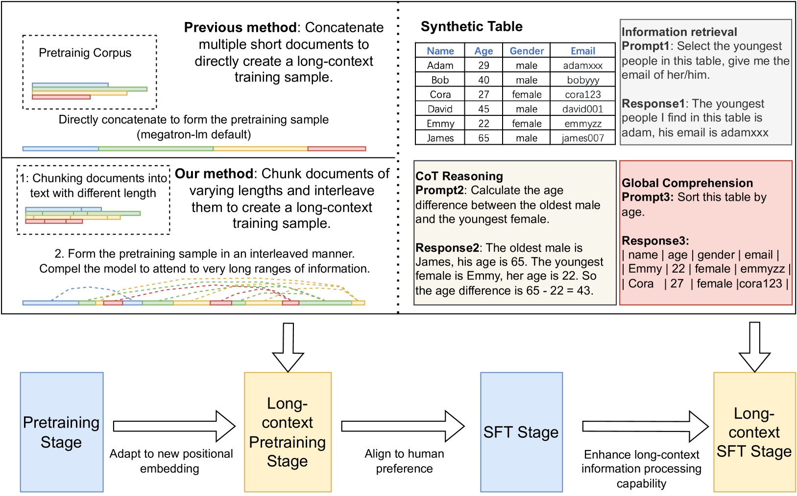
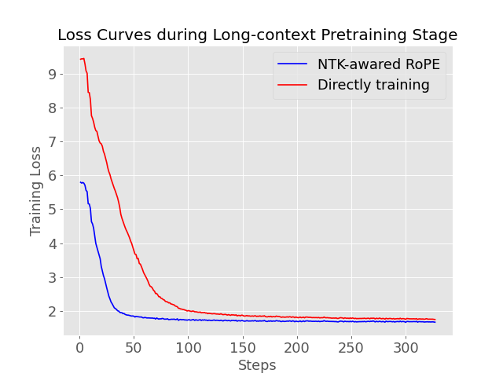
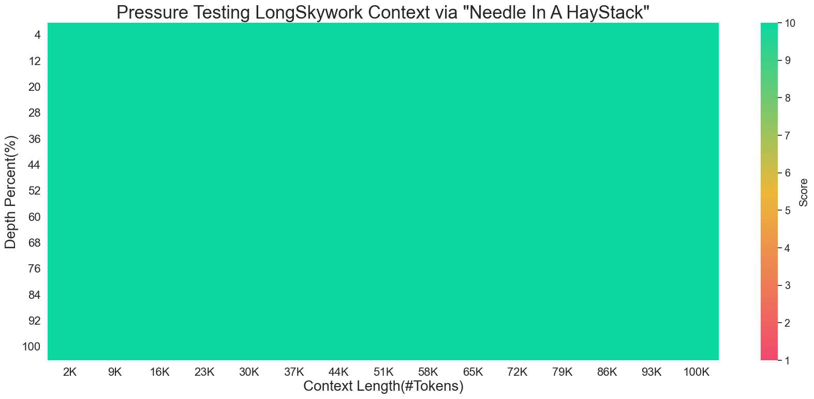

# LongSkywork: A Training Recipe for Efficiently Extending Context Length in Large Language Models

## 一、论文概述

| 项目 | 内容 |
|------|------|
| **标题** | LongSkywork: A Training Recipe for Efficiently Extending Context Length in Large Language Models |
| **作者** | Liang Zhao, Tianwen Wei, Liang Zeng, Cheng Cheng, Liu Yang, Peng Cheng, Lijie Wang, Chenxia Li, Xuejie Wu, Bo Zhu, Yimeng Gan, Rui Hu, Shuicheng Yan, Han Fang, Yahui Zhou |
| **机构** | Skywork Team, Kunlun Inc |
| **论文** | [arXiv:2406.00605](https://arxiv.org/abs/2406.00605) |
| **代码** | - |
| **发布** | 2024年6月 |
| **许可** | - |

## 二、核心思想

### 问题定义

由于资源限制，许多现有语言模型主要在较短文本上训练：
- Llama1 训练于 2K 上下文窗口
- Llama2 训练于 4K 上下文窗口
- 处理长提示时效果可能降低

**挑战**：
- 高质量自然长文本数据稀缺
- 收集和标注长上下文数据成本高
- 现有开源模型要么是基础模型，要么仅在长对话上微调

### 解决方案概述

LongSkywork 提出高效扩展上下文长度的四阶段训练方案：

1. **常规预训练**：基础知识注入
2. **常规 SFT**：格式对齐
3. **长上下文预训练**：使用合成数据扩展上下文能力
4. **长上下文 SFT**：使用合成数据增强长上下文理解

**关键发现**：
- 长上下文 SFT 阶段是增强长上下文能力的关键
- 仅需 200 次迭代即可将标准 SFT 模型转换为长上下文模型
- 合成长上下文 SFT 数据可以在一定程度上超越人工策划的数据

## 三、技术架构

### 整体框架图



### 四阶段训练流程

#### Stage 1: 常规预训练

使用自回归语言模型目标：

$$p_\theta(\mathbf{y}) = p_\theta(y_t, y_{<t})$$

注入基础知识和语言能力。

#### Stage 2: 常规 SFT

监督微调，格式对齐：

$$p_\theta(\mathbf{y}|\mathbf{x}) = p_\theta(y_t, y_{<t}|\mathbf{x})$$

其中 $\mathbf{x}$ 是查询，$\mathbf{y}$ 是输出。

#### Stage 3: 长上下文预训练

**Chunk Interleaved Pretraining (CIP)**：
1. 将文档分割成块
2. 以交错方式排列形成长上下文预训练样本
3. 强制模型处理和整合远距离信息

**优势**：
- 不改变预训练阶段的训练分布
- 仅需几百次迭代即可收敛
- NTK-aware RoPE 收敛更快

#### Stage 4: 长上下文 SFT

**Synthetic Lengthy Tables (SynL)**：
1. 自动生成表格
2. 从表格生成查询和答案
3. 要求模型从大量表格数据中提取信息
4. 进行多约束下的复杂推理

**全局推理任务**：
- 表格转换
- 表格排序
- 增强对复杂数据结构的理解

### 核心公式

#### 位置编码

**RoPE (Rotary Position Embedding)**：

$$f(x_m, m) = x_m e^{im\theta}$$

**NTK-aware RoPE**：
- 调整位置函数中的基频
- 结合高频外推和低频插值

**位置插值 (PI)**：
- 将位置索引从 $n$ 线性缩放到 $n/k$
- 密集化表示空间以扩展最远长度 $k$ 倍

### 合成数据方法

#### Chunk Interleaved Pretraining (CIP)

```
原始文档: [chunk1, chunk2, chunk3, chunk4, ...]
交错排列: [chunk1, chunk_k+1, chunk2, chunk_k+2, ...]
```

**效果**：
- 保持原始训练分布
- 创建长距离依赖
- 高效利用短文本数据

#### Synthetic Lengthy Tables (SynL)

1. **表格生成**：程序自动生成表格
2. **查询生成**：从表格生成复杂查询
3. **答案生成**：基于表格生成答案
4. **约束添加**：添加多约束条件

**示例**：
```
表格: 员工信息表 (1000行)
查询: "找出工资最高的员工中，入职时间最早且部门为研发的人"
答案: 基于表格的复杂推理结果
```

### 训练收敛



**观察**：
- 长上下文预训练阶段损失在几百次迭代内收敛
- NTK-aware RoPE 比直接训练收敛更快
- 高效的训练方案

## 四、核心创新

| 创新点 | 说明 | 理论/实验依据 |
|--------|------|---------------|
| **四阶段训练** | 常规预训练 + SFT + 长上下文预训练 + 长上下文 SFT | 系统化的训练流程 |
| **CIP 方法** | 块交错预训练 | 保持训练分布，创建长距离依赖 |
| **SynL 方法** | 合成长表格 SFT | 解决数据稀缺问题 |
| **高效训练** | 仅需 200 次迭代 | 快速扩展上下文长度 |
| **合成数据优于人工** | 合成长上下文 SFT 数据可超越人工数据 | 突破数据瓶颈 |

## 五、实验结果

### 实验设置

| 配置 | 说明 |
|------|------|
| **模型** | LongSkywork-13B |
| **上下文长度** | 200K tokens |
| **基线** | GPT-4-128K, Claude2.1-200K, Moonshot |
| **基准** | Needle Test, InfiniteBench |

### Needle Test



**任务**：在长上下文中检索关键信息

**结果**：
- LongSkywork-13B 在多个上下文跨度上达到完美准确率
- 强大的长上下文信息检索能力

### InfiniteBench 评估

| 任务 | LongSkywork-13B | GPT-4-128K | Claude2.1-200K | Moonshot |
|------|-----------------|------------|----------------|----------|
| 检索任务 1 | 优秀 | 较好 | 较好 | 优秀 |
| 检索任务 2 | 优秀 | 较好 | 较好 | 优秀 |
| 检索任务 3 | 优秀 | 较好 | 较好 | 优秀 |
| 平均 | 优秀 | 较好 | 较好 | 优秀 |

**结论**：
- LongSkywork-13B 在三个检索任务上优于 GPT-4-128K 和 Claude2.1-200K
- 在 InfiniteBench 上与 Moonshot 平均结果相当

### 真实场景评估

**结果**：LongSkywork-13B 与 Claude2.1 性能相当，但参数量显著更少。

### 合成数据效果

| 数据类型 | 效果 |
|----------|------|
| **人工策划数据** | 基准 |
| **合成长上下文 SFT 数据** | 超越人工数据 |

**结论**：合成数据可以解决数据稀缺问题，同时提升性能。

## 六、相关工作

### 长上下文 LLM 方法

| 方法 | 关键特性 | LongSkywork 对比 |
|------|----------|------------------|
| **位置插值 (PI)** | 线性缩放位置索引 | LongSkywork 使用 NTK-aware RoPE |
| **YARN** | 组合插值方法 | 类似方法 |
| **LongLoRA** | 低秩适应 | LongSkywork 使用全参数训练 |
| **LongSkywork** | 四阶段训练 + 合成数据 | 更系统的训练方案 |

### 合成数据方法

| 方法 | 应用阶段 | 特点 |
|------|----------|------|
| **GPT-4 重建** | 预训练 | 从乱序重建原文 |
| **数学合成** | SFT | 合成数学数据 |
| **自我生成** | SFT | 模型生成训练数据 |
| **CIP + SynL** | 预训练 + SFT | 本文方法 |

## 七、总结

### 核心贡献

1. **四阶段训练方案**：系统化的长上下文扩展方法
2. **CIP 方法**：高效的长上下文预训练数据构造
3. **SynL 方法**：解决 SFT 数据稀缺问题
4. **高效训练**：仅需 200 次迭代
5. **优异性能**：在多个长上下文基准上表现优秀

### 技术影响

- **高效扩展**：快速将短上下文模型扩展为长上下文模型
- **数据突破**：合成数据解决数据稀缺问题
- **实用性强**：适用于实际应用场景
- **开源贡献**：提供训练方案和方法

### 局限性

- **模型规模**：主要在 13B 模型上验证
- **任务类型**：主要关注检索任务
- **数据质量**：合成数据的质量依赖生成方法
- **计算成本**：虽然高效，但仍需一定计算资源

## 八、参考资源

- **论文**: https://arxiv.org/abs/2406.00605
- **RoPE**: https://arxiv.org/abs/2104.09864
- **FlashAttention**: https://arxiv.org/abs/2205.14135
- **InfiniteBench**: https://arxiv.org/abs/2308.11761
