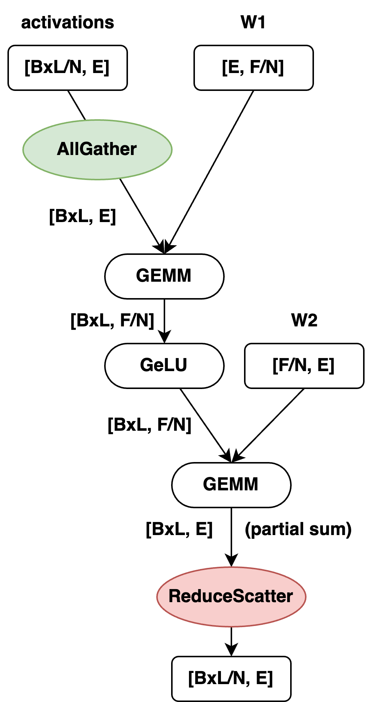
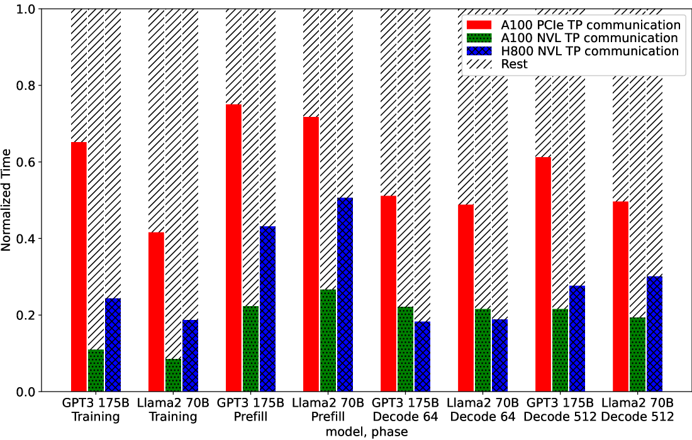
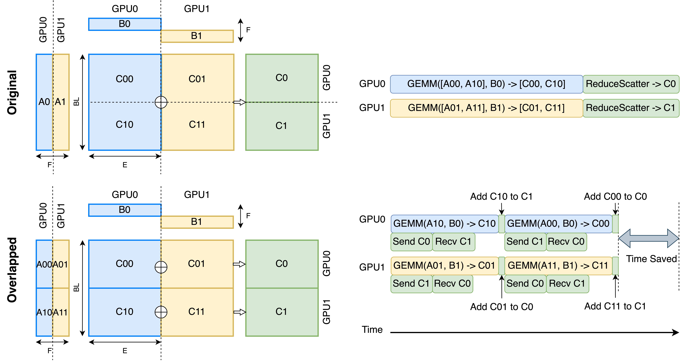
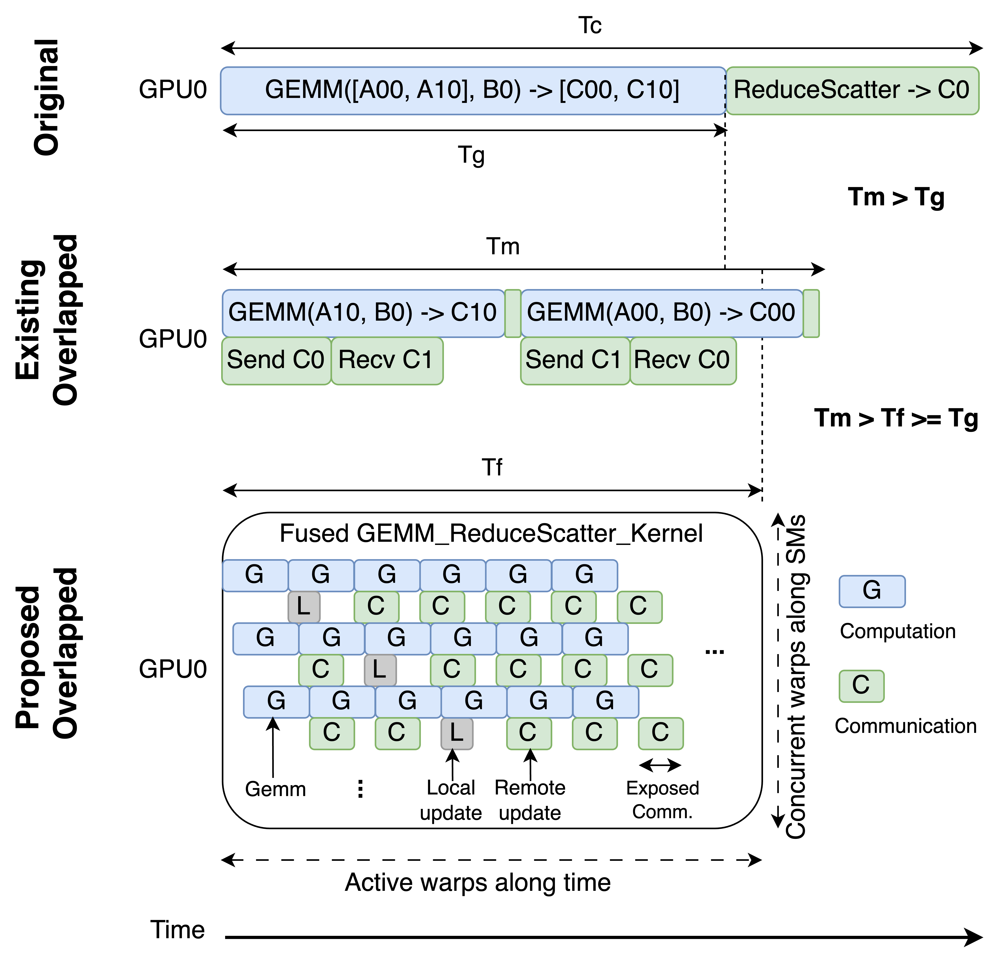
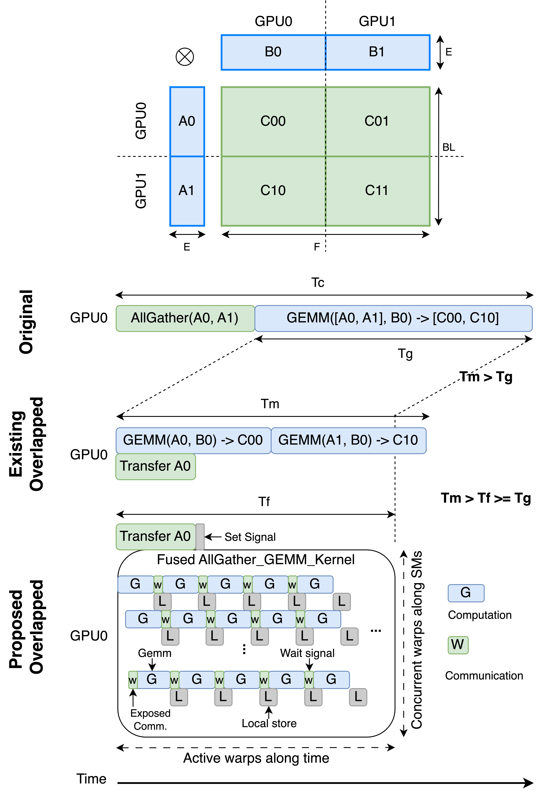
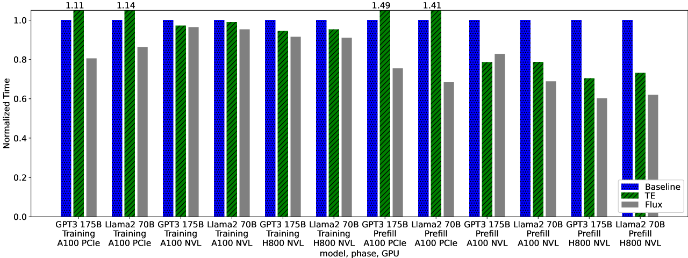

# FLUX: Fast Software-based Communication Overlap On GPUs Through Kernel Fusion

## 一、论文概述

| 项目 | 内容 |
|------|------|
| **标题** | FLUX: Fast Software-based Communication Overlap On GPUs Through Kernel Fusion |
| **作者** | Li-Wen Chang, Wenlei Bao, Qi Hou, Chengquan Jiang, Ningxin Zheng, Yinmin Zhong, Xuanrun Zhang, Zuquan Song, Ziheng Jiang, Chengji Yao, Haibin Lin, Xin Jin, Xin Liu |
| **机构** | ByteDance Ltd, Peking University |
| **论文** | [arXiv:2406.06858](https://arxiv.org/abs/2406.06858) |
| **代码** | - |
| **发布** | 2024年6月 |
| **许可** | - |

## 二、核心思想

### 问题定义

张量并行是分布式训练和推理的常用技术，但会引入额外的通信：

- **通信开销**：通信可能占总运行时间的显著部分
- **可扩展性限制**：限制了在高速互连设备组内的可扩展性

**现有重叠方法的局限**：
1. **执行时序控制**：GPU 编程模型难以精确控制执行时序
2. **GPU 利用率低**：执行多个小内核实例导致 GPU 利用率低
3. **数据依赖**：ReduceScatter 重叠需要额外计算操作，避免并发执行

### 解决方案概述

FLUX 提出了一种新的通信重叠方法：

- **细粒度分解**：将通信和计算分解为更细粒度的瓦片
- **内核融合**：将瓦片化的计算和通信融合为单个大内核
- **高达 96% 通信重叠**：在融合内核中潜在重叠高达 96% 的通信
- **1.24x 训练加速**：相比 Megatron-LM 在 128 GPU 上实现 1.24x 加速

## 三、技术架构

### 核心公式

#### 有效通信时间

$$ECT = \text{OverallTime} - \text{GEMM}_{\text{non-split}}$$

其中：
- $ECT$：有效通信时间
- $\text{OverallTime}$：整体运行时间
- $\text{GEMM}_{\text{non-split}}$：最佳非分割 GEMM 计算时间

#### MLP 前向传播

**第一个 GEMM**：
- 权重 $W_1$ 沿行方向分片
- 输入激活沿列方向 AllGather

$$\text{Output}_1 = \text{GEMM}(\text{AllGather}(X), W_1)$$

**第二个 GEMM**：
- 权重 $W_2$ 沿列方向分片
- 输出激活沿列方向 ReduceScatter

$$\text{Output}_2 = \text{ReduceScatter}(\text{GEMM}(\text{Output}_1, W_2))$$

### 通信开销分析

**训练**：128 GPU 集群，8 路张量并行
- 通信占总时间的 10-30%
- 不同 GPU 代和互连有显著差异

**推理**：8 GPU 集群，8 路张量并行
- 通信占总时间的 20-40%
- 解码阶段通信占比更高

### 现有重叠方法

**传统方法**：
1. 将通信和计算分解为与设备数对齐的块
2. 调度独立的通信和计算块并行执行

**问题**：
- 执行时序难以精确控制
- 多个小内核导致 GPU 利用率低
- 额外计算操作（如 add）避免并发执行

### FLUX 方法

#### 核心思想

1. **细粒度分解**：将通信和计算分解为更细粒度的瓦片
2. **内核融合**：将瓦片化的计算和通信融合为单个大内核
3. **瓦片映射**：每个依赖的计算和通信瓦片映射到每个线程块

#### ReduceScatter 重叠

**非重叠**：先计算 GEMM，再 ReduceScatter

**传统重叠**：将 GEMM 分成 N 块，与 ReduceScatter 交替执行

**FLUX**：
- 将 GEMM 和 ReduceScatter 分解为更细粒度的瓦片
- 融合为单个内核
- 瓦片级重叠

#### AllGather 重叠

**非重叠**：先 AllGather，再计算 GEMM

**传统重叠**：将 GEMM 分成 N 块，与 AllGather 交替执行

**FLUX**：
- 将 AllGather 和 GEMM 分解为更细粒度的瓦片
- 融合为单个内核
- 瓦片级重叠

### 关键优化

#### 1. 瓦片坐标 Swizzling

**问题**：朴素瓦片坐标映射导致内存争用

**解决方案**：重新排列瓦片坐标，避免内存争用

#### 2. 拉取 vs 推送数据传输

**拉取模式**：计算瓦片主动拉取通信数据
**推送模式**：通信瓦片主动推送数据到计算瓦片

**选择**：根据硬件和互连选择最优模式

#### 3. 通信瓦片大小

**权衡**：
- 大瓦片：通信效率高，但重叠机会少
- 小瓦片：重叠机会多，但通信效率低

**优化**：自动调优找到最优瓦片大小

#### 4. GPU 指令选择

根据 GPU 架构选择最优指令：
- A100：使用特定指令集
- H800：使用新一代指令集

### 模块化设计

**基于 NVIDIA CUTLASS**：
- 模块化实现
- 易于跨 GPU 架构自动调优
- 支持各种互连（PCIe, NVLink）

## 四、核心创新

| 创新点 | 说明 | 理论/实验依据 |
|--------|------|---------------|
| **细粒度分解** | 将通信和计算分解为更细粒度的瓦片 | 更多重叠机会 |
| **内核融合** | 融合为单个大内核 | 保持内核效率 |
| **瓦片坐标 Swizzling** | 避免内存争用 | 提高性能 |
| **拉取/推送选择** | 根据硬件选择最优模式 | 适应不同互连 |
| **自动调优** | 跨 GPU 架构自动调优 | 通用性强 |

## 五、实验结果

### 实验设置

| 配置 | 说明 |
|------|------|
| **GPU** | A100, H800 |
| **互连** | PCIe, NVLink |
| **集群** | 128 GPU (训练), 8 GPU (推理) |
| **基线** | Megatron-LM, vLLM, TransformerEngine |
| **模型** | GPT-3 175B, Llama-2 70B |

### 核心结果

| 场景 | 加速比 (vs Megatron-LM/vLLM) | 加速比 (vs TransformerEngine) |
|------|------------------------------|------------------------------|
| **训练** | 1.24x | 1.38x |
| **Prefill 推理** | 1.66x | 2.06x |
| **解码推理** | 1.30x | 2.10x |

### 通信重叠效率

**潜在重叠**：高达 96% 的通信可以被重叠

### 不同 GPU 和互连

| GPU | 互连 | 训练加速 | Prefill 加速 | 解码加速 |
|-----|------|----------|-------------|----------|
| A100 | PCIe | 1.15x | 1.45x | 1.20x |
| A100 | NVLink | 1.20x | 1.60x | 1.28x |
| H800 | NVLink | 1.24x | 1.66x | 1.30x |

### 端到端结果

**GPT-3 175B 训练**：
- 128 A100 NVLink：1.24x 加速
- 128 H800 NVLink：1.22x 加速

**Llama-2 70B 训练**：
- 128 A100 NVLink：1.18x 加速
- 128 H800 NVLink：1.20x 加速

## 六、相关工作

### 通信重叠方法

| 方法 | 关键特性 | FLUX 对比 |
|------|----------|-----------|
| **TransformerEngine** | 分块重叠 | FLUX 更细粒度 |
| **Megatron-LM** | 无重叠 | FLUX 显著加速 |
| **vLLM** | 无重叠 | FLUX 显著加速 |
| **FLUX** | 细粒度融合 | 最优性能 |

### 内核融合技术

| 技术 | 应用 |
|------|------|
| **CUTLASS** | GEMM 优化 |
| **FlashAttention** | 注意力融合 |
| **FLUX** | 通信-计算融合 |

## 七、总结

### 核心贡献

1. **细粒度重叠方法**：将通信和计算分解为更细粒度的瓦片
2. **内核融合技术**：融合为单个大内核保持效率
3. **多种优化**：瓦片坐标、数据传输、指令选择
4. **广泛验证**：不同 GPU、互连、工作负载
5. **显著加速**：训练 1.24x，推理 1.66x

### 技术影响

- **训练效率**：显著减少通信开销
- **推理效率**：大幅提升 prefill 和解码速度
- **通用性**：适用于不同 GPU 和互连
- **实用性**：基于 CUTLASS，易于部署

### 局限性

- **硬件依赖**：针对 NVIDIA GPU 优化
- **实现复杂性**：需要精细的内核优化
- **适用范围**：主要针对张量并行通信
- **自动调优**：需要针对不同配置调优

## 八、参考资源

- **论文**: https://arxiv.org/abs/2406.06858
- **CUTLASS**: https://github.com/NVIDIA/cutlass
- **Megatron-LM**: https://arxiv.org/abs/1909.08053
- **vLLM**: https://github.com/vllm-project/vllm
