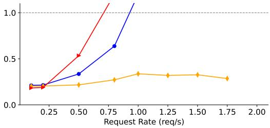
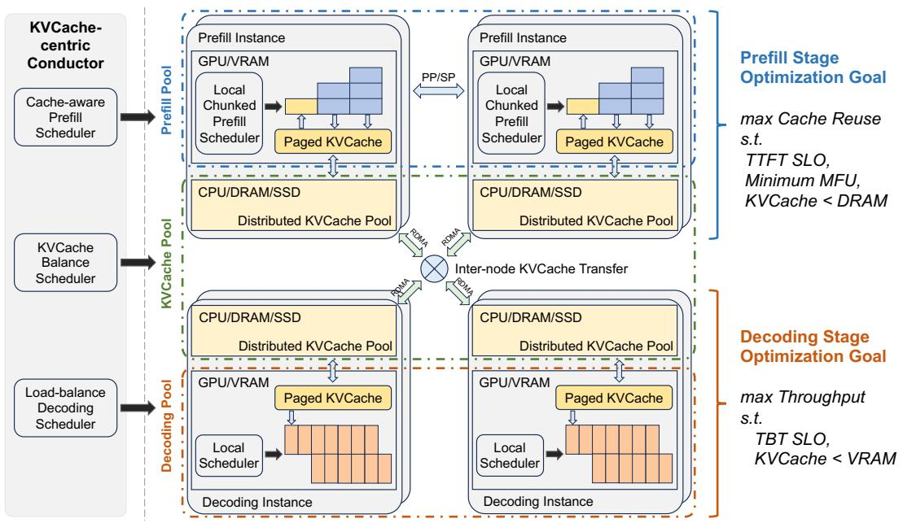
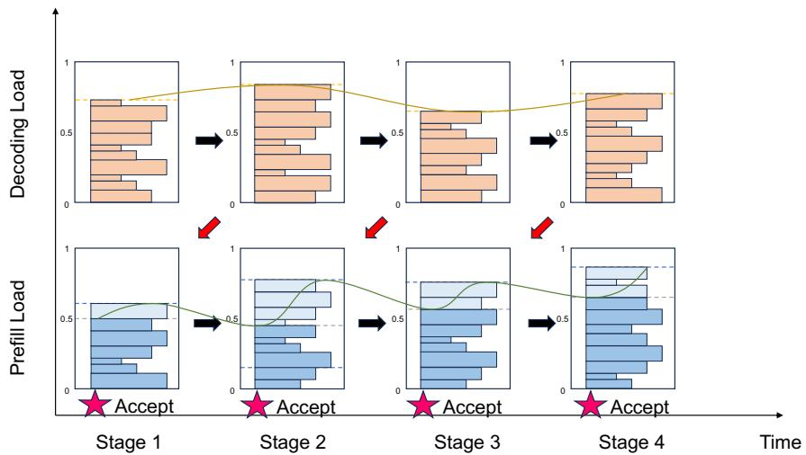
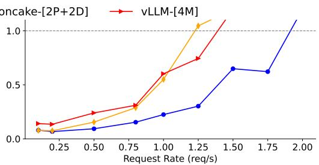
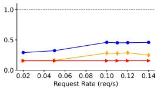
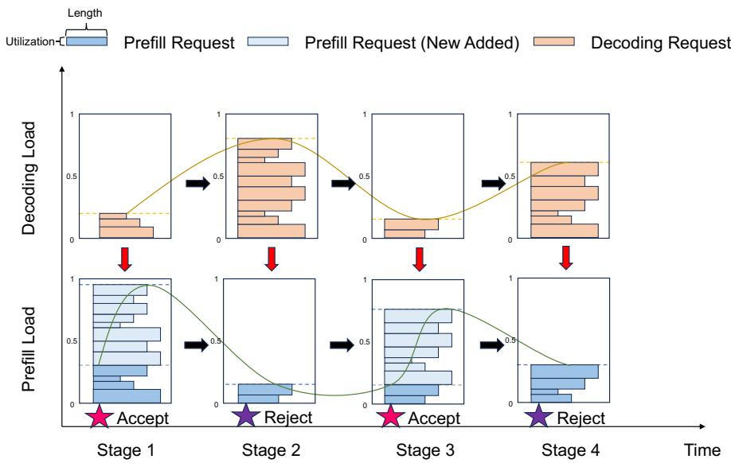
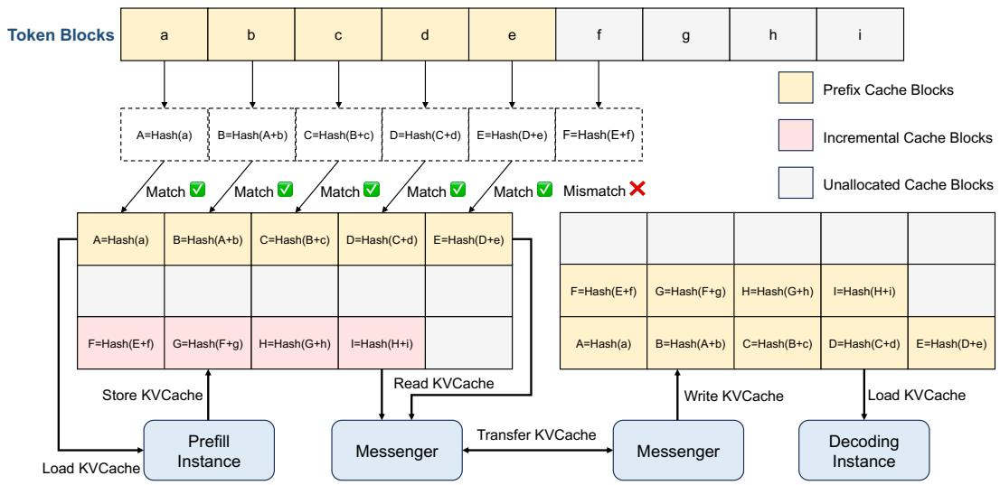
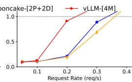

# Mooncake: A KVCache-centric Disaggregated Architecture for LLM Serving

## 一、论文概述

| 项目 | 内容 |
|------|------|
| **标题** | Mooncake: A KVCache-centric Disaggregated Architecture for LLM Serving |
| **作者** | Ruoyu Qin, Zheming Li, Weiran He, Mingxing Zhang, Yongwei Wu, Weimin Zheng, Xinran Xu |
| **机构** | Moonshot AI, Tsinghua University |
| **论文** | [arXiv:2407.00079](https://arxiv.org/abs/2407.00079) |
| **代码** | - |
| **发布** | 2024年7月 |
| **许可** | - |

## 二、核心思想

### 问题定义

Mooncake是Kimi（Moonshot AI提供的领先LLM服务）的服务平台。它采用以KVCache为中心的解耦架构，将预填充和解码集群分离。与传统研究假设所有请求都将被处理不同，Mooncake面临高度过载场景的挑战。

### 解决方案概述

**核心特点**：
- **解耦架构**：分离预填充和解码集群
- **KVCache中心调度**：平衡最大化整体有效吞吐量与满足延迟相关SLO
- **分布式缓存**：利用GPU集群中未充分利用的CPU、DRAM和SSD资源实现KVCache的分布式缓存
- **预测性早期拒绝**：开发基于预测的早期拒绝策略应对过载场景

**关键结果**：
- 在某些模拟场景中，相比基线方法实现高达525%的吞吐量提升
- 在真实工作负载下，Mooncake的创新架构使Kimi能够处理75%更多的请求

## 三、技术架构

### 整体框架图

**Figure 1**: Mooncake架构。

### 核心设计

#### 预填充与解码阶段

**Figure 2**: 不同序列长度或批大小下预填充和解码阶段的归一化吞吐量和延迟。

**关键观察**：
- **预填充阶段**：计算密集型，计算时间随输入长度超线性增长
- **解码阶段**：内存受限，计算时间随批大小亚线性增长

#### KVCache池

**Figure 3**: CPU内存中的KVCache池。每个块附加由其自身哈希和前缀确定的哈希值用于去重。

**设计特点**：
- KVCache以分页块形式存储在CPU内存中
- 支持缓存驱逐算法（LRU、LFU等）
- 通过GPUDirect RDMA组件Messenger处理跨CPU和GPU的传输

#### 请求工作流

**Figure 4**: 推理实例的工作流。

**四个步骤**：
1. 传输尽可能多的可重用KVCache到选定的预填充实例
2. 在预填充实例中分块/分层完成预填充阶段，并持续流式传输输出KVCache到对应的解码实例
3. 加载KVCache并将请求添加到解码实例的连续批处理过程中
4. 生成请求输出

### 请求特征分析

**Figure 5**: 请求跟踪中的输入和输出长度分布。

**关键统计**：
- 平均输入长度：7,590 tokens
- 平均输出长度：182 tokens
- 平均输入输出比率：约720

### 缓存命中分析

**Figure 6**: 请求跟踪中缓存块命中计数的CDF。

**关键发现**：
- 超过50%的缓存块保持未使用状态
- 某些块被访问数万次
- 复制这些热点块对于避免传输拥塞至关重要

### KVCache存储优化

**Figure 7**: 不同请求长度的KVCache存储延迟。

**优化策略**：
- 分层预填充可以有效减少长上下文请求的延迟
- KVCache加载和存储通过启动和等待操作异步执行
- 传输重叠使预填充实例的执行时间大致等于KVCache加载时间或标准预填充时间

### 调度实验

**Figure 8**: Mooncake集群中的预填充调度实验。

**调度策略对比**：
- **随机调度**：为每个请求任意选择预填充实例
- **负载均衡调度**：选择负载最轻的实例
- **缓存感知调度**：考虑KVCache分布
- **KVCache中心调度**：考虑缓存负载均衡

**实验结果**：KVCache中心调度算法在两个指标上都优于随机和负载均衡调度

## 四、核心创新

| 创新点 | 说明 | 理论/实验依据 |
|--------|------|---------------|
| **解耦架构** | 分离预填充和解码集群 | 资源利用率优化 |
| **KVCache中心调度** | 以KVCache分布为中心的调度 | 吞吐量最大化 |
| **分布式缓存** | 利用未充分利用的资源 | 额外缓存容量 |
| **预测性早期拒绝** | 应对过载场景 | SLO满足 |
| **分层传输重叠** | KVCache传输与计算重叠 | 延迟减少 |

## 五、实验结果

### 吞吐量提升

**关键结果**：
- 在某些模拟场景中，相比基线方法实现高达525%的吞吐量提升
- 在真实工作负载下，Kimi能够处理75%更多的请求

### 调度性能

**实验配置**：
- 8个预填充实例
- 8个解码实例
- 23,000个真实世界请求

**评估指标**：
- 平均TTFT（Time to First Token）
- TTFT SLO达成率

**关键发现**：
- 缓存感知策略和缓存负载均衡策略都显著减少了请求的TTFT
- KVCache中心调度算法在两个指标上都优于其他调度策略

### 长上下文场景

**优势**：
- Mooncake在长上下文场景中表现突出
- 解耦架构允许预填充和解码阶段独立优化
- 分布式缓存提供了充足的缓存容量和传输带宽

## 六、相关工作

### LLM服务系统

| 方法 | 关键特性 | 本文对比 |
|------|----------|----------|
| **vLLM** | 分页注意力机制 | 基准对比 |
| **TensorRT-LLM** | NVIDIA优化框架 | 性能对比 |
| **Orca** | 连续批处理 | 批处理参考 |

### KV缓存优化

| 方法 | 关键特性 | 本文对比 |
|------|----------|----------|
| **Prefix Caching** | 前缀缓存优化 | 集成支持 |
| **Paged Attention** | 分页管理KV缓存 | 管理参考 |
| **KV缓存压缩** | 减少缓存大小 | 互补方法 |

### 分布式系统

| 方法 | 关键特性 | 本文对比 |
|------|----------|----------|
| **GPUDirect RDMA** | GPU直接内存访问 | 传输优化 |
| **Disaggregated Architecture** | 解耦架构设计 | 核心设计 |

## 七、总结

### 核心贡献

1. **Mooncake架构**：提出以KVCache为中心的解耦架构，分离预填充和解码集群
2. **KVCache中心调度**：设计以KVCache分布为中心的调度算法，平衡吞吐量和SLO
3. **分布式缓存**：利用未充分利用的资源实现KVCache的分布式缓存
4. **预测性拒绝**：开发基于预测的早期拒绝策略应对过载场景
5. **显著性能提升**：在真实工作负载下实现75%的请求处理能力提升

### 技术影响

- **LLM服务架构**：为LLM服务系统设计提供了新的架构范式
- **资源利用**：展示了利用未充分利用资源的潜力
- **调度优化**：为KVCache感知的调度提供了新思路
- **工程实践**：提供了完整的部署和优化方案

### 局限性

- **架构复杂性**：解耦架构增加了系统复杂性
- **资源依赖**：需要GPU集群中的CPU、DRAM和SSD资源
- **调度开销**：全局调度引入了额外的调度开销
- **工作负载特异性**：主要在长上下文场景下验证

## 八、参考资源

- **论文**: https://arxiv.org/abs/2407.00079
- **Moonshot AI**: https://www.moonshot.cn
- **Kimi**: https://kimi.moonshot.cn
- **vLLM**: https://github.com/vllm-project/vllm
- **GPUDirect RDMA**: https://developer.nvidia.com/gpudirect
