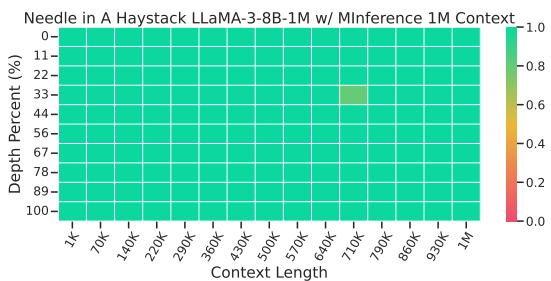
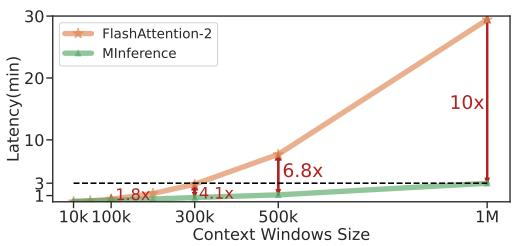
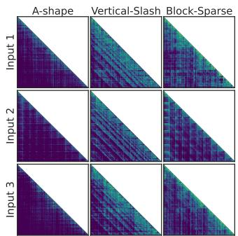
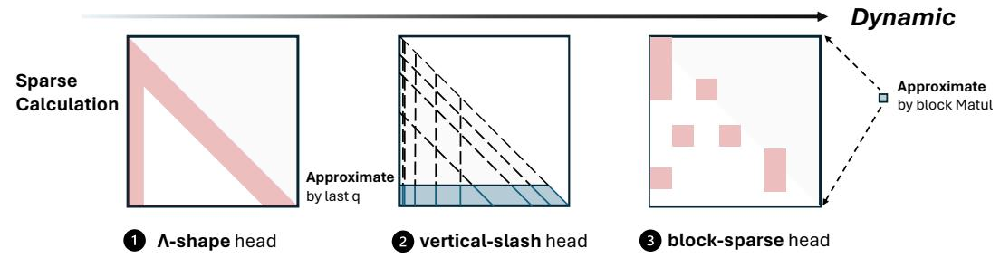
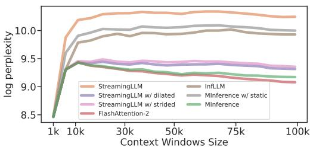
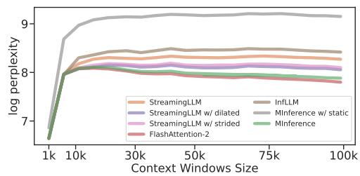
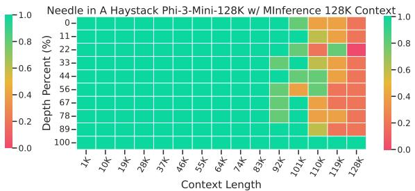
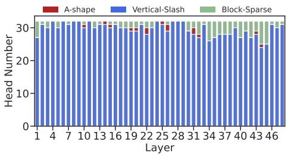

# MInference 1.0: Accelerating Pre-filling for Long-Context LLMs via Dynamic Sparse Attention

## 一、论文概述

| 项目 | 内容 |
|------|------|
| **标题** | MInference 1.0: Accelerating Pre-filling for Long-Context LLMs via Dynamic Sparse Attention |
| **作者** | Huiqiang Jiang, Yucheng Li, Chengruidong Zhang, Qianhui Wu, Xufang Luo, Surin Ahn, Zhenhua Han, Amir H. Abdi, Dongsheng Li, Chin-Yew Lin, Yuqing Yang, Lili Qiu |
| **机构** | Microsoft Research |
| **论文** | [arXiv:2407.02490](https://arxiv.org/abs/2407.02490) |
| **代码** | [GitHub](https://aka.ms/MInference) |
| **发布** | 2024年7月 |
| **许可** | 开源 |

## 二、核心思想

### 问题定义

大语言模型（LLM）推理的计算挑战仍然是其广泛部署的重要障碍，特别是随着提示长度的持续增加。由于注意力计算的二次复杂度，一个8B LLM在单个A100 GPU上处理1M token的提示（即预填充阶段）需要30分钟。

**现有问题**：
1. **二次复杂度**：注意力计算的复杂度与序列长度平方相关
2. **长上下文需求**：实际应用需要处理越来越长的上下文
3. **现有方法局限**：加速预填充的方法在应用于长上下文LLM时往往无法保持可接受的准确率或效率

### 解决方案概述

本文提出**MInference**（Million-tokens Inference），一种稀疏计算方法，用于加速长序列处理的预填充：

1. **模式识别**：识别长上下文注意力矩阵中的三种独特模式：A-shape、Vertical-Slash和Block-Sparse

2. **离线优化**：离线确定每个注意力头的最优模式

3. **动态构建**：在推理期间根据分配的模式动态构建稀疏索引

4. **高效计算**：通过优化的GPU内核执行高效的稀疏注意力计算

**实验结果**：
- 在A100上预填充延迟减少10倍
- 保持准确率
- 无需修改预训练设置或额外微调

## 三、技术架构

### 整体框架图

**Figure 1**: 注意力权重，特别是在长上下文LLM中，在上下文维度上表现出高达96.8%的稀疏性。

**关键观察**：
- 长上下文注意力矩阵高度稀疏
- 稀疏模式具有规律性
- 可以利用稀疏性减少计算

### 问题分析

**Figure 2**: (a) 预填充阶段的延迟分解。(b) top-k稀疏化可以保留多少注意力分数。

**关键发现**：
- 注意力计算是预填充的主要瓶颈
- Top-k稀疏化可以保留大部分重要信息
- 稀疏化可以显著减少计算量

### 注意力模式

**Figure 3**: 不同注意力头的注意力权重可视化。对于不同的提示，注意力模式是稳定且可预测的。

**三种稀疏模式**：

#### 1. A-shape模式

**特征**：
- 注意力权重集中在对角线附近
- 形成A形状的稀疏模式
- 适用于局部依赖强的任务

#### 2. Vertical-Slash模式

**特征**：
- 注意力权重呈垂直或斜线分布
- 捕获全局依赖关系
- 适用于需要全局信息的任务

#### 3. Block-Sparse模式

**特征**：
- 注意力权重呈块状稀疏
- 块大小可变
- 适用于结构化稀疏的场景

### 稀疏方法

**Figure 4**: MInference中的三种稀疏方法。

#### 离线模式确定

**步骤**：
1. 使用少量样本分析每个注意力头
2. 确定每个头的最优稀疏模式
3. 保存模式信息供推理使用

#### 动态稀疏索引构建

**步骤**：
1. 根据分配的模式动态构建稀疏索引
2. 索引指示哪些位置需要计算
3. 避免不必要的计算

#### 优化GPU内核

**关键优化**：
- 针对不同模式的专用内核
- 内存访问模式优化
- 计算与内存访问重叠

### 核心公式

**稀疏注意力计算**：

给定查询Q、键K和值V，标准注意力：
$$\text{Attention}(Q, K, V) = \text{softmax}\left(\frac{QK^T}{\sqrt{d}}\right)V$$

稀疏注意力：
$$\text{SparseAttention}(Q, K, V) = \text{softmax}\left(\frac{QK^T \odot M}{\sqrt{d}}\right)V$$

其中M是稀疏掩码，指示哪些位置需要计算。

**模式特定的掩码**：

- **A-shape**: $M_{ij} = 1$ if $|i-j| \leq \theta$，否则为0
- **Vertical-Slash**: $M_{ij} = 1$ if $j \in \text{selected columns}$
- **Block-Sparse**: $M_{ij} = 1$ if $(i,j) \in \text{selected blocks}$

## 四、核心创新

| 创新点 | 说明 | 理论/实验依据 |
|--------|------|---------------|
| **模式识别** | 识别长上下文注意力中的三种稀疏模式 | 实验验证 |
| **离线优化** | 离线确定每个注意力头的最优模式 | 模式稳定性 |
| **动态构建** | 动态构建稀疏索引 | 运行时适应 |
| **GPU内核优化** | 针对不同模式的专用GPU内核 | 性能提升 |

## 五、实验结果

### 实验配置

**评估模型**：
- LLaMA-3-1M
- GLM4-1M
- Yi-200K
- Phi-3-128K
- Qwen2-128K

**评估任务**：
- InfiniteBench
- RULER
- PG-19
- Needle In A Haystack

**硬件环境**：
- NVIDIA A100 GPU

### 准确率评估

**Figure 5**: 使用不同模型和方法在PG-19上的困惑度结果。

**关键结果**：
- MInference在所有模型上保持与密集注意力相当的困惑度
- 稀疏化不会显著影响模型质量
- 不同模型的最优模式不同

### Needle In A Haystack

**Figure 6-9**: 不同模型上的Needle In A Haystack结果。

**关键发现**：
- MInference在长上下文检索任务上表现良好
- 保持了密集注意力的检索能力
- 在不同模型上都有效

### 延迟比较

**Figure 10**: 三种模式和FlashAttention的单个注意力内核延迟分解。

**关键结果**：
- MInference预填充延迟减少10倍
- 不同模式的延迟特性不同
- GPU内核优化带来显著性能提升

### 模式分布

**Figure 11**: 不同模型中三种稀疏头模式的分布。

**关键发现**：
- 不同模型的模式分布不同
- 同一模型的不同层模式分布也不同
- 离线模式确定是必要的

## 六、相关工作

### 稀疏注意力

| 方法 | 关键特性 | 本文对比 |
|------|----------|----------|
| **滑动窗口** | 固定窗口大小 | 模式更灵活 |
| **全局token** | 保留特殊token | 组合使用 |
| **块稀疏** | 固定块大小 | 动态块大小 |

### 长上下文优化

| 方法 | 关键特性 | 本文对比 |
|------|----------|----------|
| **FlashAttention** | 融合注意力内核 | 互补技术 |
| **Ring Attention** | 分布式注意力 | 不同优化方向 |
| **StreamingLLM** | 流式处理 | 相关工作 |

## 七、总结

### 核心贡献

1. **模式识别**：识别长上下文注意力矩阵中的三种独特稀疏模式

2. **MInference框架**：提出动态稀疏注意力框架，无需修改预训练设置

3. **显著加速**：在A100上预填充延迟减少10倍

4. **广泛验证**：在多个模型和任务上验证有效性

### 技术影响

- **长上下文推理**：使长上下文LLM推理更加高效
- **稀疏计算**：为注意力稀疏化提供了新的方向
- **GPU优化**：展示了针对稀疏模式的GPU内核优化潜力
- **实际部署**：可以应用于现有的LLM系统

### 局限性

- **模式假设**：假设注意力模式是稳定的
- **离线分析**：需要离线确定最优模式
- **模型依赖**：不同模型可能需要不同的模式
- **解码优化**：主要优化预填充阶段

## 八、参考资源

- **论文**: https://arxiv.org/abs/2407.02490
- **GitHub**: https://aka.ms/MInference
- **FlashAttention**: 融合注意力内核
- **LLaMA-3**: Meta的语言模型
