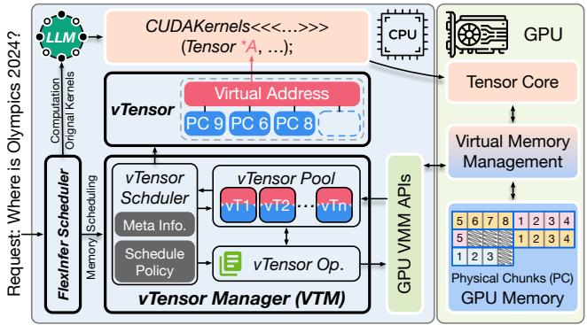
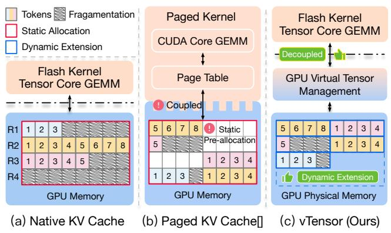
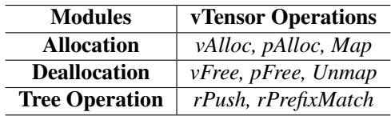
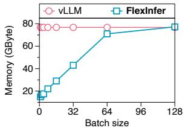
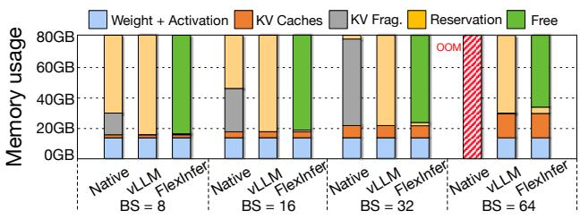
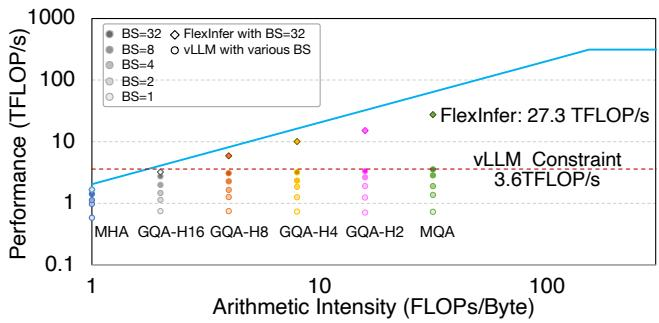

# vTensor: Flexible Virtual Tensor Management for Efficient LLM Serving

## 一、论文概述

| 项目 | 内容 |
|------|------|
| **标题** | vTensor: Flexible Virtual Tensor Management for Efficient LLM Serving |
| **作者** | Jiale Xu, Rui Zhang, Cong Guo, Weiming Hu, Zihan Liu, Feiyang Wu, Yu Feng, Shixuan Sun, Changxu Shao, Yuhong Guo, Junping Zhao, Ke Zhang, Minyi Guo, Jingwen Leng |
| **机构** | Shanghai Jiao Tong University, Shanghai Qi Zhi Institute, Ant Group |
| **论文** | [arXiv:2407.15309](https://arxiv.org/abs/2407.15309) |
| **代码** | [GitHub](https://github.com/SJTU-IPADS/FlexInfer) |
| **发布** | 2024年7月 |
| **许可** | - |

## 二、核心思想

### 问题定义

大语言模型（LLM）在各领域广泛使用，每天处理数百万请求。这种需求激增给优化吞吐量和延迟同时保持成本可控带来了重大挑战。KV缓存是保留先前计算的标准方法，使得LLM推理高度受内存限制。虽然批处理策略可以增强性能，但它们经常导致显著的内存碎片。

### 解决方案概述

本文引入vTensor，一种基于GPU虚拟内存管理（VMM）的创新张量结构。vTensor通过将计算与内存碎片整理解耦并提供动态扩展性来解决现有局限性。

**核心优势**：
- **计算解耦**：将内存碎片整理与原始计算内核分离
- **动态内存扩展**：支持LLM自回归处理的动态内存扩展
- **CPU-GPU异构框架**：确保高效、无碎片的内存管理
- **跨架构兼容**：支持不同LLM架构的各种计算内核

**关键结果**：
- 平均加速1.86×（跨不同模型）
- 多轮聊天场景最高加速2.42×
- 内核评估平均加速2.12×和3.15×
- 释放约71.25%（57GB）的A100 GPU内存

## 三、技术架构

### 整体框架图

**Figure 4**: FlexInfer服务框架概览。

### KV缓存管理策略对比

**Figure 1**: 三种KV缓存内存管理策略：(a) 原生KV缓存使用原生GPU分配有大量碎片；(b) vLLM采用分页内存管理消除大部分碎片但内核紧密耦合；(c) vTensor将计算与内存分配解耦，提供更灵活的管理。

### 核心设计

#### vTensor设计

**Figure 5**: vTensor的设计。

**关键特性**：
1. **虚拟地址连续**：虚拟地址必须连续以兼容标准CUDA分配的张量
2. **物理块灵活映射**：请求可以放置在多个非连续物理块中
3. **动态扩展**：可以设置最大序列长度的虚拟内存地址但不为新请求分配真实物理块

#### vTensor Pool数据结构

**两种主要数据结构**：
1. **vSet**：有序集合存储vTensor的虚拟地址
2. **rTree**：基数树（前缀树）解决多轮对话场景

#### GPU虚拟内存管理接口

**三个关键操作**：
1. **地址保留 (cuMemReserve)**：确定所需内存大小并保留适当的虚拟地址空间
2. **物理创建 (cuMemCreate)**：在GPU物理内存中生成实际数据段
3. **映射 (cuMemMap)**：将物理数据段链接到保留的虚拟地址

### vTensor调度示例

**Figure 6**: vTensor调度示例。

**五个基本操作**：
1. **Create**：创建新的vTensor
2. **Extend**：动态扩展序列长度
3. **Release**：释放vTensor
4. **Prefix Record**：记录前缀缓存
5. **Prefix Match**：匹配前缀缓存

## 四、核心创新

| 创新点 | 说明 | 理论/实验依据 |
|--------|------|---------------|
| **vTensor抽象** | 基于GPU VMM的虚拟张量结构 | 计算与内存解耦 |
| **动态内存扩展** | 支持LLM自回归处理的动态扩展 | 消除碎片 |
| **CPU-GPU异构管理** | CPU管理内存，GPU执行计算 | 无开销重叠 |
| **灵活映射机制** | 虚拟地址连续，物理块灵活映射 | 兼容标准CUDA |
| **前缀缓存支持** | 通过rTree支持多轮对话场景 | 性能提升 |

## 五、实验结果

### 内存使用分析

**Figure 2**: 使用FlashAttention（原生）、vLLM和FlexInfer在80GB内存的A100 GPU上的GPU内存使用分解。

**关键发现**：
- 原生方法在批大小64时导致OOM
- vLLM将KV碎片转换为保留内存
- FlexInfer平均释放57GB内存（71.25%）

### Roofline模型分析

**Figure 3**: GPU A100上LLM注意力的Roofline模型。

**关键发现**：
- vLLM在MHA（算术强度0.99）上性能与FlexInfer相似
- 从GQA-H16到GQA-H2和MQA，vLLM性能受限在3.6 TFLOP/s
- FlexInfer在MQA上实现27.3 TFLOP/s（比vLLM高7.58×）

### 端到端性能

| 应用场景 | 平均加速 | 最高加速 |
|----------|----------|----------|
| 跨不同模型 | 1.86× | - |
| 多轮聊天 | - | 2.42× |

### 内核评估性能

| 对比方法 | 平均加速 | 最高加速 |
|----------|----------|----------|
| SGLang Triton prefix-prefilling | 2.12× | 3.92× |
| vLLM paged Attention | 3.15× | 3.27× |

### 内存释放

| 指标 | 值 |
|------|-----|
| **释放内存** | 57GB |
| **释放比例** | 71.25% |
| **GPU** | NVIDIA A100 (80GB) |

## 六、相关工作

### LLM服务系统

| 方法 | 关键特性 | 本文对比 |
|------|----------|----------|
| **vLLM** | 分页注意力机制 | 主要对比基准 |
| **TensorRT-LLM** | NVIDIA优化框架 | 性能对比 |
| **LMDeploy** | 部署优化框架 | 性能对比 |
| **TGI** | 文本生成推理 | 性能对比 |

### KV缓存优化

| 方法 | 关键特性 | 本文对比 |
|------|----------|----------|
| **Paged Attention** | 分页管理KV缓存 | 改进基础 |
| **Prefix Caching** | 前缀缓存优化 | 集成支持 |
| **GQA/MQA** | 分组/多查询注意力 | 兼容性验证 |

### GPU内存管理

| 方法 | 关键特性 | 本文对比 |
|------|----------|----------|
| **cudaMalloc** | 传统GPU内存分配 | 基准对比 |
| **CUDA VMM** | 虚拟内存管理API | 核心技术 |

## 七、总结

### 核心贡献

1. **vTensor抽象**：提出基于GPU VMM的虚拟张量结构，实现计算与内存解耦
2. **FlexInfer框架**：设计高效的vTensor推理框架，增强计算和内存灵活性
3. **动态内存扩展**：支持LLM自回归处理的动态内存扩展，消除碎片
4. **CPU-GPU异构管理**：CPU管理内存调度，GPU执行计算，无开销重叠
5. **显著性能提升**：平均加速1.86×，释放71.25% GPU内存

### 技术影响

- **LLM服务效率**：显著提升LLM推理性能和内存利用率
- **系统设计**：为LLM服务系统设计提供了新思路
- **内存管理**：展示了GPU VMM在LLM推理中的潜力
- **工程实践**：提供了完整的训练和部署方案

### 局限性

- **硬件依赖**：主要针对NVIDIA GPU的VMM API
- **实现复杂度**：需要CUDA VMM的底层编程
- **兼容性**：需要与现有LLM服务系统集成
- **任务范围**：主要在文本生成任务上评估

## 八、参考资源

- **论文**: https://arxiv.org/abs/2407.15309
- **代码**: https://github.com/SJTU-IPADS/FlexInfer
- **vLLM**: https://github.com/vllm-project/vllm
- **CUDA VMM**: https://docs.nvidia.com/cuda/cuda-driver-api/group__CUDA__VMM.html
- **FlashAttention**: https://arxiv.org/abs/2205.14135
