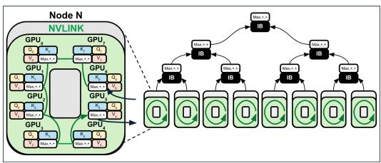
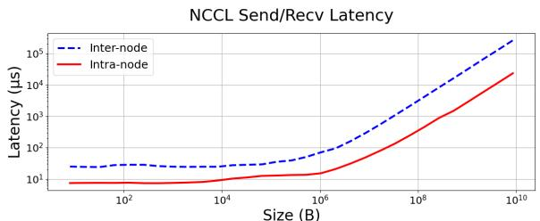
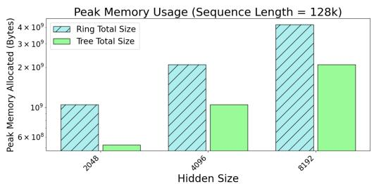
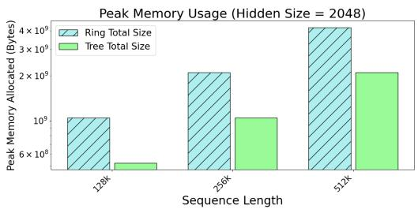

# Tree Attention: Topology-aware Decoding for Long-Context Attention on GPU clusters

## 一、论文概述

| 项目 | 内容 |
|------|------|
| **标题** | Tree Attention: Topology-aware Decoding for Long-Context Attention on GPU clusters |
| **作者** | Vasudev Shyam, Jonathan Pilault, Emily Shepperd, Quentin Anthony, Beren Millidge |
| **机构** | Zyphra |
| **论文** | [arXiv:2408.04093](https://arxiv.org/abs/2408.04093) |
| **代码** | [GitHub](https://github.com/Zyphra/tree_attention) |
| **发布** | 2024年8月 |
| **许可** | 开源 |

## 二、核心思想

### 问题定义

长上下文LLM推理需要跨多个GPU并行化注意力计算。现有方法如Ring Attention通过环形拓扑传递KV块，但存在以下问题：

1. **通信开销大**：Ring Attention需要在GPU间顺序传递所有KV块
2. **延迟高**：解码时间与GPU数量线性相关
3. **内存冗余**：每个GPU需要存储完整的注意力状态

### 解决方案概述

本文提出**Tree Attention**，一种拓扑感知的注意力并行算法：

1. **树形归约**：利用logsumexp和softmax的结合律属性，通过树形结构并行计算注意力归约
2. **拓扑感知**：根据GPU集群的网络拓扑（节点内/节点间）优化通信模式
3. **高效解码**：在序列轴上的归约可以高效并行计算

**实验结果**：
- 比Ring Attention快8倍
- 通信量显著减少
- 峰值内存减少2倍
- 在Llama 3.1-8B上解码速度提升4倍

## 三、技术架构

### 整体框架图



**Figure 1**: Ring和Tree Attention拓扑。由于logsumexp和softmax的结合属性，跨序列轴的归约可以高效并行计算。

### 核心公式

#### 注意力计算

标准注意力计算：
$$\text{Attention}(Q, K, V) = \text{softmax}\left(\frac{QK^T}{\sqrt{d}}\right)V$$

#### 分块注意力

将KV分成块 $K_1, K_2, ..., K_n$ 和 $V_1, V_2, ..., V_n$：

$$O = \text{softmax}\left(\sum_{i=1}^{n} S_i\right) \sum_{i=1}^{n} P_i V_i$$

其中：
- $S_i = QK_i^T / \sqrt{d}$ 是第i块的注意力分数
- $P_i = \text{softmax}(S_i)$ 是第i块的注意力权重

#### 树形归约

利用logsumexp的结合律：
$$\log\sum_{i} e^{x_i} = \log\left(\sum_{j=1}^{k} e^{\log\sum_{i \in G_j} e^{x_i}}\right)$$

**树形归约步骤**：
1. 每个GPU计算本地块的注意力分数和最大值
2. 通过树形结构归约最大值
3. 重新归一化注意力分数
4. 并行计算最终输出

### Ring vs Tree拓扑

#### Ring Attention

**通信模式**：
- 每个GPU依次将KV块传递给下一个GPU
- 总通信量：O(n × KV_size)
- 解码时间：O(n)

**问题**：
- 通信是顺序的
- 延迟与GPU数量线性相关
- 无法利用节点内高速互联

#### Tree Attention

**通信模式**：
- 通过树形结构并行归约
- 总通信量：O(log(n) × KV_size)
- 解码时间：O(log(n))

**优势**：
- 通信是并行的
- 延迟与GPU数量对数相关
- 可以利用拓扑感知优化

### 拓扑感知优化



**Figure 2**: H100 GPU之间节点内和节点间的NCCL Send/Recv。GPU集群提供两层通信层次。

**关键观察**：
- 节点内通信带宽高（NVLink/NVSwitch）
- 节点间通信带宽相对低（InfiniBand/RoCE）
- 应优先使用节点内通信

**拓扑感知策略**：
1. 在节点内使用树形归约
2. 在节点间使用树形归约
3. 两层归约的结果合并

### 算法流程

**Tree Attention算法**：

```
输入: Q, [K_1, ..., K_n], [V_1, ..., V_n]
输出: O

1. 每个GPU i计算本地:
   S_i = Q K_i^T / sqrt(d)
   m_i = max(S_i)
   P_i = exp(S_i - m_i)
   O_i = P_i V_i

2. 树形归约最大值:
   m = tree_reduce_max(m_1, ..., m_n)

3. 重新归一化:
   对每个GPU i:
     P_i = P_i * exp(m_i - m)
     l_i = sum(P_i)

   l = tree_reduce_sum(l_1, ..., l_n)
   O_sum = tree_reduce_sum(O_1, ..., O_n)

4. 最终输出:
   O = O_sum / l
```

## 四、核心创新

| 创新点 | 说明 | 理论/实验依据 |
|--------|------|---------------|
| **树形归约** | 利用结合律实现并行注意力归约 | O(log n) vs O(n) |
| **拓扑感知** | 根据网络层次优化通信模式 | 节点内/节点间优化 |
| **内存效率** | 减少峰值内存使用 | 2倍内存减少 |
| **通信优化** | 减少总通信量 | 显著通信减少 |

## 五、实验结果

### 实验配置

**硬件环境**：
- H100 DGX节点
- AMD MI300x节点
- PCIe连接的NVIDIA RTX 4090

**模型**：
- Llama 3.1-8B

**基线**：
- Ring Attention
- 标准注意力

### 执行时间



**Figure 3**: 16头Tree Attention vs Ring Attention在不同GPU集群大小下的执行时间。

**关键结果**：
- Tree Attention比Ring Attention快8倍
- 解码时间与GPU数量呈对数关系
- 在大规模集群下优势更明显

### 内存使用



**Figure 4**: Tree Attention vs Ring Attention在不同序列长度下的单个注意力块峰值内存使用。

**关键结果**：
- Tree Attention峰值内存减少2倍
- 内存节省随序列长度增加而增加
- 支持更长的上下文窗口

### 硬件适用性

**Llama 3.1-8B结果**：
- 解码速度提升4倍
- 在不同硬件配置下都有效

**跨平台验证**：
- H100 DGX：最优性能
- AMD MI300x：良好适配
- RTX 4090 PCIe：仍有效果

## 六、相关工作

### 分布式注意力

| 方法 | 关键特性 | 本文对比 |
|------|----------|----------|
| **Ring Attention** | 环形拓扑顺序传递KV | 基线对比 |
| **Flash Attention** | 融合注意力内核 | 互补技术 |
| **Sequence Parallelism** | 序列维度并行 | 相关工作 |

### 归约算法

| 方法 | 关键特性 | 本文对比 |
|------|----------|----------|
| **AllReduce** | 标准归约操作 | 通信原语 |
| **Tree AllReduce** | 树形归约 | 核心创新 |
| **logsumexp技巧** | 数值稳定归约 | 理论基础 |

## 七、总结

### 核心贡献

1. **Tree Attention算法**：提出基于树形归约的并行注意力算法，实现O(log n)的解码时间

2. **拓扑感知优化**：根据GPU集群的网络拓扑优化通信模式，充分利用节点内高速互联

3. **显著性能提升**：比Ring Attention快8倍，峰值内存减少2倍

4. **广泛适用性**：在不同硬件平台（H100、MI300x、RTX 4090）上都有效

### 技术影响

- **长上下文推理**：使长上下文LLM在GPU集群上高效推理成为可能
- **通信优化**：显著减少分布式注意力的通信开销
- **内存效率**：支持更长的上下文窗口
- **硬件利用**：充分利用现代GPU集群的拓扑特性

### 局限性

- **模型规模**：主要在8B模型上验证
- **集群规模**：需要多GPU集群
- **网络依赖**：性能受网络拓扑影响
- **实现复杂度**：需要定制的通信原语

## 八、参考资源

- **论文**: https://arxiv.org/abs/2408.04093
- **GitHub**: https://github.com/Zyphra/tree_attention
- **Ring Attention**: 基线分布式注意力方法
- **Flash Attention**: 融合注意力内核
