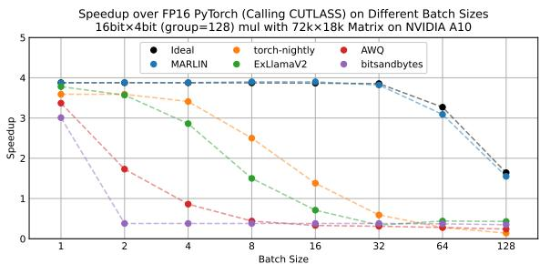
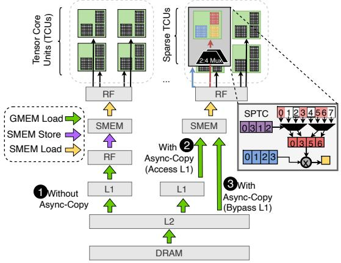
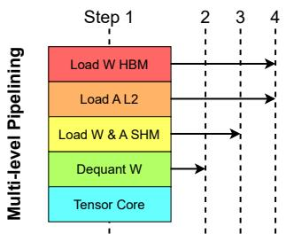
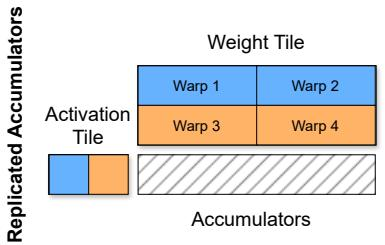
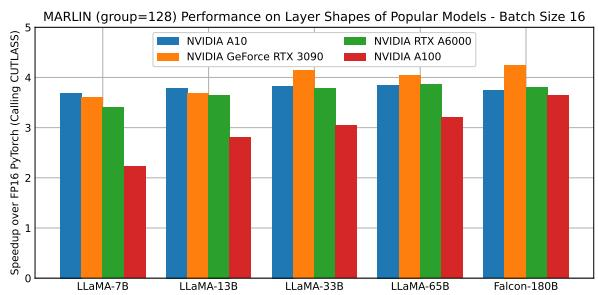
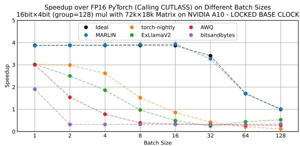
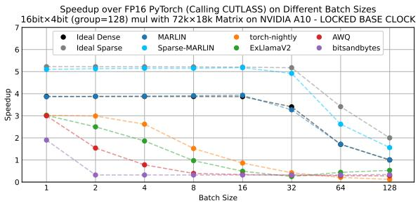
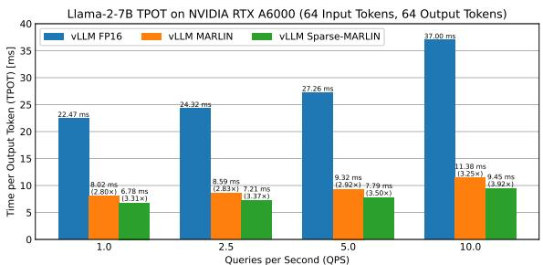

# MARLIN: Mixed-Precision Auto-Regressive Parallel Inference on Large Language Models

## 一、论文概述

| 项目 | 内容 |
|------|------|
| **标题** | MARLIN: Mixed-Precision Auto-Regressive Parallel Inference on Large Language Models |
| **作者** | Elias Frantar, Roberto L. Castro, Jiale Chen, Torsten Hoefler, Dan Alistarh |
| **机构** | IST Austria, ETH Zurich, NeuralMagic |
| **论文** | [arXiv:2408.11743](https://arxiv.org/abs/2408.11743) |
| **代码** | - |
| **发布** | 2024年8月 |
| **许可** | - |

## 二、核心思想

### 问题定义

随着大语言模型（LLM）推理成为机器学习应用中的重要工作负载，权重量化已成为高效GPU部署的标准技术。量化不仅减少模型大小，还通过减少内存移动为单用户推理带来显著加速。

**核心问题**：
1. **批量推理挑战**：在有多个并行客户端的批量设置中，是否仍能实现加速？
2. **计算需求增加**：GPU内核能否在支持批量工作负载大幅增加的计算需求的同时，保持实际上的内存受限？
3. **量化加速上限**：不同批量大小下能量化加速多少？

### 解决方案概述

本文提出**MARLIN**（Mixed-precision Auto-Regressive LINear kernels），一种高效的量化推理内核：

1. **异步内存访问**：利用异步复制操作隐藏内存延迟
2. **复杂任务调度**：优化的任务调度和流水线策略
3. **定制量化支持**：针对4-bit量化的专门优化

**实验结果**：
- 批量大小16-32时接近最大4倍量化加速
- 批量大小64-128时仍有显著加速
- 端到端推理加速2.8倍
- 与vLLM集成后实际部署加速

## 三、技术架构

### 整体框架图

**Figure 1**: MARLIN峰值性能随批量大小增加的说明。

**关键观察**：
- 批量大小16-32时接近最大4倍加速
- 批量大小增加时加速逐渐下降
- 但仍保持显著加速

### 异步内存访问

**Figure 2**: 异步复制操作的说明（有/无L1旁路）与标准内存访问的比较。

**关键设计**：

#### 异步复制

**传统方法**：
- 同步内存访问
- 线程等待数据加载完成
- GPU计算单元空闲

**MARLIN方法**：
- 异步复制操作
- 数据加载与计算重叠
- 隐藏内存延迟

#### L1缓存旁路

**优势**：
- 减少缓存污染
- 提高内存带宽利用率
- 适合流式数据访问模式

### 流水线设计

**Figure 3**: MARLIN内核中的流水线级别。

**多级流水线**：
1. **内存加载阶段**：异步加载量化权重
2. **反量化阶段**：将4-bit权重反量化为FP16
3. **计算阶段**：执行矩阵乘法
4. **累加阶段**：累加部分结果

**流水线重叠**：
- 不同阶段并行执行
- 隐藏各阶段延迟
- 提高整体吞吐量

### Warp布局

**Figure 4**: MARLIN的warp布局说明。

**设计策略**：
- 多个warp累加相同输出的部分结果
- Warp间高效协作
- 减少同步开销

### 条纹分区方案

**分区策略**：
- 将输入矩阵分成条纹
- 每个warp处理一个条纹
- 负载均衡
- 合并内存访问

### 核心公式

#### 量化格式

**4-bit量化**：
- 权重存储为4-bit整数
- 使用GPTQ量化方法
- 支持分组量化（group quantization）

**量化公式**：
$$W_{int4} = \text{round}\left(\frac{W_{fp16}}{s}\right) + z$$

其中s是缩放因子，z是零点。

#### 反量化计算

**反量化公式**：
$$W_{fp16} = (W_{int4} - z) \times s$$

**矩阵乘法**：
$$C = A \times W_{fp16} = A \times ((W_{int4} - z) \times s)$$

#### 稀疏支持

**NVIDIA 2:4稀疏**：
- 每4个元素中有2个为零
- 额外2倍压缩
- 硬件加速支持

## 四、核心创新

| 创新点 | 说明 | 理论/实验依据 |
|--------|------|---------------|
| **异步内存访问** | 异步复制操作隐藏内存延迟 | 带宽利用率提升 |
| **多级流水线** | 内存加载、反量化、计算重叠 | 吞吐量提升 |
| **批量优化** | 支持批量大小16-128的高效推理 | 接近4倍加速 |
| **稀疏扩展** | 支持NVIDIA 2:4稀疏 | 额外加速 |

## 五、实验结果

### 实验配置

**评估模型**：
- Llama2-7B
- Llama2-13B
- Llama2-70B
- 其他流行模型

**评估设置**：
- 单层性能
- 端到端推理
- 服务基准测试

**基线**：
- FP16基线
- 其他量化内核

### 单层性能

**Figure 9**: MARLIN在流行模型实际层形状上的性能。

**关键结果**：
- 在不同层形状上都表现良好
- 接近理论峰值性能
- 优于其他开源内核

### 持续性能

**Figure 10**: MARLIN与其他流行开源内核的持续性能比较。

**关键发现**：
- MARLIN在不同批量大小下都保持高性能
- 比其他内核更稳定
- 适合实际部署

### Roofline分析

**Figure 11**: MARLIN内核在四种不同矩阵形状下的Roofline分析。

**关键发现**：
- MARLIN接近内存受限区域
- 量化减少了内存带宽需求
- 计算效率高

### 端到端性能

**Figure 14**: MARLIN和Sparse-MARLIN与vLLM FP16基线的端到端生成时间比较。

**关键结果**：
- 端到端推理加速2.8倍
- 与vLLM集成后实际部署加速
- Sparse-MARLIN提供额外加速

### 服务基准测试

**TPOT（Time Per Output Token）**：
- MARLIN显著减少每个输出token的时间
- 提高服务吞吐量
- 支持更多并发用户

## 六、相关工作

### 量化方法

| 方法 | 关键特性 | 本文对比 |
|------|----------|----------|
| **GPTQ** | 训练后量化 | 使用的量化方法 |
| **AWQ** | 激活感知量化 | 相关工作 |
| **SqueezeLLM** | 稀疏量化 | 相关工作 |

### 推理优化

| 方法 | 关键特性 | 本文对比 |
|------|----------|----------|
| **vLLM** | 高效服务引擎 | 集成目标 |
| **TensorRT-LLM** | NVIDIA推理优化 | 相关工作 |
| **FlashAttention** | 注意力优化 | 互补技术 |

## 七、总结

### 核心贡献

1. **MARLIN内核**：提出高效的4-bit量化推理内核，支持批量推理

2. **异步优化**：利用异步内存访问和多级流水线隐藏延迟

3. **批量支持**：在批量大小16-32时接近最大4倍加速

4. **实际部署**：与vLLM集成，实现2.8倍端到端加速

### 技术影响

- **量化推理**：展示了量化在批量推理中的有效性
- **GPU优化**：为量化内核设计提供了最佳实践
- **服务效率**：提高了LLM服务的吞吐量
- **成本降低**：通过量化减少计算和内存成本

### 局限性

- **量化方法**：主要针对GPTQ量化
- **模型支持**：主要在LLaMA系列上验证
- **硬件依赖**：针对特定GPU架构优化
- **精度影响**：量化可能影响某些任务的精度

## 八、参考资源

- **论文**: https://arxiv.org/abs/2408.11743
- **GPTQ**: 训练后量化方法
- **vLLM**: 高效LLM服务引擎
- **NVIDIA 2:4稀疏**: 硬件加速稀疏支持
