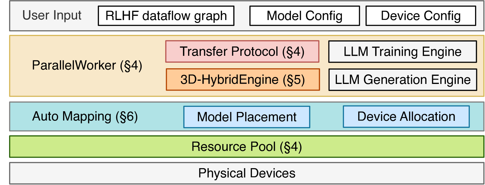
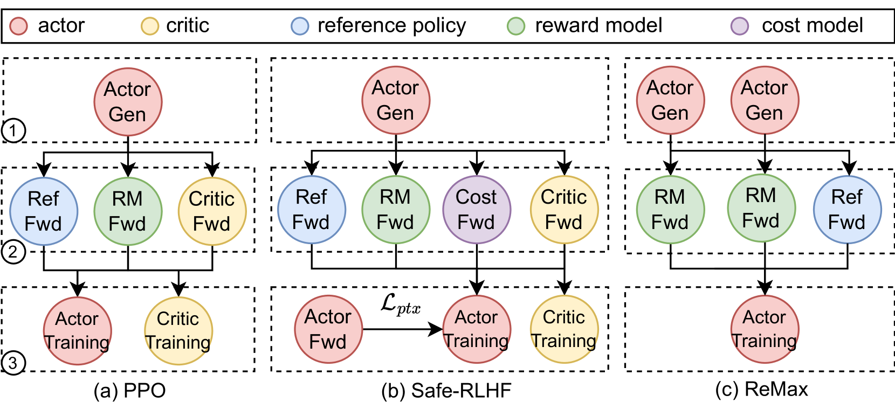
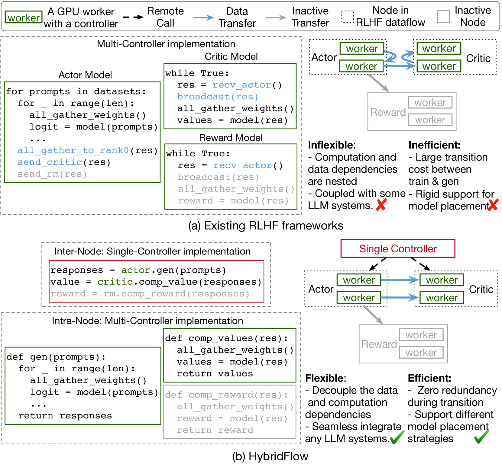
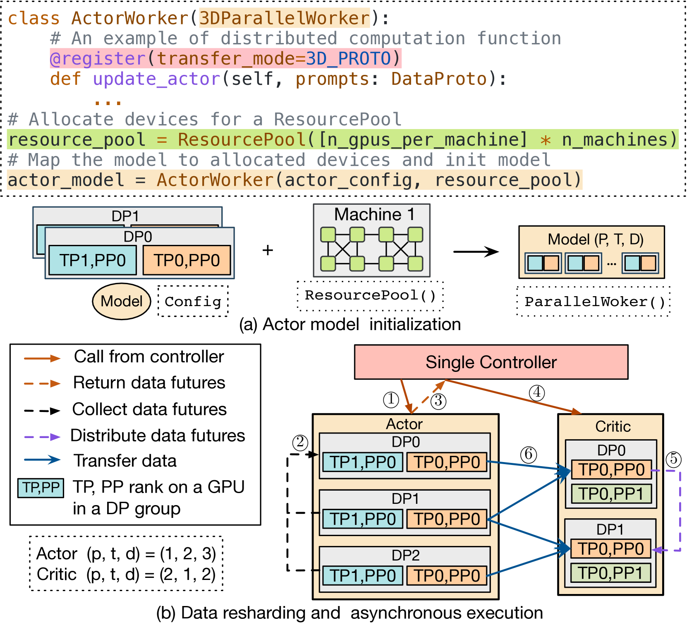
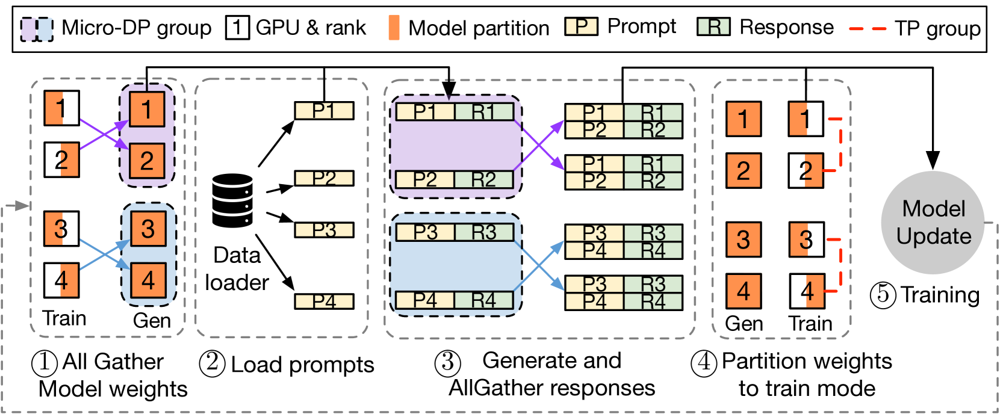
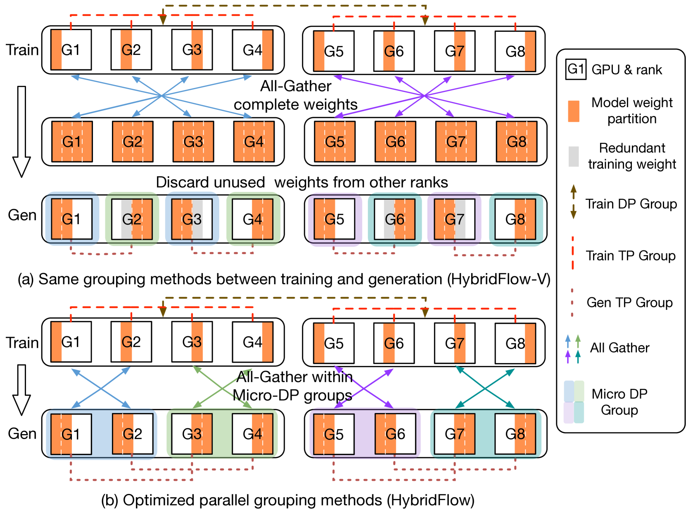
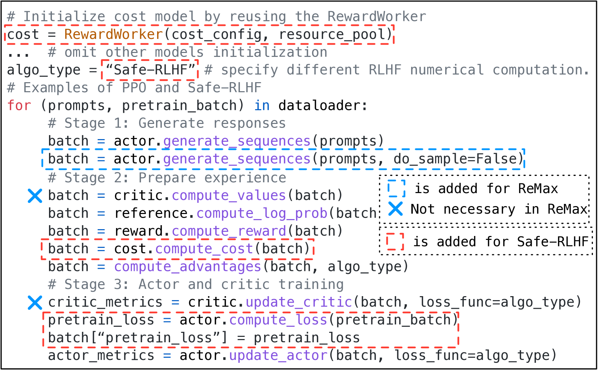
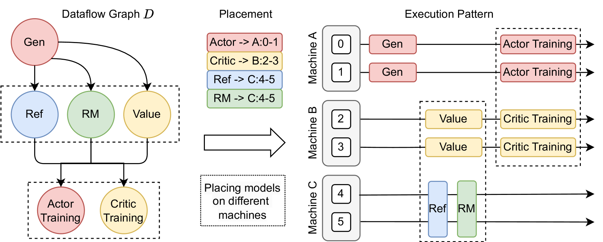

# HybridFlow: A Flexible and Efficient RLHF Framework

## 一、论文概述

| 项目 | 内容 |
|------|------|
| **标题** | HybridFlow: A Flexible and Efficient RLHF Framework |
| **作者** | Guangming Sheng, Chi Zhang, Zilingfeng Ye, Xibin Wu, Wang Zhang, Ru Zhang, Yanghua Peng, Haibin Lin, Chuan Wu |
| **机构** | The University of Hong Kong, ByteDance |
| **论文** | [arXiv:2409.19256](https://arxiv.org/abs/2409.19256) |
| **代码** | [verl](https://github.com/volcengine/verl) |
| **发布** | 2024年9月 (EuroSys 2025) |
| **许可** | ACM Licensed |

## 二、核心思想

### 问题定义

RLHF（Reinforcement Learning from Human Feedback）是 LLM 对齐的关键技术。传统 RL 可以建模为数据流图（dataflow），每个节点表示神经网络计算，每条边表示数据依赖。RLHF 将这一数据流复杂化：

1. **节点复杂化**：每个节点扩展为分布式 LLM 训练或生成程序
2. **边复杂化**：每条边变为多对多的组播（multicast）
3. **异构工作负载**：不同模型（actor/critic/reference/reward）有不同的计算需求
4. **训练-生成不均衡**：actor 模型的训练和生成阶段对并行策略需求不同

**现有系统的局限**：

| 系统 | 问题 |
|------|------|
| **单控制器框架** (RLlib) | 分发开销大，不适合大规模分布式计算 |
| **多控制器系统** (DeepSpeed-Chat, OpenRLHF) | 代码耦合度高，不灵活，难以复用 |
| **NeMo-Aligner** | 训练和生成使用相同并行策略，生成效率低 |

### 解决方案概述

HybridFlow 提出混合编程模型，结合单控制器和多控制器范式：

- **节点级（Intra-node）**：使用多控制器范式进行分布式计算，低分发开销
- **节点间（Inter-node）**：使用单控制器范式协调数据传输，灵活表达数据依赖
- **3D-HybridEngine**：高效执行 actor 模型的训练和生成，零冗余模型重分片
- **Auto-Mapping**：自动优化模型到 GPU 的映射

## 三、技术架构

### 整体框架图

HybridFlow 由三个核心组件构成：

| 组件 | 职责 | 关键技术 |
|------|------|----------|
| **Hybrid Programming Model** | 灵活表达和高效执行 RLHF 数据流 | 层次化 API，解耦计算和数据传输 |
| **3D-HybridEngine** | Actor 模型训练和生成的高效执行 | 零冗余重分片，最小化通信开销 |
| **Auto-Mapping** | 自动优化模型放置 | 贪心算法，最大化吞吐量 |

### RLHF 数据流

以 PPO 为例，RLHF 数据流包含三个阶段：

| 阶段 | 说明 | 涉及模型 |
|------|------|----------|
| **Stage 1: Generation** | Actor 从 prompt 生成响应 | Actor |
| **Stage 2: Preparation** | 计算 value、reference log prob、reward | Critic, Reference, Reward |
| **Stage 3: Training** | 更新 Actor 和 Critic | Actor, Critic |

### 核心公式

#### RLHF 数据流建模

传统 RL 数据流为有向无环图（DAG）$G = (V, E)$：
- 节点 $v \in V$：神经网络计算
- 边 $e \in E$：数据依赖

RLHF 扩展为：
- 每个节点 $v$：分布式 LLM 训练/生成程序
- 每条边 $e$：多对多组播

#### 3D 并行组

Actor 训练使用 $p$-$t$-$d$ 并行组：
- $p$：流水线并行大小
- $t$：张量并行大小
- $d$：数据并行大小

Actor 生成使用 $p_g$-$t_g$-$d_g$-$d$ 并行组：
- $p_g$：生成流水线并行大小
- $t_g$：生成张量并行大小
- $d_g$：微数据并行大小
- $d$：训练数据并行大小

满足约束：
$$N_a = p \times t \times d = p_g \times t_g \times d_g \times d$$

其中 $d_g = \frac{pt}{p_g t_g}$

### 混合编程模型

#### 层次化 API

**节点级（Intra-node）**：封装分布式程序

提供基类 `3DParallelWorker`：
- 分布式模型权重初始化
- 建立 3D 并行组
- 封装前向/后向计算、自回归生成、优化器更新

**节点间（Inter-node）**：统一数据重分片实现

每个操作关联传输协议（Transfer Protocol），包含：
- `collect` 函数：聚合输出数据
- `distribute` 函数：分发输入数据

提供 8 种传输协议：`3D_PROTO`, `DP_PROTO`, `ONE_TO_ALL` 等

#### 灵活的模型放置

使用 `ResourcePool` 类虚拟化 GPU 设备集合：
- 相同 `ResourcePool` 实例的模型共置（colocate）在同一 GPU 集
- 不同 `ResourcePool` 实例的模型放置在不同 GPU 集

### 3D-HybridEngine

#### 核心设计

1. **统一设备集**：Actor 训练和生成在同一组 GPU 上执行
2. **不同并行策略**：训练和生成使用不同的 3D 并行配置
3. **零冗余重分片**：模型参数在训练和生成阶段间高效转换

#### 工作流程

1. **Step 1**：在微数据并行组内 all-gather actor 模型参数
2. **Step 2**：加载 prompt 数据到每个模型副本
3. **Step 3**：生成响应，在微数据并行组内 all-gather 生成结果
4. **Step 4**：根据训练并行策略重新分区模型参数
5. **Step 5**：计算 loss，更新 actor 模型权重

#### 零冗余重分片

**问题**：传统方法需要在训练和生成间传输大量模型参数（如 70B 模型需传输 140GB）

**解决方案**：
- 训练和生成使用同一组设备
- 通过 all-gather 和 reduce-scatter 操作实现参数重分片
- 避免跨设备的显式参数传输
- **零内存冗余**：不需要额外的模型副本

### Auto-Mapping 算法

自动确定模型到 GPU 的最优映射：

**输入**：
- 模型规格（架构、大小）
- GPU 集群配置
- 并行策略

**算法**：
1. 按模型计算量降序排列
2. 贪心地为每个模型分配 GPU 集
3. 考虑数据依赖和共置约束
4. 最大化设备利用率

### 算法实现示例

HybridFlow 支持多种 RLHF 算法的简洁实现：

**PPO**：仅需 8 行代码
**Safe-RLHF**：在 PPO 基础上增加 5 行代码
**ReMax**：增加一次 actor 生成调用，移除 critic 相关代码

## 四、核心创新

| 创新点 | 说明 | 理论/实验依据 |
|--------|------|---------------|
| **混合编程模型** | 结合单控制器和多控制器范式 | 节点间灵活，节点内高效 |
| **层次化 API** | 解耦计算和数据传输 | 代码简洁，易于扩展 |
| **3D-HybridEngine** | 零冗余模型重分片 | 消除 140GB 参数传输开销 |
| **Auto-Mapping** | 自动优化模型放置 | 最大化设备利用率 |
| **多算法支持** | 统一框架支持 PPO/ReMax/Safe-RLHF | 仅需几行代码修改 |

## 五、实验结果

### 实验设置

| 配置 | 说明 |
|------|------|
| **模型** | Llama-2-7B/13B/70B |
| **集群** | 8-64 GPUs (A100 80GB) |
| **基线** | DeepSpeed-Chat, OpenRLHF, NeMo-Aligner |
| **算法** | PPO, ReMax, Safe-RLHF |

### 核心结果

**吞吐量提升**：1.53x ~ 20.57x

| 对比基线 | 提升倍数 |
|----------|----------|
| DeepSpeed-Chat | 1.53x ~ 7.73x |
| OpenRLHF | 1.31x ~ 20.57x |
| NeMo-Aligner | 1.42x ~ 3.59x |

### 关键优势

1. **零冗余重分片**：消除 actor 训练和生成间的参数传输开销
2. **灵活的并行策略**：训练和生成使用不同的最优并行配置
3. **高效的模型放置**：Auto-Mapping 算法优化 GPU 利用率
4. **代码简洁**：实现不同 RLHF 算法仅需几行代码修改

### 模型放置对比

| 放置策略 | 优势 | 劣势 |
|----------|------|------|
| **全部共置** | 节省 GPU | 串行执行，效率低 |
| **全部分离** | 并行执行 | GPU 空闲时间长 |
| **HybridFlow** | 灵活映射 | 需要 Auto-Mapping |

## 六、相关工作

### RLHF 框架

| 框架 | 关键特性 | 局限性 |
|------|----------|--------|
| **DeepSpeed-Chat** | ZeRO 训练，TP 生成 | 训练-生成重分片开销大 |
| **OpenRLHF** | 分离设备，独立副本 | 内存冗余，同步开销 |
| **NeMo-Aligner** | 3D 并行统一 | 生成效率低 |
| **HybridFlow** | 混合并行，零冗余 | - |

### 编程模型

| 范式 | 优势 | 劣势 |
|------|------|------|
| **单控制器** | 灵活协调 | 分发开销大 |
| **多控制器** | 低延迟 | 代码耦合度高 |
| **HybridFlow** | 两者结合 | - |

## 七、总结

### 核心贡献

1. **混合编程模型**：首次将单控制器和多控制器范式结合用于 RLHF
2. **3D-HybridEngine**：实现 actor 模型训练-生成的零冗余重分片
3. **层次化 API**：解耦计算和数据传输，简化 RLHF 算法实现
4. **Auto-Mapping**：自动优化模型到 GPU 的映射
5. **开源实现**：verl 框架，支持多种 RLHF 算法

### 技术影响

- **效率提升**：吞吐量提升 1.53x ~ 20.57x
- **开发效率**：RLHF 算法实现仅需几行代码
- **资源优化**：零冗余设计节省 GPU 内存
- **生态贡献**：开源 verl 框架促进 RLHF 研究

### 局限性

- **模型规模**：主要在 7B-70B 模型上验证，更大规模需进一步测试
- **算法覆盖**：主要验证 PPO 系列，其他 RL 算法的适配性需探索
- **集群规模**：实验在 64 GPU 内进行，更大集群的扩展性需验证
- **网络依赖**：假设高速网络（NVLink/InfiniBand），低速网络下的性能需评估

## 八、参考资源

- **论文**: https://arxiv.org/abs/2409.19256
- **verl**: https://github.com/volcengine/verl
- **Megatron-LM**: https://arxiv.org/abs/1909.08053
- **DeepSpeed-Chat**: https://github.com/microsoft/DeepSpeedExamples
- **OpenRLHF**: https://github.com/OpenRLHF/OpenRLHF
