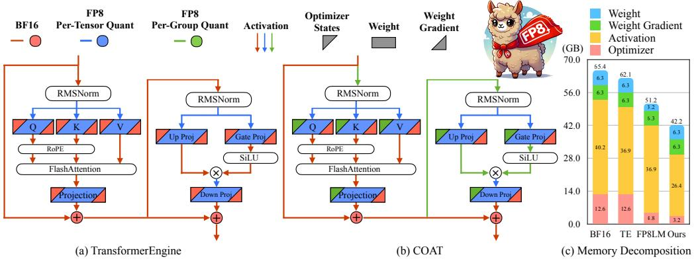
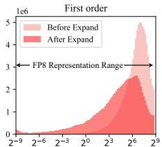
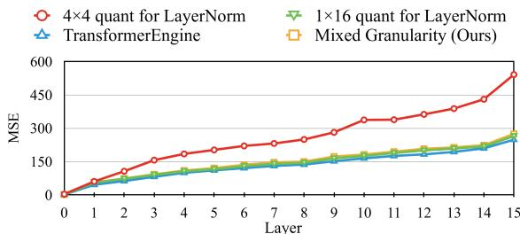
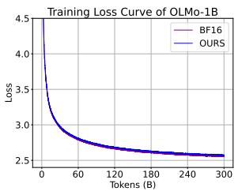
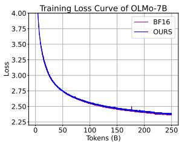
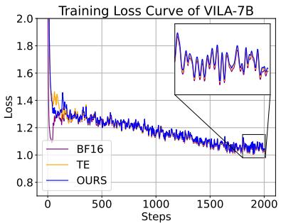

# COAT: Compressing Optimizer States and Activation for Memory-Efficient FP8 Training

## 一、论文概述

| 项目 | 内容 |
|------|------|
| **标题** | COAT: Compressing Optimizer States and Activation for Memory-Efficient FP8 Training |
| **作者** | Haocheng Xi, Han Cai, Ligeng Zhu, Yao Lu, Kurt Keutzer, Jianfei Chen, Song Han |
| **机构** | UC Berkeley, NVIDIA, MIT, Tsinghua University |
| **论文** | [arXiv:2410.19313](https://arxiv.org/abs/2410.19313) |
| **代码** | [GitHub](https://github.com/NVlabs/COAT) |
| **发布** | 2024年10月 |
| **许可** | - |

## 二、核心思想

### 问题定义

FP8训练已成为提高训练效率的有前途的方法。现有框架通过将FP8计算应用于线性层来加速训练，但将优化器状态和激活保持在更高精度，这未能充分利用内存节省潜力。特别是在使用ZeRO或FSDP进行分布式训练时，激活的内存问题变得更加关键。

### 解决方案概述

本文提出COAT（Compressing Optimizer States and Activations for FP8 Training），一种新颖的FP8训练框架，通过以下两个关键创新显著减少内存占用：

1. **动态范围扩展（Dynamic Range Expansion）**：调整优化器状态分布，使其更好地适应FP8表示范围，从而减少量化误差
2. **混合粒度激活量化（Mixed-Granularity Activation Quantization）**：使用per-tensor和per-group量化策略的组合来优化激活内存

**核心优势**：
- 端到端内存减少1.54×（相比BF16）
- 端到端训练加速1.43×（相比BF16）
- 性能几乎无损（在LLM预训练、微调和VLM训练等任务上）

## 三、技术架构

### 整体框架图

**Figure 1**: (a,b) Transformer Engine和COAT的量化流程对比。COAT将优化器状态和激活都量化到FP8。(c) 使用FSDP在8×80G H100上训练Llama-2-13B时的端到端GPU内存比较。

### 核心公式

#### FP8量化

量化将高精度张量压缩到低精度以实现加速和节省内存：

$$
X_{\mathrm{FP8}}, S_{X} = Q(X_{\mathrm{FP32}}), \text{其中} X_{\mathrm{FP8}} = \left\lceil \frac{X_{\mathrm{FP32}}}{S_{X}} \right\rfloor, S_{X} = \frac{\max(|X_{\mathrm{FP32}}|)}{\Delta_{\max}^{\mathrm{E4M3}}}
$$

其中 $S_X$ 是缩放因子，$\lceil \cdot \rfloor$ 表示四舍五入。

#### AdamW优化器更新规则

$$
m_{t} = \beta_{1} m_{t-1} + (1-\beta_{1}) g_{t-1} \quad v_{t} = \beta_{2} v_{t-1} + (1-\beta_{2}) g_{t-1}^{2}
$$

$$
\hat{m}_{t} = \frac{m_{t}}{1-\beta_{1}^{t}} \quad \hat{v}_{t} = \frac{v_{t}}{1-\beta_{2}^{t}}
$$

$$
w_{t+1} = w_{t} - \eta \left(\frac{\hat{m}_{t}}{\sqrt{\hat{v}_{t}}+\epsilon} + \lambda w_{t}\right)
$$

#### 动态范围扩展

引入扩展函数 $f(\cdot)$ 来扩展量化组的动态范围：

$$
f(x) = \mathrm{sign}(x) |x|^{k}
$$

其中 $k$ 用于控制扩展强度。扩展后的动态范围变为：

$$
\mathcal{R}_{f(X)} = \left(\frac{\max(|X|)}{\min(|X|)}\right)^{k} = (\mathcal{R}_{X})^{k}
$$

最优 $k$ 满足 $(\mathcal{R}_{X})^{k} = \mathcal{R}_{\mathrm{E4M3}}$，即 $k = \log_{\mathcal{R}_{X}}(\mathcal{R}_{\mathrm{E4M3}})$。

### 动态范围扩展可视化

**Figure 3**: 动态范围扩展可以更好地利用E4M3表示范围。

### 混合粒度激活量化

**关键观察**：
- 非线性层（如LayerNorm、SiLU）需要细粒度量化以保持精度
- 线性层的矩阵乘法使用per-tensor量化更高效，更适合TensorCore

**量化策略**：
- 非线性层：per-group量化（group size = 1×G）
- 线性层：per-tensor量化

**Figure 4**: (a) 前向传播中的量化误差。(b) 各种缩放方法的时间比较。

### 模型架构实现

COAT LLaMA实现引入三个新模块：

1. **BeforeAttention**：计算LayerNorm和QKV Projection，处理量化输入与残差连接的交互
2. **AfterAttention**：计算注意力投影层，确保量化输出正确缩放并与残差连接求和
3. **MLPResidual**：高效处理前馈网络（FFN）中的量化，包含残差连接

### Triton优化内核

**线性层优化**：
- 块大小自动调优：M、N、K维度从{128, 256}中选择
- 组缩放技术：将输出reshape为(BLOCK_M, BLOCK_N//G, G)，沿最后一维计算最大值

**非线性层优化**：
- 转置FP8输出：生成量化FP8输出和转置FP8输出，用于反向计算
- 块大小自动调优：M、N维度从{32, 64}中选择

## 四、核心创新

| 创新点 | 说明 | 理论/实验依据 |
|--------|------|---------------|
| **动态范围扩展** | 调整优化器状态分布以更好适应FP8范围 | MSE减少1.63× |
| **混合粒度激活量化** | 非线性层per-group，线性层per-tensor | 精度与效率的最佳平衡 |
| **组缩放技术** | 两阶段最大值归约，可与前一操作融合 | 开销增加<5% |
| **融合优化器内核** | CUDA实现的融合优化器状态更新 | 数值稳定性保证 |
| **FSDP兼容性** | 无需跨GPU同步动态范围 | 每个GPU独立处理自己的分片 |

## 五、实验结果

### LLM预训练结果

#### OLMo-1B训练

**Figure 5**: OLMo-1B训练损失曲线。

| 模型 | 训练PPL | COPA | ARC(Easy) | SciQ | HellaSwag | 平均 |
|------|---------|------|-----------|------|-----------|------|
| BF16 | 2.995 | 60.0 | 45.6 | 67.3 | 33.7 | 51.6 |
| COAT | 3.008 | 61.0 | 44.2 | 67.6 | 33.7 | 51.5 |

#### OLMo-7B训练

**Figure 6**: OLMo-7B训练损失曲线。

### VLM训练结果

#### VILA1.5-7B SFT

**Figure 7**: VILA1.5-7B Stage-3 SFT损失曲线。

### 效率分析

#### 内存分解

| 配置 | 优化器 | 激活 | 峰值 | 最大BS | 吞吐量 | 加速比 |
|------|--------|------|------|--------|--------|--------|
| **Llama-2-7B on 2 GPU** |
| BF16 | 26.2 GB | 25.8 GB | OOM | 1 | 6130 tokens/s | 1.00× |
| FP8优化器 | 6.4 GB | 25.8 GB | 61.9 GB | 2 | 7258 tokens/s | 1.18× |
| FP8优化器+FP8激活 | 6.4 GB | 16.9 GB | 35.6 GB | 4 | 11351 tokens/s | 1.85× |
| **Llama-2-7B on 8 GPU** |
| BF16 | 6.5 GB | 25.8 GB | 41.2 GB | 4 | 8238 tokens/s | 1.00× |
| FP8优化器 | 1.6 GB | 16.9 GB | 36.1 GB | 4 | 8444 tokens/s | 1.02× |
| FP8优化器+FP8激活 | 1.6 GB | 16.9 GB | 27.0 GB | 8 | 11241 tokens/s | 1.36× |

**关键发现**：
- FP8优化器显著减少优化器内存（从26.2GB降至6.4GB）
- FP8激活进一步减少激活内存（从25.8GB降至16.9GB）
- 组合使用可将批大小从1增加到4（2 GPU）或从4增加到8（8 GPU）

#### 端到端性能

| 指标 | 值 |
|------|-----|
| **内存减少** | 1.54×（相比BF16） |
| **训练加速** | 1.43×（相比BF16） |
| **批大小增加** | 2×（在所有分布式训练设置中） |

### 消融实验

#### 组件影响分析

| 配置 | 训练PPL | COPA | ARC(Easy) | SciQ | HellaSwag | 平均 |
|------|---------|------|-----------|------|-----------|------|
| BF16 | 2.995 | 60.0 | 45.6 | 67.3 | 33.7 | 51.6 |
| FP8 O + A | 3.008 | 61.0 | 44.2 | 67.6 | 33.7 | 51.5 |
| FP8 O | 2.998 (+0.003) | 60.0 (+0.0) | 44.5 | 66.0 | 34.1 | 51.1 |
| FP8 A | 2.999 (+0.004) | 63.0 (+3.0) | 44.0 | 68.4 | 34.1 | 52.3 |

**结论**：
- 量化激活几乎不引起性能下降（得益于精心设计的量化流程）
- 主要性能下降来自优化器量化
- 两者结合可最大化内存节省

#### 组大小分析

| MSE | 1×128组 | Per-Tensor | 4 | 8 | 16 | 32 | 64 |
|-----|---------|------------|---|---|----|----|----|
| 内存开销 | - | - | 50% | 25% | 12.5% | 6.5% | 3.2% |
| 前向 | 372 | 438 | 464 | 480 | 492 | 512 | 520 |
| 反向 | 285 | 286 | 319 | 334 | 363 | 361 | 371 |

**结论**：group size = 16在内存效率和量化误差之间取得良好平衡。

## 六、相关工作

### 低精度训练

| 方法 | 关键特性 | 本文对比 |
|------|----------|----------|
| **FP16/BF16** | 半精度训练，广泛应用 | 基准对比 |
| **Transformer Engine** | FP8 TensorCore线性层计算 | 主要对比基准 |
| **FP8-LM** | 梯度和优化器状态FP8量化 | 改进基础 |
| **Jetfire** | INT8数据流，适用于LM预训练 | 方法参考 |

### 内存高效优化器

| 方法 | 关键特性 | 本文对比 |
|------|----------|----------|
| **8-bit Adam** | 动态指数格式 | 参考方法 |
| **4-bit Optimizer** | 4-bit优化器量化 | 极限压缩参考 |
| **FP8-LM** | 一阶动量FP8，二阶动量FP16 | 改进基础 |

### 激活量化

| 方法 | 关键特性 | 本文对比 |
|------|----------|----------|
| **ActNN** | 2-bit激活压缩训练 | CNN参考 |
| **GACT** | 支持多种架构 | 通用方法参考 |
| **Jetfire** | INT8线性和非线性层 | 方法参考 |

## 七、总结

### 核心贡献

1. **动态范围扩展方法**：通过幂函数扩展优化器状态的动态范围，使其更好地适应FP8表示范围，MSE减少1.63×
2. **混合粒度激活量化**：非线性层使用per-group量化保持精度，线性层使用per-tensor量化提高效率
3. **组缩放技术**：两阶段最大值归约，可与前一操作融合，开销增加<5%
4. **融合优化器内核**：CUDA实现的融合优化器状态更新，确保数值稳定性
5. **FSDP兼容设计**：无需跨GPU同步动态范围，每个GPU独立处理自己的分片

### 技术影响

- **内存效率**：端到端内存减少1.54×，使得在更少GPU上训练大模型成为可能
- **训练效率**：端到端训练加速1.43×，批大小可翻倍
- **实用性**：与现有FSDP/ZeRO分布式训练框架完全兼容
- **精度保证**：在LLM预训练、微调和VLM训练上几乎无性能损失

### 局限性

- **硬件依赖**：主要针对NVIDIA H100 GPU的FP8 TensorCore优化
- **模型验证**：主要在Llama风格模型上验证，其他架构的泛化性需进一步探索
- **量化误差累积**：长时间训练中量化误差可能累积，需要更长训练验证
- **实现复杂度**：需要自定义Triton内核和CUDA优化，增加工程复杂度

## 八、参考资源

- **论文**: https://arxiv.org/abs/2410.19313
- **代码**: https://github.com/NVlabs/COAT
- **项目主页**: https://nvlabs.github.io/COAT/
- **Transformer Engine**: https://github.com/NVIDIA/TransformerEngine
- **FP8-LM**: https://arxiv.org/abs/2310.18313
