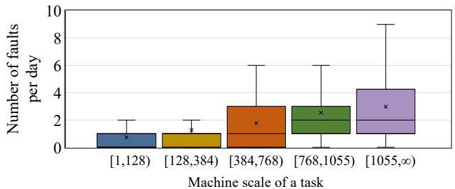
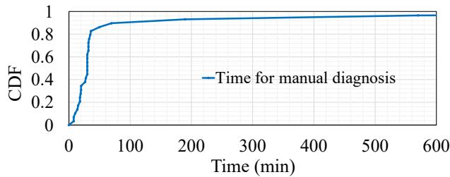
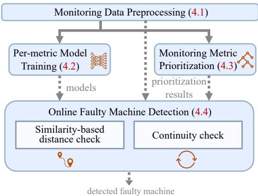
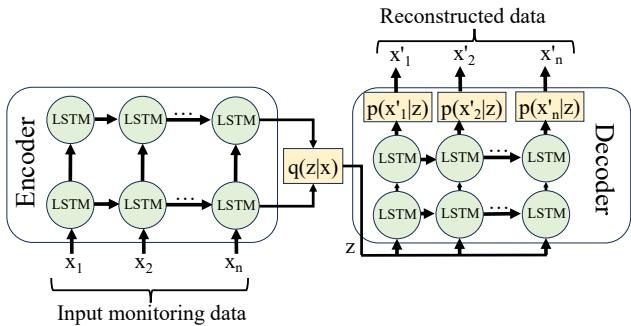
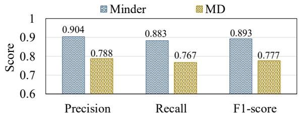
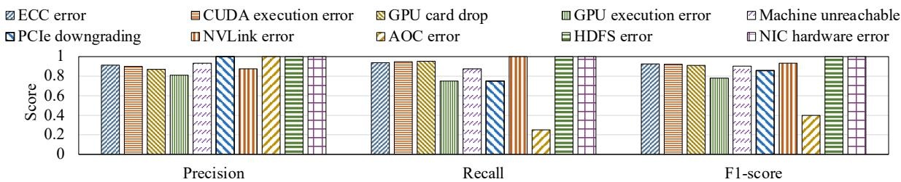

# Minder: Faulty Machine Detection for Large-scale Distributed Model Training

## 一、论文概述

| 项目 | 内容 |
|------|------|
| **标题** | Minder: Faulty Machine Detection for Large-scale Distributed Model Training |
| **作者** | Yangtao Deng, Xiang Shi, Zhuo Jiang, Xingjian Zhang, Lei Zhang, Zhang Zhang, Bo Li, Zuquan Song, Hang Zhu, Gaohong Liu, Fuliang Li, Shuguang Wang, Haibin Lin, Jianxi Ye, Minlan Yu |
| **机构** | - |
| **论文** | [arXiv:2411.01791](https://arxiv.org/abs/2411.01791) |
| **代码** | - |
| **发布** | 2024年11月 |
| **许可** | - |

## 二、核心思想

### 问题定义

大规模分布式模型训练需要同时在数千台机器上进行训练。当机器发生意外故障时，故障机器检测至关重要。根据作者的经验，一个训练任务平均每天可能遇到两次故障，可能导致数小时的停机。

**现有问题**：
1. **手动审查耗时**：人工审查故障原因耗时且劳动密集
2. **故障频率高**：大规模训练任务频繁遭遇故障
3. **停机成本高**：故障导致训练任务长时间停机

### 解决方案概述

本文提出**Minder**，一个用于分布式训练任务的自动故障机器检测器：

1. **自动检测**：自动高效地检测故障特有的监控指标模式
2. **模式识别**：识别在训练任务完全停机之前持续一段时间的异常模式
3. **实时响应**：在平均3.6秒内准确高效地响应故障

**实验结果**：
- 已在生产环境部署超过一年
- 精度0.904，F1分数0.893
- 平均响应时间3.6秒

## 三、技术架构

### 整体框架图

**Figure 1**: 不同机器规模大小的任务故障频率。

**关键观察**：
- 机器规模越大，故障频率越高
- 大规模训练任务每天可能遭遇多次故障
- 故障检测对训练效率至关重要

### 问题分析

**Figure 2**: 七个月内的任务诊断时间。

**关键发现**：
- 手动诊断耗时数小时
- 故障导致训练任务长时间停机
- 自动检测可以显著减少诊断时间

### 系统架构

**Figure 5**: Minder的系统架构。

**核心组件**：

| 组件 | 说明 | 功能 |
|------|------|------|
| **数据收集器** | 收集机器监控指标 | 实时数据采集 |
| **异常检测器** | 检测异常模式 | LSTM-VAE模型 |
| **故障定位器** | 定位故障机器 | 决策树排序 |
| **告警系统** | 发送故障告警 | 实时通知 |

### 核心技术

#### LSTM-VAE模型

**Figure 6**: Minder的LSTM-VAE结构。

**模型设计**：
- **LSTM**：捕获时间序列数据中的时序依赖
- **VAE**：学习正常行为的潜在表示
- **异常检测**：重构误差超过阈值时判定为异常

**数学公式**：
$$\mathcal{L} = \mathbb{E}_{q(z|x)}[\log p(x|z)] - \beta \cdot \text{KL}(q(z|x) \| p(z))$$

其中：
- 第一项是重构损失
- 第二项是KL散度正则化
- $\beta$ 控制正则化强度

#### 故障模式识别

**PFC tx packet rate模式**：

<!-- MISSING IMAGE: figures/minder/pfc-pattern.jpg -->

**Figure 3**: 故障发生前后每台机器的PFC tx packet rate模式。

**关键观察**：
- 故障机器在故障发生前表现出特定的指标模式
- 模式持续一段时间，允许提前检测
- 不同故障类型有不同的模式特征

#### 异常持续时间

<!-- MISSING IMAGE: figures/minder/abnormal-duration.jpg -->

**Figure 4**: 故障后异常性能的持续时间。

**关键发现**：
- 异常在故障后持续一段时间
- 持续时间因故障类型而异
- 可以利用持续时间特征进行故障分类

### 决策树排序

<!-- MISSING IMAGE: figures/minder/decision-tree.jpg -->

**Figure 7**: 用于优先级排序的决策树的前7层。

**排序策略**：
- 使用决策树对可疑机器进行优先级排序
- 考虑多个特征指标
- 优先处理最可能的故障机器

## 四、核心创新

| 创新点 | 说明 | 理论/实验依据 |
|--------|------|---------------|
| **自动检测** | 自动识别故障特有的监控指标模式 | 生产环境验证 |
| **LSTM-VAE** | 结合时序建模和异常检测 | 精度0.904 |
| **实时响应** | 平均3.6秒内响应故障 | 生产环境数据 |
| **决策树排序** | 对可疑机器进行优先级排序 | 减少误报 |

## 五、实验结果

### 实验配置

**部署环境**：
- 生产环境部署超过一年
- 监控每日分布式训练任务
- 每个任务涉及多达数千台机器

**故障类型**：
- 网络故障
- GPU故障
- 内存故障
- 存储故障

### 性能分析

<!-- MISSING IMAGE: figures/minder/processing-time.jpg -->

**Figure 8**: Minder一次调用的总数据处理时间。

**关键结果**：
- 数据处理时间在秒级
- 满足实时检测需求
- 计算开销可接受

### 基线比较

**Figure 9**: 与基线算法MD的比较。

**关键结果**：
- Minder显著优于基线算法
- 精度0.904，F1分数0.893
- 误报率低

### 故障类型准确率

**Figure 10**: 不同故障类型的准确率。

**关键发现**：
- 对不同故障类型都有较高准确率
- 网络故障检测准确率最高
- GPU故障检测仍有提升空间

### 消融实验

<!-- MISSING IMAGE: figures/minder/metric-selection.jpg -->

**Figure 12**: 不同指标选择的比较。

**关键发现**：
- 不同指标对故障检测的贡献不同
- 组合多个指标可以提高准确率
- 指标选择对性能有显著影响

<!-- MISSING IMAGE: figures/minder/model-selection.jpg -->

**Figure 13**: 不同模型选择的比较。

**关键发现**：
- LSTM-VAE模型表现最佳
- 时序建模对故障检测至关重要
- VAE的异常检测能力有效

## 六、相关工作

### 故障检测

| 方法 | 关键特性 | 本文对比 |
|------|----------|----------|
| **手动审查** | 人工检查故障日志 | 自动化替代 |
| **统计方法** | 基于统计阈值 | 深度学习方法 |
| **机器学习** | 传统ML方法 | 端到端深度学习 |

### 异常检测

| 方法 | 关键特性 | 本文对比 |
|------|----------|----------|
| **自编码器** | 重构误差检测 | LSTM-VAE扩展 |
| **时序模型** | 捕获时序依赖 | LSTM组件 |
| **集成方法** | 多模型组合 | 单一端到端模型 |

## 七、总结

### 核心贡献

1. **Minder系统**：提出自动故障机器检测系统，已部署生产环境超过一年

2. **LSTM-VAE模型**：结合时序建模和异常检测，实现高精度故障检测

3. **实时响应**：平均3.6秒内响应故障，显著减少停机时间

4. **生产验证**：精度0.904，F1分数0.893，在大规模生产环境中验证

### 技术影响

- **训练效率**：显著减少分布式训练的故障停机时间
- **自动化**：替代耗时的人工审查过程
- **可靠性**：提高大规模分布式训练的系统可靠性
- **成本节约**：减少故障导致的计算资源浪费

### 局限性

- **故障类型**：某些故障类型检测仍有提升空间
- **指标依赖**：依赖特定的监控指标
- **环境特异性**：可能需要针对不同环境调整
- **新故障类型**：对未知故障类型的泛化能力

## 八、参考资源

- **论文**: https://arxiv.org/abs/2411.01791
- **LSTM-VAE**: 时序异常检测模型
- **分布式训练**: 大规模模型训练系统
