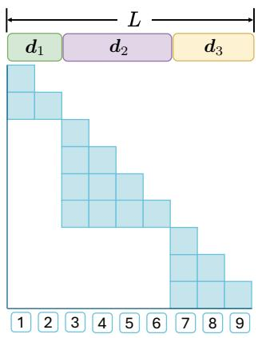
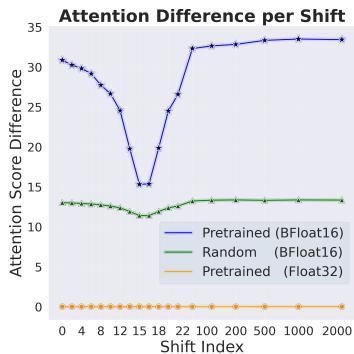
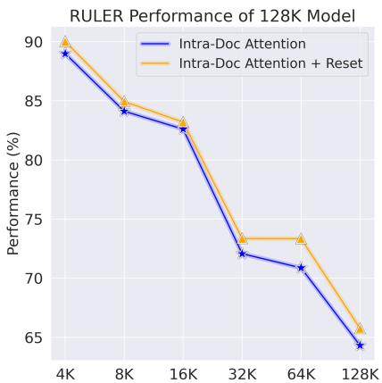
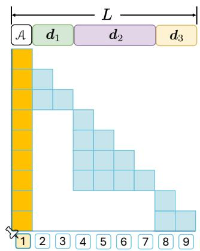
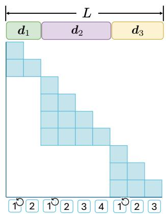

# When Precision Meets Position: BFloat16 Breaks Down RoPE in Long-Context Training

## 一、论文概述

| 项目 | 内容 |
|------|------|
| **标题** | When Precision Meets Position: BFloat16 Breaks Down RoPE in Long-Context Training |
| **作者** | Haonan Wang, Qian Liu, Chao Du, Tongyao Zhu, Cunxiao Du, Kenji Kawaguchi, Tianyu Pang |
| **机构** | National University of Singapore, Sea AI Lab |
| **论文** | [arXiv:2411.13476](https://arxiv.org/abs/2411.13476) |
| **代码** | [GitHub](https://github.com/hsiehjason/AnchorAttention) |
| **发布** | 2024年11月 |
| **许可** | - |

## 二、核心思想

### 问题定义

扩展上下文窗口大小允许大语言模型（LLM）处理更长序列和更复杂任务。旋转位置编码（RoPE）因其相对位置编码属性而成为长上下文训练的事实标准。然而，我们观察到使用RoPE与BFloat16格式会导致数值问题，使其偏离预期的相对位置编码，尤其是在长上下文场景中。

**关键发现**：
- BFloat16的有限精度导致RoPE的相对位置属性被破坏
- 第一个token对这种偏差贡献最大
- 随着上下文长度增加，数值误差累积，问题更加严重

### 解决方案概述

本文提出AnchorAttention，一种即插即用的注意力方法，通过以下方式解决BFloat16引起的问题：

1. **共享锚点token**：将第一个token作为共享锚点，始终分配第一个位置ID
2. **跨文档可见性**：使锚点对所有文档可见，同时确保不同文档的token相互不可见
3. **减少不必要的注意力计算**：通过不关注所有先前token来防止数值误差的累积

**核心优势**：
- 显著提高长上下文性能
- 训练时间减少50%以上
- 保持原始LLM在通用任务上的能力

## 三、技术架构

### 整体框架图

**Figure 2**: 不同注意力范式的示意图。左：标准文档内注意力。中：改进版本，每个文档重置位置ID。右：AnchorAttention，包含共享锚点token A。

### 核心公式

#### RoPE的相对位置属性

理论上，RoPE应该只依赖于token之间的相对位置距离 $m = j - i$：

$$
A_{(i+\Delta)(j+\Delta)} = \left(R_{i+\Delta,\theta} q_{i}\right)^{\top} \left(R_{j+\Delta,\theta} k_{j}\right) = q_{i}^{\top} R_{m,\theta} k_{j} = A_{ij}
$$

其中 $R_{m,\theta}$ 是对应相对距离 $m$ 的旋转矩阵。

#### 注意力差异度量

为了量化位置偏移对注意力计算的影响，定义以下度量：

$$
D(\mathbf{X}, \Delta_{1}, \Delta_{2}) = \sum_{l, h} \sum_{j=1}^{L} \mathbf{n} \odot \left(\sum_{i=1}^{L} \left| \mathrm{ATTN}_{i, j}^{l, h}(\mathbf{X}, \Delta_{1}) - \mathrm{ATTN}_{i, j}^{l, h}(\mathbf{X}, \Delta_{2}) \right|\right)
$$

其中归一化向量 $\mathbf{n} = \left[\frac{1}{L}, \frac{1}{L-1}, \dots, 1\right]$ 用于处理因果掩码导致的下三角矩阵元素数量变化。

#### 注意力logit差异

对于第一个token，定义注意力logit差异：

$$
D_{\text{logit}} = \frac{1}{T} \sum_{l, h} \sum_{i=1}^{T} \left| A_{i, j=1}^{l, h}(\Delta_{1}) - A_{i, j=1}^{l, h}(\Delta_{2}) \right|
$$

### BFloat16对RoPE的影响

**Figure 1**: 位置偏移对注意力计算的影响。左：不同位置偏移下的注意力差异。中：每个token的注意力差异，显示第一个token贡献最大。右：随着序列长度增加，第一个token的注意力logit差异增大。

**关键观察**：
- 使用BFloat16精度时，位置偏移Δ会影响预训练LLaMA-2-7B的注意力计算
- 使用Float32精度时，这种影响消失
- 预训练会放大这种差异（相比随机初始化）
- 第一个token对注意力差异贡献最大
- 更长的序列会加剧第一个token的差异

### AnchorAttention机制

**核心设计**：
1. **共享锚点token**：第一个token始终分配位置ID 1，对所有文档可见
2. **文档内注意力**：不同文档的token相互不可见
3. **连续位置ID**：使用从窗口开始到结束的连续位置ID（无需重置）

**优势**：
- 消除位置ID不一致的问题
- 允许模型学习完整的旋转角度范围
- 减少参与注意力计算的token数量
- 防止数值误差的累积

## 四、核心创新

| 创新点 | 说明 | 理论/实验依据 |
|--------|------|---------------|
| **发现BFloat16破坏RoPE** | BFloat16精度下RoPE的相对位置属性被破坏 | 注意力差异度量实验 |
| **第一个token的关键作用** | 第一个token对偏差贡献最大 | 每token注意力差异分析 |
| **AnchorAttention机制** | 共享锚点token + 文档内注意力 | 长上下文性能显著提升 |
| **训练效率提升** | 减少50%以上训练时间 | 注意力计算量减少 |
| **位置ID重置的有效性** | 重置位置ID可提高长上下文性能 | RULER基准测试结果 |

## 五、实验结果

### 位置ID重置效果

**Figure 3**: 重置位置ID可以提高性能，这与RoPE的理论预测相矛盾。

### RULER基准测试

**Figure 4**: RULER性能在长上下文训练期间变化。建议报告多个checkpoint的平均RULER性能，而不仅仅是最终训练步骤。PPL在前几个步骤后保持不变，无法反映长上下文能力的改进。

### 域标记和交错块

**Figure 5**: 域标记和交错块的示意图。左：带域标记的AnchorAttention。中：带交错块的文档内注意力。右：带交错块的AnchorAttention。

### 训练效率

**关键结果**：
- AnchorAttention显著减少训练时间（相比标准全注意力）
- 在相同序列并行度和DeepSpeed-Ulysses配置下，实现更高的GPU利用率
- 支持更高级的实验（如Flex-Attention机制）

### 长上下文性能

**评估基准**：
- RULER：从8K到128K长度的长上下文评估
- LongBench：真实世界长上下文基准

**关键发现**：
- AnchorAttention在RULER基准上 consistently outperforms 全注意力、标准文档内注意力和改进的文档内注意力
- 在LongBench上提高上下文学习性能
- 在MMLU和HellaSwag等通用任务上 largely preserving 模型能力

## 六、相关工作

### 位置编码方法

| 方法 | 关键特性 | 本文对比 |
|------|----------|----------|
| **RoPE** | 旋转位置编码，相对位置属性 | 问题分析对象 |
| **ALiBi** | 线性偏置注意力 | 替代方案参考 |
| **位置插值** | 扩展上下文长度 | 长上下文训练参考 |

### 长上下文训练

| 方法 | 关键特性 | 本文对比 |
|------|----------|----------|
| **Full Attention** | 标准全注意力机制 | 基准对比 |
| **Intra-document Attention** | 文档内注意力，跨文档掩码 | 改进基础 |
| **FlashAttention2** | 高效注意力实现 | 系统集成 |

### 数值精度研究

| 方法 | 关键特性 | 本文对比 |
|------|----------|----------|
| **BFloat16** | Brain浮点格式，广泛使用 | 问题来源 |
| **Float32** | 单精度浮点，高精度 | 对比基准 |

## 七、总结

### 核心贡献

1. **发现问题**：首次发现BFloat16精度下RoPE的相对位置属性被破坏，第一个token贡献最大
2. **理论分析**：量化分析了位置偏移对注意力计算的影响，定义了注意力差异度量
3. **AnchorAttention方法**：提出共享锚点token的注意力机制，解决位置ID不一致问题
4. **训练效率**：减少50%以上训练时间，提高GPU利用率
5. **实践建议**：建议报告多个checkpoint的平均RULER性能，避免cherry-picking

### 技术影响

- **长上下文训练**：为长上下文模型训练提供了更高效的方法
- **数值精度理解**：揭示了BFloat16在位置编码中的局限性
- **注意力机制设计**：为设计更高效的注意力机制提供了新思路
- **评估方法**：提出了更可靠的长上下文性能评估建议

### 局限性

- **理论理解**：RoPE在BFloat16下作为绝对位置编码机制的假设需要更严格的验证
- **模型规模**：主要在7B参数模型上验证，更大规模的泛化性需进一步探索
- **任务范围**：主要在长上下文任务上评估，其他任务类型的效果需验证
- **实现依赖**：需要与FlashAttention2集成，增加了一定的实现复杂度

## 八、参考资源

- **论文**: https://arxiv.org/abs/2411.13476
- **代码**: https://github.com/hsiehjason/AnchorAttention
- **RoPE**: https://arxiv.org/abs/2104.09864
- **FlashAttention2**: https://arxiv.org/abs/2307.08691
- **RULER基准**: https://arxiv.org/abs/2404.06654
