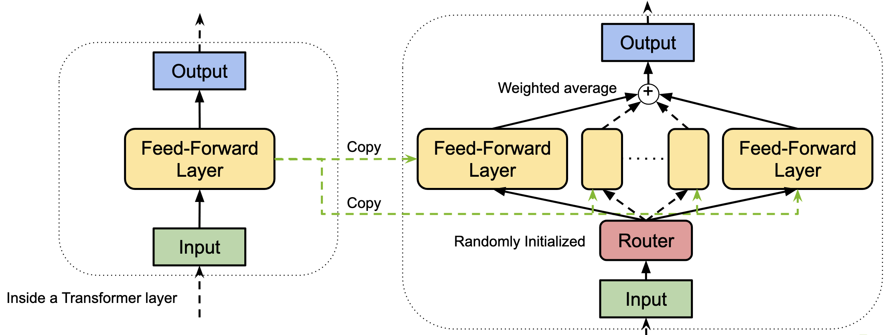
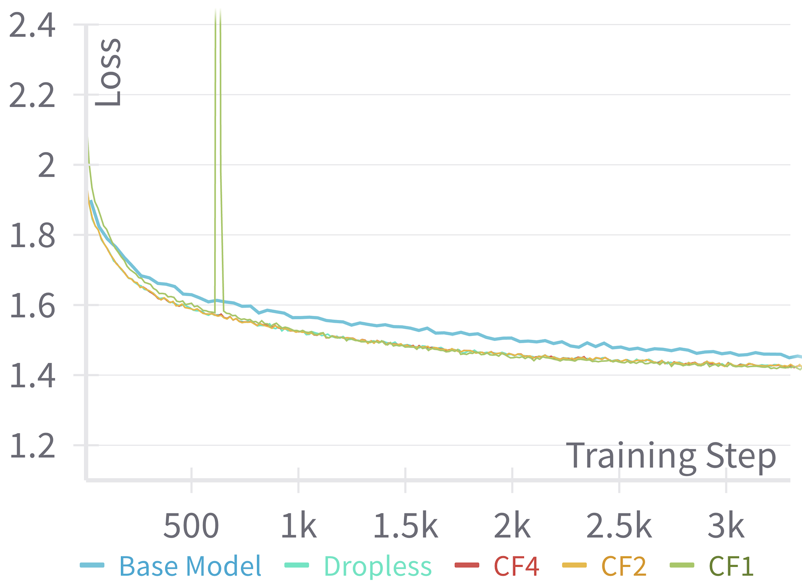
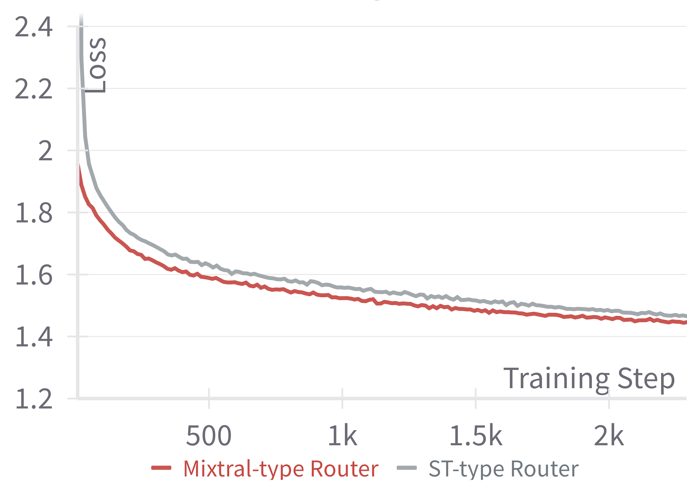

# Llama 3 Meets MoE: Efficient Upcycling

## 一、论文概述

| 项目 | 内容 |
|------|------|
| **标题** | Llama 3 Meets MoE: Efficient Upcycling |
| **作者** | Aditya Vavre, Ethan He, Dennis Liu, Zijie Yan, June Yang, Nima Tajbakhsh, Ashwath Aithal |
| **机构** | University of Texas at Austin, NVIDIA |
| **论文** | [arXiv:2412.09952](https://arxiv.org/abs/2412.09952) |
| **代码** | [NeMo](https://github.com/NVIDIA/NeMo) |
| **发布** | 2024年12月 |
| **许可** | - |

## 二、核心思想

### 问题定义

扩展大型语言模型（LLM）可显著提升性能，但计算成本极高。Mixture-of-Experts（MoE）模型提供了一种高效替代方案，可在不按比例增加计算需求的情况下增加模型容量。然而，从头训练 MoE 模型面临诸多挑战：

1. **过拟合风险**：MoE 模型参数量大，容易过拟合
2. **路由不稳定性**：训练过程中路由器可能出现不稳定
3. **专家坍塌**：部分专家可能失效，无法有效利用所有专家
4. **计算成本高**：从头训练需要大量 GPU 时间（如 GPT-4 约需 55M GPU 小时）

### 解决方案概述

本文提出一种高效的训练方法，利用预训练的密集检查点（dense checkpoint）来初始化 MoE 模型：

- **上循环（Upcycling）**：将 Llama 3-8B 的前馈层复制 N 次，初始化为 N 个专家
- **8-Expert Top-2 MoE**：创建 34.4B 参数的 MoE 模型，仅激活 11.8B 参数
- **极低计算成本**：仅需典型预训练计算量的不到 1%
- **性能提升**：在 MMLU 0-shot 上提升 2%，总体提升约 1.2%

## 三、技术架构

### 整体框架图

### 核心公式

#### MoE 输出计算

给定输入 $x$，路由器输出 $G(x)$ 和第 $i$ 个专家输出 $E_i(x)$，MoE 的输出 $y$ 为：

$$y = \sum_{i=1}^{N} G(x)_i E_i(x)$$

#### Noisy Top-k 路由

$$G(x) = \text{Softmax}(\text{KeepTopK}(H(x), k))$$

其中：

$$H(x)_i = (x \cdot W_g)_i + \text{StandardNormal}() \cdot \text{Softplus}((x \cdot W_{noise})_i)$$

$$\text{KeepTopK}(v, k)_i = \begin{cases} v_i, & \text{if } v_i \text{ is in the top } k \text{ elements of } v \\ -\infty, & \text{otherwise} \end{cases}$$

#### 容量因子

$$\text{expert capacity} = \frac{\text{tokens per batch}}{N} \times \text{CF}$$

溢出的 token 被排除在计算之外，直接路由到层的输出。

### 模型参数对比

| 模型 | 总参数 | 激活参数 | FLOPs (BS=1) |
|------|--------|----------|--------------|
| Llama 3-8B | 8B | 8B | 4.7e14 |
| Llama 3-E8T2 | 34.4B | 11.8B | 7.5e14 |

### 训练框架

#### 5-D 混合并行策略

使用 Megatron-Core 支持的 5-D 混合并行：

| 并行策略 | 说明 |
|----------|------|
| **Tensor Parallelism (TP)** | 将每层的张量分片到不同设备 |
| **Expert Parallelism (EP)** | 将 MoE 层的专家分配到不同设备 |
| **Pipeline Parallelism (PP)** | 将 Transformer 层切割为多个阶段 |
| **Context Parallelism (CP)** | 将输入序列分割为多段，减少长序列训练的内存占用 |
| **Data Parallelism (DP)** | 使用 ZeRO-1 分片优化器状态 |

#### MoE Parallel Folding

提出异构混合并行策略，解耦 Attention 和 MoE 组件的并行映射：

- **Attention 层**：4D 并行映射 TP×CP×DP×PP
- **MoE 层**：4D 并行组 Expert-TP×EP×Expert-DP×PP

**核心思想**：将通信密集的并行操作折叠到高带宽 NVLink 域中，大幅减少通信开销。

**示例**：TP2CP2 用于 Attention 层，TP1EP8 用于 MoE 层；TP 和 CP 组在 Attention 层中折叠到 EP 组中。

### 训练配置

| 配置项 | 值 |
|--------|-----|
| **基础模型** | Llama 3-8B 预训练检查点 |
| **MoE 架构** | 8-Expert Top-2 (E8T2) |
| **容量因子** | 4 |
| **专家并行** | 8-way |
| **张量并行** | 2-way |
| **流水线并行** | 4-way |
| **虚拟流水线并行** | 8-way |
| **训练 token 数** | 100B |
| **学习率** | 3e-5 → 3e-7（余弦退火） |
| **预热步数** | 100 |
| **GPU** | 512 × H100 |
| **精度** | bfloat16 |

### 训练数据

| 数据源 | 说明 | token 数 |
|--------|------|----------|
| **RedPajama V2** | 去重过滤，按困惑度分桶，使用最低困惑度桶 | ~0.89T |
| **学术数据** | 多个开源学术基准数据集的混合 | ~2.7B |
| **混合比例** | RedPajama V2 : 学术数据 = 7 : 3 | - |

## 四、核心创新

| 创新点 | 说明 | 理论/实验依据 |
|--------|------|---------------|
| **高效上循环方法** | 利用预训练密集检查点初始化 MoE 模型 | 仅需 <1% 预训练计算量 |
| **在线上循环实现** | 在 NeMo 中实现，支持分布式训练 | 避免跨设备权重复制 |
| **MoE Parallel Folding** | 解耦 Attention 和 MoE 的并行映射 | 通信折叠到 NVLink 域 |
| **容量因子优化** | CF=4 在性能和精度间取得最佳平衡 | MFU 39.4%，MMLU 63.8% |
| **路由器选择** | Mixtral 类型路由器优于 ST 类型 | 起始损失更低，收敛更快 |

## 五、实验结果

### 核心结果

| 指标 | 值 |
|------|-----|
| **MFU** | 46.8%（CF=1） |
| **MMLU 0-shot 提升** | +2% |
| **总体平均提升** | +1.2% |
| **训练成本** | ~11K GPU 小时（vs 从头训练 1.6M GPU 小时） |

### 下游任务评估

| 模型 | MMLU(5) | MMLU | TruthfulQA | PIQA | SciQ | LogiQA | BoolQ | OBQA | 平均 |
|------|---------|------|------------|------|------|--------|-------|------|------|
| Llama 3-8B | 65.20 | 62.10 | 44.01 | 80.47 | 93.90 | 29.80 | 81.16 | 45.00 | 62.71 |
| Llama 3-E8T2 | 64.00 | 64.10 | 44.22 | 78.62 | 97.00 | 30.11 | 88.23 | 44.80 | 63.89 |

**关键发现**：
- MMLU 0-shot 提升 2%（62.10 → 64.10）
- SciQ 提升 3.1%（93.90 → 97.00）
- BoolQ 提升 7.07%（81.16 → 88.23）

### 容量因子消融实验

| 训练策略 | MFU(%) | MMLU(5) | MMLU |
|----------|--------|---------|------|
| 基础模型继续训练 | 52.4 | 62.4 | 62.9 |
| Dropless（无限 CF） | 39.6 | 63.3 | 63.7 |
| CF=4 | 39.4 | 63.5 | 63.8 |
| CF=2 | 39.2 | 64.0 | 63.9 |
| CF=1 | 46.8 | 63.7 | 63.3 |

**结论**：
- CF=1 时 MFU 最高（46.8%），但精度略低
- CF=2 和 CF=4 在精度上显著优于基础模型继续训练
- Dropless 方法精度较差，因为缺乏 CF 提供的隐式正则化
- **选择 CF=4** 作为主配置，在性能和精度间取得最佳平衡

### 路由器算法消融实验

比较两种路由器类型：
- **Mixtral 类型**：先 KeepTopK 后 Softmax，初始输出与密集模型匹配
- **ST 类型**：先 Softmax 后 KeepTopK，保留绝对幅度信息

**结论**：Mixtral 类型路由器起始损失更低，收敛更快，因此选择该类型。

### 训练性能

| GPU 数 | CF | TP | CP | Expert-TP | EP | PP | VP | TFLOPS/GPU | MFU |
|--------|----|----|----|-----------|----|----|----|------------|-----|
| 128 | 1 | 1 | 2 | 1 | 8 | 4 | 8 | 462.8 | 46.8% |
| 128 | 2 | 2 | 2 | 1 | 8 | 4 | 8 | 387.5 | 39.2% |
| 128 | 4 | 2 | 2 | 1 | 8 | 4 | 8 | 389.7 | 39.4% |
| 128 | N/A | 2 | 2 | 1 | 8 | 4 | 8 | 391.8 | 39.6% |

## 六、相关工作

### MoE 训练方法

| 方法 | 关键特性 | 本文对比 |
|------|----------|----------|
| **Switch Transformers** | 简单高效的稀疏性 | 容量因子优化参考 |
| **Mixtral** | 8-Expert Top-2 架构 | 路由器类型参考 |
| **Sparse Upcycling** | 从密集检查点初始化 MoE | 基础方法，本文扩展 |
| **GShard** | 专家并行 | EP 策略参考 |

### 并行训练框架

| 框架 | 关键特性 | 本文使用 |
|------|----------|----------|
| **Megatron-LM** | 张量并行 | 基础框架 |
| **Megatron-Core** | 5-D 混合并行 | 主要训练框架 |
| **ZeRO** | 数据并行优化 | ZeRO-1 用于 DP |

## 七、总结

### 核心贡献

1. **高效上循环方法**：利用 Llama 3-8B 预训练检查点，以 <1% 的计算成本训练 8-Expert Top-2 MoE 模型
2. **在线上循环实现**：在 NeMo 中实现分布式训练友好的上循环方法
3. **MoE Parallel Folding**：提出异构混合并行策略，优化通信效率
4. **性能验证**：在 MMLU 等基准上实现 2% 的性能提升
5. **开源贡献**：在 NeMo 中发布完整训练配方

### 技术影响

- **成本效益**：将 MoE 训练成本从 1.6M GPU 小时降低到 11K GPU 小时（降低 99.3%）
- **可访问性**：使中小团队也能训练高质量 MoE 模型
- **工程实践**：提供了详细的并行配置调优指南
- **社区贡献**：开源实现促进 MoE 研究

### 局限性

- **模型规模**：仅在 8B 参数的基础模型上验证，更大规模的泛化性需进一步验证
- **数据规模**：上循环仅使用 100B token，可能限制了模型的进一步提升
- **架构限制**：仅验证了 8-Expert Top-2 配置，其他 MoE 配置需进一步探索
- **评估范围**：主要在学术基准上评估，实际应用场景的效果需验证

## 八、参考资源

- **论文**: https://arxiv.org/abs/2412.09952
- **NeMo**: https://github.com/NVIDIA/NeMo
- **Megatron-LM**: https://arxiv.org/abs/1909.08053
- **Sparse Upcycling**: https://arxiv.org/abs/2310.12072
