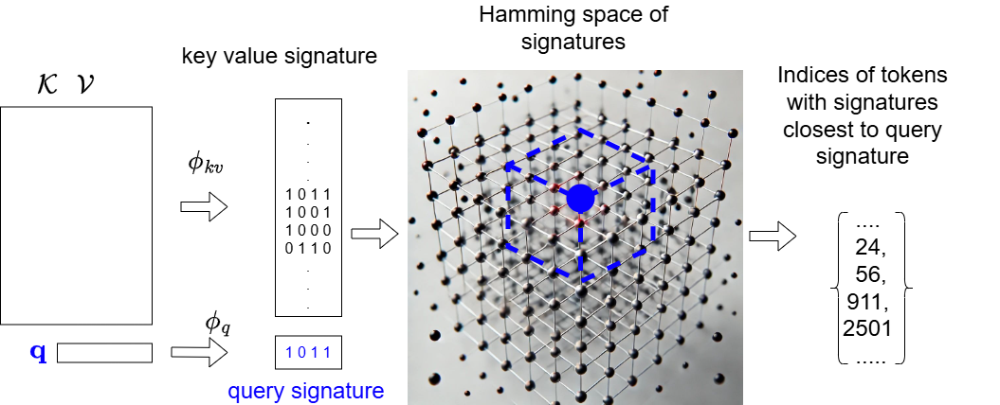
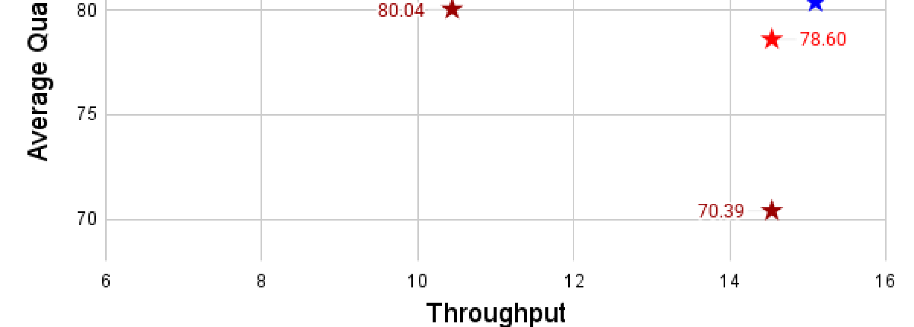
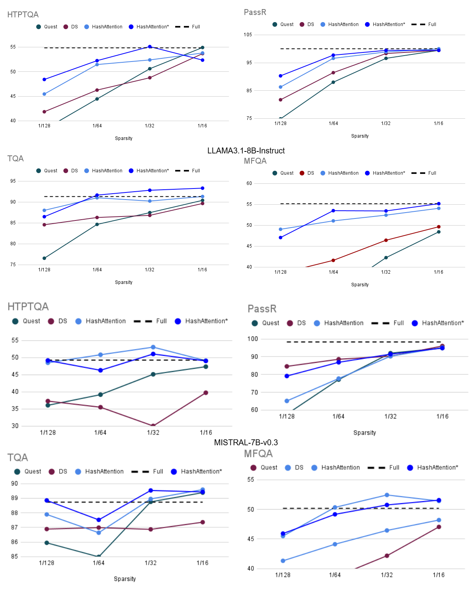

# HashAttention: 语义稀疏性实现更快推理

## 一、论文概述

| 项目 | 内容 |
|------|------|
| **标题** | HashAttention: Semantic Sparsity for Faster Inference |
| **作者** | Aditya Desai, Shuo Yang, Alejandro Cuadron, Matei Zaharia, Joseph E. Gonzalez, Ion Stoica |
| **机构** | UC Berkeley, Anyscale |
| **论文** | [arXiv:2412.14468](https://arxiv.org/abs/2412.14468) |
| **代码** | [GitHub: xAlg-ai/HashAttention-1.0](https://github.com/xAlg-ai/HashAttention-1.0) |
| **发布** | 2024年12月 |
| **许可** | ICML |

## 二、核心思想

### 问题定义

长上下文推理中，注意力计算面临可扩展性挑战：

**问题根源**：
- Scaled Dot-Product Attention (SDPA) 展示出 token 稀疏性
- 仅少数关键 token 对输出有显著贡献
- 但识别这些关键 token 具有挑战性

**现有方法局限**：
- 固定稀疏模式：忽略动态性
- KV 缓存丢弃：不可逆，丢失信息
- 部分计算估计：召回率低，内存开销大

### 解决方案概述

HashAttention 将关键 token 识别建模为推荐问题：

1. **问题转化**：识别关键 token 是最大内积搜索（MIPS）问题
2. **哈希空间编码**：使用学习的映射函数将 key 和 query 编码到汉明空间
3. **位运算高效检索**：使用位运算高效识别关键 token
4. **仅计算关键 token 的注意力**：减少计算量

## 三、技术架构

### 核心公式

#### Scaled Dot-Product Attention

$$\text{SDPA}(\mathbf{K}, \mathbf{V}, \mathbf{Q}) = \text{softmax}\left(\frac{\mathbf{QK}^\top}{\sqrt{d}}\right)\mathbf{V}$$

对于单个 query $\mathbf{q}$：

$$\text{SDPA}(\mathbf{K}, \mathbf{V}, \mathbf{q}) = \sum_{i=1}^{n_1} \left(a_i \mathbf{V}[i]\right)$$

其中：

$$a_i = \frac{\exp{\langle \mathbf{K}[i], \mathbf{q} \rangle}}{\sum_{j=1}^{n} \exp{\langle \mathbf{K}[j], \mathbf{q} \rangle}}$$

#### 稀疏注意力框架

稀疏注意力可分解为三个子程序：

1. **SCORE** $(\mathcal{K}, \mathcal{V}, \mathbf{q})$：为每个 token 分配分数
2. **TOPK**：基于分数选择 top-k token
3. **GATHER-ATT** $(\mathcal{K}, \mathcal{V}, \mathbf{q}, \mathcal{I})$：仅使用关键 token 计算注意力

$$\text{GATHER-ATT}(\mathcal{K}, \mathcal{V}, \mathbf{q}, \mathcal{I}) = \sum_{i=1}^{|\mathcal{K}|} \frac{\mathbf{1}(i \in \mathcal{I}) \exp{(\langle \mathbf{q}, \mathbf{k}_i \rangle)} \mathbf{v}_i}{\sum_{j=1}^{|\mathcal{K}|} \mathbf{1}(j \in \mathcal{I}) \exp{(\langle \mathbf{q}, \mathbf{k}_j \rangle)}}$$

#### HashAttention SCORE 函数

**核心思想**：将 MIPS 问题转化为汉明空间中的近邻搜索

**学习的映射函数**：

$$\phi_{kv}: \mathbb{R}^{2d} \rightarrow [0,1]^b, \quad \phi_q: \mathbb{R}^d \rightarrow [0,1]^b$$

将 key-value 和 query 映射到 $b$ 维汉明空间。

**SCORE 函数**：

$$\text{SCORE}(\mathbf{k}, \mathbf{v}, \mathbf{q}) = -\mathcal{H}(\phi_{kv}(\mathbf{k}, \mathbf{v}), \phi_q(\mathbf{q}))$$

其中 $\mathcal{H}$ 为汉明距离。

**映射函数实现**：

$$\phi(\mathbf{x}) = \text{relu}(\text{sign}(\mathcal{F}(\mathbf{x})))$$

其中 $\mathcal{F}$ 为前馈网络。

**高效实现**：

$$\mathcal{H}(\phi_{kv}(\mathbf{k}, \mathbf{v}), \phi_q(\mathbf{q})) = \text{bitcount}(\text{bitwise\_xor}(\phi_{\text{int},kv}(\mathbf{k}, \mathbf{v}), \phi_{\text{int},q}(\mathbf{q})))$$

### 模型组件

| 组件 | 说明 | 关键参数 |
|------|------|----------|
| **映射网络 $\mathcal{F}$** | 学习的前馈网络 | 输入 $d$ 或 $2d$，输出 $b$ 位 |
| **签名缓存** | 存储 key-value 签名 | 32 bits per token per head |
| **汉明距离计算** | 位运算 | XOR + bitcount |
| **Top-K 选择** | 选择最近邻 | 按汉明距离排序 |

### 训练流程

#### 训练数据

- 通用数据集（独立于下游任务）
- OpenWebText + LongBench 数据集
- 每个数据集 25 个样本

#### 训练目标

学习映射函数 $\phi_{kv}$ 和 $\phi_q$，使得：
- 内积相似的 token 在汉明空间中距离近
- 内积不相似的 token 在汉明空间中距离远

#### 部署

- 签名与 KV 缓存一起缓存
- 解码热路径中计算 query 签名
- 使用位运算计算汉明距离

## 四、核心创新

| 创新点 | 说明 | 理论/实验依据 |
|--------|------|---------------|
| **推荐问题建模** | 将关键 token 识别建模为推荐问题 | 理论分析 |
| **汉明空间编码** | 使用学习的映射函数编码语义相似性 | 位运算高效 |
| **低内存开销** | 仅需 32 bits per token per head | 相比其他方法 4× 更少 |
| **GPU 友好** | 位运算在 GPU 上高效 | 无图结构 |
| **任务无关训练** | 通用数据训练即可工作 | 16× 稀疏度 |

## 五、实验结果

### 实验设置

| 配置 | 说明 |
|------|------|
| **模型** | Llama-3.1-8B-Instruct, Mistral-7B-v0.3-Instruct |
| **基准** | LongBench, RULER@16K, RULER@32K |
| **GPU** | NVIDIA A100 |
| **框架** | GPT-FAST, FlashDecode |
| **稀疏度** | 4×, 8×, 16×, 32× |

### LongBench 评估

| 方法 | 辅助内存 (bits/token) | Tokens | 平均分数 |
|------|----------------------|--------|----------|
| Full Model | NA | NA | 63.55 |
| Oracle (top) | NA | 512 | 63.43 |
| H2O | NA | 512 | 43.47 |
| StreamingLLM | NA | 512 | 33.28 |
| InfLLM | 256 | 512 | 47.87 |
| Double Sparsity | 64 | 512 | 62.78 |
| Quest | 64 | 512 | 63.33 |
| **HashAttention** | **32** | **512** | **64.15** |

**关键发现**：
- HashAttention 以最小的辅助内存（32 bits）达到最佳性能
- 相比 Double Sparsity，内存减少 2×，性能更好
- 相比 Quest，内存减少 2×，性能更好

### 质量 vs 吞吐量权衡

**关键发现**：
- 在 32× 稀疏度下，HashAttention 保持高质量
- Double Sparsity 在相同辅助内存下质量下降严重
- HashAttention 在质量-吞吐量-内存三个维度均占优

### Pareto 曲线

**关键发现**：
- HashAttention 在所有数据集上 Pareto 最优
- 在相同质量下，吞吐量最高
- 在相同吞吐量下，质量最好

### 系统性能

| 框架 | 稀疏度 | 延迟改进 | 吞吐量改进 |
|------|--------|----------|-----------|
| **GPT-FAST** | 32× | 4.3× | 3.12× |
| **FlashDecode** | 32× | 2.54× | - |

**关键发现**：
- 在 A100 GPU 上，32× 稀疏度下：
  - GPT-FAST 注意力延迟减少 4.3×
  - FlashDecode 注意力延迟减少 2.54×
  - GPT-FAST 端到端吞吐量提升 3.12×

### 与现有方法对比

| 特性 | HashAttention | Double Sparsity | Quest | InfLLM | RetrievalAttention |
|------|---------------|-----------------|-------|--------|-------------------|
| **辅助内存** | 32 bits | 32-128 bits | 32-128 bits | 256 bits | 高 |
| **稀疏度** | 16-32× | 4-8× | 4-8× | 4× | 4× |
| **GPU 友好** | ✓ | ✓ | ✓ | ✗ | ✗ |
| **质量保持** | ✓ | 部分 | 部分 | 部分 | ✓ |
| **动态性** | ✓ | 部分 | 部分 | ✓ | ✓ |

## 六、相关工作

### 稀疏注意力方法

| 方法 | 关键特性 | 局限性 |
|------|----------|--------|
| **StreamingLLM** | 固定模式（初始 + 滑动窗口） | 忽略动态性 |
| **H2O** | 选择重要 token | 丢弃不可逆 |
| **ScissorHands** | 选择重要 token | 丢弃不可逆 |
| **Double Sparsity** | 部分通道估计 | 召回率低 |
| **Quest** | 页面级表示 | 粒度粗 |
| **InfLLM** | 图结构近邻 | GPU 不友好 |
| **RetrievalAttention** | 图结构近邻 | CPU 卸载 |

### HashAttention 优势

HashAttention 是唯一同时实现：
1. **低内存开销**：32 bits per token
2. **高稀疏度**：16-32×
3. **GPU 友好**：位运算
4. **高质量保持**：任务无关训练
5. **动态性**：每个 query 独立识别

## 七、总结

### 核心贡献

1. **推荐问题建模**：将关键 token 识别建模为 MIPS/推荐问题
2. **汉明空间编码**：使用学习的映射函数编码语义相似性
3. **HashAttention 系统**：高效的稀疏注意力实现
4. **16× 稀疏度**：任务无关训练即可达到
5. **32× 稀疏度**：任务特定微调可达到

### 技术影响

- **推理效率**：注意力延迟减少 4.3×，吞吐量提升 3.12×
- **内存效率**：仅需 32 bits per token per head
- **质量保持**：在 LongBench 上保持或超越全注意力
- **通用性**：任务无关训练即可工作

### 局限性

- **训练开销**：需要学习映射函数
- **签名存储**：需要额外存储签名
- **仅评估 8B 模型**：更大模型的适用性需验证
- **任务特定微调**：达到 32× 需要微调

## 八、参考资源

- **论文**: https://arxiv.org/abs/2412.14468
- **代码**: https://github.com/xAlg-ai/HashAttention-1.0
- **GPT-FAST**: https://github.com/pytorch-labs/gpt-fast
- **FlashDecode**: 相关工作
- **Llama-3.1**: https://arxiv.org/abs/2407.21783
- **LongBench**: 相关工作
- **RULER**: https://arxiv.org/abs/2404.06654
