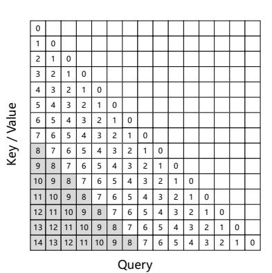
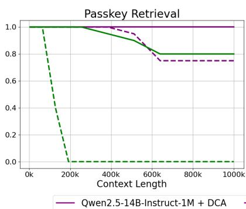
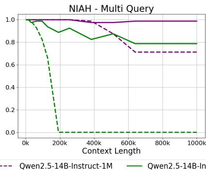
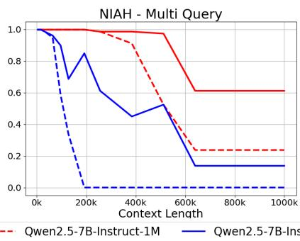
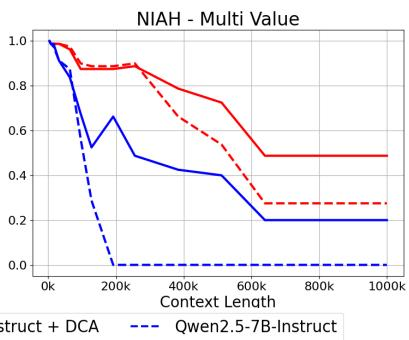
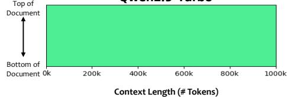
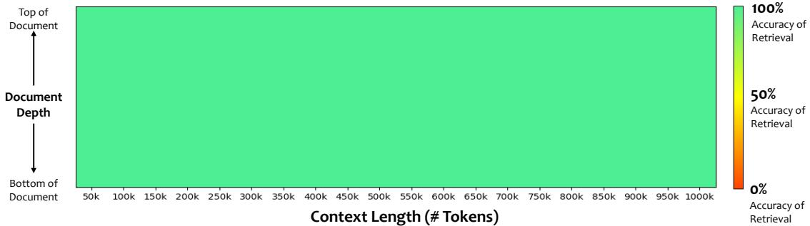
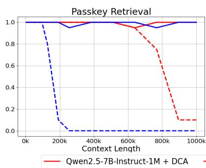
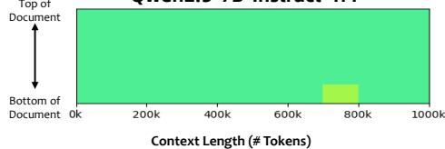

# Qwen2.5-1M Technical Report

## 一、论文概述

| 项目 | 内容 |
|------|------|
| **标题** | Qwen2.5-1M Technical Report |
| **作者** | An Yang, Bowen Yu, Chengyuan Li, Dayiheng Liu, Fei Huang, Haoyan Huang, Jiandong Jiang, Jianhong Tu, Jianwei Zhang, Jingren Zhou, Junyang Lin, Kai Dang, Kexin Yang, Le Yu, Mei Li, Minmin Sun, Qin Zhu, Rui Men, Tao He, Weijia Xu, Wenbiao Yin, Wenyuan Yu, Xiafei Qiu, Xingzhang Ren, Xinlong Yang, Yong Li, Zhiying Xu, Zipeng Zhang |
| **机构** | Qwen Team, Alibaba Group |
| **论文** | [arXiv:2501.15383](https://arxiv.org/abs/2501.15383) |
| **代码** | [GitHub](https://github.com/QwenLM/Qwen2.5) |
| **发布** | 2025年1月 |
| **许可** | Apache 2.0 |

## 二、核心思想

### 问题定义

大语言模型（LLM）的有限上下文长度限制了它们一次可以处理的文本量，使其局限于更简单的单一任务，无法处理需要大量信息处理或生成的复杂现实场景。

### 解决方案概述

本文介绍Qwen2.5-1M，一系列将上下文长度扩展到100万token的模型。相比之前的128K版本，Qwen2.5-1M系列通过长上下文预训练和后训练显著增强了长上下文能力。

**关键技术**：
1. **长数据合成**：合成强调长程依赖的数据
2. **渐进式预训练**：逐步扩展上下文长度以降低成本
3. **多阶段监督微调**：平衡短序列和长序列性能
4. **长度外推方法**：无需额外训练即可扩展模型上下文长度
5. **稀疏注意力机制**：减少推理成本

**模型系列**：
- Qwen2.5-7B-Instruct-1M（开源）
- Qwen2.5-14B-Instruct-1M（开源）
- Qwen2.5-Turbo（API访问，基于MoE）

## 三、技术架构

### 模型架构

| 模型 | 层数 | 注意力头 (Q/KV) | 上下文/生成长度 | 许可 |
|------|------|-----------------|----------------|------|
| 7B | 28 | 28 / 4 | 1M / 8K | Apache 2.0 |
| 14B | 48 | 40 / 8 | 1M / 8K | Apache 2.0 |

**架构特点**：
- Grouped Query Attention (GQA)：高效KV缓存利用
- SwiGLU激活函数
- Rotary Positional Embeddings (RoPE)
- QKV bias
- RMSNorm with pre-normalization

### 预训练策略

#### 渐进式上下文长度扩展

| 阶段 | 上下文长度 | RoPE基础频率 |
|------|-----------|-------------|
| 1 | 4,096 | 10,000 |
| 2 | 32,768 | 1,000,000 |
| 3 | 65,536 | 1,000,000 |
| 4 | 131,072 | 5,000,000 |
| 5 | 262,144 | 10,000,000 |

**数据策略**：每个阶段使用75%当前最大长度序列和25%较短序列

#### 合成数据任务

1. **Fill in the Middle (FIM)**：预测文本序列中缺失的片段
2. **基于关键词和位置的检索**：基于特定关键词或位置检索相关段落
3. **段落重排序**：将打乱的段落重新排序以恢复原始序列

### 后训练策略

#### 两阶段监督微调

1. **第一阶段**：仅在短指令数据上训练（最多32,768 tokens）
2. **第二阶段**：引入短序列和长序列的混合数据集（最多262,144 tokens）

#### 强化学习

使用离线强化学习（类似DPO）增强模型与人类偏好的对齐。仅使用短样本（最多8,192 tokens）训练，但能有效泛化到长上下文任务。

**效果**：

| 模型 | RL前 | RL后 |
|------|------|------|
| Qwen2.5-7B-Instruct-1M | 7.32 | 8.08 (+0.75) |
| Qwen2.5-14B-Instruct-1M | 8.56 | 8.76 (+0.20) |
| Qwen2.5-Turbo | 7.60 | 8.34 (+0.74) |

## 四、推理与部署优化

### 长度外推方法

#### Dual Chunk Attention (DCA)

**Figure 2**: Dual Chunk Attention (DCA)示意图。DCA将相对位置重新映射为较小的数字，从而避免训练中未遇到的大型相对位置。

**三种注意力模式**：
1. **Intra-Chunk Attention**：处理同一chunk内的token注意力
2. **Inter-Chunk Attention**：处理不同chunk间的token注意力
3. **Successive-Chunk Attention**：确保相邻chunk间短程相对位置的连续性

#### YaRN注意力缩放

$$
\text{softmax}\left(\frac{\mathbf{q}^{\mathrm{T}}\mathbf{k}}{t\sqrt{D}}\right), \text{其中} \sqrt{\frac{1}{t}} = 0.1\ln(s) + 1
$$

其中 $s$ 是推理长度与训练长度的比率，$D$ 是每个注意力头的维度。

### 稀疏注意力机制

**Figure 4**: MInference和我们集成chunked prefill版本的示意图。

**关键优化**：
- **连续相对位置**：在选择关键token时恢复连续相对位置
- **Chunked prefill集成**：为每个chunk选择关键token
- **稀疏配置优化**：提高精度

### 推理引擎优化

#### 内核优化

**Figure 7**: 稀疏注意力内核性能。

**关键结果**：
- A100 GPU上，1M token上下文，MInference实现13.7×加速
- BladeLLM在相同稀疏配置下实现27.8×加速
- 峰值FLOPs利用率高达90%

#### MoE内核优化

**Figure 8**: MoE内核性能。

**优化技术**：
- 针对内存受限场景的Tensor Core利用率优化
- 细粒度warp特化
- H20 GPU上峰值内存访问效率3.4 TB/s（比vLLM的FusedMoE内核提升55%）

#### 流水线并行优化

**Figure 9**: BladeLLM中的流水线并行优化。

**动态Chunked流水线并行 (DCPP)**：
- 根据注意力内核的计算复杂度动态调整chunk大小
- 确保每个chunk的执行时间尽可能相等
- 最小化流水线气泡

#### 调度优化

**Figure 10**: BladeLLM中的调度优化。

**Totally Asynchronous Generator (TAG)**：
- Scheduler、Model Runner和Decoder由三个独立进程处理
- 无需同步
- 显著提高GPU利用率

## 五、核心创新

| 创新点 | 说明 | 理论/实验依据 |
|--------|------|---------------|
| **渐进式预训练** | 逐步扩展上下文长度以降低成本 | RULER基准持续改进 |
| **合成数据增强** | FIM、检索、重排序等任务增强长程依赖 | 数据效率提升 |
| **两阶段SFT** | 平衡短序列和长序列性能 | 短任务性能不下降 |
| **Dual Chunk Attention** | 将相对位置重新映射为较小数字 | 4×长度外推 |
| **连续相对位置** | 在稀疏注意力中恢复连续相对位置 | 精度恢复 |
| **动态流水线并行** | 动态调整chunk大小最小化气泡 | 推理效率提升 |
| **异步推理架构** | TAG架构消除同步开销 | GPU利用率提升 |

## 六、实验结果

### Passkey Retrieval测试

**Figure 1**: Qwen2.5-1M模型在100万token文档上的Passkey Retrieval测试。

**关键结果**：
- Qwen2.5-14B-Instruct-1M和Qwen2.5-Turbo实现完美准确率
- Qwen2.5-7B-Instruct-1M仅有少量错误
- 支持高达1M token的上下文

### 长度外推效果

**Figure 3**: 长度外推对长上下文任务的影响。

**关键发现**：
- DCA显著增强了所有指令模型处理长上下文任务的能力
- 对于简单的Passkey Retrieval任务，DCA使模型在1M token序列上实现>80%准确率
- 在更长序列上训练（256k tokens）显著提高了模型外推到更长上下文的能力

### RULER基准评估

| 训练长度 | Avg. | 4K | 8K | 16K | 32K | 64K | 128K |
|----------|------|----|----|----|-----|-----|------|
| 32,768 Tokens | 82.3 | 96.8 | 94.7 | 95.9 | 92.2 | 76.4 | 37.6 |
| 65,536 Tokens | 86.8 | 96.5 | 95.5 | 93.6 | 92.5 | 86.7 | 56.0 |
| 131,072 Tokens | 92.5 | 96.5 | 95.9 | 93.0 | 92.6 | 93.0 | 83.8 |
| 262,144 Tokens | 92.7 | 95.6 | 93.8 | 93.1 | 94.1 | 91.9 | 87.6 |

**结论**：渐进式训练持续提高模型对相应序列长度的理解能力

### 推理性能

**Figure 11**: Qwen2.5-7B-Instruct-1M、Qwen2.5-14B-Instruct-1M、Qwen2.5-Turbo在H20和A100 GPU上的TTFT。

**关键结果**：
- 1M上下文场景下实现3.2×到6.7×加速
- H20 GPU上，Qwen2.5-14B-Instruct-1M推理时间从12.2分钟降至109秒
- Qwen2.5-Turbo处理时间从4.9分钟降至68秒

## 七、相关工作

### 长上下文模型

| 方法 | 关键特性 | 本文对比 |
|------|----------|----------|
| **Gemini** | 支持1M token上下文 | 性能对比 |
| **GLM-9B-Chat-1M** | 1M上下文长度 | 性能对比 |
| **Llama-3-1M** | 1M上下文长度 | 性能对比 |

### 长度外推方法

| 方法 | 关键特性 | 本文对比 |
|------|----------|----------|
| **YaRN** | 注意力缩放方法 | 集成使用 |
| **DCA** | 双chunk注意力 | 核心方法 |
| **位置插值** | 位置编码插值 | 替代方案 |

### 稀疏注意力

| 方法 | 关键特性 | 本文对比 |
|------|----------|----------|
| **MInference** | Vertical-Slash模式 | 改进基础 |
| **FlashAttention** | 高效注意力实现 | 速度基准 |

## 八、总结

### 核心贡献

1. **Qwen2.5-1M系列**：支持100万token上下文的开源模型
2. **高效长上下文训练**：渐进式预训练、合成数据、两阶段SFT
3. **长度外推方法**：DCA + YaRN注意力缩放，支持4×长度外推
4. **稀疏注意力优化**：连续相对位置、chunked prefill集成
5. **推理引擎优化**：内核优化、动态流水线并行、异步调度

### 技术影响

- **长上下文应用**：使开源模型能够处理100万token的上下文
- **推理效率**：显著降低长上下文推理成本
- **开源生态**：开源模型和推理框架，促进长上下文应用开发
- **工程实践**：提供了完整的长上下文训练和部署方案

### 局限性

- **模型规模**：7B和14B模型可能限制了某些复杂任务的能力
- **生成长度**：生成长度限制为8K tokens
- **硬件依赖**：推理优化主要针对NVIDIA GPU
- **评估范围**：主要在英语和中文任务上评估

## 九、参考资源

- **论文**: https://arxiv.org/abs/2501.15383
- **代码**: https://github.com/QwenLM/Qwen2.5
- **HuggingFace**: https://huggingface.co/Qwen
- **vLLM集成**: https://github.com/vllm-project/vllm
- **DCA**: https://arxiv.org/abs/2406.02552
- **YaRN**: https://arxiv.org/abs/2309.00071
- **MInference**: https://arxiv.org/abs/2407.02490
