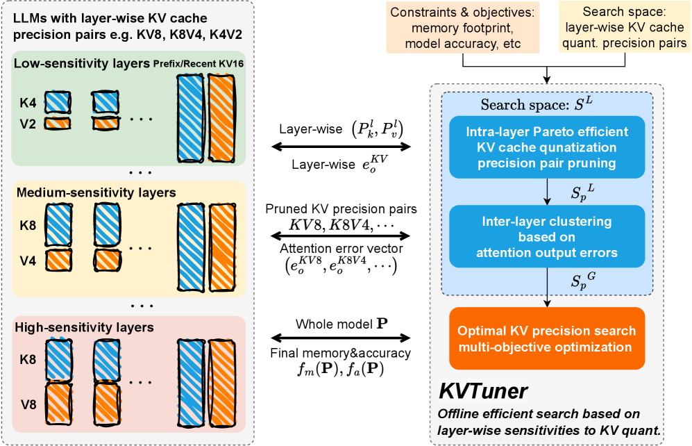
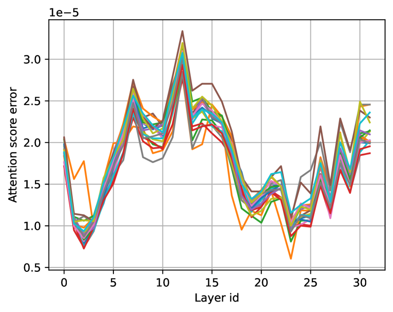
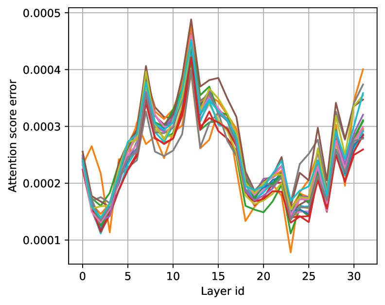
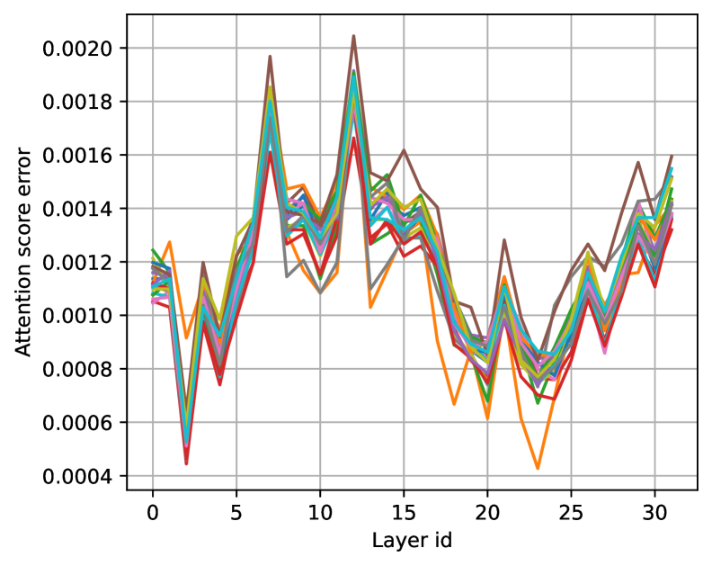
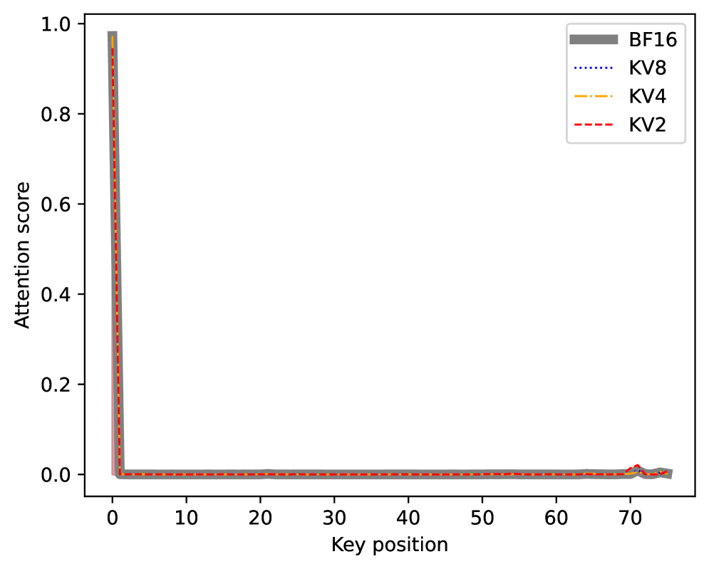
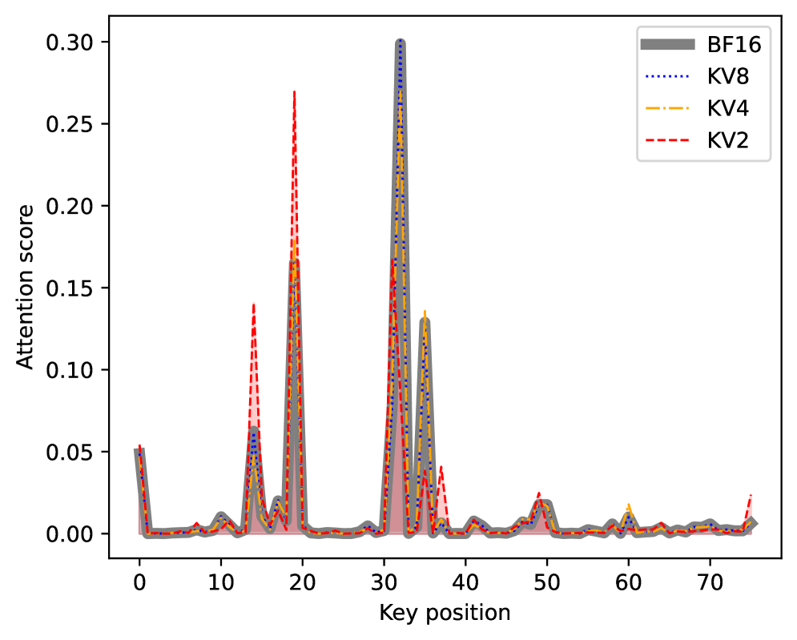

# KVTuner: 敏感度感知的层级混合精度 KV 缓存量化

## 一、论文概述

| 项目 | 内容 |
|------|------|
| **标题** | KVTuner: Sensitivity-Aware Layer-Wise Mixed-Precision KV Cache Quantization for Efficient and Nearly Lossless LLM Inference |
| **作者** | Xing Li, Zeyu Xing, Yiming Li, Linping Qu, Hui-Ling Zhen, Yiwu Yao, Wulong Liu, Sinno Jialin Pan, Mingxuan Yuan |
| **机构** | Huawei Noah's Ark Lab, NUS |
| **论文** | [arXiv:2502.04420](https://arxiv.org/abs/2502.04420) |
| **代码** | [GitHub: cmd2001/KVTuner](https://github.com/cmd2001/KVTuner) |
| **发布** | 2025年2月 |
| **许可** | ICML |

## 二、核心思想

### 问题定义

KV 缓存量化面临三个未解决问题：

1. **忽略层级敏感度**：不同层对量化的敏感度不同
2. **在线决策开销高**：细粒度在线决策引入额外开销
3. **灵活性低**：难以适应不同 LLM 和约束

**关键发现**：
- Key 缓存通常比 Value 缓存更重要
- 层级敏感度是模型固有属性，与输入无关
- 注意力模式与量化误差强相关

### 解决方案概述

KVTuner 提出自适应层级混合精度 KV 缓存量化框架：

1. **离线搜索**：使用多目标优化搜索最优精度对
2. **两阶段剪枝**：层内 KV 精度对剪枝 + 层间聚类
3. **在线推理**：直接使用离线搜索的配置，无额外开销

## 三、技术架构

### 整体框架图

KVTuner 由三个核心组件构成：

| 组件 | 职责 | 关键技术 |
|------|------|----------|
| **敏感度分析** | 分析层级敏感度 | 注意力模式分析 |
| **离线搜索** | 搜索最优精度对 | 多目标优化 |
| **在线推理** | 使用搜索配置 | 无额外开销 |

### 核心公式

#### KV 缓存量化

**量化函数**：

$$Q(\boldsymbol{X}) = \text{round}\left(\frac{\boldsymbol{X} - \boldsymbol{z}}{\boldsymbol{s}}\right)$$

$$\hat{\boldsymbol{X}} = Q(\boldsymbol{X}) \cdot \boldsymbol{s} + \boldsymbol{z}$$

其中：
- $\boldsymbol{z} = \min(\boldsymbol{X})$ 为偏移
- $\boldsymbol{s} = \frac{\max(\boldsymbol{X}) - \min(\boldsymbol{X})}{2^B - 1}$ 为缩放因子

#### 误差度量

**Key 缓存相对误差**：
$$e_k^l = \text{mean}\left(\frac{|\boldsymbol{K}^l - \hat{\boldsymbol{K}}^l|}{|\boldsymbol{K}^l|}\right)$$

**Value 缓存相对误差**：
$$e_v^l = \text{mean}\left(\frac{|\boldsymbol{V}^l - \hat{\boldsymbol{V}}^l|}{|\boldsymbol{V}^l|}\right)$$

**注意力分数绝对误差**：
$$e_a^l = \text{mean}(|\boldsymbol{a}^l - \hat{\boldsymbol{a}}^l|)$$

**注意力输出相对误差**：
$$e_o^l = \text{mean}\left(\frac{|\boldsymbol{o}^l - \hat{\boldsymbol{o}}^l|}{|\boldsymbol{o}^l|}\right)$$

#### 误差累积

**二维误差累积**：

$$e_i^l = f_e(\boldsymbol{e}_i^{1:l-1}, \boldsymbol{e}_{i-1}^{1:L}, \cdots, \boldsymbol{e}_1^{1:L})$$

误差在模型层和 token 序列两个维度累积。

#### 为什么 Key 缓存更重要？

**引理 1**：只有稀疏和集中的注意力模式对低精度 KV 缓存量化具有一致的鲁棒性。

**注意力分数误差分析**：
- K8 → K4：注意力分数误差增加 13.9×
- K4 → K2：注意力分数误差增加 4.6×

**结论**：Key 缓存量化误差对注意力分布影响更大。

#### 层级敏感度

**关键发现**：
- 层级敏感度是模型固有属性
- 与输入 prompt 无关
- 敏感层会进一步放大误差

### 模型组件

| 组件 | 说明 | 关键参数 |
|------|------|----------|
| **敏感度分析器** | 分析层级敏感度 | 注意力模式分析 |
| **离线搜索器** | 搜索最优精度对 | 多目标优化 |
| **层内剪枝器** | 剪枝不必要精度对 | 减少搜索空间 |
| **层间聚类器** | 聚类相似层 | 减少搜索空间 |
| **在线推理器** | 使用搜索配置 | 无额外开销 |

### 训练流程

#### 离线搜索

**搜索空间**：
- 精度对：K8V8, K8V4, K8V2, K4V8, K4V4, K4V2, K2V8, K2V4, K2V2
- 每层独立选择精度对

**多目标优化**：
- 目标 1：最小化内存使用
- 目标 2：最大化模型精度

**两阶段剪枝**：

**阶段 1：层内 KV 精度对剪枝**
- 移除不必要的精度对
- 减少搜索空间

**阶段 2：层间聚类**
- 聚类相似层
- 减少搜索空间

#### 在线推理

**配置加载**：
- 直接加载离线搜索的配置
- 无额外开销

**硬件友好**：
- 使用标准量化内核
- 与 FlashAttention 和 vLLM 兼容

## 四、核心创新

| 创新点 | 说明 | 理论/实验依据 |
|--------|------|---------------|
| **层级敏感度分析** | 发现层级敏感度是模型固有属性 | 注意力模式分析 |
| **Key 缓存更重要** | 理论分析 Key 缓存的重要性 | 误差累积分析 |
| **离线搜索** | 使用多目标优化搜索最优精度对 | Pareto 最优 |
| **两阶段剪枝** | 层内剪枝 + 层间聚类 | 减少搜索空间 |
| **无在线开销** | 直接使用离线配置 | 硬件友好 |

## 五、实验结果

### 实验设置

| 配置 | 说明 |
|------|------|
| **模型** | Llama-3.1-8B, Qwen2.5-7B, Mistral-7B 等 |
| **基准** | GSM8K, HumanEval, LongBench |
| **精度** | 2-bit, 4-bit, 8-bit |
| **量化模式** | per-token-asym, per-channel-asym |

### 困惑度评估

| 模型 | KV8 | K8V4 | K4V2 | K2V4 | KV2 |
|------|-----|------|------|------|-----|
| Llama3-8B | 9.95 | 9.94 | 10.11 | 31.48 | 37.29 |
| Llama2-7B | 11.60 | 11.60 | 11.67 | 13.92 | 14.92 |
| Qwen2.5-7B | 9.56 | 9.39 | 149.15 | 1831.33 | 4016.10 |

**关键发现**：
- K8V4 与 KV8 性能相当
- K4V2 对大多数模型可接受
- Qwen2.5-7B 对 Key 缓存量化更敏感

### 数学推理任务

**Llama-3.1-8B-Instruct**：
- 可实现近无损 3.25-bit 混合精度
- 相比 KIVI-KV8，吞吐量提升 21.25%

**Qwen2.5-7B-Instruct**：
- 需要 4.0-bit 精度
- 对 Key 缓存量化更敏感

### 注意力模式分析

**关键发现**：
- 流式头对量化更鲁棒
- 检索头对量化更敏感
- 非稀疏注意力模式导致更大误差

### 与现有方法对比

| 特性 | KVTuner | KIVI | QAQ | MiKV | ZipCache |
|------|---------|------|-----|------|----------|
| **精度** | 混合 | 固定 | 动态 | 动态 | 动态 |
| **粒度** | 层级 | 层内 | 细粒度 | 细粒度 | 细粒度 |
| **在线开销** | 无 | 无 | 高 | 高 | 高 |
| **硬件友好** | ✓ | ✓ | ✗ | ✗ | ✗ |
| **灵活性** | 高 | 低 | 高 | 高 | 高 |
| **平均精度** | 3.25-4 bit | 4 bit | - | - | - |

## 六、相关工作

### KV 缓存压缩方法

| 方法 | 关键特性 | 局限性 |
|------|----------|--------|
| **KIVI** | 固定精度，静态重要 token | 忽略动态性 |
| **IntactKV** | 保留初始 token | 假设不一定成立 |
| **KVQuant** | 细粒度量化 | 在线开销高 |
| **QAQ** | 动态精度调整 | 硬件不友好 |
| **MiKV** | 动态重要 token | 在线开销高 |
| **ZipCache** | 混合压缩 | 部署复杂 |

### KVTuner 优势

KVTuner 是唯一同时实现：
1. **层级混合精度**：每层独立选择精度对
2. **无在线开销**：离线搜索，直接使用
3. **硬件友好**：标准量化内核
4. **灵活性**：适应不同模型和约束
5. **近无损**：3.25-4 bit 精度

## 七、总结

### 核心贡献

1. **层级敏感度分析**：发现层级敏感度是模型固有属性
2. **Key 缓存重要性**：理论分析 Key 缓存更重要
3. **KVTuner 框架**：自适应层级混合精度量化
4. **两阶段剪枝**：减少搜索空间
5. **近无损 3.25-bit**：在数学推理任务上验证

### 技术影响

- **推理效率**：吞吐量提升 21.25%
- **内存效率**：3.25-4 bit 精度
- **质量保持**：近无损量化
- **部署友好**：无在线开销

### 局限性

- **离线搜索成本**：需要离线搜索最优配置
- **模型特定**：不同模型需要不同配置
- **仅评估 7B-14B 模型**：更大模型的适用性需验证
- **数学推理任务**：其他任务的适用性需验证

## 八、参考资源

- **论文**: https://arxiv.org/abs/2502.04420
- **代码**: https://github.com/cmd2001/KVTuner
- **KIVI**: 相关工作
- **FlashAttention**: https://arxiv.org/abs/2205.14135
- **vLLM**: https://github.com/vllm-project/vllm
- **Llama-3.1**: https://arxiv.org/abs/2407.21783
