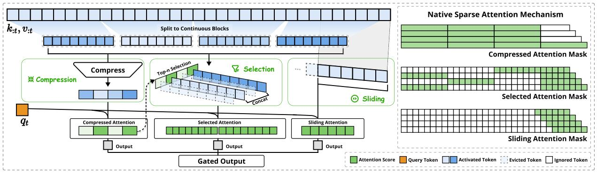
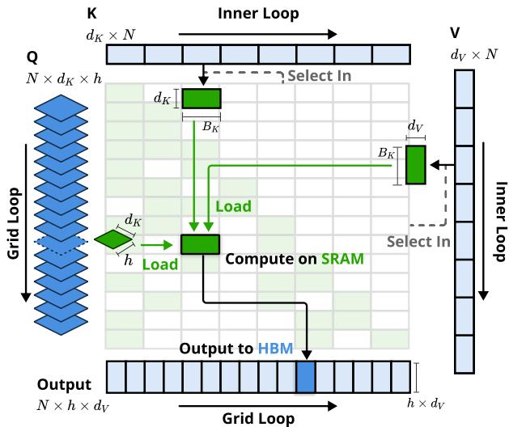
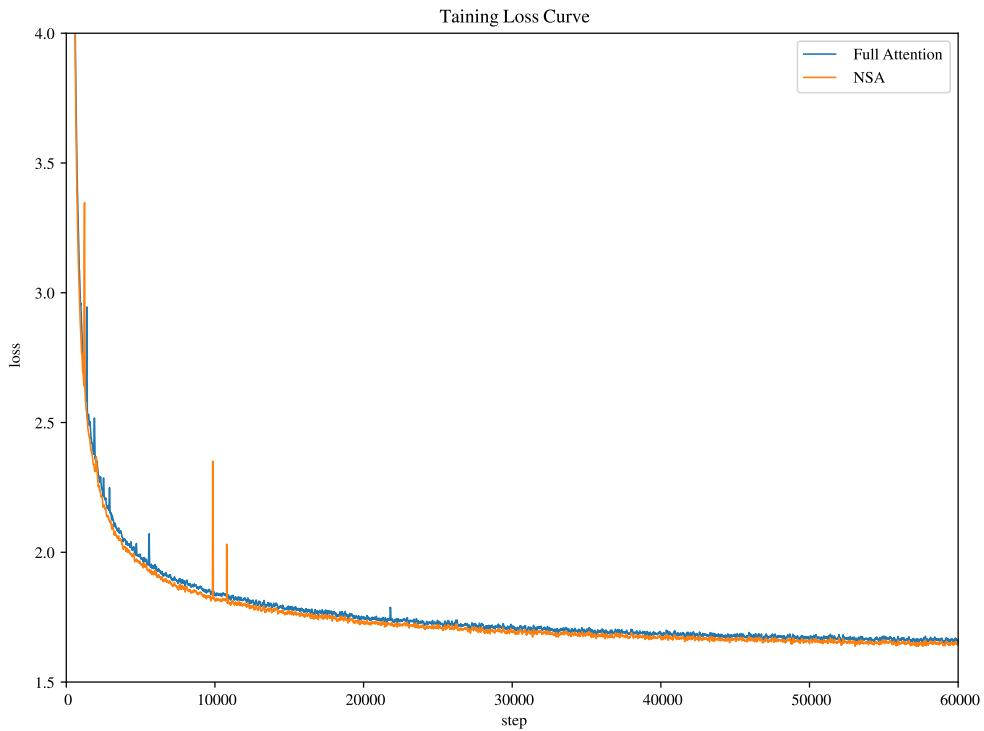
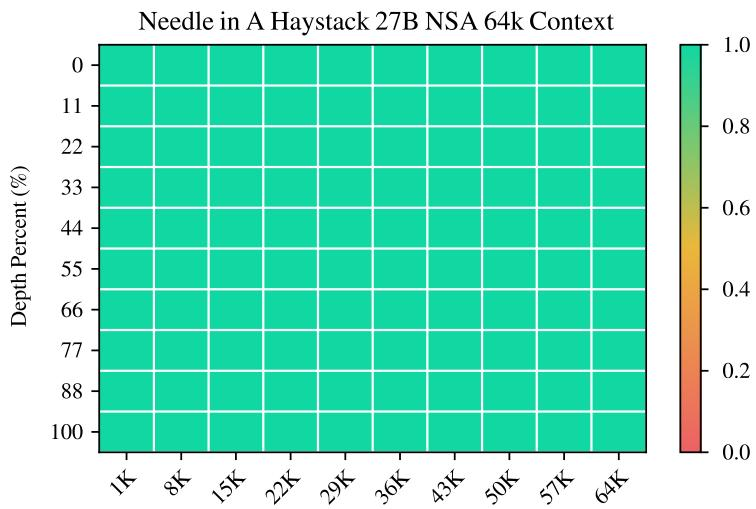
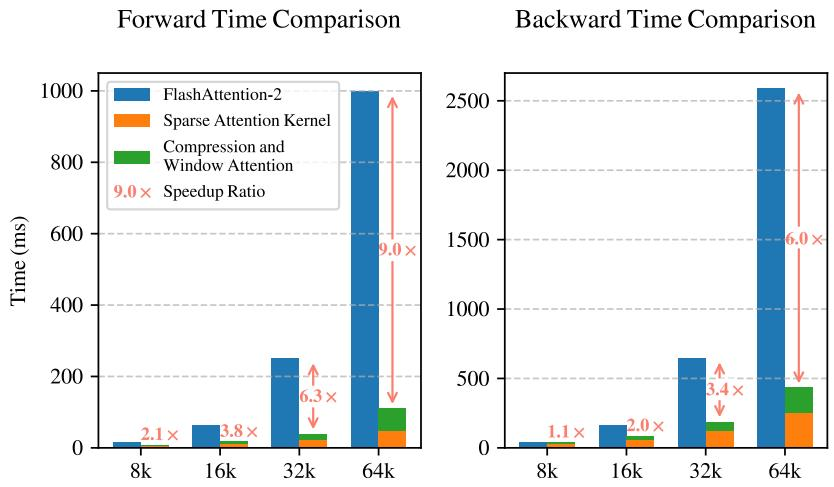
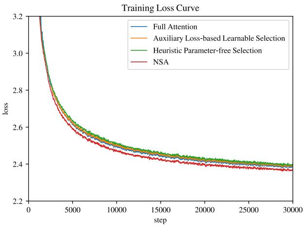
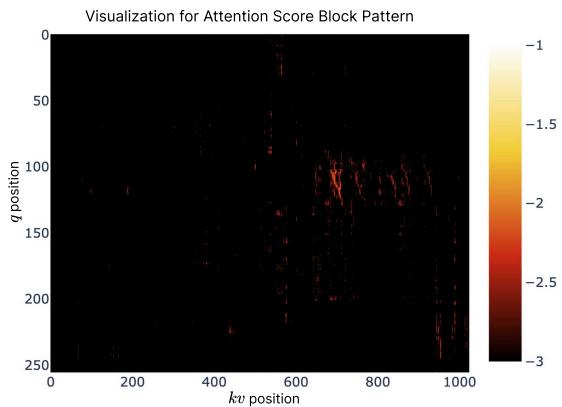

# Native Sparse Attention: Hardware-Aligned and Natively Trainable Sparse Attention

## 一、论文概述

| 项目 | 内容 |
|------|------|
| **标题** | Native Sparse Attention: Hardware-Aligned and Natively Trainable Sparse Attention |
| **作者** | Jingyang Yuan, Huazuo Gao, Damai Dai, Junyu Luo, Liang Zhao, Zhengyan Zhang, Zhenda Xie, Y. X. Wei, Lean Wang, Zhiping Xiao, Yuqing Wang, Chong Ruan, Ming Zhang, Wenfeng Liang, Wangding Zeng |
| **机构** | DeepSeek-AI, Peking University, University of Washington |
| **论文** | [arXiv:2502.11089](https://arxiv.org/abs/2502.11089) |
| **代码** | [GitHub](https://github.com/DeepSeek-AI/NSA) |
| **发布** | 2025年2月 |
| **许可** | 开源 |

## 二、核心思想

### 问题定义

长上下文建模对下一代语言模型至关重要，但标准注意力机制的高计算成本带来了显著挑战。现有稀疏注意力方法存在以下问题：

1. **训练阶段稀疏性缺失**：大多数方法仅在推理阶段使用稀疏性，无法减少训练计算
2. **硬件不友好**：现有稀疏模式与现代GPU架构不匹配，导致效率低下
3. **辅助损失依赖**：基于神经网络的重要性分数计算依赖辅助损失，增加开销且可能降低性能

### 解决方案概述

本文提出**NSA**（Natively trainable Sparse Attention），一种硬件对齐且可原生训练的稀疏注意力机制：

**核心创新**：
1. **动态层次化稀疏策略**：结合粗粒度token压缩与细粒度token选择
2. **硬件对齐设计**：针对现代GPU的Tensor Core和内存访问优化
3. **端到端可训练**：支持从头开始训练，减少预训练计算而不牺牲性能

**关键结果**：
- 在通用基准、长上下文任务和推理评估上保持或超越全注意力模型
- 在64k长度序列上实现解码11.6×、前向9.0×、反向6.0×加速

## 三、技术架构

### 整体框架图

**Figure 2**: NSA架构概览。左：框架通过三个并行注意力分支处理输入序列：压缩注意力（粗粒度模式）、选择注意力（重要token块）和滑动注意力（局部上下文）。右：每个分支产生的不同注意力模式可视化。绿色区域表示需要计算注意力分数的区域，白色区域表示可以跳过的区域。

### 模型配置

| 参数 | 值 | 说明 |
|------|-----|------|
| 总参数量 | 27B | 包含MoE结构 |
| 激活参数量 | 3B | 稀疏激活 |
| 层数 | 30 | Transformer层数 |
| 隐藏维度 | 2560 | 模型维度 |
| GQA组数 | 4 | 分组查询注意力 |
| 注意力头数 | 64 | 总头数 |
| 查询/键维度 | 192 | $d_q = d_k = 192$ |
| 值维度 | 128 | $d_v = 128$ |
| 路由专家数 | 72 | MoE路由专家 |
| 共享专家数 | 2 | MoE共享专家 |
| Top-K专家 | 6 | 每token激活专家数 |

### 三种注意力路径

NSA通过三种并行注意力分支处理键和值：

#### 1. 压缩注意力（Compression Attention）

**目的**：捕获全局上下文的粗粒度表示

**公式**：
$$\tilde{K}_t^{\mathrm{cmp}} = f_K^{\mathrm{cmp}}(\mathbf{k}_{:t}) = \{\varphi(\mathbf{k}_{id+1:id+l}) \mid 0 \leqslant i \leqslant \lfloor \frac{t-l}{d} \rfloor\}$$

其中：
- $l$ 是块长度（压缩块大小 = 32）
- $d$ 是滑动步长（滑动步长 = 16）
- $\varphi$ 是可学习的MLP，带块内位置编码

**特点**：$l > d$ 以减少信息碎片化

#### 2. 选择注意力（Selection Attention）

**目的**：选择性保留最重要的细粒度token

**块级选择策略**：
1. **硬件效率考虑**：现代GPU对连续块访问的吞吐量显著高于随机索引读取
2. **注意力分布模式**：注意力分数呈现空间连续性，相邻键通常具有相似的重要性

**重要性分数计算**：

复用压缩注意力的中间结果：
$$\mathbf{p}_t^{\mathrm{cmp}} = \operatorname{Softmax}(\mathbf{q}_t^T \tilde{K}_t^{\mathrm{cmp}})$$

当压缩块和选择块大小相同时（$l' = l = d$），可直接获得选择块重要性分数。当不同时，通过空间关系推导：
$$\mathbf{p}_t^{\mathrm{slc}}[j] = \sum_{m=0}^{\frac{l'}{d}-1} \sum_{n=0}^{\frac{l}{d}-1} \mathbf{p}_t^{\mathrm{cmp}}[\frac{l'}{d}j - m - n]$$

**GQA组内共享**：为确保GQA组内头的一致性选择：
$$\mathbf{p}_t^{\mathrm{slc}'} = \sum_{h=1}^{H} \mathbf{p}_t^{\mathrm{slc},(h)}$$

**Top-N块选择**：
$$\mathcal{I}_t = \{i \mid \operatorname{rank}(\mathbf{p}_t^{\mathrm{slc}'}[i]) \leqslant n\}$$

**配置**：选择块大小 $l' = 64$，选择块数量 $n = 16$（包括1个初始块和2个局部块）

#### 3. 滑动窗口注意力（Sliding Window Attention）

**目的**：显式处理局部上下文，防止局部模式主导学习过程

**设计**：
- 维护最近 $w = 512$ 个token的窗口
- 为三个分支提供独立的键和值，防止跨分支的捷径学习
- 通过学习的门控机制聚合三个分支的输出

### 门控机制

$$o_t = g_t^c \cdot o_t^c + g_t^s \cdot o_t^s + g_t^w \cdot o_t^w$$

其中 $g_t^c, g_t^s, g_t^w \in [0, 1]$ 是通过MLP和sigmoid激活从输入特征派生的门控分数。

### 内核设计

**Figure 3**: NSA的内核设计。内核按GQA组加载查询（Grid Loop），获取对应的稀疏KV块（Inner Loop），并在SRAM上执行注意力计算。绿色块表示SRAM上的数据，蓝色表示HBM上的数据。

**关键优化**：

1. **Group-Centric数据加载**：每个内循环加载位置 $t$ 处GQA组内所有头的查询 $Q \in \mathbb{R}^{[h, d_k]}$ 及其共享的稀疏键/值块索引 $\mathcal{I}_t$

2. **共享KV获取**：在内循环中，顺序加载索引 $\mathcal{I}_t$ 指示的连续键/值块到SRAM，最小化内存加载

3. **Grid上的外循环**：由于内循环长度（与选择块数量 $n$ 成正比）对不同查询块几乎相同，将查询/输出循环放在Triton的grid调度器中

**算术强度优化**：
- 通过组内共享消除冗余KV传输
- 在GPU流式多处理器间平衡计算工作负载

## 四、核心创新

| 创新点 | 说明 | 理论/实验依据 |
|--------|------|---------------|
| **动态层次化稀疏策略** | 结合粗粒度压缩与细粒度选择 | 保持全局上下文感知和局部精度 |
| **硬件对齐设计** | 针对Tensor Core和内存访问优化 | 算术强度平衡，最大化效率 |
| **端到端可训练** | 支持从头开始训练 | 稳定收敛，性能超越全注意力 |
| **三路径注意力架构** | 压缩、选择、滑动窗口并行 | 全面的上下文建模 |
| **复用压缩注意力分数** | 利用压缩注意力的中间结果计算选择重要性 | 无额外计算开销 |
| **GQA组内共享选择** | 确保组内头的一致性块选择 | 最小化解码时KV缓存加载 |

## 五、实验结果

### 预训练配置

**训练设置**：
- 预训练数据：270B tokens，8k长度文本
- 长上下文适应：YaRN方法，32k长度文本
- 两个模型都训练到完全收敛

**NSA配置**：
- 压缩块大小 $l = 32$
- 滑动步长 $d = 16$
- 选择块大小 $l' = 64$
- 选择块数量 $n = 16$（包括1个初始块和2个局部块）
- 滑动窗口大小 $w = 512$

### 预训练损失

**Figure 4**: 全注意力和NSA在27B参数模型上的预训练损失对比。两个模型都表现出稳定的收敛，NSA实现了更低的损失值。

### 通用基准评估

| 模型 | MMLU | MMLU-PRO | CMMLU | BBH | GSM8K | MATH | DROP | MBPP | HumanEval | 平均 |
|------|------|----------|-------|-----|-------|------|------|------|-----------|------|
| Full Attn | 0.567 | 0.279 | 0.576 | 0.497 | 0.486 | 0.263 | 0.503 | 0.482 | 0.335 | 0.443 |
| **NSA** | 0.565 | **0.286** | **0.587** | **0.521** | **0.520** | 0.264 | **0.545** | 0.466 | **0.348** | **0.456** |

**关键结果**：
- NSA在9个指标中的7个上超越全注意力基线
- 推理相关基准显著提升：DROP +0.042，GSM8K +0.034
- 稀疏注意力预训练迫使模型关注最重要的信息，可能通过过滤噪声增强性能

### 长上下文评估

**Figure 5**: 64k上下文长度下Needle-in-a-Haystack检索准确率。NSA通过其层次化稀疏注意力设计实现了完美的准确率。

**LongBench结果**：

| 模型 | SQA平均 | MQA平均 | Synthetic平均 | Code | 总平均 |
|------|---------|---------|---------------|------|--------|
| H2O | 0.388 | 0.163 | 0.563 | 0.092 | 0.303 |
| InfLLM | 0.449 | 0.273 | 0.626 | 0.143 | 0.383 |
| Quest | 0.474 | 0.273 | 0.635 | 0.135 | 0.392 |
| Exact-Top | 0.501 | 0.304 | 0.679 | 0.156 | 0.423 |
| Full Attn | 0.515 | 0.318 | 0.695 | 0.163 | 0.437 |
| **NSA** | 0.520 | **0.360** | **0.728** | **0.232** | **0.469** |

**关键结果**：
- NSA总平均分0.469，超越全注意力+0.032，超越Exact-Top +0.046
- 多跳QA任务显著提升：HPQ +0.087，2Wiki +0.051
- 代码理解提升：LCC +0.069
- 段落检索提升：PassR-en +0.075

### 链式思维推理评估

从DeepSeek-R1进行知识蒸馏，使用10B tokens的32k长度数学推理轨迹进行SFT。

| 模型 | 8k生成限制 | 16k生成限制 |
|------|-----------|-----------|
| Full Attention-R | 0.046 | 0.092 |
| **NSA-R** | **0.121** | **0.146** |

**关键结果**：
- NSA-R在8k上下文设置下比Full Attention-R高+0.075
- 在16k上下文下优势持续：+0.054
- 预训练的稀疏注意力模式能够有效捕获复杂数学推导所需的长程逻辑依赖

### 内核性能

**Figure 6**: 基于Triton的NSA内核与基于Triton的FlashAttention-2内核对比。

**训练速度**：
- 64k上下文长度：前向传播加速9.0×，反向传播加速6.0×
- 速度优势随着序列长度增加而更加显著

**解码速度**：

| 上下文长度 | 8192 | 16384 | 32768 | 65536 |
|-----------|------|-------|-------|-------|
| Full Attention（等效token数） | 8192 | 16384 | 32768 | 65536 |
| NSA（等效token数） | 2048 | 2560 | 3584 | 5632 |
| 预期加速 | 4× | 6.4× | 9.1× | **11.6×** |

**关键结果**：
- 64k上下文长度解码加速11.6×
- 内存访问效率优势随序列长度增加而放大

### Token选择策略对比

**Figure 7**: 在3B参数模型上比较全注意力和不同token选择策略的训练损失。

**对比方法**：
1. **辅助损失选择方法**：使用额外查询和代表性键估计块重要性分数，用KL散度监督（类似SeerAttention）
2. **启发式无参数选择方法**：使用查询和键块的坐标最小最大值的乘积（类似Quest）
3. **冷启动训练**：前1000步使用全注意力，然后转换为启发式块选择

**结果**：两种替代方法都表现出较差的损失，验证了NSA设计的有效性。

### 注意力模式可视化

**Figure 8**: 全注意力transformer的注意力图可视化。浅色区域表示更高的注意力值。注意力分数呈现块状聚类分布。

**关键发现**：
- 注意力分数倾向于呈现块状聚类特征
- 附近的键通常显示相似的注意力分数
- 这种观察启发了NSA的设计，建议基于空间连续性选择键块是有前途的方法

## 六、相关工作

### 稀疏注意力方法分类

| 类别 | 代表方法 | 特点 | NSA对比 |
|------|----------|------|---------|
| **固定稀疏模式** | SlidingWindow, StreamingLLM, Longformer | 预定义模式 | NSA学习模式 |
| **动态token剪枝** | H2O, SnapKV, BUZZ | 推理时KV缓存剪枝 | NSA支持训练 |
| **查询感知选择** | Quest, InfLLM, ClusterKV, MInference | 基于查询的选择 | NSA硬件对齐 |

### 关键区别

**与Quest/InfLLM的区别**：
- Quest使用启发式无参数选择，召回率低
- InfLLM使用代表性键估计，需要额外计算
- NSA复用压缩注意力的中间结果，无额外开销

**与SeerAttention的区别**：
- SeerAttention使用辅助损失估计块重要性
- NSA直接从压缩注意力导出重要性分数
- NSA避免了辅助损失的额外开销和性能损失

**与ClusterKV的区别**：
- ClusterKV基于聚类，引入动态聚类开销
- 聚类导致MoE系统中的负载不均衡
- NSA使用空间连续的块选择，更高效

## 七、总结

### 核心贡献

1. **NSA架构**：提出可原生训练的稀疏注意力机制，结合层次化token建模
2. **硬件对齐优化**：针对Tensor Core和内存访问优化，实现算术强度平衡
3. **端到端训练能力**：支持从头开始训练，稳定收敛且性能优越
4. **显著效率提升**：在64k长度序列上实现解码11.6×、前向9.0×、反向6.0×加速
5. **注意力模式洞察**：发现并利用注意力分数的块状聚类分布特征

### 技术影响

- **长上下文训练**：为长上下文模型训练提供了高效的方法
- **稀疏注意力设计**：为设计硬件友好的稀疏注意力提供了新思路
- **注意力机制理解**：揭示了注意力分布的块状聚类特征
- **系统-算法协同设计**：展示了硬件-算法协同优化的重要性

### 局限性

- **模型规模**：主要在27B参数（3B激活）的MoE模型上验证
- **硬件依赖**：主要针对NVIDIA GPU的Tensor Core优化
- **配置敏感性**：多个超参数（块大小、选择数量等）需要仔细调优
- **任务范围**：主要在语言模型任务上评估，其他模态的效果需验证

## 八、参考资源

- **论文**: https://arxiv.org/abs/2502.11089
- **代码**: https://github.com/DeepSeek-AI/NSA
- **FlashAttention-2**: https://arxiv.org/abs/2307.08691
- **YaRN**: https://arxiv.org/abs/2309.00071
- **Quest**: https://arxiv.org/abs/2406.10774
- **DeepSeek-R1**: https://arxiv.org/abs/2501.12948
