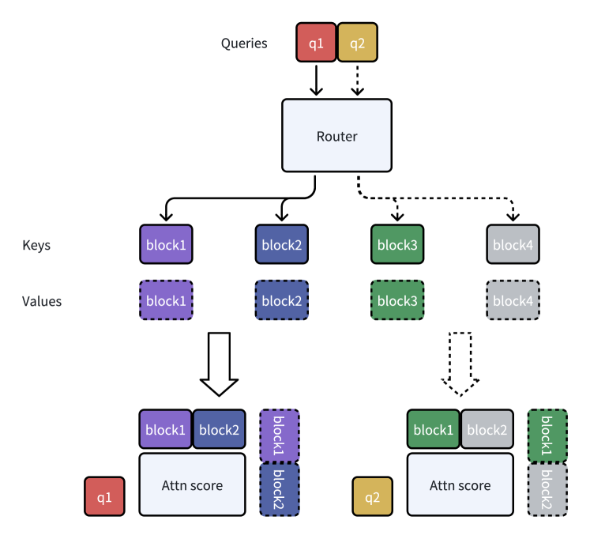
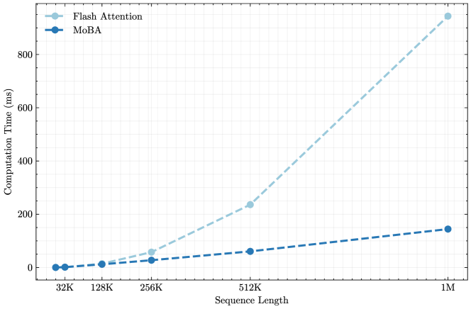
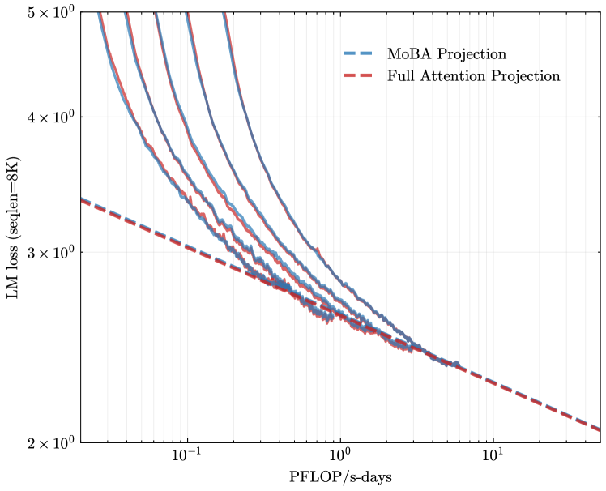
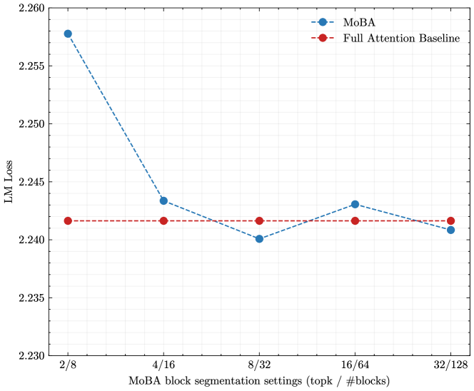
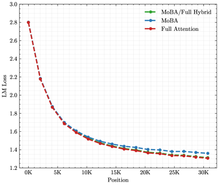
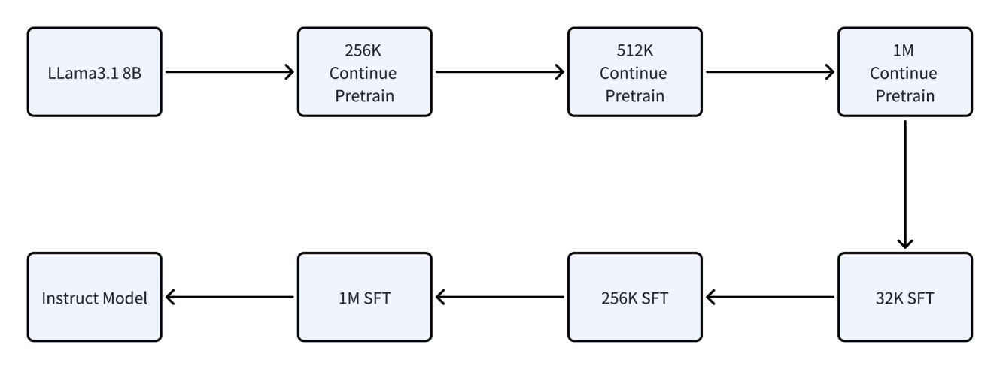
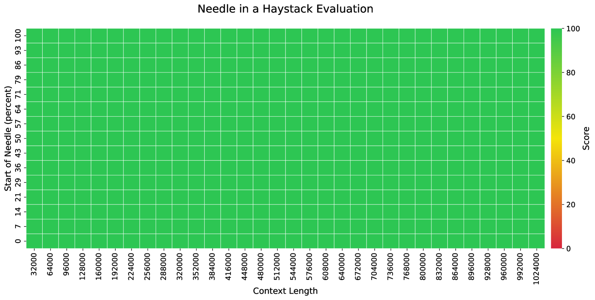

# MoBA: Mixture of Block Attention for Long-Context LLMs

## 一、论文概述

| 项目 | 内容 |
|------|------|
| **标题** | MoBA: Mixture of Block Attention for Long-Context LLMs |
| **作者** | Enzhe Lu, Zhejun Jiang, Jingyuan Liu, Yulun Du, Tao Jiang, Chao Hong, Shaowei Liu, Weiran He, Enming Yuan, Yuzhi Wang, Zhiqi Huang, Huan Yuan, Suting Xu, Xinran Xu, Guokun Lai, Yanru Chen, Huabin Zheng, Junjie Yan, Jianlin Su, Yuxin Wu, Neo Y. Zhang, Zhilin Yang, Xinyu Zhou, Mingxing Zhang, Jiezhong Qiu |
| **机构** | Moonshot AI, Tsinghua University, Zhejiang Lab/Zhejiang University |
| **论文** | [arXiv:2502.13189](https://arxiv.org/abs/2502.13189) |
| **代码** | [GitHub](https://github.com/MoonshotAI/MoBA) |
| **发布** | 2025年2月 |
| **许可** | - |

## 二、核心思想

### 问题定义

扩展有效上下文长度对于推动大语言模型（LLM）向通用人工智能（AGI）发展至关重要。然而，传统注意力机制固有的计算复杂度二次增长带来了巨大的开销。现有方法要么施加强偏置结构（如sink或窗口注意力），要么将注意力机制彻底修改为线性近似。

### 解决方案概述

本文提出遵循"少结构"原则的解决方案，允许模型自主决定关注何处，而不是引入预定义偏置。我们引入MoBA（Mixture of Block Attention），一种将Mixture of Experts（MoE）原理应用于注意力机制的创新方法。

**核心特点**：
- **动态块选择**：每个查询token动态选择最相关的KV块
- **无缝切换**：可在全注意力和稀疏注意力之间无缝过渡
- **保持性能**：提高效率而不损害性能
- **已部署**：已部署用于支持Kimi的长上下文请求

## 三、技术架构

### 整体框架图

**Figure 1**: Mixture of Block Attention (MoBA)示意图。(a) MoBA的运行示例；(b) 将MoBA集成到Flash Attention中。

### 核心公式

#### 标准注意力

$$
\mathrm{Attn}({\bm{q}},{\bm{K}},{\bm{V}}) = \mathrm{Softmax}\left({\bm{q}}{\bm{K}}^{\top}\right){\bm{V}}
$$

#### MoBA注意力

$$
\mathrm{MoBA}({\bm{q}},{\bm{K}},{\bm{V}}) = \mathrm{Softmax}\left({\bm{q}}{{\bm{K}}[I]}^{\top}\right){\bm{V}}[I]
$$

其中 $I \subseteq [N]$ 是选定的键和值集合。

#### 块分区策略

将长度为 $N$ 的完整上下文划分为 $n$ 个块，每个块大小为 $B = \frac{N}{n}$：

$$
I_{i} = \left[(i-1) \times B + 1, i \times B\right]
$$

#### 门控机制

使用top-k门控机制选择最相关的块：

$$
g_{i} = \begin{cases} 1 & s_{i} \in \mathrm{Topk}\left(\{s_{j} | j \in [n]\}, k\right) \\ 0 & \text{otherwise} \end{cases}
$$

其中亲和度分数 $s_i$ 通过查询 ${\bm{q}}$ 与第 $i$ 个块的均值池化键的内积计算：

$$
s_{i} = \langle {\bm{q}}, \mathrm{mean\_pool}({\bm{K}}[I_{i}]) \rangle
$$

### 因果性保持

MoBA通过两个特定设计保持因果性：

1. **不关注未来块**：限制注意力范围到当前和过去的块
2. **当前块注意力与因果掩码**：强制每个token路由到其相应的当前块，并应用因果掩码

### 实现细节

**五个主要步骤**：
1. 根据门控网络和因果掩码确定查询token到KV块的分配
2. 基于分配的KV块安排查询token的顺序
3. 计算每个KV块和分配给它的查询token的注意力输出
4. 将注意力输出重新排列回原始顺序
5. 使用在线Softmax组合相应的注意力输出

### 效率对比

**Figure 2**: MoBA与全注意力（使用Flash Attention实现）的效率对比。(a) 1M模型速度评估：MoBA与Flash Attention在1M模型上随序列长度增加（8K-1M）的计算时间缩放。(b) 固定稀疏比率缩放：MoBA与Flash Attention在固定95.31%稀疏比率下随序列长度增加（8K-10M）的计算时间缩放比较。

## 四、核心创新

| 创新点 | 说明 | 理论/实验依据 |
|--------|------|---------------|
| **MoE应用于注意力** | 将MoE原理应用于注意力机制 | 动态块选择 |
| **少结构原则** | 允许模型自主决定关注何处 | 无预定义偏置 |
| **无缝过渡** | 全注意力和稀疏注意力之间无缝切换 | 训练稳定性 |
| **细粒度块分割** | 沿上下文长度维度进行细粒度分割 | 性能提升 |
| **因果性保持** | 两个特定设计保持因果性 | 自回归生成 |
| **在线Softmax组合** | 使用在线Softmax组合注意力输出 | 数值稳定性 |

## 五、实验结果

### 缩放定律实验

**Figure 3**: 缩放定律实验。(a) MoBA与全注意力的缩放定律对比。

**实验配置**：

| 模型参数 | 头数 | 层数 | 隐藏维度 | 训练Token | 块大小 | TopK |
|----------|------|------|----------|-----------|--------|------|
| 568M | 14 | 14 | 1792 | 10.8B | 512 | 3 |
| 822M | 16 | 16 | 2048 | 15.3B | 512 | 3 |
| 1.1B | 18 | 18 | 2304 | 20.6B | 512 | 3 |
| 1.5B | 20 | 20 | 2560 | 27.4B | 512 | 3 |
| 2.1B | 22 | 22 | 2816 | 36.9B | 512 | 3 |

**关键发现**：MoBA在缩放定律上与全注意力表现相当

### 细粒度块分割

**Figure 4**: 细粒度块分割。验证集上的LM损失与不同块粒度的MoBA对比。

**结论**：细粒度分割可以提高MoBA性能

### 混合注意力

**Figure 5**: 混合MoBA与全注意力的实验结果。

**关键发现**：
- MoBA可以在训练过程中动态切换全注意力和稀疏注意力
- 这种过渡是平滑的，不会损害性能

### 训练配方

**Figure 6**: 持续预训练和SFT配方。

### 长上下文评估

**Figure 7**: LLama-8B-1M-MoBA在Needle in the Haystack基准上的性能（高达1M上下文长度）。

### 性能对比

| 评估基准 | MoBA | 全注意力 |
|----------|------|----------|
| 短上下文任务 | 相当 | 基准 |
| 长上下文任务 | 优于 | 基准 |
| 推理任务 | 相当 | 基准 |

**关键结果**：
- MoBA在长上下文任务上表现优于全注意力
- 在短上下文任务上保持相当性能
- 在推理任务上保持相当性能

## 六、相关工作

### 稀疏注意力方法

| 方法 | 关键特性 | 本文对比 |
|------|----------|----------|
| **Sliding Window Attention** | 仅关注相邻token | MoBA特例 |
| **Attention Sink** | 关注初始token和最近token | MoBA特例 |
| **Quest** | 基于查询-键相似度的块选择 | 性能对比 |
| **MInference** | Vertical-Slash模式 | 性能对比 |
| **RetrievalAttention** | 检索增强注意力 | 性能对比 |

### 线性注意力模型

| 方法 | 关键特性 | 本文对比 |
|------|----------|----------|
| **Mamba** | 线性近似注意力 | 性能对比 |
| **RWKV** | 线性近似注意力 | 性能对比 |
| **RetNet** | 保留注意力 | 性能对比 |

### MoE架构

| 方法 | 关键特性 | 本文对比 |
|------|----------|----------|
| **Switch Transformers** | MoE应用于FFN | 灵感来源 |
| **DeepSeek-MoE** | 细粒度专家分割 | 设计参考 |
| **Qwen2-MoE** | 共享专家 | 设计参考 |

## 七、总结

### 核心贡献

1. **MoBA架构**：将MoE原理应用于注意力机制，实现动态块选择
2. **少结构原则**：允许模型自主决定关注何处，无预定义偏置
3. **无缝过渡能力**：可在全注意力和稀疏注意力之间无缝切换
4. **高效实现**：基于FlashAttention和MoE优化的高性能实现
5. **实际部署**：已部署用于支持Kimi的长上下文请求

### 技术影响

- **长上下文处理**：为长上下文LLM提供了高效的注意力机制
- **注意力机制设计**：为设计更灵活的注意力机制提供了新思路
- **MoE应用扩展**：将MoE原理从FFN扩展到注意力机制
- **工程实践**：提供了完整的训练和部署方案

### 局限性

- **块大小选择**：块大小和top-k值需要仔细调优
- **因果性约束**：因果掩码可能限制了某些注意力模式
- **计算开销**：门控机制引入了额外的计算开销
- **任务特异性**：某些任务可能需要特定的注意力模式

## 八、参考资源

- **论文**: https://arxiv.org/abs/2502.13189
- **代码**: https://github.com/MoonshotAI/MoBA
- **Kimi**: https://kimi.moonshot.cn
- **FlashAttention**: https://arxiv.org/abs/2205.14135
- **MoE**: https://arxiv.org/abs/1701.06538
