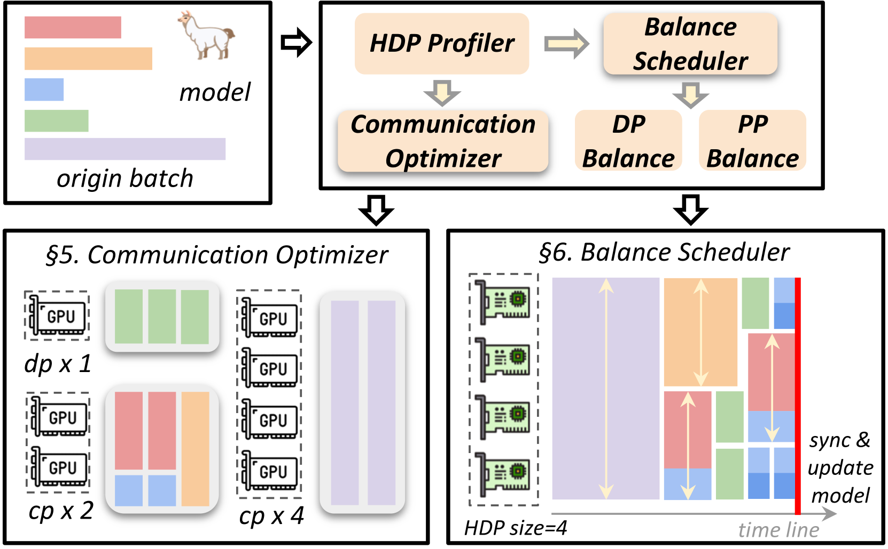
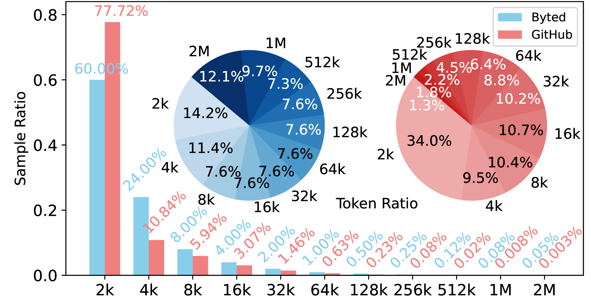
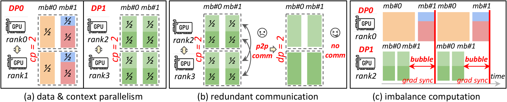
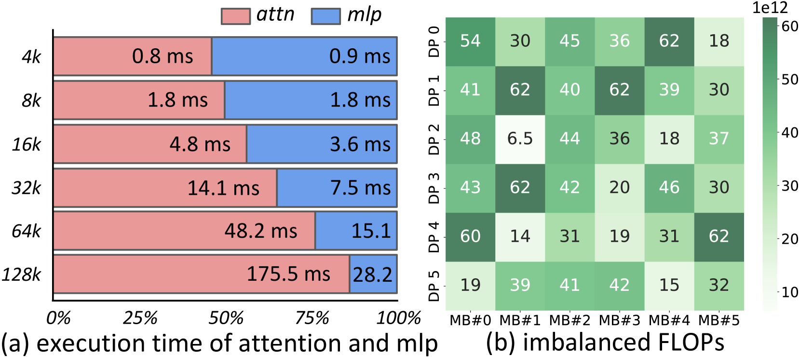
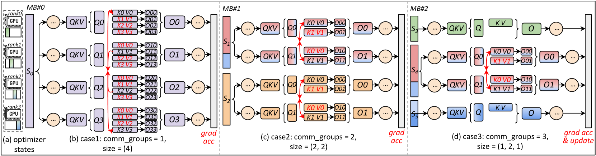
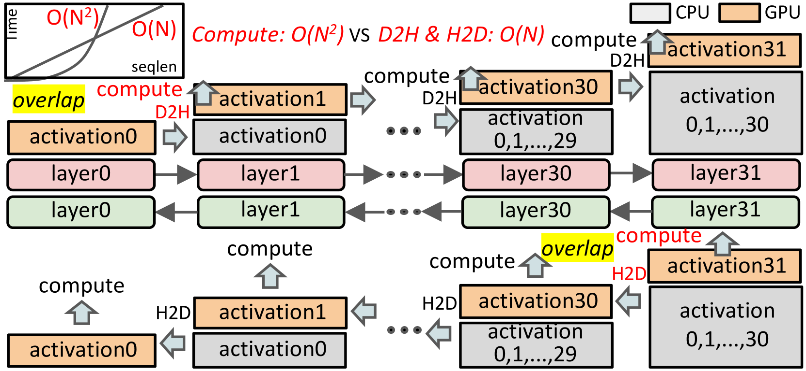
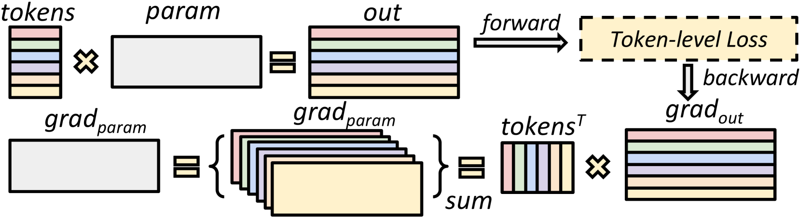

# ByteScale: 在超过 12,000 GPU 上高效扩展 2048K 上下文 LLM 训练

## 一、论文概述

| 项目 | 内容 |
|------|------|
| **标题** | ByteScale: Efficient Scaling of LLM Training with a 2048K Context Length on More Than 12,000 GPUs |
| **作者** | Hao Ge, Junda Feng, Qi Huang, Fangcheng Fu, Xiaonan Nie, Lei Zuo, Haibin Lin, Bin Cui, Xin Liu |
| **机构** | Peking University, ByteDance Seed |
| **论文** | [arXiv:2502.21231](https://arxiv.org/abs/2502.21231) |
| **代码** | - |
| **发布** | 2025年2月 |
| **许可** | ACM |

## 二、核心思想

### 问题定义

长上下文 LLM 训练面临两个核心挑战：

1. **冗余通信**：短序列被迫使用与长序列相同的 CP 组，导致不必要的通信
2. **计算不均衡**：不同序列的计算量差异导致设备空闲

**根本原因**：数据异质性与静态网格设计的不匹配

### 解决方案概述

ByteScale 提出高效、灵活、可扩展的 LLM 训练框架：

1. **Hybrid Data Parallelism (HDP)**：统一 inter-data 和 intra-data 分区
2. **通信优化器**：数据感知分片 + 动态通信 + 选择性卸载
3. **负载均衡调度器**：并行感知数据分配

## 三、技术架构

### 整体框架图

ByteScale 由三个核心组件构成：

| 组件 | 职责 | 关键技术 |
|------|------|----------|
| **Profiler** | 分析环境和数据 | 成本模型构建 |
| **通信优化器** | 优化通信效率 | HDP，动态通信，选择性卸载 |
| **负载均衡调度器** | 解决不均衡计算 | 并行感知数据分配 |

### 核心公式

#### 数据异质性

**观察 1**：序列长度呈偏斜分布
- 80% 样本 ≤4K tokens
- 0.05% 样本 ≥2M tokens（贡献 12.1% tokens）
- 1% 样本 ≥128K tokens（贡献 44.3% tokens）

**观察 2**：混合长短序列训练提升模型性能
- 纯长上下文训练损害短上下文性能
- 混合 0.1% 长数据优化长短上下文性能

#### 冗余通信

**问题**：静态 CP 组导致短序列冗余通信
- 1M 上下文需要 CP=128
- 4K 序列被迫使用 CP=128，实际只需 1 设备
- 所有序列必须分片到整个 CP 组

**影响**：
- 短序列不必要的跨设备通信
- CP 需要 $O(S^2)$ 计算来重叠 $O(S)$ 通信，对短序列困难

#### 计算不均衡

**问题**：不同序列的计算量差异
- 注意力计算复杂度 $O(S^2)$
- 即使 token 数相同，不同序列的 FLOPs 不同
- 导致设备执行时间差异

**影响**：
- 数据并行中 DP Bubble
- 流水线并行中 PP Bubble 和 DP Bubble
- DP Bubble 被放大 $d_{pp}$ 倍

#### Hybrid Data Parallelism (HDP)

**核心思想**：统一 inter-data 和 intra-data 分区

**定义**：均匀分布 token 到设备

**关键特性**：
1. **更灵活的通信**：HDP rank 可以处理完整序列（短序列）或部分序列（长序列）
2. **更细粒度的通信**：可使用 [1, $d_{hdp}$] 范围内的任意数量设备处理序列

**优势**：
- 短序列：使用少量设备，无跨设备通信
- 长序列：使用更多设备，分摊通信
- 动态通信组：根据序列长度自动建立

#### 数据感知分片

**策略**：
- 短序列：分配到单个设备，无通信
- 中等序列：分配到少量设备，轻量通信
- 长序列：分配到更多设备，分摊通信

**NCCL 缓冲区优化**：
- 使用全局通信组
- P2P 通信复用现有组
- 避免创建临时通信组

#### 选择性卸载

**策略**：对长序列选择性卸载激活到 CPU
- 减少 GPU 内存使用
- 允许更长的序列处理
- 与计算重叠

#### Token 级梯度

**策略**：Token 级梯度累积
- 不同设备处理不同数量 token
- 梯度按 token 数量加权平均
- 确保梯度一致性

### 模型组件

| 组件 | 说明 | 关键参数 |
|------|------|----------|
| **HDP** | 统一 DP 和 CP | 动态设备分配 |
| **数据感知分片** | 根据序列长度分片 | 动态通信组 |
| **选择性卸载** | 激活卸载到 CPU | 与计算重叠 |
| **负载均衡调度器** | 并行感知数据分配 | 微批次分配 |

### 训练流程

#### 负载均衡调度

**问题**：微批次执行时间差异导致 DP/PP Bubble

**解决方案**：
1. 分析微批次 FLOPs
2. 重新组织数据分配
3. 执行时间短的设备分配更多微批次

**效果**：
- 减少 DP Bubble
- 减少 PP Bubble
- 提高整体效率

## 四、核心创新

| 创新点 | 说明 | 理论/实验依据 |
|--------|------|---------------|
| **HDP** | 统一 DP 和 CP 的新并行策略 | 消除静态网格限制 |
| **数据感知分片** | 根据序列长度动态分片 | 消除短序列冗余通信 |
| **动态通信** | 自动建立通信组 | 灵活适配不同序列 |
| **选择性卸载** | 长序列激活卸载 | 减少内存使用 |
| **负载均衡调度** | 并行感知数据分配 | 减少 DP/PP Bubble |

## 五、实验结果

### 实验设置

| 配置 | 说明 |
|------|------|
| **模型** | 7B - 141B |
| **上下文长度** | 256K - 2048K |
| **GPU** | 12,000+ GPU 生产集群 |
| **数据集** | GitHub, Byted |
| **基线** | Megatron-LM, MegaScale |

### 性能评估

**加速比**：
- 相比 SOTA 训练系统，最高 7.89× 加速

**可扩展性**：
- 支持 2048K 上下文长度
- 支持 12,000+ GPU
- 支持 7B - 141B 模型

### 通信优化

**短序列**：
- 消除冗余通信
- 减少跨设备通信

**长序列**：
- 选择性卸载减少通信成本
- 与计算重叠

### 负载均衡

**效果**：
- 减少 DP Bubble
- 减少 PP Bubble
- 提高设备利用率

### 与现有方法对比

| 特性 | ByteScale | Megatron-LM | MegaScale | FCP |
|------|-----------|-------------|-----------|-----|
| **并行策略** | HDP | 静态 DP×CP | 静态 DP×CP | 动态 CP |
| **通信** | 动态 | 静态 | 静态 | 动态 |
| **负载均衡** | ✓ | ✗ | 部分 | ✓ |
| **最大上下文** | 2048K | 128K | 128K | 512K |
| **GPU 规模** | 12,000+ | 1,000+ | 1,000+ | 256 |
| **加速比** | 7.89× | 基线 | 中等 | 2.21× |

## 六、相关工作

### 长上下文训练方法

| 方法 | 关键特性 | 局限性 |
|------|----------|--------|
| **Megatron-LM** | 3D 并行 | 静态网格 |
| **MegaScale** | 大规模训练 | 静态网格 |
| **Ring Attention** | Ring 通信 | 固定分片 |
| **Ulysses** | All-to-All | 可扩展性受限 |
| **FCP** | 动态 CP | 仅优化 CP |

### ByteScale 优势

ByteScale 是唯一同时实现：
1. **统一 DP 和 CP**：HDP 新并行策略
2. **动态通信**：根据序列长度自动调整
3. **负载均衡**：减少 DP/PP Bubble
4. **大规模验证**：12,000+ GPU，2048K 上下文
5. **最高加速**：7.89×

## 七、总结

### 核心贡献

1. **HDP**：统一 DP 和 CP 的新并行策略
2. **通信优化器**：数据感知分片 + 动态通信 + 选择性卸载
3. **负载均衡调度器**：并行感知数据分配
4. **大规模验证**：12,000+ GPU，2048K 上下文
5. **最高 7.89× 加速**

### 技术影响

- **训练效率**：最高 7.89× 加速
- **可扩展性**：支持 2048K 上下文，12,000+ GPU
- **灵活性**：适配不同序列长度
- **实用性**：生产集群验证

### 局限性

- **仅评估训练**：未评估推理
- **特定集群**：需要大规模集群验证
- **通信假设**：需要高带宽互连
- **调度开销**：负载均衡调度器本身有开销

## 八、参考资源

- **论文**: https://arxiv.org/abs/2502.21231
- **Megatron-LM**: https://github.com/NVIDIA/Megatron-LM
- **MegaScale**: 相关工作
- **FlashAttention**: https://arxiv.org/abs/2205.14135
- **Ring Attention**: https://arxiv.org/abs/2310.01889
- **Ulysses**: https://arxiv.org/abs/2309.14509
- **FCP**: https://arxiv.org/abs/2605.08524
