# WLB-LLM: Workload-Balanced 4D Parallelism for Large Language Model Training

## 一、论文概述

| 项目 | 内容 |
|------|------|
| **标题** | WLB-LLM: Workload-Balanced 4D Parallelism for Large Language Model Training |
| **作者** | Zheng Wang, Anna Cai, Xinfeng Xie, Zaifeng Pan, Yue Guan, Weiwei Chu, Jie Wang, Shikai Li, Jianyu Huang, Chris Cai, Yuchen Hao, Yufei Ding |
| **机构** | - |
| **论文** | https://arxiv.org/abs/2503.17924 |
| **发布** | 2025-03-23 |

## 二、核心思想

### 问题定义

在大规模LLM训练中，4D并行（TP、CP、PP、DP）存在严重的工作负载不平衡问题。作者通过对8K-GPU 128K上下文窗口训练任务的性能分析，识别出两个主要的不平衡来源：

1. **PP级别不平衡**：微批次(micro-batch)间的计算负载不均
2. **CP级别不平衡**：序列分片(sequence shard)间的负载不均

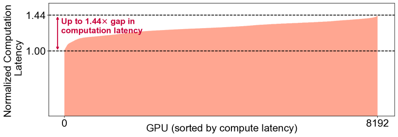

**Figure 1(a)**: 8K-GPU LLM训练任务中的归一化计算延迟。

**关键观察**：
- DP工作者间的注意力计算延迟变化显著
- 每个DP工作者内的PP工作者形成"垂直线"，显示相似工作负载
- 不平衡源于输入打包过程导致的微批次间差异

### 解决方案概述

WLB-LLM提出两个核心优化：

1. **工作负载感知的变长文档打包** (Workload-Aware Var-Length Packing)：
   - 允许每个微批次有不同的序列长度
   - 平衡包括注意力计算在内的总工作负载
   - 设计高效启发式算法实现运行时优化

2. **细粒度自适应CP分片** (Fine-grained and Adaptive Sharding for CP)：
   - 每文档分片策略：确保每个CP工作者有相同的工作负载
   - 自适应分片选择：根据文档特征选择最优分片策略

**核心优势**：
- 平均1.23倍训练加速
- 显著缓解4D并行训练中的工作负载不平衡
- 支持不同模型规模和上下文窗口大小

## 三、技术架构

### 4D并行概述

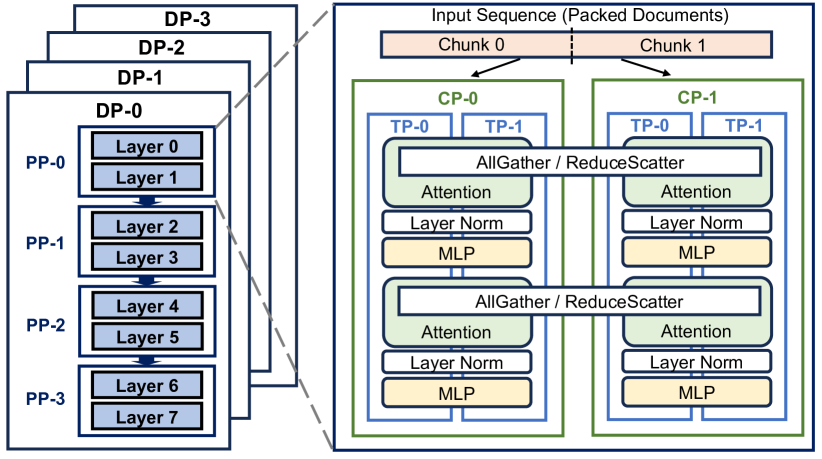

**Figure 2**: LLM训练的4D并行概述。

**并行维度**：
- **TP (张量并行)**：单机内，分割计算
- **CP (上下文并行)**：跨机，分割序列
- **PP (流水线并行)**：跨机，分割模型层
- **DP (数据并行)**：跨机，分割数据

### 输入数据统计

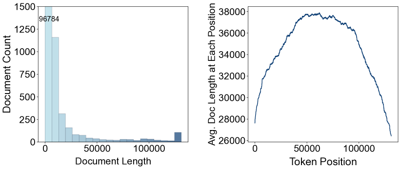

**Figure 3**: 输入数据统计：输入文档长度分布（左）和平均文档长度（右）。

**关键观察**：
- 输入文档长度变化显著
- 不同数据源的文档长度分布不同
- 需要工作负载感知的打包策略

### 不平衡分析

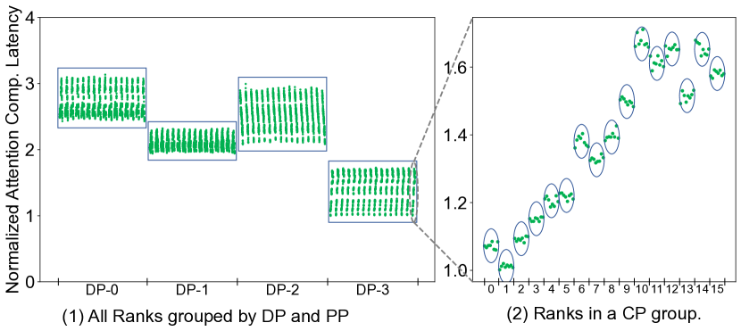

**Figure 4(a)**: 不平衡分析（TP=8, CP=16, PP=16, DP=4）：
- (1) 归一化计算延迟（按DP和PP分组）
- (2) CP组内的归一化计算延迟

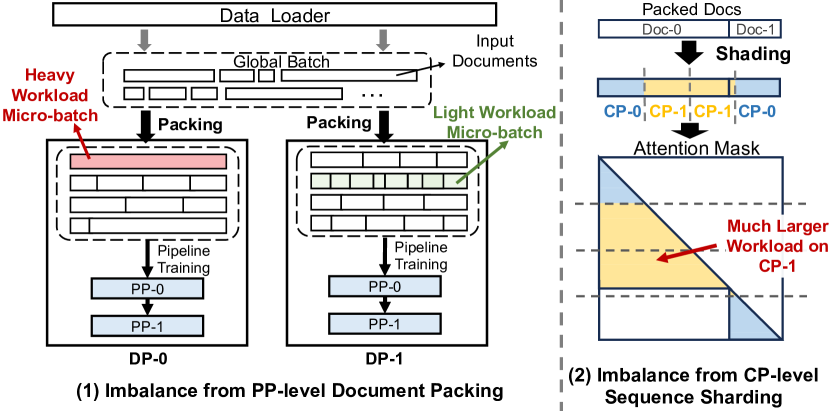

**Figure 4(b)**: PP级别的文档打包和CP级别的序列分片。

**PP级别不平衡**：
- 固定长度打包确保每个PP和DP工作者处理相同数量的token
- 但每token计算强度的差异导致工作负载不平衡
- 包含单个长文档的微批次比包含多个短文档的微批次有更大的工作负载

**CP级别不平衡**：
- 输入序列被分成相等数量的token块，分配给CP工作者
- 当序列包含多个文档时，可能导致显著的工作负载不平衡

### 延迟传播

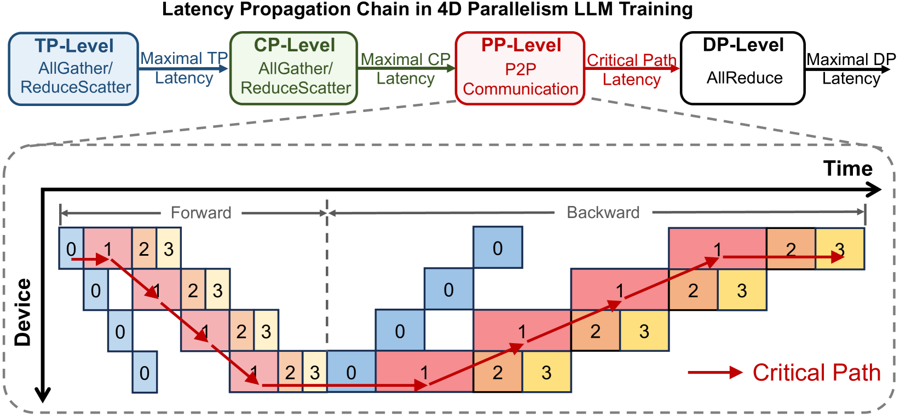

**Figure 5**: 4D并行LLM训练中不同并行层级的延迟传播过程。

**关键发现**：
- 工作负载不平衡会从内层并行传播到外层并行
- 不平衡会被累积和放大
- 最终导致显著的端到端训练延迟影响

### 打包窗口权衡

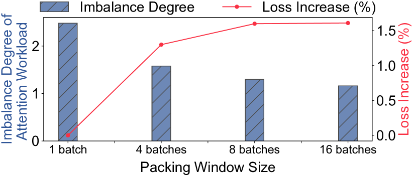

**Figure 6**: 更大的打包窗口改善工作负载平衡，但导致训练损失增加。

**关键发现**：
- 更大的打包窗口可以改善工作负载平衡
- 但会导致训练损失增加（数据随机性降低）
- 需要在平衡和收敛之间找到最优权衡

## 四、核心技术

### 4.1 工作负载感知的变长文档打包

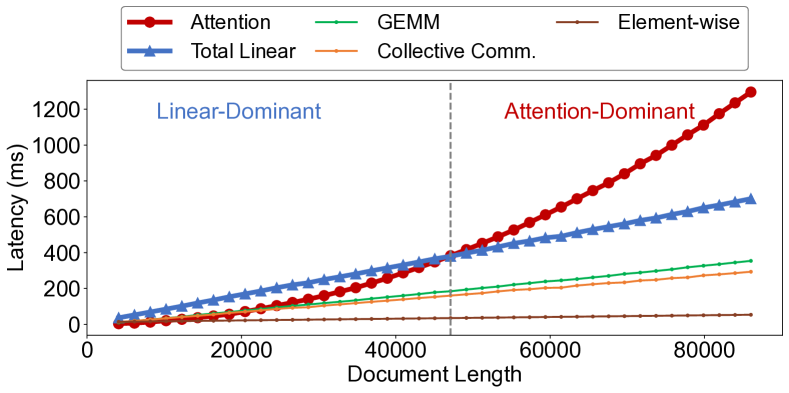

**Figure 7**: 操作延迟与输入文档长度的关系。（Total Linear是GEMM、集体通信和逐元素操作的总和）

**核心思想**：
- 注意力计算延迟与文档长度呈二次关系
- 其他操作（GEMM、通信、逐元素）与文档长度呈线性关系
- 可以通过打包多个短文档来匹配长文档的总延迟

**优化目标**：

$$\text{minimize} \max\left(\sum_{i=1}^{N}(W_a(x_{ij} \cdot d_i) + W_l(x_{ij} \cdot d_i))\right), \quad j=1,\cdots,M$$

$$\text{subject to} \sum_{j=1}^{M} x_{ij} = 1, \quad i=1,\cdots,N$$

$$\sum_{i=1}^{N} x_{ij} \cdot d_i \leq L_{max}, \quad j=1,\cdots,M$$

$$x_{ij} \in \{0,1\}$$

其中：
- $W_a$ 是注意力计算的工作负载函数
- $W_l$ 是其他操作的工作负载函数
- $d_i$ 是文档$i$的长度
- $x_{ij}$ 表示文档$i$是否分配到微批次$j$

### 4.2 离群文档延迟

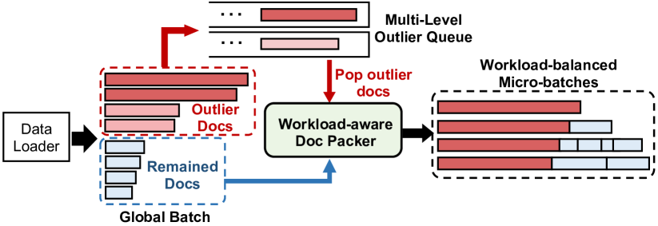

**Figure 8**: 离群文档延迟与变长文档打包的结合过程。

**核心思想**：
- 极长文档会导致严重的不平衡
- 延迟极长文档的训练可以减少对数据随机性的影响
- 实现接近最优的工作负载平衡

**策略**：
- 识别极长文档（如超过上下文窗口大小的文档）
- 延迟这些文档的训练到后续批次
- 最小化对数据随机性的影响

### 4.3 启发式打包算法

**算法设计**：
- 高效的运行时优化
- 可忽略的开销
- 支持动态文档长度变化

### 5.1 每文档分片设计

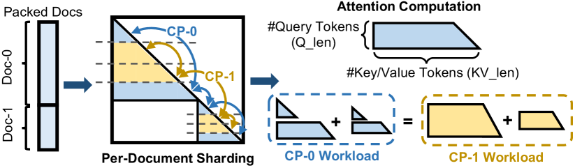

**Figure 9**: 细粒度每文档分片概述。

**核心思想**：
- 确保每个CP工作者有相同的工作负载
- 细粒度分片：每个文档独立分片
- 避免传统固定分片导致的不平衡

### 5.2 内核效率vs分片平衡

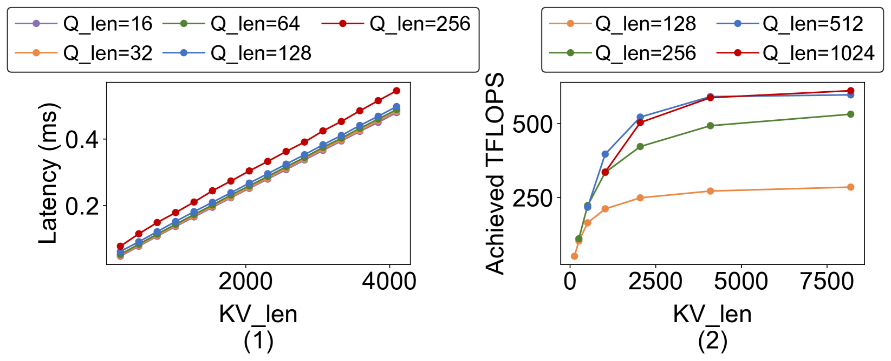

**Figure 10**: 注意力内核性能分析：（左）注意力前向延迟；（右）实现的加速比。

**关键发现**：
- 分片粒度影响内核效率
- 需要在分片平衡和内核效率之间找到最优权衡
- 自适应选择可以实现最佳性能

### 5.3 自适应分片选择

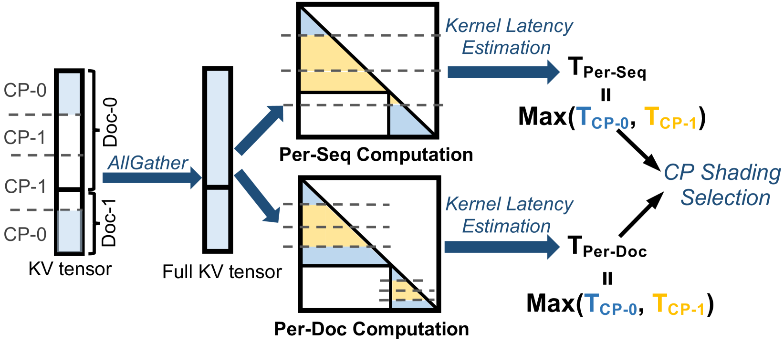

**Figure 11**: 自适应CP分片选择过程。

**核心思想**：
- 根据文档特征选择最优分片策略
- 考虑文档长度、内核效率等因素
- 动态调整分片粒度

## 五、核心创新

| 创新点 | 说明 | 理论/实验依据 |
|--------|------|---------------|
| 变长文档打包 | 允许微批次有不同的序列长度 | 注意力计算的二次复杂性分析 |
| 离群文档延迟 | 延迟极长文档的训练 | 减少对数据随机性的影响 |
| 每文档分片 | 细粒度分片确保负载均衡 | CP级别不平衡分析 |
| 自适应分片选择 | 根据文档特征动态选择策略 | 内核效率vs平衡权衡 |
| 延迟传播分析 | 分析不平衡在并行层级间的传播 | 4D并行架构分析 |

## 六、实验结果

### 实验设置

**模型规模**：
- 550M参数
- 7B参数
- 更大规模模型

**上下文窗口**：
- 128K tokens
- 不同上下文窗口大小的对比

**并行配置**：
- TP=8, CP=16, PP=16, DP=4（8K-GPU配置）
- 不同并行配置的对比

### 训练性能

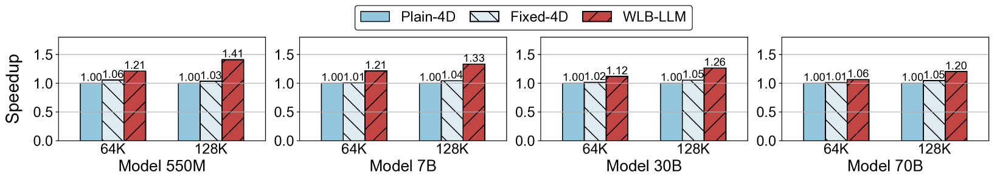

**Figure 12**: WLB-LLM和Fixed-4D相对于Plain-4D在各种配置下的训练加速比。

**关键结果**：
- WLB-LLM实现平均1.23倍训练加速
- 在不同模型规模和上下文窗口大小下都有效
- 显著优于Fixed-4D基线

### 性能分解

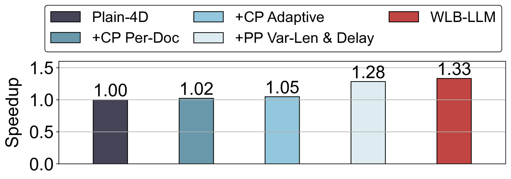

**Figure 13**: WLB-LLM在7B模型128K上下文窗口下的性能分解。

**关键发现**：
- 不同并行层级的优化贡献不同
- PP级别和CP级别的优化都有显著贡献
- 整体优化效果显著

### 上下文窗口加速

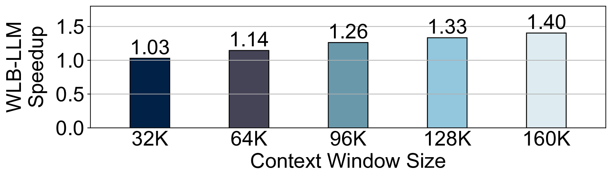

**Figure 14**: WLB-LLM在7B模型上不同上下文窗口大小的加速比。

**关键发现**：
- 随着上下文窗口增大，加速比增加
- 更长的上下文窗口带来更大的不平衡
- WLB-LLM的优化效果更显著

### CP分片比较

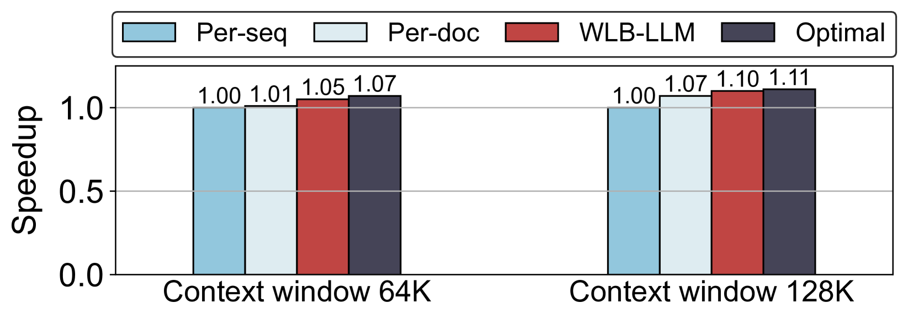

**Figure 15**: CP分片性能比较。

**关键发现**：
- 每文档分片策略显著优于传统固定分片
- 自适应分片选择进一步优化性能
- 细粒度分片实现更好的负载均衡

### 训练损失比较

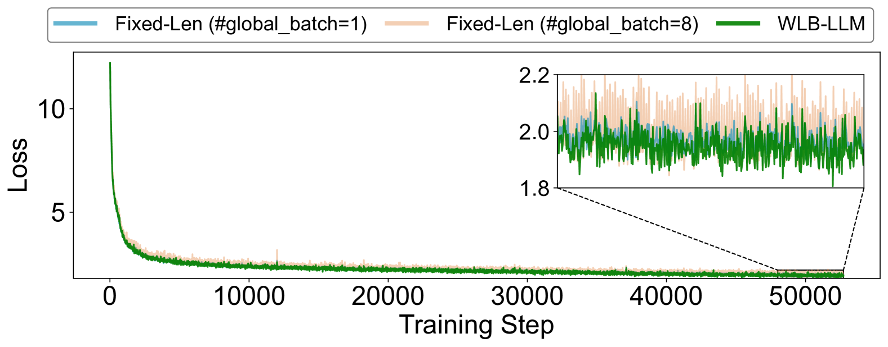

**Figure 16**: 550M模型上的训练损失比较。

**关键发现**：
- WLB-LLM在优化性能的同时保持模型收敛
- 训练损失与基线方法相当
- 不影响模型质量

## 七、相关工作

### 分布式训练优化

| 方法类别 | 代表方法 | 特点 | 局限 |
|----------|----------|------|------|
| 数据并行 | DP, FSDP | 简单高效 | 无法处理大模型 |
| 模型并行 | TP, PP | 处理大模型 | 通信开销大 |
| 序列并行 | CP, Ring Attention | 处理长序列 | 负载不平衡 |
| 混合并行 | Megatron-LM, DeepSpeed | 组合多种并行 | 复杂优化 |

### 工作负载平衡

| 方法 | 关键特性 | 本文对比 |
|------|----------|----------|
| 固定长度打包 | 简单高效 | 无法处理变长文档 |
| 动态打包 | 适应文档长度 | 缺乏工作负载感知 |
| 负载均衡调度 | 平衡计算负载 | 不适用于4D并行 |

### WLB-LLM的定位

WLB-LLM是第一个专门针对4D并行LLM训练的工作负载平衡优化方法，通过变长文档打包和细粒度CP分片实现显著的性能提升。

## 八、总结

### 核心贡献

1. **问题分析**：深入分析4D并行LLM训练中的工作负载不平衡问题
2. **变长文档打包**：允许微批次有不同的序列长度，平衡总工作负载
3. **离群文档延迟**：延迟极长文档的训练，减少对数据随机性的影响
4. **每文档分片**：细粒度CP分片确保每个工作者有相同的工作负载
5. **自适应分片选择**：根据文档特征动态选择最优分片策略

### 技术影响

- **训练效率**：实现平均1.23倍训练加速
- **可扩展性**：支持不同模型规模和上下文窗口大小
- **实用性**：可集成到现有训练框架中
- **理论基础**：建立4D并行工作负载平衡的理论框架

### 局限性

1. 启发式算法可能无法找到全局最优解
2. 需要额外的打包和分片开销
3. 可能需要针对不同硬件配置调整参数
4. 极长文档的延迟可能影响数据随机性

## 九、参考资源

- 论文: https://arxiv.org/abs/2503.17924
- Megatron-LM: 大规模LLM训练框架
- DeepSpeed: 分布式训练优化库
- Ring Attention: 序列并行方法

## 十、图片索引

| 图片 | 说明 | 文件名 |
|------|------|--------|
| Figure 1 | 8K-GPU LLM训练任务中的计算延迟不平衡 | `computation-latency-imbalance.png` |
| Figure 2 | LLM训练的4D并行概述 | `4d-parallelism-overview.png` |
| Figure 3 | 输入数据统计：文档长度分布 | `input-data-statistics.png` |
| Figure 4 | 不平衡分析和文档打包/序列分片 | `imbalance-analysis.png` |
| Figure 5 | 4D并行训练中的延迟传播 | `latency-propagation.png` |
| Figure 6 | 打包窗口大小与工作负载平衡的权衡 | `packing-window-balance.png` |
| Figure 7 | 操作延迟与文档长度的关系 | `operation-latency-document-length.png` |
| Figure 8 | 离群文档延迟过程 | `outlier-document-delay.png` |
| Figure 9 | 细粒度每文档分片概述 | `per-document-sharding.png` |
| Figure 10 | 注意力内核性能分析 | `attention-kernel-profiling.png` |
| Figure 11 | 自适应CP分片选择过程 | `adaptive-cp-sharding.png` |
| Figure 12 | 训练加速比对比 | `training-speedup.png` |
| Figure 13 | 性能分解 | `performance-breakdown.png` |
| Figure 14 | 不同上下文窗口大小的加速比 | `context-window-speedup.png` |
| Figure 15 | CP分片性能比较 | `cp-sharding-comparison.png` |
| Figure 16 | 训练损失比较 | `training-loss-comparison.png` |
