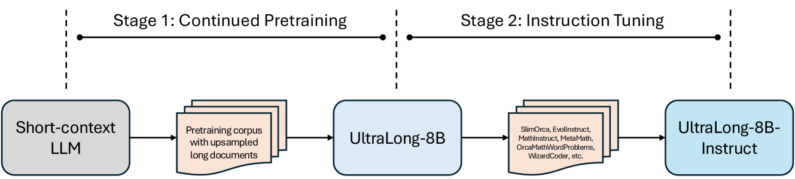
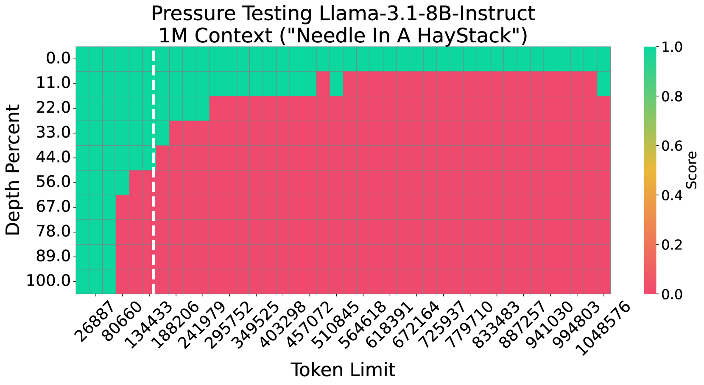
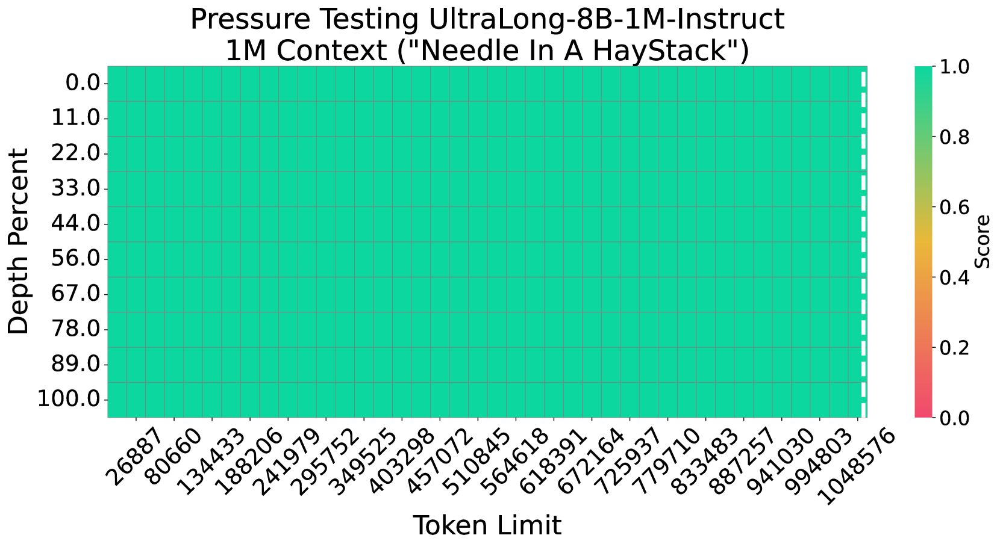
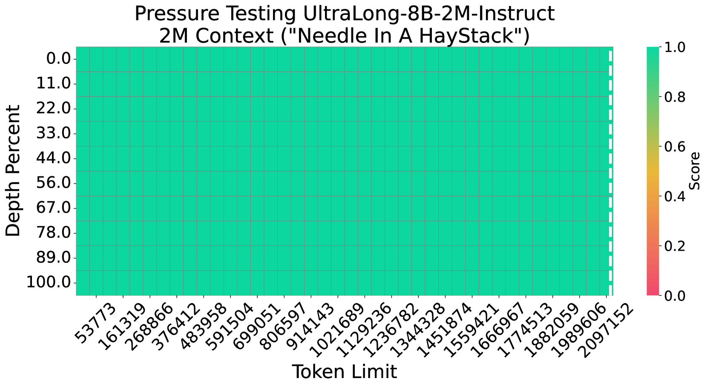
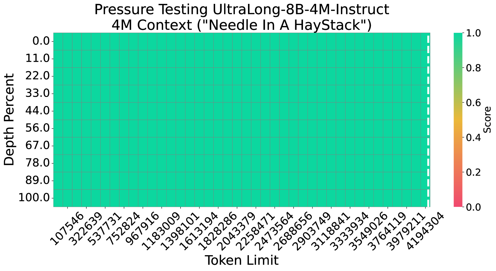

# UltraLong: 从 128K 到 4M 的超长上下文训练

## 一、论文概述

| 项目 | 内容 |
|------|------|
| **标题** | From 128K to 4M: Efficient Training of Ultra-Long Context Large Language Models |
| **作者** | Chejian Xu, Wei Ping, Peng Xu, Zihan Liu, Boxin Wang, Mohammad Shoeybi, Bo Li, Bryan Catanzaro |
| **机构** | UIUC, NVIDIA |
| **论文** | [arXiv:2504.06214](https://arxiv.org/abs/2504.06214) |
| **代码** | [GitHub: ultralong](https://ultralong.github.io/) |
| **发布** | 2025年4月 |
| **许可** | 开源 |

## 二、核心思想

### 问题定义

长上下文能力对多种应用至关重要：
- 文档和视频理解
- 上下文学习
- 推理时缩放

**挑战**：
- 现有模型上下文窗口有限
- 扩展上下文长度需要高效训练策略
- 需要保持标准任务性能

### 解决方案概述

UltraLong 提出高效的超长上下文 LLM 训练方案：

1. **阶段 1：继续预训练**：扩展上下文窗口到 1M/2M/4M tokens
2. **阶段 2：指令调优**：维持指令跟随和推理能力

**关键技术**：
- 特殊文档分隔符
- YaRN-based RoPE 缩放
- 高效数据组成

## 三、技术架构

### 整体框架图

UltraLong 遵循两阶段训练：

| 阶段 | 职责 | 关键技术 |
|------|------|----------|
| **继续预训练** | 扩展上下文窗口 | 特殊分隔符，YaRN RoPE |
| **指令调优** | 维持能力 | 高质量 SFT 数据 |

### 核心公式

#### YaRN-based RoPE 缩放

**RoPE 缩放因子**：

$$s = \frac{\text{目标上下文长度}}{\text{基础上下文长度}}$$

**配置**：
- α = 1, β = 4（固定）
- 1M: s = 128
- 2M: s = 256
- 4M: s = 512

**效果**：更大的缩放因子缓解性能退化。

#### 数据准备与文档连接

**策略**：
- 下采样 <4K tokens 文档
- 上采样 >8K tokens 文档
- 最终语料：1B tokens

**文档分隔**：
- 使用特殊字符而非保留 token
- 不应用跨文档注意力掩码
- 允许模型关注整个输入序列

**优势**：更有效、更高效地适应超长上下文。

### 模型组件

| 组件 | 说明 | 关键参数 |
|------|------|----------|
| **基础模型** | Llama-3.1-8B-Instruct | 128K 上下文 |
| **RoPE 缩放** | YaRN-based | α=1, β=4 |
| **上下文并行** | CP=4 (1M), CP=16 (2M/4M) | TP=8 |
| **训练数据** | 长上下文语料 | 1B tokens |

### 训练流程

#### 继续预训练

| 配置 | 说明 |
|------|------|
| **目标长度** | 1M, 2M, 4M tokens |
| **RoPE 缩放** | s=128, 256, 512 |
| **数据量** | 1B tokens，1 epoch |
| **学习率** | 3×10⁻⁵ |
| **GPU** | 256 NVIDIA H100 |
| **训练时间** | 1M: 5h, 2M: 6h, 4M: 13h |

#### 指令调优

**数据组成**：
- 通用领域
- 数学领域
- 代码领域

**策略**：
- 高质量短上下文 SFT 数据
- 保持指令跟随和推理能力

## 四、核心创新

| 创新点 | 说明 | 理论/实验依据 |
|--------|------|---------------|
| **高效训练方案** | 从 128K 扩展到 4M tokens | 仅需 1B tokens |
| **特殊文档分隔符** | 替换保留 token | 更有效的上下文适应 |
| **YaRN RoPE 缩放** | 更大的缩放因子 | 缓解性能退化 |
| **一步策略** | 优于多步策略 | 一致的性能提升 |
| **平衡改进** | 长短上下文均提升 | 标准基准保持竞争力 |

## 五、实验结果

### 实验设置

| 配置 | 说明 |
|------|------|
| **基础模型** | Llama-3.1-8B-Instruct |
| **上下文长度** | 128K, 1M, 2M, 4M |
| **评估基准** | RULER, LV-Eval, InfiniteBench |
| **标准基准** | MMLU, MATH, GSM-8K, HumanEval |

### Needle-in-a-Haystack 测试

**关键发现**：
- UltraLong 在所有长度下保持高准确率
- 4M 模型在 4M 长度下仍有效
- 相比基线有显著改进

### 长上下文基准

**RULER 评估**：
- UltraLong 在所有长度下优于基线
- 在 1M+ 长度下优势更明显

**LV-Eval 评估**：
- 在多文档问答任务上表现优异
- 长上下文理解能力显著提升

**InfiniteBench 评估**：
- 在超长上下文任务上达到 SOTA
- 在 128K+ 长度下超越现有模型

### 标准基准

| 基准 | Llama-3.1-8B | UltraLong-8B |
|------|--------------|--------------|
| **MMLU** | 竞争力 | 保持 |
| **MATH** | 竞争力 | 保持 |
| **GSM-8K** | 竞争力 | 保持 |
| **HumanEval** | 竞争力 | 保持 |

**结论**：扩展上下文不损害标准任务性能。

### 与现有方法对比

| 特性 | UltraLong | ProLong | Gradient | ChatQA 2 |
|------|-----------|---------|----------|----------|
| **最大长度** | 4M | 512K | 1024K | 128K |
| **训练数据** | 1B | 40B+ | - | - |
| **训练时间** | 5-13h | 长 | 长 | - |
| **标准性能** | 保持 | 退化 | 退化 | 保持 |
| **长上下文** | SOTA | 好 | 中等 | 好 |

## 六、消融实验

### 关键设计选择

**文档分隔符**：
- 特殊字符 > 保留 token
- 全注意力 > 跨文档掩码

**RoPE 缩放**：
- YaRN > NTK-aware
- 更大缩放因子更好

**训练策略**：
- 一步 > 多步
- 更高效，性能更好

**数据组成**：
- 长上下文数据上采样
- 短文档下采样

## 七、相关工作

### 上下文扩展方法

| 方法 | 关键特性 | 局限性 |
|------|----------|--------|
| **PI** | 位置插值 | 需要微调 |
| **NTK-aware** | 频率缩放 | 性能退化 |
| **YaRN** | 综合缩放 | 参数选择 |
| **LongLoRA** | 稀疏注意力 | 近似方法 |
| **LM-Infinite** | 有限注意力 | 近似方法 |

### 长上下文 LLMs

| 模型 | 关键特性 | 局限性 |
|------|----------|--------|
| **GPT-4o** | 128K 上下文 | 闭源 |
| **Gemini** | 超长上下文 | 闭源 |
| **ProLong** | 512K 开源 | 计算昂贵 |
| **Gradient** | 1024K | 标准性能退化 |

## 八、总结

### 核心贡献

1. **高效训练方案**：从 128K 扩展到 4M tokens
2. **关键技术**：特殊分隔符 + YaRN RoPE
3. **一步策略**：优于多步策略
4. **SOTA 性能**：长上下文基准最佳
5. **平衡改进**：长短上下文均提升

### 技术影响

- **效率**：仅需 1B tokens 和 5-13 小时训练
- **可扩展性**：支持 4M tokens
- **实用性**：保持标准任务性能
- **开源**：发布所有模型权重

### 局限性

- **模型规模**：仅评估 8B 参数模型
- **数据量**：1B tokens 可能不够充分
- **评估范围**：未覆盖所有长上下文任务
- **计算成本**：4M 模型需要 13 小时训练

## 九、参考资源

- **论文**: https://arxiv.org/abs/2504.06214
- **代码**: https://ultralong.github.io/
- **Llama-3.1**: https://arxiv.org/abs/2407.21783
- **YaRN**: https://arxiv.org/abs/2309.00071
- **RoPE**: https://arxiv.org/abs/2104.09864
- **RULER**: https://arxiv.org/abs/2404.06654
- **Megatron-LM**: https://github.com/NVIDIA/Megatron-LM
