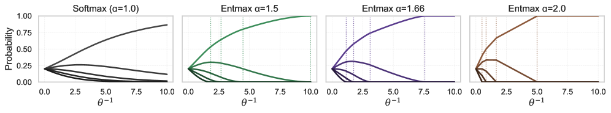
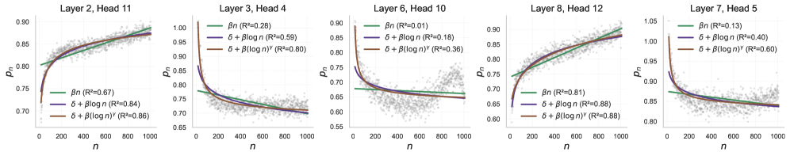
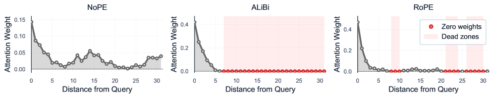
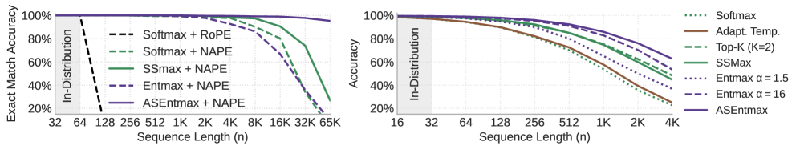

# ASEntmax: 基于稀疏注意力的长上下文泛化

## 一、论文概述

| 项目 | 内容 |
|------|------|
| **标题** | Long-Context Generalization with Sparse Attention |
| **作者** | Pavlo Vasylenko, Hugo Pitorro, André F. T. Martins, Marcos Treviso |
| **机构** | Instituto Superior Técnico, Universidade de Lisboa; Instituto de Telecomunicações; TransPerfect; ELLIS Unit Lisbon |
| **论文** | [arXiv:2506.16640](https://arxiv.org/abs/2506.16640) |
| **代码** | [GitHub: deep-spin/asentmax](https://github.com/deep-spin/asentmax) |
| **发布** | 2025年6月 |
| **许可** | 开源 |

## 二、核心思想

### 问题定义

Transformer 中的 softmax 注意力机制存在三个根本性限制：

1. **注意力分散（Attention Dispersion）**：随着序列长度增加，非信息性 token 积累注意力概率质量，导致分散和表示崩溃
2. **表示崩溃（Representational Collapse）**：softmax 无法维持不同 token 的区分性表示
3. **过度压缩（Over-squashing）**：softmax 的密集概率分布导致梯度指数级稀释

**根本原因**：softmax 产生密集分布，无法为不相关 token 分配精确的零概率。

### 解决方案概述

使用 α-entmax 替换 softmax，引入自适应可缩放 entmax（ASEntmax）：

1. **α-entmax**：可微分的稀疏变换，允许精确零概率
2. **非分散性**：注意力分布熵有界，为 $O(\log s)$ 而非 $O(\log n)$
3. **表示保持**：维持 token 表示的区分性
4. **过度压缩缓解**：梯度路径从 $O(n^L)$ 减少到 $O(s^L)$

## 三、技术架构

### 核心公式

#### α-entmax 变换

对于输入向量 $\bm{z} \in \mathbb{R}^n$ 和 $\alpha > 1$：

$$\alpha\text{-entmax}(\bm{z})_i = \left[(\alpha-1)z_i - \tau(\bm{z})\right]_+^{\frac{1}{\alpha-1}}$$

其中 $[\cdot]_+ := \max(0, \cdot)$，$\tau(\bm{z})$ 为确保分布和为 1 的阈值。

**关键性质**：
- 低于阈值的 token 获得精确零概率
- $\alpha \to 1^+$ 退化为 softmax
- $\alpha = 2$ 对应 sparsemax

#### 非分散性定理

**定义（注意力分散）**：
- **完全分散**：$\lim_{n\to\infty} \frac{H(f(\bm{z}_{1:n}))}{\log n} = 1$
- **集中韧性**：$\lim_{n\to\infty} \frac{H(f(\bm{z}_{1:n}))}{\log n} < 1$

**命题（分散性质）**：
1. α-entmax 可以保持概率，而 softmax 总是泄漏
2. Softmax 表现出完全分散
3. α-entmax 可以表现出强集中韧性

**推论**：当支持大小 $|\mathcal{S}| = O(n^\beta)$ 且 $\beta < 1$ 时：

$$\lim_{n\to\infty} \frac{H(\alpha\text{-entmax}(\bm{z}_{1:n}))}{\log n} \leq \beta < 1$$

#### 表示保持与过度压缩缓解

**命题（表示保持与梯度路径减少）**：
1. **保持表示**：存在输入族使得 $\|\bm{v}_n^{(L)} - \bm{v}_{n+1}^{*(L)}\|_1 \geq c$ 对所有 $n$ 成立
2. **缓解过度压缩**：有效梯度路径缩放为 $O(s^L)$ 而非 $O(n^L)$

#### ASEntmax

**问题**：固定 α 和温度在长上下文中可能过于稀疏或过于密集

**解决方案**：自适应可缩放 entmax（ASEntmax）：

$$\text{ASEntmax}(\bm{z}) = \alpha\text{-entmax}((\delta + \beta(\log n)^\gamma)\bm{z})$$

其中 $\beta, \gamma, \delta \in \mathbb{R}$ 为头特定的标量：

$$\bm{\beta} = \text{softplus}(\bm{X}\bm{w}_\beta) \in \mathbb{R}_+^n, \quad \bm{\gamma} = s\tanh(\bm{X}\bm{w}_\gamma) \in (-s, s)^n$$

**关键性质**：
- 当 $\beta = 0$ 时恢复标准 α-entmax
- $\gamma > 0$：温度随序列长度缓慢上升
- $\gamma < 0$：温度随序列长度下降，抵消 logit 范围增长

#### 与位置编码的交互

**不同位置编码下的 α-entmax 行为**：
- **NoPE**：内容驱动的稀疏性
- **ALiBi**：注意力窗口，有明确截止
- **RoPE**：频率依赖模式，可能有周期性死区

**NAPE（NoPE + ALiBi）**：
- 一半头使用 ALiBi 诱导局部偏好
- 一半头使用 NoPE，更内容驱动
- 特别适合长度外推：ALiBi 头维持一致的局部感受野，NoPE 头允许检索远程证据

### 模型组件

| 组件 | 说明 | 关键参数 |
|------|------|----------|
| **α-entmax** | 稀疏注意力变换 | α > 1，阈值 τ |
| **ASEntmax** | 自适应缩放 entmax | δ, β, γ（头特定） |
| **NAPE** | 混合位置编码 | NoPE + ALiBi |
| **AdaSplash** | 高效 entmax 内核 | GPU 加速 |

### 训练流程

#### 合成任务设置

- 小型 decoder-only Transformer
- 尽可能少的层数
- α = 1.5（Entmax 和 ASEntmax）
- δ = 1（SSMax 和 ASEntmax）
- NAPE 作为默认位置编码

#### 语言建模设置

- 420M 参数 decoder-only 模型
- LLaMA 3 架构
- DCLM-Edu 数据集，77B tokens
- 上下文长度 n = 2048

## 四、核心创新

| 创新点 | 说明 | 理论/实验依据 |
|--------|------|---------------|
| **非分散性** | α-entmax 注意力分布熵有界 $O(\log s)$ | 命题 3.2 |
| **表示保持** | 维持 token 表示区分性 | 命题 3.3 |
| **过度压缩缓解** | 梯度路径从 $O(n^L)$ 到 $O(s^L)$ | 命题 3.3 |
| **ASEntmax** | 自适应可缩放 entmax | 公式 8-10 |
| **NAPE** | NoPE + ALiBi 混合位置编码 | 实验验证 |

## 五、实验结果

### 合成任务

**评估设置**：训练长度 64，测试长度最高 1024×

| 任务 | 方法 | ID | 2× | 4× | 16× | 64× | 256× | 1024× |
|------|------|-----|-----|-----|------|------|-------|--------|
| **MQMTAR** | Softmax | 100.0 | 100.0 | 100.0 | 99.5 | 97.8 | 80.2 | 3.0 |
| | SSMax | 99.9 | 100.0 | 99.9 | 99.6 | 98.3 | 90.6 | 26.7 |
| | Entmax | 100.0 | 100.0 | 100.0 | 99.2 | 92.7 | 66.8 | 9.3 |
| | **ASEntmax** | 100.0 | 100.0 | 100.0 | 99.7 | 99.6 | 99.0 | **95.3** |
| **Reverse** | Softmax | 100.0 | 36.0 | 0.0 | - | - | - | - |
| | SSMax | 100.0 | 54.6 | 0.0 | - | - | - | - |
| | Entmax | 100.0 | 99.0 | 86.0 | 28.5 | 0.2 | - | - |
| | **ASEntmax** | 100.0 | 100.0 | 99.8 | 96.4 | **56.7** | - | - |

**关键发现**：
- ASEntmax 在极端长度下显著优于其他方法
- 在 MQMTAR 上实现 1000× 长度外推（95.3% 准确率）
- 固定 α-entmax 在极端长度下可能过于稀疏

### 语言建模

#### 短上下文评估

| 方法 | Lambada (PPL) | Lambada | HellaSwag | PIQA | Arc-C |
|------|---------------|---------|-----------|------|-------|
| Softmax | 52.4 | 30.9 | 33.1 | 65.1 | 25.6 |
| SSMax | 48.9 | 31.6 | 32.9 | 65.1 | 25.0 |
| Entmax | 47.9 | 32.1 | 32.8 | 63.6 | 24.6 |
| **ASEntmax** | **41.6** | **34.3** | **33.4** | 63.8 | **26.0** |

**结论**：ASEntmax 在短上下文上保持或优于 softmax。

#### 长上下文困惑度

| 方法 | ArXiv (4K) | ArXiv (8K) | ArXiv (16K) | PubMed (4K) | PubMed (8K) | PubMed (16K) |
|------|------------|------------|-------------|-------------|-------------|--------------|
| Softmax | 13.87 | 12.46 | 12.71 | 15.59 | 15.31 | 18.23 |
| SSMax | 13.74 | 12.29 | 12.31 | 15.14 | 13.75 | 14.72 |
| Entmax | 13.36 | 11.04 | 10.07 | 14.79 | 12.86 | 13.02 |
| **ASEntmax** | **13.31** | **10.89** | **10.01** | **14.76** | **12.61** | **12.90** |

**结论**：ASEntmax 在 8× 训练长度下仍保持下降的困惑度趋势。

#### RULER 检索任务

| 方法 | S-NIAH-1 (4K) | S-NIAH-1 (8K) | S-NIAH-1 (16K) | S-NIAH-2 (4K) | S-NIAH-2 (8K) |
|------|---------------|---------------|----------------|---------------|---------------|
| Softmax | 94.2 | 11.4 | 0.8 | 4.8 | 0.0 |
| SSMax | 99.2 | 92.0 | 75.2 | 64.4 | 14.8 |
| Entmax | 89.0 | 21.6 | 1.2 | 64.8 | 7.2 |
| **ASEntmax** | **100.0** | **99.8** | **97.4** | **83.2** | **25.4** |

**结论**：ASEntmax 在 8× 长度外推下保持 97.4% 检索准确率。

### 与现有方法对比

| 特性 | ASEntmax | Softmax | SSMax | α-entmax | Top-K |
|------|----------|---------|-------|----------|-------|
| **注意力分散** | 有界 | 完全分散 | 部分缓解 | 有界 | 有界 |
| **表示保持** | ✓ | ✗ | 部分 | ✓ | ✗ |
| **过度压缩缓解** | $O(s^L)$ | $O(n^L)$ | $O(n^L)$ | $O(s^L)$ | $O(k^L)$ |
| **自适应缩放** | ✓ | ✗ | ✓ | ✗ | ✗ |
| **长度外推** | 最佳 | 差 | 中等 | 中等 | 差 |

## 六、相关工作

### 注意力分散

| 方法 | 关键特性 | 局限性 |
|------|----------|--------|
| **Softmax** | 密集分布 | 完全分散 |
| **SSMax** | $\log n$ 缩放 | 未解决稀疏性 |
| **Adaptive Temperature** | 学习温度 | 未解决根本问题 |
| **α-entmax** | 稀疏分布 | 固定 α |
| **ASEntmax** | 自适应稀疏 | 本文贡献 |

### 稀疏注意力

| 方法 | 关键特性 | 局限性 |
|------|----------|--------|
| **Longformer** | 结构化模式 | 固定模式 |
| **BigBird** | 随机 + 局部 + 全局 | 固定模式 |
| **Top-K** | 动态稀疏 | 不可微分 |
| **α-entmax** | 可微分稀疏 | 固定 α |
| **ASEntmax** | 自适应可微分稀疏 | 本文贡献 |

## 七、总结

### 核心贡献

1. **理论分析**：证明 α-entmax 的非分散性、表示保持和过度压缩缓解
2. **ASEntmax**：自适应可缩放 entmax，根据序列长度调整稀疏性
3. **NAPE**：NoPE + ALiBi 混合位置编码
4. **1000× 长度外推**：在合成任务上实现 95.3% 准确率
5. **8× 语言建模外推**：保持下降的困惑度趋势和 97.4% 检索准确率

### 技术影响

- **长上下文泛化**：直接解决注意力分散的根本原因
- **理论基础**：为稀疏注意力提供理论保证
- **实用价值**：ASEntmax 可直接替换 softmax
- **高效实现**：使用 AdaSplash 内核，无额外开销

### 局限性

- **全局排序任务**：Sort 等任务仍难以长度外推
- **模型规模**：仅评估 420M 参数模型
- **位置编码依赖**：NAPE 作为默认，其他 PE 的适用性需进一步研究
- **稀疏内核效率**：依赖 AdaSplash 实现

## 八、参考资源

- **论文**: https://arxiv.org/abs/2506.16640
- **代码**: https://github.com/deep-spin/asentmax
- **α-entmax**: https://arxiv.org/abs/1905.06349
- **sparsemax**: https://arxiv.org/abs/1602.02068
- **AdaSplash**: 相关工作
- **FlashAttention-2**: https://arxiv.org/abs/2307.08691
- **ALiBi**: https://arxiv.org/abs/2108.12409
- **RoPE**: https://arxiv.org/abs/2104.09864
