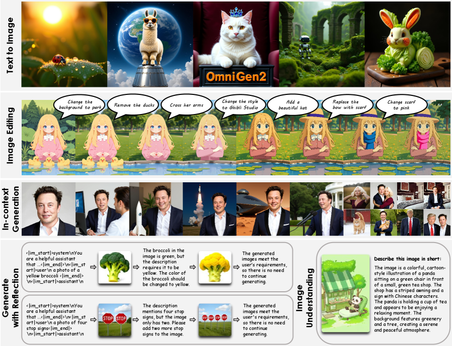
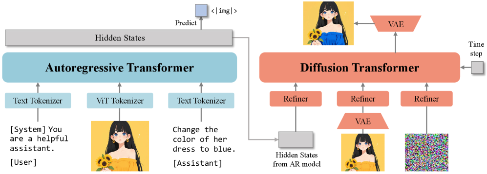
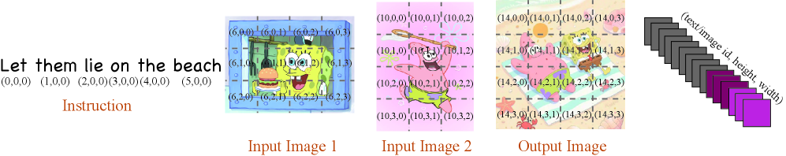
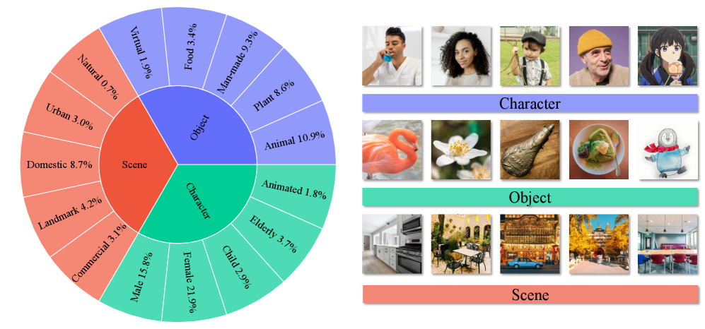
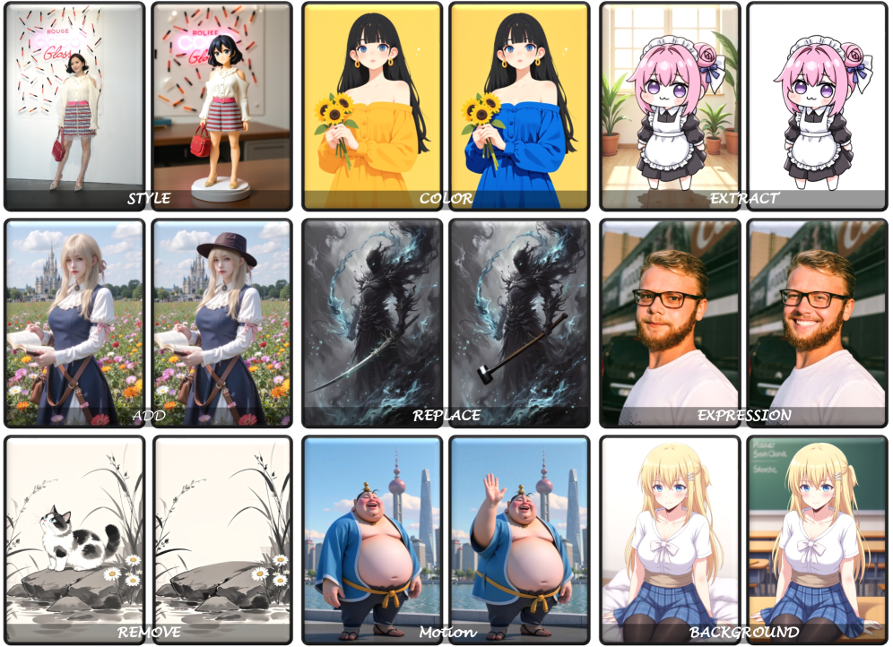
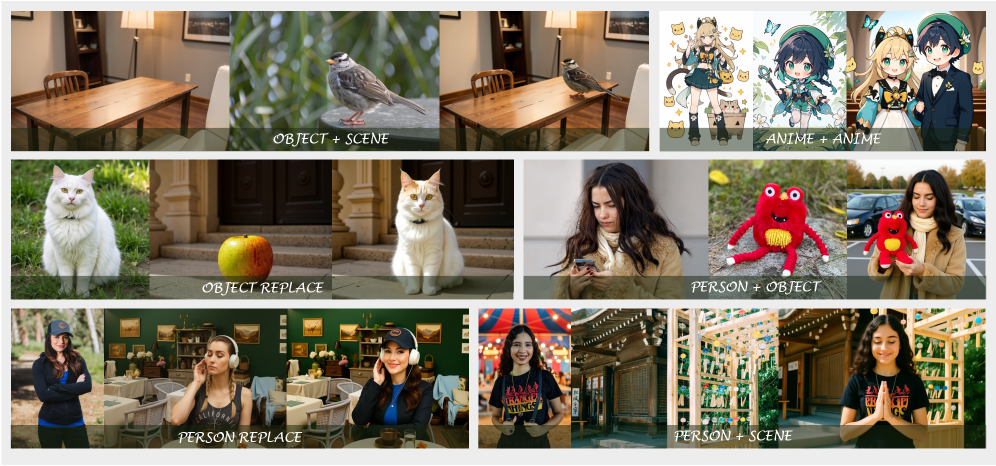
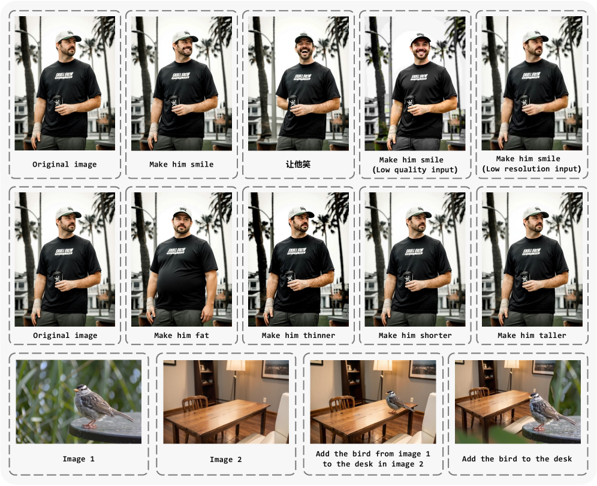

# OmniGen2: Towards Instruction-Aligned Multimodal Generation

## 一、论文概述

| 项目 | 内容 |
|------|------|
| **标题** | OmniGen2: Towards Instruction-Aligned Multimodal Generation |
| **作者** | Chenyuan Wu, Pengfei Zheng, Ruiran Yan, Shitao Xiao, Xin Luo, Yueze Wang, Wanli Li, Xiyan Jiang, Yexin Liu, Junjie Zhou, Ze Liu, Ziyi Xia, Chaofan Li, Haoge Deng, Jiahao Wang, Kun Luo, Bo Zhang, Defu Lian, Xinlong Wang, Zhongyuan Wang, Tiejun Huang, Zheng Liu |
| **机构** | 浙江大学、BAAI（北京人工智能研究院） |
| **论文** | https://arxiv.org/abs/2506.18871v4 |
| **代码** | https://github.com/VectorSpaceLab/OmniGen2 |
| **主页** | https://vectorspacelab.github.io/OmniGen2 |
| **发布** | 2025年6月23日（v1），2026年4月21日（v4） |
| **领域** | cs.CV, cs.AI, cs.CL |

## 二、核心思想

### 问题定义

当前多模态生成模型在各类图像生成任务中表现出色，但在复杂真实场景中的**指令对齐**（instruction alignment）不足，导致可控性、语义一致性和整体生成质量受限。这涉及两个关键挑战：

1. **构建鲁棒且通用的基础模型**：模型需具备初始指令遵循能力和广泛的世界知识，同时避免过度训练
2. **对齐基础模型**：需要全面的奖励信号，且必须确保所有生成任务间的一致性

### 解决方案概述

OmniGen2 提出两阶段设计：

1. **第一阶段**：构建一个基于世界知识的强基础模型，采用解耦解码架构支持多样化多模态生成
2. **第二阶段**：通过渐进式、多任务强化学习进行指令对齐，精心调度训练任务和奖励信号以促进跨任务知识迁移

*Figure 1: OmniGen2 多样化能力概览*

## 三、技术架构

### 整体框架图

*Figure 2: OmniGen2 架构。采用独立的 Transformer 处理自回归和扩散两个路径，使用两种不同的图像编码器：ViT 编码图像输入文本 Transformer，VAE 编码图像输入扩散 Transformer。*

### 核心设计

#### 1. 解耦双路架构

OmniGen2 采用**文本和图像解耦**的双路解码设计：

- **自回归 Transformer**：从 VLM（Qwen2.5-VL-3B）初始化，提供丰富的世界知识和深度多模态指令理解
- **扩散 Transformer**：随机初始化，专注于高保真图像合成
- **解耦图像 Tokenizer**：使用独立参数，无需重新适配 VAE 输入

**工作流程**：
1. VLM 处理输入多模态上下文
2. 特殊 token `<|img|>` 触发图像生成
3. VLM 最终层隐藏状态作为扩散解码器的条件
4. Flux-VAE 提供低层图像特征（用于编辑等任务）

#### 2. Omni-RoPE 位置编码

*Figure 3: Omni-RoPE 示意图*

Omni-RoPE 是专为多模态上下文设计的位置编码方案，将 RoPE 扩展到统一多模态设置：

**统一公式**：每个 token 位置 $(t, i, h, w)$
- $t$：文本序列中的 1D 位置
- $i$：图像索引（区分不同图像）
- $(h, w)$：图像内 2D 空间坐标

**关键特性**：
- 同一图像的所有 token 共享相同的 $i$
- 空间坐标在每个图像内局部计算，确保输入/输出图像对应 patch 获得相同嵌入
- $i$ 提供显式通道区分视觉实例

**消融验证**：

| 方法 | 收敛步数 (loss ≤ 0.014) |
|------|------------------------|
| Lumina-Image-2.0 RoPE | 显著更多 |
| Qwen2-VL RoPE | 更多（有优化平台期） |
| **Omni-RoPE** | **最少，最终 loss 最低** |
| Omni-RoPE + image index | 最低且最稳定 |

#### 3. 扩散解码器

- 基于 Lumina-Image 2.0 的统一 Transformer 骨干
- 跨模态参数共享（语言和视觉共享语义表示）
- **避免信息瓶颈**：直接利用 VLM 的变长隐藏状态，而非压缩为固定数量的查询 token
- 仅使用文本 token 的隐藏状态（VAE 特征已提供视觉细节）
- 轻量级两层 Transformer refiner 对齐输入条件信号

### 训练流程

#### 基础模型训练

| 阶段 | 分辨率 | 数据 | 目标 |
|------|--------|------|------|
| 预训练 | 256→1024 | 140M 开源图文对 + 10M 专有图像 + LLaVA-OneVision | 学习通用视觉和语义表示 |
| 监督微调 (SFT) | 1024 | 精选数据集 + 专有模型蒸馏数据 | 提升高级推理和构图能力 |

**分辨率课程**：256 → 512 → 1024，每个分辨率先 T2I 训练建立对齐，再引入混合任务数据

#### 指令对齐（RL）

采用 **GRPO**（Group Relative Policy Optimization）的渐进式强化学习：

**三阶段课程**：
1. **Edit**：图像编辑任务，使用 EditScore 奖励
2. **GenEval**：组合生成任务，使用可验证奖励
3. **IC**：上下文生成任务，使用 Qwen2.5-VL-72B 奖励

**关键设计**：
- 排除美学奖励（如 HPSv3）以避免 reward hacking
- 编辑任务优先于 T2I（编辑提供更丰富的监督信号）
- 任务调度顺序影响性能：Edit → GenEval → IC 优于 Edit → IC → GenEval

### 数据构建流水线

#### 1. 上下文生成数据

从视频中构建，利用时间多样性捕获同一主体在不同条件下的外观：
- 提取关键帧，使用 Qwen2.5-VL-7B 识别主体
- Grounding DINO 获取主体边界框
- SAM2 分割和跟踪后续帧
- FLUX.1-Fill-dev 进行 inpainting/outpainting
- DINO 相似度过滤 + VLM 质量评估

#### 2. 图像编辑数据

- **Inpaint 数据**：使用 inpainting 模型构建编辑对
- **视频数据**：从视频帧对中提取局部变化，使用 DINOv2 过滤视角变化

#### 3. 反思数据（Reflection Data）

引入**多模态反思机制**：
- 使用 Doubao-1.5-pro 评估生成图像是否满足指令要求
- 如果不满足，模型识别具体错误并提出修改建议
- 迭代生成多轮自反思数据
- 测试时扩展（test-time scaling）提升生成质量

## 四、OmniContext 基准测试

*Figure 4: OmniContext 基准概览*

OmniContext 是论文提出的**上下文生成综合评估基准**，解决现有基准的不足：
- 支持多张输入图像
- 涵盖多样化任务
- 包含 Character、Object、Scene 三类图像
- 8 个子任务，评估 Prompt Following (PF) 和 Subject Consistency (SC)

## 五、核心创新

| 创新点 | 说明 | 理论/实验依据 |
|--------|------|---------------|
| **解耦双路架构** | 自回归 VLM + 扩散 Transformer 分离 | 保留 VLM 指令理解能力，无需重新适配 VAE |
| **Omni-RoPE** | 统一多模态位置编码 | 消融实验显示收敛速度和最终 loss 均优于现有方案 |
| **渐进式 RL 对齐** | Edit → GenEval → IC 三阶段课程 | 促进跨任务知识迁移，避免负干扰 |
| **反思机制** | 多模态自反思 + 测试时扩展 | 成功案例展示自我纠正能力 |
| **OmniContext 基准** | 上下文生成综合评估 | 填补现有基准不支持多图输入的空白 |

## 六、代码实现分析

**开源内容**：模型、训练代码、数据集、数据构建流水线

**关键组件**：
- VLM 基础：Qwen2.5-VL-3B-Instruct
- 扩散骨干：基于 Lumina-Image 2.0
- VAE：Flux-VAE
- 训练框架：FlashAttention2 + Rectified Flow 目标
- RL 框架：GRPO

## 七、实验结果

### 总体性能

OmniGen2（3B + 4B 参数）在多个基准上取得竞争性结果：

| 基准 | OmniGen2 分数 | 对比说明 |
|------|--------------|----------|
| **GenEval** | **0.95** | 超越 UniWorld-V1 (0.84)、BAGEL (0.88)、Qwen-Image |
| **OneIG-Bench** | 0.47 | 仅次于 Gemini 2.5 Flash Image 和 Qwen-Image |
| **OmniContext Overall** | **7.95** | 开源模型 SOTA，超越 Qwen-Image-Edit-2509 |

### 文本生成图像 (T2I)

*Figure 5: OmniGen2 文本生成图像定性结果*

- GenEval 总分 0.95，使用仅 4B 可训练参数
- 训练数据：15M T2I 对 + 50K RL prompts
- 在复杂组合提示下表现优异

### 图像编辑

*Figure 6: OmniGen2 图像编辑定性结果*

**Emu-Edit 基准**：
- CLIP-I: 0.896（第二名）
- CLIP-Out: 0.311（**第一名**，最佳编辑对齐）
- DINO: 0.876（**第一名**，最佳未编辑区域保持）

**GEdit-Bench-EN**：
- SC (语义一致性): 7.58（第二名）
- PQ (感知质量): 7.94（**第一名**）
- Overall: 7.21（超越 Gemini-2.5-Flash-Image，仅次于 Qwen-Image-Edit）

### 上下文生成

*Figure 7: OmniGen2 上下文生成和编辑定性结果*

OmniContext 基准结果：
- Single 任务: 7.86
- Multiple 任务: 7.73
- Scene 任务: 7.93
- **Overall: 7.95**（开源模型 SOTA）

### 消融研究

**关键发现**：

1. **任务选择**：
   - OCR 训练导致负干扰（GEdit: 6.28 → 6.13）
   - Edit & GenEval 策略超越单任务基线（GenEval: 0.95 vs 0.94；GEdit: 7.19 vs 7.01）

2. **奖励信号**：
   - HPSv3 美学奖励导致 reward hacking（PQ 膨胀至 8.22，SC 和 IC 崩溃）
   - EditScore 的准确性奖励对 IC 任务有正迁移（IC: 7.71 vs 7.38）

3. **训练顺序**：
   - Edit → GenEval → IC 优于 Edit → IC → GenEval（GEdit: 7.21 vs 7.06）
   - 编辑任务优先于 T2I 效果更好

## 八、相关工作

- **多模态生成**：GPT-Image-1、BAGEL、UniWorld、MetaQuery、Mogao
- **扩散模型 RL**：GRPO、DDPO、Diffusion-DPO
- **上下文生成**：DreamBooth、Subject-driven generation
- **位置编码**：RoPE、Qwen2-VL RoPE、Lumina-Image 2.0 RoPE
- **数据构建**：SEED-Data-Edit、Recap-DataComp、FLUX.1-Fill-dev

## 九、总结

### 核心贡献

1. **系统化指令对齐**：两阶段设计（基础模型 + 渐进式 RL 对齐）
2. **高效架构**：解耦双路设计 + Omni-RoPE，4B 可训练参数
3. **全面数据流水线**：视频源的上下文生成/编辑数据构建
4. **反思机制**：多模态自反思 + 测试时扩展
5. **OmniContext 基准**：上下文生成综合评估新标准

### 技术影响

- 证明了解耦架构在保留 VLM 理解能力的同时支持图像生成的可行性
- 渐进式 RL 课程策略对多任务对齐的有效性
- 视频数据在上下文生成数据构建中的价值
- 反思机制为测试时扩展提供了新方向

### 局限性

*Figure 8: OmniGen2 局限性可视化*

- 中文提示和低质量图像处理能力较弱
- 人体姿态修改准确性不足
- 对涉及多图像源的模糊指令敏感
- 反思机制可能导致过度反思（over-reflection）
- 3B 规模 MLLM 的感知能力有限

## 十、关键图表

| 图表 | 说明 | 文件路径 |
|------|------|----------|
| Figure 1 | 能力概览 |  |
| Figure 2 | 模型架构 |  |
| Figure 3 | Omni-RoPE |  |
| Figure 4 | OmniContext 基准 |  |
| Figure 5 | T2I 定性结果 |  |
| Figure 6 | 编辑定性结果 |  |
| Figure 7 | 上下文生成 |  |
| Figure 8 | 局限性 |  |

## 十一、参考资源

- **论文**: https://arxiv.org/abs/2506.18871v4
- **PDF**: https://arxiv.org/pdf/2506.18871v4
- **代码**: https://github.com/VectorSpaceLab/OmniGen2
- **主页**: https://vectorspacelab.github.io/OmniGen2
- **Qwen2.5-VL**: https://arxiv.org/abs/2502.13923
- **Lumina-Image 2.0**: https://github.com/Alpha-VLLM/Lumina-Image-2.0
