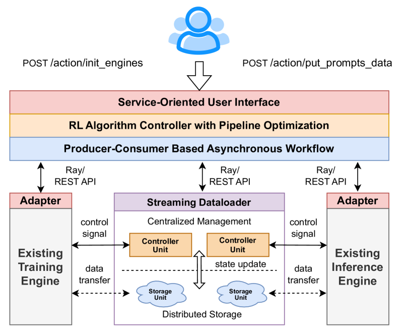
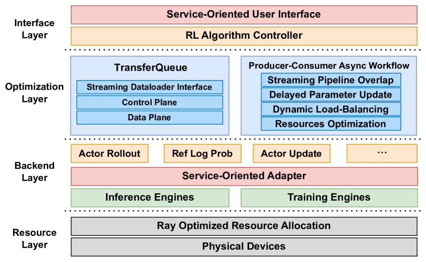
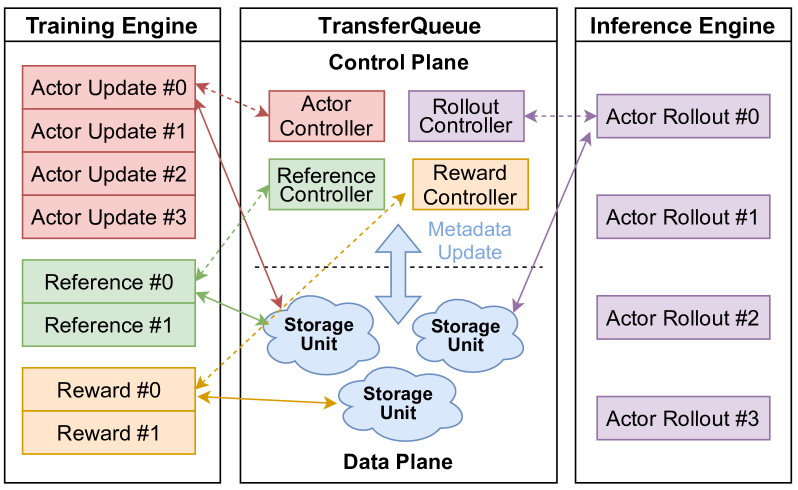
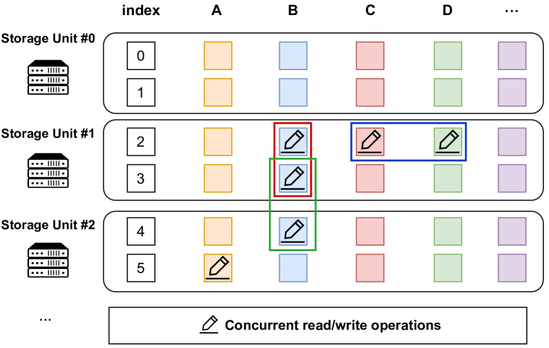
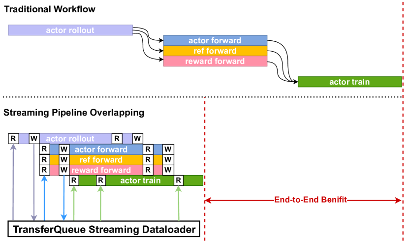
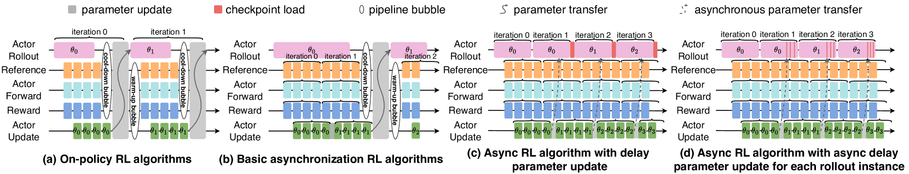
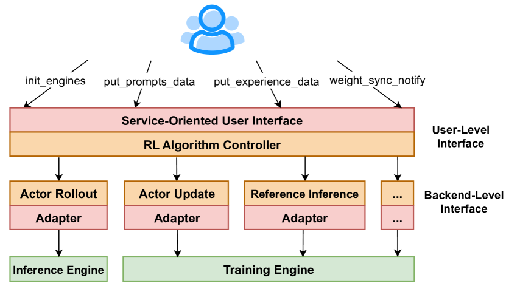
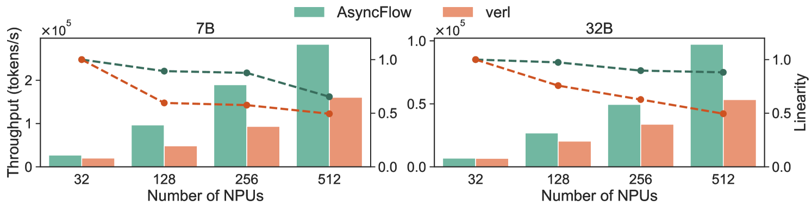
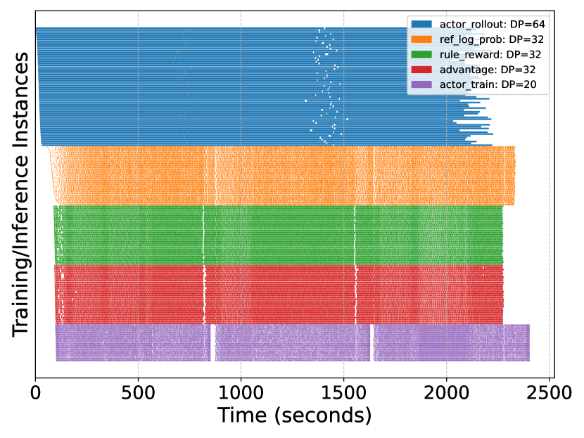
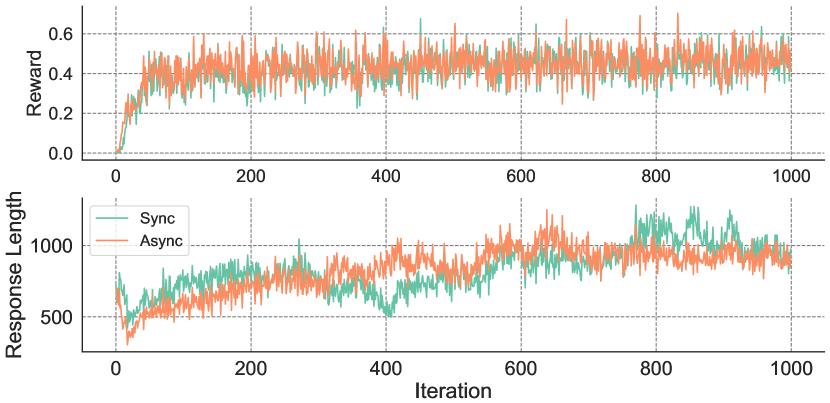

# AsyncFlow: 面向高效 LLM 后训练的异步流式 RL 框架

## 一、论文概述

| 项目 | 内容 |
|------|------|
| **标题** | AsyncFlow: An Asynchronous Streaming RL Framework for Efficient LLM Post-Training |
| **作者** | Zhenyu Han, Ansheng You, Haibo Wang, Kui Luo, Guang Yang, Wenqi Shi, Menglong Chen, Sicheng Zhang, Zeshun Lan, Chunshi Deng, Huazhong Ji, Wenjie Liu, Yu Huang, Yixiang Zhang, Chenyi Pan, Jing Wang, Xin Huang, Chunsheng Li, Jianping Wu |
| **机构** | 华为 (Huawei)、独立研究者 |
| **论文** | [arXiv:2507.01663](https://arxiv.org/abs/2507.01663) |
| **代码** | [MindSpeed-RL](https://gitee.com/ascend/MindSpeed-RL) |
| **发布** | 2025年7月2日 |
| **许可** | CC BY-SA 4.0 |

## 二、核心思想

### 问题定义

RL 后训练已成为 LLM 开发的关键技术，但现有框架面临三大挑战：

1. **任务共置 (Task-Colocated) 框架的瓶颈**：所有任务在同一设备上顺序执行，存在内存效率低、重分片开销大、并行策略次优等问题
2. **任务分离 (Task-Separated) 框架的挑战**：复杂数据流导致资源空闲和工作负载不平衡
3. **引擎耦合问题**：大多数框架与特定训练/推理引擎紧密耦合，难以支持自定义引擎

### 解决方案概述

AsyncFlow 提出三层协同设计：

1. **TransferQueue**：分布式数据存储和传输模块，提供统一数据管理和细粒度调度，以全流式方式运行
2. **生产者-消费者异步工作流**：通过延迟参数更新机制，在陈旧度阈值内最小化计算空闲
3. **服务导向用户接口**：与底层训练/推理解耦，提供模块化、可定制的用户体验

## 三、技术架构

### 整体框架图

AsyncFlow 采用分层架构设计：

| 层次 | 职责 | 关键组件 |
|------|------|----------|
| **接口层 (Interface Layer)** | 统一算法入口，服务导向 API | Trainer 类、用户级/后端级接口 |
| **优化层 (Optimization Layer)** | 数据流管理和资源利用优化 | TransferQueue、异步工作流 |
| **后端层 (Backend Layer)** | 异构引擎适配 | MindSpeed、vLLM 等适配器 |
| **资源层 (Resource Layer)** | 计算资源管理 | Ray 调度、执行时间模拟器 |

### TransferQueue: 高性能异步流式数据加载器

TransferQueue 是一个集中式数据管理模块，具有分布式存储能力，充当异步流式数据加载器。

**核心设计**：
- **控制平面与数据平面解耦**：灵感来自软件定义网络 (SDN)
- **每个 RL 任务配备独立 Controller**：维护训练样本的元数据（存储位置、数据状态、消费状态）
- **分布式存储单元**：每个单元负责当前全局 batch 中的样本子集

**2D 列式数据结构**：

- **列**：对应任务特定数据组件（如 actor 响应、reference log 概率）
- **行**：完整训练样本，通过全局索引唯一寻址
- 支持按需获取特定列，减少不必要的数据传输

**元数据通知机制**：
- 数据写入存储单元后，向所有 Controller 广播行索引和列标识符
- Controller 立即更新元数据，标记数据为可消费状态

**调度流程**：
1. DP 组向 Controller 发送读请求
2. Controller 扫描元数据，识别满足任务要求的条目
3. 根据负载均衡策略选择和打包元数据为微批次
4. 标记已消费样本，防止重复消费
5. 消费者根据元数据从分布式存储单元检索数据

**高并发设计**：
- 解耦架构支持可扩展的存储单元扩展
- 控制平面调度和数据平面 I/O 并发执行
- 每个 DP 组仅一个 rank 与系统交互，减少请求数量
- 支持变长数据传输，消除不必要的 padding

### 生产者-消费者异步工作流

#### 流式流水线重叠

TransferQueue 使 RL 任务间的流水线重叠成为可能：
- 所有训练和推理实例只需与流式数据加载器交互
- 动态调度和重定向最细粒度的数据样本
- 自动支持任意 RL 算法的流水线重叠

#### 异步 Off-Policy 气泡减少

**延迟参数更新机制**：

核心思想：解耦 actor rollout 和 actor update 的模型权重

1. **基本异步 RL**：通过扩大全局 batch size，允许 actor update 使用旧参数生成的响应
2. **延迟参数更新**：actor rollout worker 在 actor update 完成后不立即停止生成
   - 继续使用旧权重生成响应
   - 异步将新参数写入主机内存
   - 当前生成迭代完成后加载新参数到 NPU
   - 将同步开销减少到快速的 H2D 传输
3. **子步异步**：rollout 实例顺序执行参数更新，部分数据使用最新更新的参数生成

**参数更新重叠**：
- WeightSender（训练集群）和 WeightReceiver（推理集群）
- 同步模式：利用高带宽 HCCL 链路传输模型权重
- 异步模式：模型权重卸载到主机设备，通过主机网络异步传输

### 任务资源规划

基于图的资源规划模块：
- 在给定资源约束下搜索最优配置
- 混合成本模型：分析法（快速评估）+ 性能分析法（精确评估）
- 模拟不同配置下的计算和通信时间

### 服务导向用户接口

**用户级接口**：
- `init_engines`：初始化训练和推理引擎
- `put_prompts_data`：加载 prompt 数据集
- `put_experience_data` / `get_experience_data`：协调训练和推理引擎间的 experience 数据
- `weight_sync_notify`：通知引擎更新模型权重

**后端级接口**：
- `RLAdapter` 基类：抽象 RL 任务
- `MindSpeedAdapter`：MindSpeed 后端适配
- `VLLMAdapter`：vLLM 后端适配
- 支持 FSDP、DeepSpeed、vLLM 等多种后端

## 四、核心创新

| 创新点 | 说明 | 理论/实验依据 |
|--------|------|---------------|
| **TransferQueue 流式数据加载器** | 集中式数据管理 + 分布式存储，自动化流水线重叠和动态负载均衡 | 消除静态数据依赖图的瓶颈 |
| **延迟参数更新机制** | 解耦 rollout 和 update 权重，连续一步异步 | 消除 warm-up/cool-down 气泡 |
| **子步异步算法** | rollout 实例顺序更新参数，部分数据使用最新参数 | 进一步减少陈旧度 |
| **服务导向接口** | 两层抽象分离算法逻辑和执行引擎 | 支持异构后端，桥接研究与工业 |
| **混合成本模型** | 分析法 + 性能分析法优化资源配置 | 平衡效率和精度 |

## 五、实验结果

### 基准测试

**实验配置**：
- 模型：Qwen2.5-7B 和 Qwen2.5-32B
- 算法：GRPO (Group Relative Policy Optimization)
- 数据集：DeepScaleR（4万+ 数学问答对）
- 硬件：Ascend NPU 集群（32-1024 NPUs）
- 基线：veRL（SOTA 任务共置框架）

#### 端到端吞吐量对比

| 配置 | AsyncFlow 吞吐量提升 |
|------|----------------------|
| **7B / 256 NPUs** | **2.03×** (峰值) |
| **7B / 512 NPUs** | 1.76× |
| **32B / 512 NPUs** | 1.82× |
| **7B / 32 NPUs** | 1.33× |
| **平均** | **1.59×** |

**可扩展性**：
- 集群规模扩大 16× 时，保持 0.65 和 0.88 的线性度

### 消融实验

**7B 模型 / 512 NPUs 配置**：

| 编号 | 配置 | 归一化吞吐量 |
|------|------|--------------|
| ➀ | Baseline（顺序执行） | 1.00 |
| ➁ | + TransferQueue | 2.01 |
| ➂ | + 异步优化 | 2.74 |

- TransferQueue 贡献 **2.01×** 吞吐量提升
- 异步工作流优化额外提升 **36.3%**

### 工作流分析

Gantt 图展示（32B 模型 / 512 NPUs）：
- RL 任务在优化的数据流调度下实现显著并行化
- 任务间空闲时间最小化
- 验证了任务分离框架在资源利用和可扩展性间的良好平衡

### 算法稳定性

- 7B 模型 / 16 NPUs 配置
- 异步工作流交替启用/禁用
- 奖励分数差异可忽略
- 响应长度方差呈现收敛趋势

## 六、与现有方法对比

| 特性 | AsyncFlow | veRL | OpenRLHF | StreamRL |
|------|-----------|------|----------|----------|
| **架构类型** | 任务分离 | 任务共置 | 任务分离 | 任务分离 |
| **数据管理** | TransferQueue 集中式 | 静态依赖图 | Ray 调度 | 流式调度 |
| **异步优化** | 延迟参数更新 + 子步异步 | 3D-HybridEngine | 基本异步 | 流式 rollout |
| **引擎耦合** | 解耦（服务导向） | 部分解耦 | DeepSpeed+vLLM | 紧耦合 |
| **可扩展性** | 高（线性度 0.65-0.88） | 中 | 中 | 中 |
| **平均吞吐量** | 1.59× (vs veRL) | 基线 | - | - |

## 七、相关工作

### LLM 后训练框架

**任务共置框架**：
- TRL、DeepSpeed-Chat、NeMo-Aligner、RLHFuse、veRL
- 小规模后训练资源利用率高

**任务分离框架**：
- OpenRLHF、k1.5、Seed1.5-Thinking、StreamRL、AReaL
- 大规模场景竞争力强

### RLHF 算法

- **PPO**：基础算法，包含 actor/reference/reward/critic 四个模型
- **GRPO**：移除 critic 模型，通过组相对比较估计优势
- **DAPO**：进一步移除 reference 模型，使用动态参考策略

### 系统优化

- **RLHFuse**：阶段间融合策略
- **StreamRL**：响应长度预测器，动态调度
- **k1.5**：partial rollout 技术

## 八、总结

### 核心贡献

1. **TransferQueue 流式数据加载器**：集中式数据管理 + 分布式存储，自动化负载均衡和流水线重叠
2. **生产者-消费者异步工作流**：延迟参数更新机制平衡训练效率和收敛稳定性
3. **服务导向接口**：两层抽象桥接算法研究和工业部署
4. **大规模验证**：在 32-1024 NPUs 集群上实现平均 1.59× 吞吐量提升

### 技术影响

- **大规模可扩展性**：任务分离框架在大规模场景展现优越线性度
- **算法效率**：异步工作流在不损失收敛性的情况下显著提升吞吐量
- **工程实践**：服务导向设计降低算法研究和工业部署的门槛
- **生态开放性**：解耦设计支持异构训练/推理引擎

### 局限性

- 当前仅支持 GRPO 算法，PPO 支持正在开发中
- 子步异步机制的实现细节留作未来工作
- 实验主要在 Ascend NPU 平台上验证，其他硬件平台的适配性待验证

## 九、参考资源

- **论文**: https://arxiv.org/abs/2507.01663
- **代码**: https://gitee.com/ascend/MindSpeed-RL
- **基线框架**: [veRL](https://github.com/volcengine/verl)
- **数据集**: [DeepScaleR](https://pretty-radio-b75.notion.site/DeepScaleR-Surpassing-O1-Preview-with-a-1-5B-Model-by-Scaling-RL-19681902c1468005bed8ca303013a4e2)
