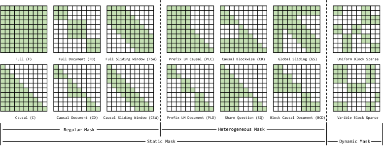
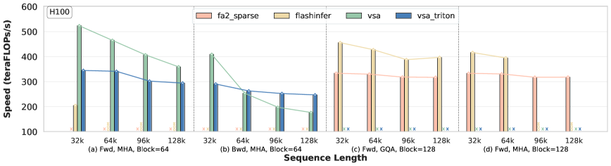

# LongCA-Bench: 长上下文注意力基准测试

## 一、论文概述

| 项目 | 内容 |
|------|------|
| **标题** | Long-Context Attention Benchmark: From Kernel Efficiency to Distributed Context Parallelism |
| **作者** | Tao Bu, Qiangang Wang, Bowen Zeng, Hanwen Sun, Yunpeng Huang, Chun Cao, Jingwei Xu |
| **机构** | 南京大学, 浙江大学, 北京大学 |
| **论文** | [arXiv:2510.17896](https://arxiv.org/abs/2510.17896) |
| **代码** | [GitHub: NJUDeepEngine/LongCA-bench](https://github.com/NJUDeepEngine/LongCA-bench) |
| **发布** | 2025年10月 |
| **许可** | 开源 |

## 二、核心思想

### 问题定义

长上下文 LLM 训练中，注意力机制面临两大挑战：
1. **内核级优化**：密集和稀疏注意力算子的加速
2. **模块级策略**：分布式注意力或上下文并行训练

**现有问题**：
- 算子级比较往往不完整
- 上下文并行策略通常是框架特定的
- 缺乏系统性的性能分析和公平比较

### 解决方案概述

LongCA-Bench 提出统一基准测试框架，集成代表性注意力内核和上下文并行机制：

1. **统一数据准备接口**：标准化预处理
2. **统一输入表示接口**：支持 7 种密集和 5 种稀疏注意力内核
3. **优化的上下文并行框架**：集成 5 种分布式注意力机制

**评估维度**：
- **注意力掩码模式**：影响效率、可扩展性和可用性
- **序列长度和分布式规模**：极端长上下文训练下的性能

## 三、技术架构

### 整体框架图

LongCA-Bench 由三个核心组件构成：

| 组件 | 职责 | 关键特性 |
|------|------|----------|
| **数据准备** | 生成评估数据 | 支持 14 种掩码模式，可变长度采样 |
| **注意力内核** | 统一接口 | 7 种密集 + 5 种稀疏内核 |
| **分布式注意力** | 上下文并行 | 5 种 CP 机制，模块化接口 |

### 核心公式

#### 掩码模式分类

**14 种掩码模式**分为两大类：

**静态掩码（12 种）**：
- **规则掩码（6 种）**：FULL, CAUSAL, FULL SLIDING WINDOW, CAUSAL SLIDING WINDOW, FULL DOCUMENT, CAUSAL DOCUMENT
- **异构掩码（6 种）**：SHARED QUESTION, GLOBAL SLIDING, CAUSAL BLOCKWISE, PREFIX LM CAUSAL, PREFIX LM DOCUMENT, BLOCK CAUSAL DOCUMENT

**动态掩码（2 种）**：
- **均匀块掩码**：固定块大小（如 64×64）
- **可变块掩码**：不同大小的块

#### 密集注意力内核

| 内核 | 特性 | 掩码支持 |
|------|------|----------|
| **Naive-Torch** | 基线实现 | 全部 12 种 |
| **SDPA** | PyTorch 融合 | 全部 12 种 |
| **FA2** | 硬件优化 | 6 种规则掩码 |
| **FA3** | Hopper 架构优化 | 6 种规则掩码 |
| **cuDNN-Fused** | 多架构支持 | 6 种规则掩码 |
| **FlexAttention** | 通用融合算子 | 全部 12 种 |
| **FlashMask** | 列式表示优化 | 全部 12 种 |

#### 稀疏注意力内核

| 内核 | 块大小 | 前向/后向 | GQA 支持 | 性能 |
|------|--------|-----------|----------|------|
| **VSA** | 64 | 两者 | ✗ | 高 |
| **Triton VSA** | 64 | 两者 | ✗ | 中 |
| **FA2 Sparse** | 128 | 仅前向 | ✓ | 中 |
| **FlexAttention** | 任意 | 两者 | ✓ | 低 |
| **FlashInfer** | 任意 | 仅前向 | ✓ | 中 |

#### 分布式注意力机制

| 机制 | 架构类型 | 通信模式 | 可扩展性 |
|------|----------|----------|----------|
| **Ulysses** | All-to-All | 集合通信 | 受头数限制 |
| **Ring P2P** | Ring | 点对点 | 强 |
| **Ring All-Gather** | Ring | 全收集 | 强 |
| **USP** | 混合 | All-to-All + Ring | 强 |
| **LoongTrain** | 混合 | 双 Ring | 强 |

### 模型组件

| 组件 | 说明 | 关键参数 |
|------|------|----------|
| **数据采样器** | 生成评估数据 | Pile (≤8K), ProLong64K (≤64K), ProLong512K (≤512K) |
| **掩码生成器** | 生成 14 种掩码 | 静态/动态，规则/异构 |
| **内核适配器** | 统一接口 | 消除数据表示不一致 |
| **分布式调度器** | 管理 CP 策略 | 双并行分区，头到尾重排序 |

### 训练流程

#### 评估设置

| 配置 | 说明 |
|------|------|
| **GPU** | NVIDIA H100 (80GB HBM3) |
| **精度** | BFloat16 |
| **隐藏维度** | 128 |
| **头配置** | GQA (64:8), MHA (64:64) |
| **序列长度** | 1K-48K (密集), 32K-128K (稀疏), 64K-512K (分布式) |
| **GPU 规模** | 8-96 GPU (12 台服务器) |

## 四、核心创新

| 创新点 | 说明 | 理论/实验依据 |
|--------|------|---------------|
| **统一基准框架** | 集成 7 种密集 + 5 种稀疏 + 5 种 CP 机制 | 首个系统性长上下文注意力基准 |
| **14 种掩码模式** | 覆盖静态/动态、规则/异构掩码 | 揭示掩码对效率的关键影响 |
| **模块化接口** | 消除数据表示不一致 | 公平比较不同内核 |
| **大规模评估** | 最多 96 GPU，512K 上下文 | 揭示可扩展性瓶颈 |

## 五、实验结果

### 密集内核性能

**评估设置**：8K 序列长度，GQA (64:8)

| 内核 | FULL | CAUSAL | SLIDING WINDOW | DOCUMENT | 异构掩码 |
|------|------|--------|----------------|----------|----------|
| **FA3** | 最佳 | 最佳 | 最佳 | 最佳 | ✗ |
| **cuDNN** | 次佳 | 次佳 | 次佳 | 次佳 | ✗ |
| **FA2** | 中等 | 中等 | 中等 | 中等 | ✗ |
| **FlexAttention** | 中等 | 中等 | 中等 | 中等 | ✓ |
| **FlashMask** | 中等 | 中等 | 中等 | 中等 | ✓ |
| **SDPA** | 低 | 低 | 低 | 低 | ✓ |

**关键发现**：
- FA3 在 H100 上性能最佳，专为 Hopper 架构优化
- FA 系列和 cuDNN 不支持异构掩码
- FlexAttention 和 FlashMask 支持全部掩码，但性能较低
- SDPA 和 Naive 实现因二次复杂度不适用于长上下文

### 稀疏内核性能

**评估设置**：50% 稀疏率，MHA (64:64) 和 GQA (64:8)

| 内核 | 块大小 64 | 块大小 128 | 前向 | 后向 | GQA 支持 |
|------|-----------|-----------|------|------|----------|
| **VSA** | ✓ | ✗ | ✓ | ✓ | ✗ |
| **Triton VSA** | ✓ | ✗ | ✓ | ✓ | ✗ |
| **FA2 Sparse** | ✗ | ✓ | ✓ | ✗ | ✓ |
| **FlashInfer** | ✓ (OOM) | ✓ | ✓ | ✗ | ✓ |

**关键发现**：
- VSA 性能最佳，但仅支持块大小 64 和 MHA
- 后向计算仍是主要瓶颈
- FlashInfer 在长序列小块大小时易 OOM
- 块大小 128 通常比 64 性能更好

### 分布式注意力性能

**评估设置**：每设备 8K 序列，GQA (64:8)，8-96 GPU

| 机制 | FULL | CAUSAL | DOCUMENT | 可扩展性 |
|------|------|--------|----------|----------|
| **Ulysses** | 好 | 好 | 好 | 受头数限制 |
| **Ring P2P** | 最佳 | 好 | 波动 | 强 |
| **USP** | 好 | 好 | 好 | 强 |
| **LoongTrain** | 好 | 好 | 好 | 强 |

**关键发现**：
- Ulysses 性能稳定但受头数限制
- Ring P2P 在 FULL 掩码下最佳，DOCUMENT 下波动
- 混合架构（USP/LoongTrain）平衡了可扩展性和效率
- 通信-计算重叠是关键优化点

### 与现有方法对比

| 特性 | LongCA-Bench | 单一内核评估 | 框架特定评估 |
|------|--------------|--------------|--------------|
| **内核覆盖** | 7 密集 + 5 稀疏 | 1-2 种 | 1-2 种 |
| **掩码模式** | 14 种 | 2-3 种 | 1-2 种 |
| **CP 机制** | 5 种 | 无 | 1 种 |
| **评估规模** | 96 GPU, 512K | 单 GPU | 特定规模 |
| **接口统一** | ✓ | ✗ | ✗ |

## 六、相关工作

### 注意力内核

| 内核 | 关键特性 | 局限性 |
|------|----------|--------|
| **FlashAttention** | IO 感知，硬件优化 | 不支持异构掩码 |
| **FlexAttention** | 通用融合算子 | 性能较低，内存开销大 |
| **FlashMask** | 列式表示优化 | 不能覆盖所有场景 |
| **VSA** | 专用稀疏内核 | 仅支持 MHA 和块大小 64 |

### 上下文并行

| 方法 | 关键特性 | 局限性 |
|------|----------|--------|
| **Ulysses** | All-to-All 通信 | 可扩展性受头数限制 |
| **Ring Attention** | Ring 拓扑 | 通信-计算重叠困难 |
| **USP** | 混合架构 | 复杂调度 |
| **LoongTrain** | 双 Ring 拓扑 | 额外同步开销 |

## 七、总结

### 核心贡献

1. **统一基准框架**：首个系统性长上下文注意力基准测试
2. **全面内核覆盖**：7 种密集 + 5 种稀疏 + 5 种 CP 机制
3. **14 种掩码模式**：覆盖静态/动态、规则/异构掩码
4. **大规模评估**：最多 96 GPU，512K 上下文
5. **实用指导**：为长上下文训练提供选择指南

### 技术影响

- **公平比较**：统一接口消除实现差异
- **性能洞察**：揭示掩码、内核、CP 策略的权衡
- **工程指导**：为实际部署提供选择依据
- **研究方向**：识别稀疏内核后向计算等瓶颈

### 局限性

- **评估范围**：仅覆盖 H100 GPU，未评估其他硬件
- **掩码覆盖**：动态掩码仅评估块稀疏，未覆盖其他动态模式
- **分布式规模**：最大 96 GPU，未评估更大规模
- **Ring All-Gather**：因资源限制暂未评估
- **下游任务**：仅评估效率，未评估模型质量

## 八、参考资源

- **论文**: https://arxiv.org/abs/2510.17896
- **代码**: https://github.com/NJUDeepEngine/LongCA-bench
- **FlashAttention**: https://arxiv.org/abs/2205.14135
- **FlashAttention-2**: https://arxiv.org/abs/2307.08691
- **FlashAttention-3**: https://arxiv.org/abs/2407.08608
- **FlexAttention**: https://arxiv.org/abs/2412.05496
- **Ring Attention**: https://arxiv.org/abs/2310.01889
- **Ulysses**: https://arxiv.org/abs/2309.14509
- **LoongTrain**: https://arxiv.org/abs/2406.18485
