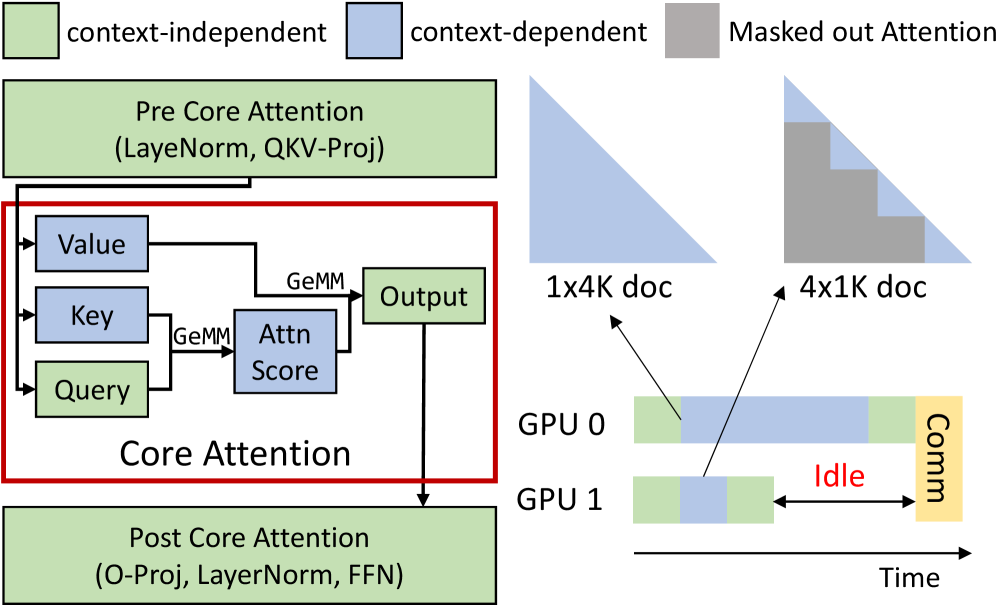
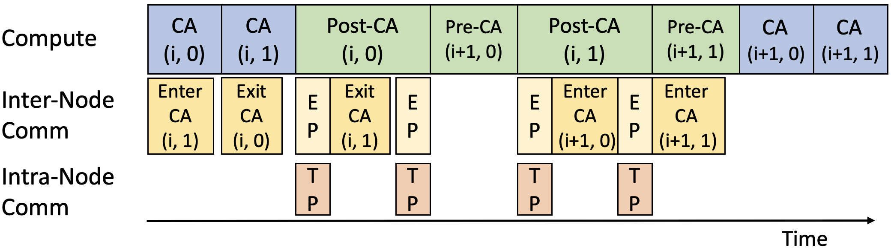
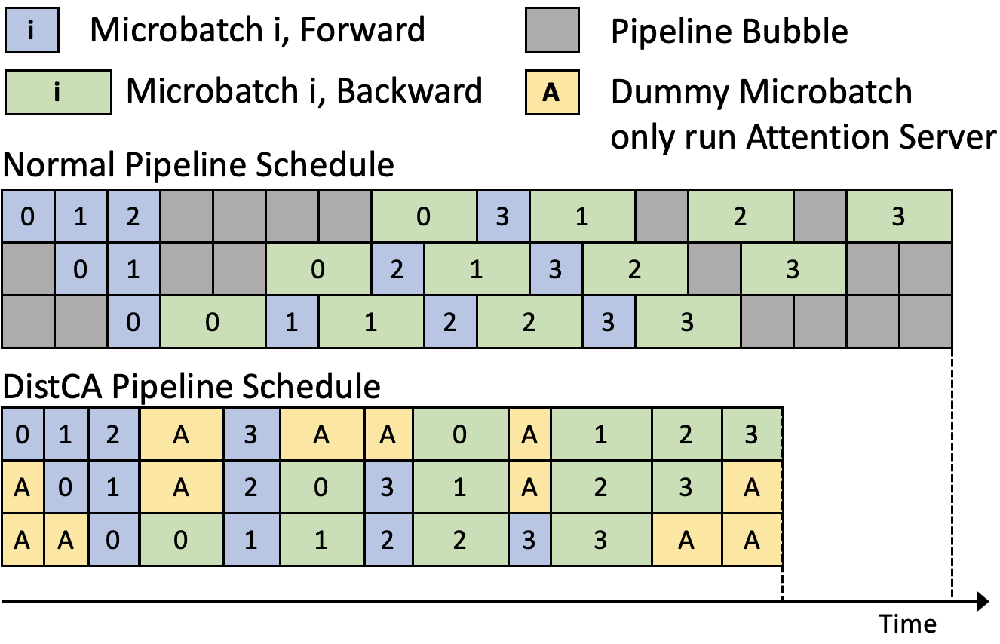
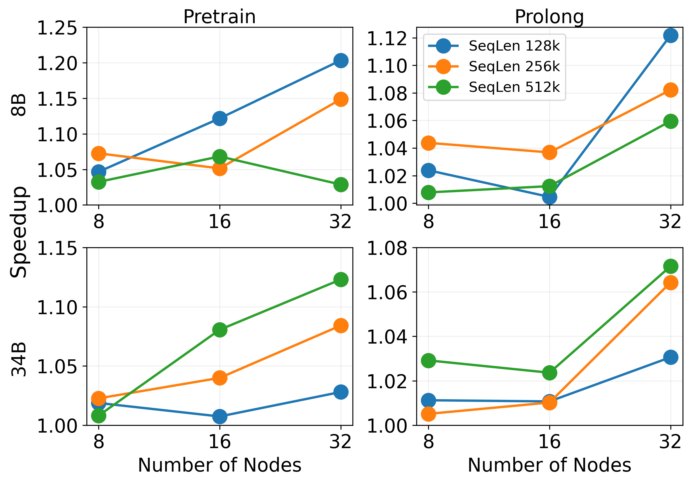
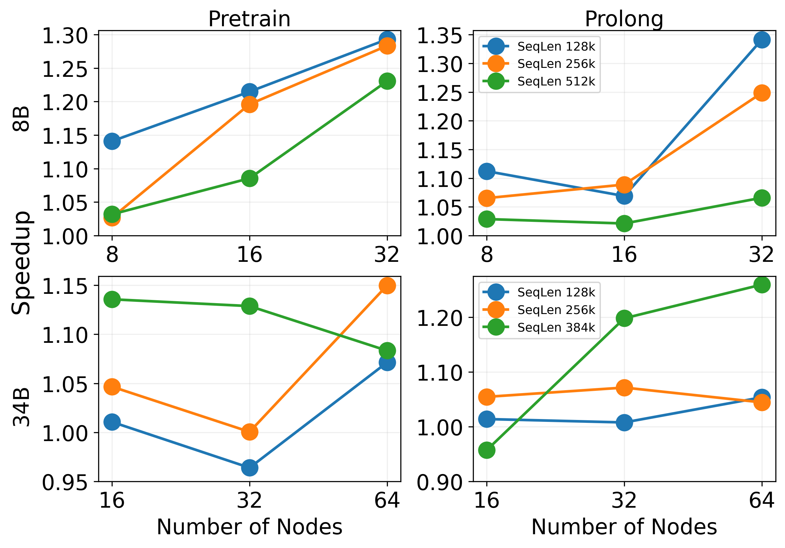
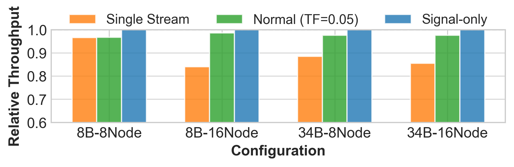

# DistCA: 通过核心注意力分解实现高效长上下文语言模型训练

## 一、论文概述

| 项目 | 内容 |
|------|------|
| **标题** | Efficient Long-context Language Model Training by Core Attention Disaggregation |
| **作者** | Anonymous Authors |
| **机构** | 未公开 (Under Review) |
| **论文** | [arXiv:2510.18121](https://arxiv.org/abs/2510.18121) |
| **代码** | - |
| **发布** | 2025年10月 |
| **许可** | MLSys 2026 Under Review |

## 二、核心思想

### 问题定义

长上下文 LLM 训练中，核心注意力（Core Attention, CA）的二次计算增长与其他组件的近线性增长导致严重的负载不均衡：

**问题根源**：
- CA 计算：$O(l^2)$，其中 $l$ 为序列长度
- 其他层计算：$O(l)$
- 当 CA 与其他层共置时，随着上下文长度增长，不匹配加剧

**影响**：
1. **数据并行（DP）落后者**：不同副本处理不同批次，在梯度同步处落后
2. **流水线并行（PP）落后者**：不同微批次在不同阶段并发执行，计算量大的微批次导致流水线气泡

### 解决方案概述

核心注意力分解（Core Attention Disaggregation, CAD）将 CA 从模型中解耦，调度到独立的设备池：

**两个关键观察**：
1. **无状态性**：CA 没有可训练参数，仅存储少量瞬态数据，负载均衡简化为调度计算密集型任务
2. **可组合性**：现代注意力内核在处理融合的任意长度分片批次时保持高效率

**CAD 工作流程**：
1. 将 CA 分解为 token 级任务（CA-tasks）
2. 分派到专用的注意力服务器（Attention Servers）
3. 动态重新批处理任务以均衡计算

## 三、技术架构

### 整体框架图

DistCA 由两个核心组件构成：

| 组件 | 职责 | 关键特性 |
|------|------|----------|
| **Runtime** | 执行上下文无关层和 CA | Ping-Pong 执行，原地注意力服务器 |
| **Scheduler** | 文档分片和任务分配 | 通信感知贪心调度，负载均衡 |

### 核心公式

#### 计算和内存模型

给定长度为 $l$ 的文档：

**计算量**：
$$\text{FLOPs}(l) = \alpha l^2 + \beta l$$

其中：
- $\alpha l^2$：核心注意力计算量
- $\beta l$：上下文无关层计算量

**激活内存**：
$$M(l) = \gamma l$$

由于现代 IO 感知注意力内核避免存储 $\mathbf{P}$，激活内存主要由上下文无关层决定。

#### 负载均衡条件

对于两个微批次 $\{l_i\}_{i=1}^n$ 和 $\{l'_j\}_{j=1}^m$，要同时均衡计算和内存，需要满足：

$$\sum_{i=1}^n l_i = \sum_{j=1}^m l'_j \quad \text{(内存均衡)}$$
$$\sum_{i=1}^n l_i^2 = \sum_{j=1}^m l'^2_j \quad \text{(计算均衡)}$$

**问题**：现有方法通常只针对一个条件优化。

#### 核心注意力任务（CA-task）

CA-task 定义为查询分片 $q(t)$ 及其上下文的 Key-Value 分片 $kv(t) = \text{context}(q(t))$ 的核心注意力计算。

**特性**：
- 可在 token 粒度任意分割
- 不同文档的分片可重新批处理为单个高占用率内核
- 内核吞吐量主要取决于融合调用中的聚合 token 数

#### 通信感知贪心调度

调度器解决约束优化问题：
1. 最小化注意力服务器间的负载不均衡（以 FLOPs 衡量）
2. 最小化通信量（以字节衡量）

**调度算法**：

1. **确定目标负载**：计算理想每服务器负载 $\bar{F}$
2. **迭代迁移**：对每个亏损目标 $d$，评估每个候选 Item 的优先级分数：
   $$E = \frac{\Delta F_{\max}}{V_{\text{comm}}}$$
   其中 $\Delta F_{\max} = \min(F_{\text{Item}}, S_{\text{source}}, D_{\text{destination}})$
3. **终止条件**：每服务器负载在 $\epsilon \bar{F}$ 内，或迁移无法改善 $E$

### 模型组件

| 组件 | 说明 | 关键参数 |
|------|------|----------|
| **Runtime** | 执行上下文无关层和 CA | Ping-Pong 执行，原地服务器 |
| **Scheduler** | 文档分片和任务分配 | 通信感知贪心算法 |
| **Profiler** | 估计 CA-task 成本 | 双线性插值，饱和区域检测 |
| **All-to-All 通信** | 高效分发输入输出 | NVSHMEM，CUDA 实现 |

### 训练流程

#### Ping-Pong 执行

**执行流程**：
1. 每个输入微批次分为两个 nano-batch："Ping" 和 "Pong"
2. 交替执行两个 nano-batch
3. 一个的通信与另一个的计算重叠
4. 节点内 TP 通信与节点间 CA 通信重叠

**优势**：完全隐藏通信开销

#### 原地注意力服务器

**问题**：专用注意力服务器导致内存利用率低

**解决方案**：允许每个 GPU 周期性切换角色：
- 计算上下文无关层
- 作为注意力服务器

**优势**：同时实现高内存利用率和均衡计算

#### 流水线并行支持

**集成策略**：
- CA 任务来自不同 PP 阶段，与 DP 微批次无区别
- 上下文无关层：所有阶段在每个 tick 执行相同阶段（全前向或全后向）
- 逻辑延迟选定的后向微批次到流水线末尾的气泡中
- 预热和排空阶段的空闲 GPU 时间用于注意力服务器

**兼容性**：1F1B、交错 1F1B 和其他广泛采用的调度

## 四、核心创新

| 创新点 | 说明 | 理论/实验依据 |
|--------|------|---------------|
| **核心注意力分解** | 将 CA 从模型中解耦，独立调度 | 消除 DP/PP 落后者 |
| **无状态性** | CA 无参数，负载均衡简化为任务调度 | 理论分析 |
| **可组合性** | 任意分片重新批处理不损失效率 | FA2 吞吐量分析 |
| **Ping-Pong 执行** | 通信与计算完全重叠 | 隐藏通信开销 |
| **原地注意力服务器** | GPU 角色切换，高内存利用率 | 消除内存浪费 |
| **通信感知调度** | 平衡负载和通信的贪心算法 | 优先级分数 $E$ |

## 五、实验结果

### 实验设置

| 配置 | 说明 |
|------|------|
| **模型** | LLaMA-3-8B, LLaMA-34B |
| **GPU** | NVIDIA DGX H200 (8×140GB) |
| **上下文长度** | 128K, 256K, 384K, 512K |
| **GPU 规模** | 64-512 GPU |
| **并行策略** | TP=8, DP/CP/PP 可变 |
| **基线** | WLB-LLM (WLB-ideal) |

### 3D 并行（无 PP）

**设置**：LLaMA-8B 和 LLaMA-34B，128K-512K 上下文

| 模型 | 数据集 | DistCA 加速 |
|------|--------|-------------|
| LLaMA-8B | Pretrain | 1.07-1.20x |
| LLaMA-8B | ProLong | 1.05-1.12x |
| LLaMA-34B | Pretrain | 1.10-1.25x |
| LLaMA-34B | ProLong | 1.08-1.18x |

**关键发现**：
- DistCA 在所有配置下均优于 WLB-ideal
- 在 Pretrain 数据集上加速更高（短文档比例高，更难均衡）
- 34B 模型在更长上下文下加速更大

### 4D 并行（含 PP）

**设置**：LLaMA-8B 和 LLaMA-34B，128K-512K 上下文

| 模型 | 数据集 | DistCA 加速 |
|------|--------|-------------|
| LLaMA-8B | Pretrain | 1.15-1.30x |
| LLaMA-8B | ProLong | 1.10-1.35x |
| LLaMA-34B | Pretrain | 1.12-1.28x |
| LLaMA-34B | ProLong | 1.10-1.25x |

**关键发现**：
- 4D 并行下加速更大（额外消除 PP 落后者）
- DistCA 最高实现 1.35x 加速
- 更好的缩放行为

### 消融实验

**通信模式对比**：
- **DistCA**：完整实现，Ping-Pong 重叠
- **No Overlap**：无通信重叠
- **No Scheduling**：简单轮询调度

**关键发现**：
- Ping-Pong 执行完全隐藏通信开销
- 通信感知调度显著改善负载均衡
- 每个优化组件均有贡献

### 与现有方法对比

| 特性 | DistCA | WLB-LLM | Context Parallelism |
|------|--------|---------|---------------------|
| **负载均衡** | 完美 | 变量长度分块 | 固定分片 |
| **内存均衡** | 完美 | 不均衡 | 均衡 |
| **DP 落后者** | 消除 | 部分缓解 | 部分缓解 |
| **PP 落后者** | 消除 | 不解决 | 不解决 |
| **通信开销** | 隐藏 | 暴露 | 暴露 |
| **可扩展性** | 强 | 受限 | 受限 |

## 六、相关工作

### 负载均衡方法

| 方法 | 关键特性 | 局限性 |
|------|----------|--------|
| **WLB-LLM** | 变量长度数据分块 | 内存不均衡，长序列受限 |
| **Per-doc CP** | 每文档上下文并行 | 小分片效率低，KV 内存压力 |
| **Ring Attention** | 序列分片，Ring 通信 | 固定分片，通信暴露 |
| **Ulysses** | All-to-All 通信 | 可扩展性受头数限制 |

### DistCA 优势

DistCA 是唯一同时实现：
1. **计算和内存完美均衡**：无状态 CA + 线性层独立均衡
2. **消除 DP 和 PP 落后者**：CA 任务独立调度
3. **隐藏通信开销**：Ping-Pong 执行
4. **高内存利用率**：原地注意力服务器

## 七、总结

### 核心贡献

1. **核心注意力分解**：首次提出将 CA 从模型中解耦
2. **DistCA 系统**：实现 CAD 的完整系统
3. **Ping-Pong 执行**：完全隐藏通信开销
4. **通信感知调度**：平衡负载和通信的贪心算法
5. **最高 1.35x 加速**：在 512 H200 GPU 上验证

### 技术影响

- **训练效率**：最高 1.35x 端到端加速
- **可扩展性**：近线性弱缩放
- **负载均衡**：消除 DP/PP 落后者，近完美均衡
- **内存效率**：原地服务器，高利用率

### 局限性

- **通信假设**：需要高带宽互连（NVLink + InfiniBand）
- **调度开销**：调度器在 CPU 上运行，可能成为瓶颈
- **仅评估因果掩码**：其他掩码模式的适用性未验证
- **匿名提交**：作者信息未公开

## 八、参考资源

- **论文**: https://arxiv.org/abs/2510.18121
- **FlashAttention**: https://arxiv.org/abs/2205.14135
- **Megatron-LM**: https://github.com/NVIDIA/Megatron-LM
- **WLB-LLM**: 相关工作
- **Ring Attention**: https://arxiv.org/abs/2310.01889
- **Ulysses**: https://arxiv.org/abs/2309.14509
