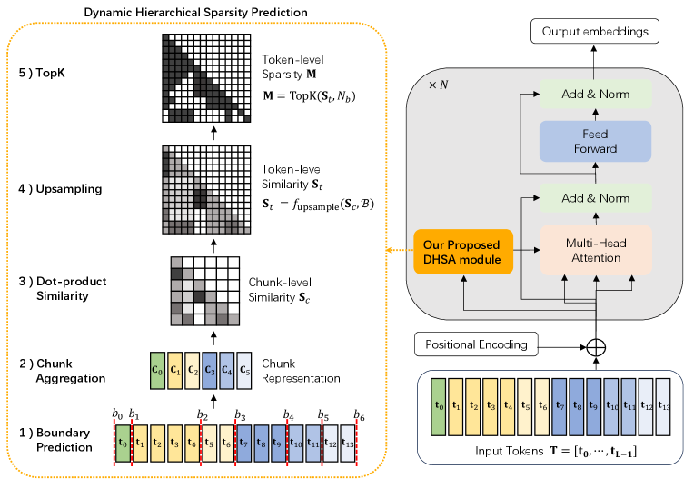
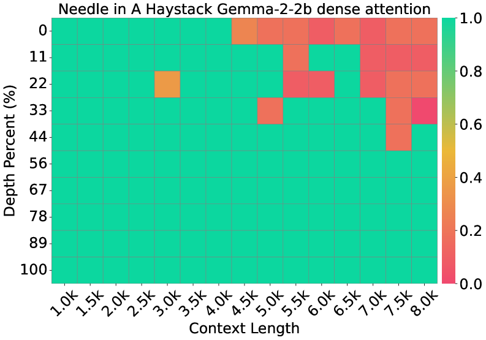
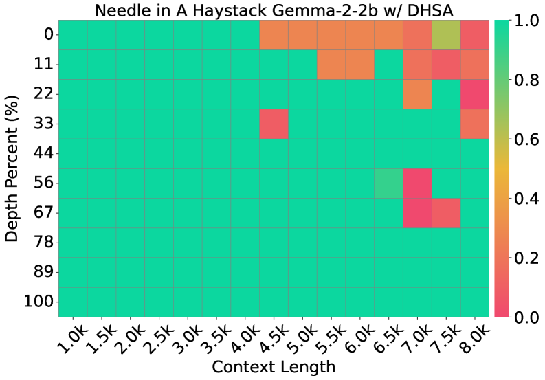
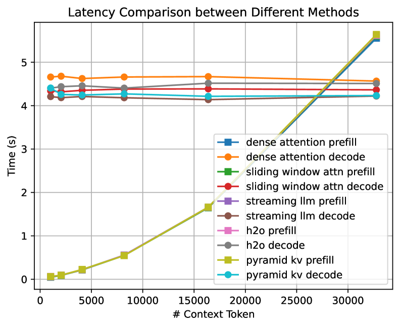
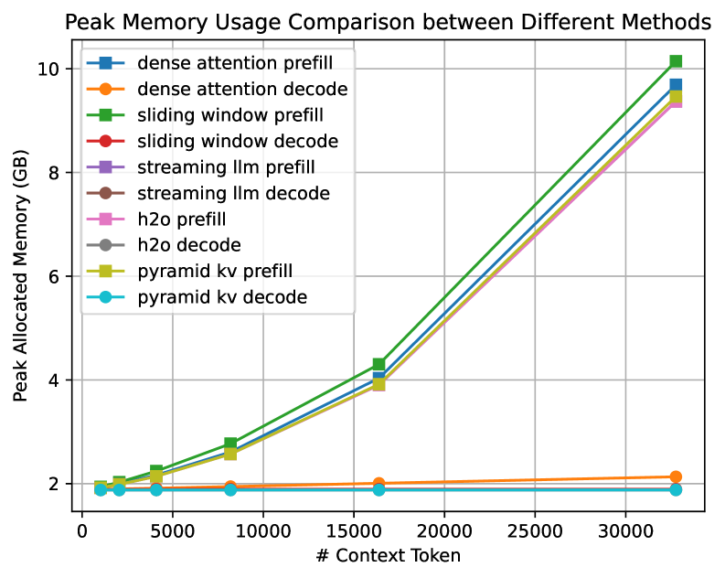
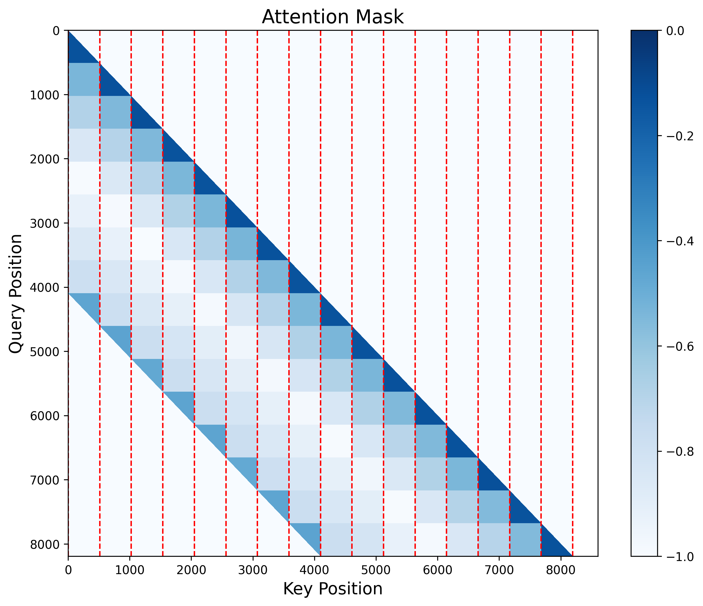
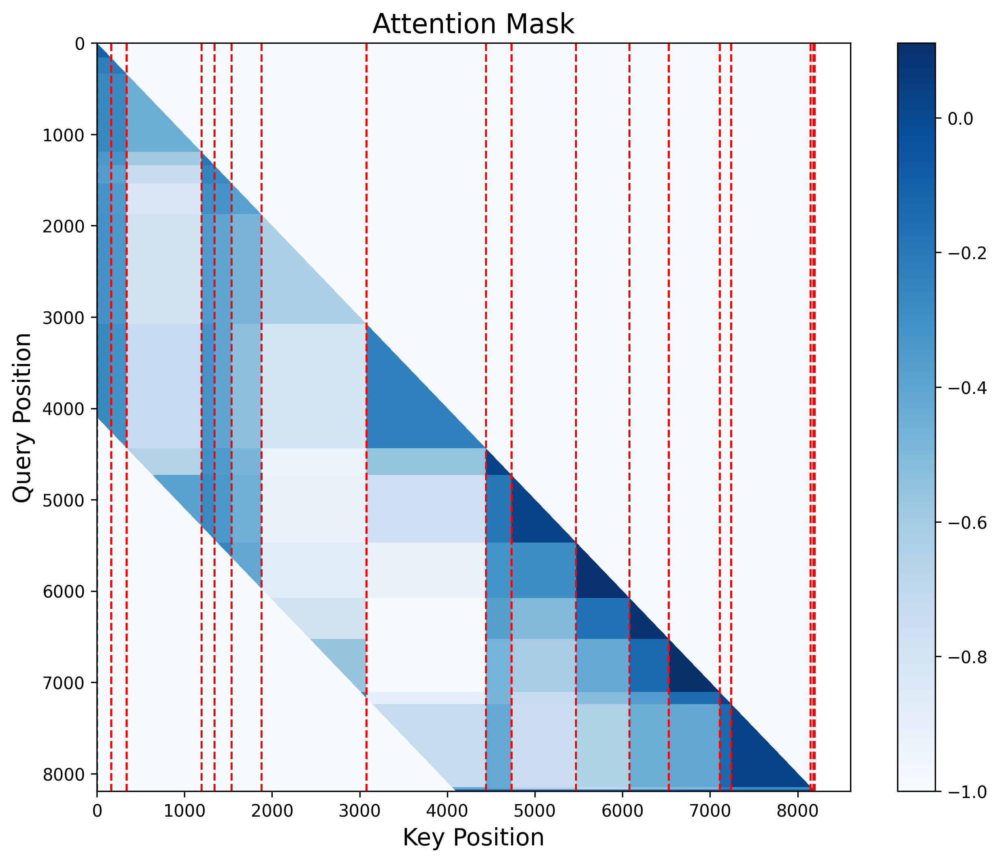

# Long-Context Modeling with Dynamic Hierarchical Sparse Attention for On-Device LLMs

## 一、论文概述

| 项目 | 内容 |
|------|------|
| **标题** | Long-Context Modeling with Dynamic Hierarchical Sparse Attention for On-Device LLMs |
| **作者** | (未在摘要中列出) |
| **机构** | - |
| **论文** | https://arxiv.org/abs/2510.24606 |
| **发布** | 2025-10 |

## 二、核心思想

### 问题定义

注意力机制的二次计算成本阻碍了长上下文LLM的可扩展性，特别是在资源受限的环境中。现有静态稀疏方法（如滑动窗口或全局token）虽然利用了注意力的稀疏性来降低成本，但由于其静态性，难以适应注意力的内容依赖变化。

**现有方法的局限**：
- **静态稀疏方法**：滑动窗口、全局token等方法无法适应内容变化
- **动态方法**：依赖预定义模板或启发式机制，通用性受限
- **精度损失**：可能剪枝掉上下文重要的token

### 解决方案概述

本文提出**动态分层稀疏注意力 (DHSA)**，一个数据驱动的框架，在不重新训练的情况下动态预测注意力稀疏性：

1. **分层稀疏预测**：将序列分割为变长chunk，计算chunk表示，上采样到token级别
2. **动态边界检测**：基于输入序列自适应确定chunk边界
3. **鲁棒chunk表示**：长度归一化聚合，避免chunk长度变化引入的偏差

**核心优势**：
- 在Gemma2上匹配密集注意力的精度
- 减少20-60%的prefill延迟
- 减少35%的峰值内存使用
- 相比块稀疏注意力实现6-18%的相对精度提升

## 三、技术架构

### 核心公式

#### 1. 分层稀疏预测

**Step 1: Chunk级预测**

将token序列 $\mathbf{T}=[\mathbf{t}_{0},\mathbf{t}_{1},...,\mathbf{t}_{L-1}]$ 分割为 $N_c$ 个非重叠chunk $\{\mathbf{C}_{0},\mathbf{C}_{1},...,\mathbf{C}_{N_{c}-1}\}$，由边界索引 $\mathcal{B}=\{b_{0},b_{1},...,b_{N_{c}}\}$ 定义，其中 $0=b_{0}<b_{1}<...<b_{N_{c}}=L$。

构建chunk级相似度矩阵 $\mathbf{S}_{c}\in\mathbb{R}^{N_{c}\times N_{c}}$，其中 $(\mathbf{S}_{c})_{l,k}$ 表示chunk $\mathbf{C}_{l}$ 和 $\mathbf{C}_{k}$ 之间交互的预测重要性。

**Step 2: Token级选择**

从 $\mathbf{S}_{c}$ 上采样得到token级相似度矩阵 $\mathbf{S}_{t}\in\mathbb{R}^{L\times L}$：

$$f_{\text{upsample}}(\mathbf{S}_{c},\mathcal{B})\coloneqq\mathbf{S}_{t}$$

对于每个chunk对 $(\mathbf{C}_{l},\mathbf{C}_{k})$，子矩阵 $(\mathbf{S}_{t})_{[b_{l}:b_{l+1}],[b_{k}:b_{k+1}]}$ 被赋值为 $(\mathbf{S}_{c})_{l,k}$。

然后应用TopK选择生成token级稀疏掩码 $\mathbf{M}$，每个query token的预算为 $N_b$。

#### 2. 动态边界检测

将chunking公式化为边界检测问题，对于每个位置 $i\in[0,L-1]$，定义边界指示函数 $\delta(i)$。

**编码器**：对于每个候选位置 $i$，提取两个局部窗口：

$$\mathbf{k}_{\text{left}}=f_{\text{MHA}}([\mathbf{k}_{i-w+1},\cdots,\mathbf{k}_{i}]), \quad \mathbf{k}_{\text{right}}=f_{\text{MHA}}([\mathbf{k}_{i+1},\cdots,\mathbf{k}_{i+w}])$$

其中 $w$ 是窗口大小，$\mathbf{k}_{j}$ 是token $j$ 的key向量，$f_{\text{MHA}}$ 是带池化的多头注意力模块。

**边界预测器架构**：
- 共享编码器：处理左右窗口
- 特征融合模块：融合左右特征
- MLP分类器：预测边界概率

#### 3. 鲁棒Chunk表示

为了避免chunk长度变化引入的偏差，应用长度归一化聚合：

- 将chunk内的token嵌入聚合为chunk表示
- 按chunk大小的平方根缩放平均嵌入
- 确保不同长度chunk的表示具有可比性

### 实现细节

**算法流程** (Algorithm 1: DHSA Prefill Stage)：
1. 输入token序列和边界预测器
2. 动态检测chunk边界
3. 计算chunk级相似度
4. 上采样到token级
5. TopK选择生成稀疏掩码
6. 应用稀疏注意力计算

## 四、核心创新

| 创新点 | 说明 | 理论/实验依据 |
|--------|------|---------------|
| 分层稀疏预测 | chunk级预测→token级选择 | 减少计算复杂度 |
| 动态边界检测 | 基于内容自适应确定chunk边界 | 适应内容变化 |
| 长度归一化聚合 | 按chunk大小平方根缩放 | 避免长度偏差 |
| 数据驱动框架 | 无需重新训练即可预测稀疏性 | 即插即用 |
| 端到端优化 | 边界预测器可端到端训练 | 自动学习最优边界 |

## 五、实验结果

### 实验设置

**模型**：Gemma2-2b-it
**基准**：
- Needle-in-a-Haystack Test
- LongBench

**基线方法**：
- Dense Attention (密集注意力)
- Block Sparse Attention (块稀疏注意力)
- Sliding Window Attention (滑动窗口注意力)

### Needle-in-a-Haystack结果

**Figure 2**: Gemma2-2b-it上的Needle-in-a-haystack结果（最大上下文长度=8k）。

**关键发现**：
- DHSA在budget=1k时匹配密集注意力的精度
- 动态chunking优于静态chunking
- 在不同上下文位置都能有效检索信息

### LongBench性能

| 方法 | NrtvQA | Qasper | Mf-en | HotpotQA | 2WikiMQA | Musique | GovReport | QMSum | MultiNews | TriviaQA | SAMSum |
|------|--------|--------|-------|----------|----------|---------|-----------|-------|-----------|----------|--------|
| Dense | 22.37 | 35.32 | 37.32 | 41.63 | 32.05 | 19.05 | 27.08 | 21.08 | 25.48 | 87.00 | 41.26 |
| Block sparse | 16.74 | 26.15 | 32.83 | 35.74 | 31.93 | 14.44 | 26.20 | 19.54 | 25.30 | 86.12 | 40.38 |
| **DHSA** | 20.69 | 30.20 | 34.98 | 38.78 | 31.96 | 15.90 | 26.75 | 20.74 | 25.38 | 87.03 | 41.46 |
| DHSA (+bs) | 19.64 | 28.67 | 31.20 | 39.50 | 32.97 | 14.39 | 26.72 | 20.12 | 25.57 | 87.74 | 40.68 |

**关键结果**：
- DHSA在大多数任务上匹配或接近密集注意力的精度
- 相比块稀疏注意力，DHSA实现6-18%的相对精度提升
- DHSA (+bs) 表示跨层共享边界的变体

### 效率分析

**关键发现**：
- DHSA减少20-60%的prefill延迟
- 减少35%的峰值内存使用
- 在单个24GB GPU上支持更长上下文

### 边界检测可视化

**Figure 5**: 静态chunking与动态chunking的对比。

**关键发现**：
- 动态chunking能够识别语义边界
- 在不同层表现出不同的chunking模式
- 局部注意力层和全局注意力层有不同的chunking特征

## 六、相关工作

### 稀疏注意力方法

| 方法类别 | 代表方法 | 特点 | 局限 |
|----------|----------|------|------|
| 静态稀疏 | Sliding Window, Global Tokens | 固定模式 | 无法适应内容变化 |
| 块稀疏 | Block Sparse Attention | 规则分块 | 忽略语义边界 |
| 动态稀疏 | DHSA | 内容自适应 | 需要训练边界预测器 |

### 长上下文优化

| 方法 | 关键特性 | 本文对比 |
|------|----------|----------|
| FlashAttention | 计算优化 | 正交方法，可组合 |
| KV Cache压缩 | 减少内存 | 不同优化维度 |
| 线性注意力 | 降低复杂度 | 近似方法 |

## 七、总结

### 核心贡献

1. **DHSA框架**：提出数据驱动的动态分层稀疏注意力框架
2. **动态边界检测**：基于内容自适应确定chunk边界
3. **长度归一化聚合**：避免chunk长度变化引入的偏差
4. **显著效率提升**：减少20-60%延迟和35%内存使用
5. **精度保持**：匹配密集注意力精度，优于块稀疏注意力

### 技术影响

- **设备端部署**：使长上下文LLM在资源受限设备上可行
- **即插即用**：无需重新训练即可集成到现有模型
- **通用性**：适用于不同模型架构和任务
- **效率-精度权衡**：提供灵活的预算控制

### 局限性

1. 需要训练边界预测器
2. 边界检测增加了一定开销
3. 在极短序列上可能无法充分体现优势
4. 依赖于chunk级相似度的质量

## 八、参考资源

- 论文: https://arxiv.org/abs/2510.24606
- Gemma2: Google的开源LLM
- FlashAttention: 高效注意力实现

## 九、图片索引

| 图片 | 说明 | 文件名 |
|------|------|--------|
| Figure 1 | DHSA框架概览 | `framework-overview.jpg` |
| Figure 2 | Needle-in-a-haystack结果对比 | `needle-haystack-dense.jpg`, `needle-haystack-dhsa.jpg` |
| Figure 3 | 边界预测器架构 | `boundary-predictor.jpg` |
| Figure 4 | 自动标注策略 | `auto-labeling.jpg` |
| Figure 5 | 静态vs动态chunking对比 | `static-chunking-local.jpg`, `dynamic-chunking-local.jpg` |
| Figure 6 | 不同方法的haystack对比 | `haystack-comparison-dense.jpg`, `haystack-comparison-dhsa-1k.jpg` |
| Figure 7 | 延迟对比 | `latency-comparison.jpg` |
| Figure 8 | 内存对比 | `memory-comparison.jpg` |
