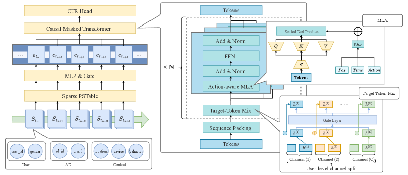
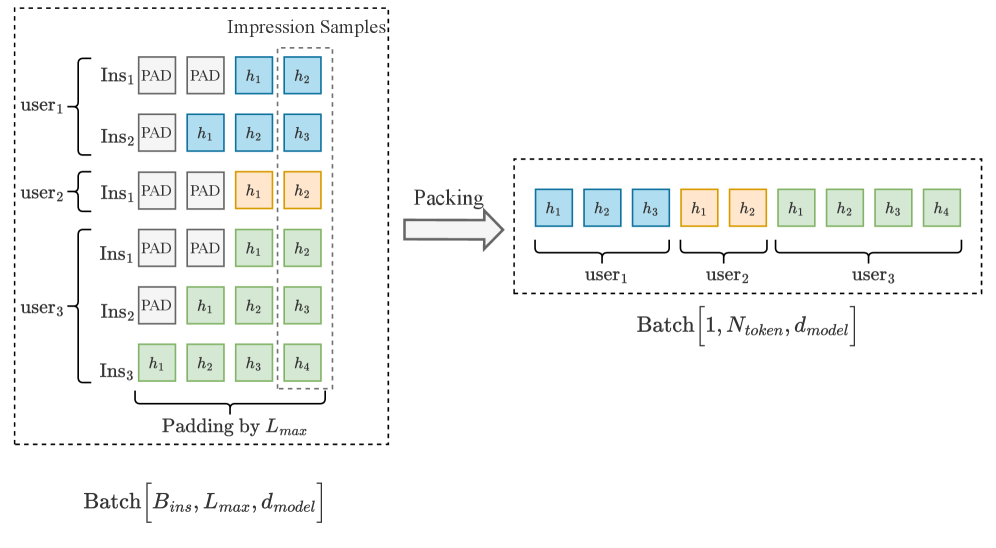
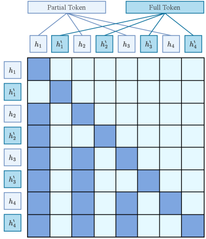
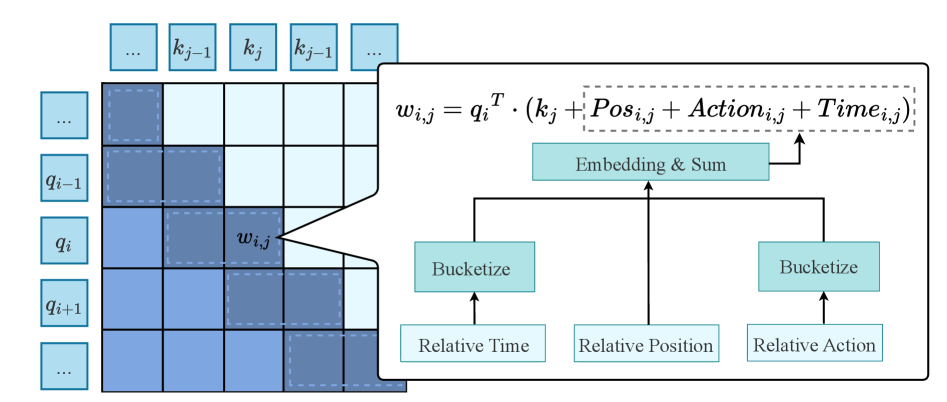
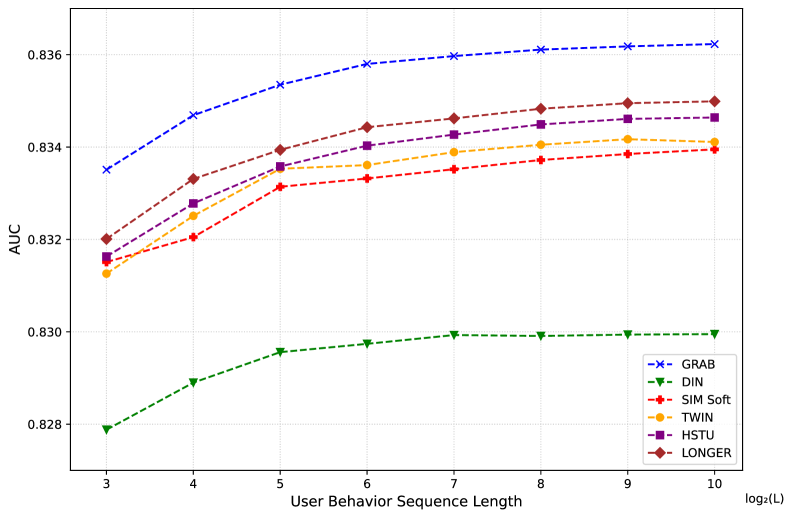
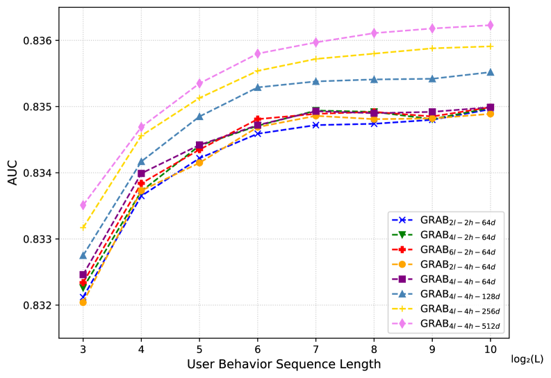

# GRAB: 受 LLM 启发的序列优先点击率预测建模范式

## 一、论文概述

| 项目 | 内容 |
|------|------|
| **标题** | GRAB: An LLM-Inspired Sequence-First Click-Through Rate Prediction Modeling Paradigm |
| **作者** | Shaopeng Chen, Chuyue Xie, Huimin Ren, Shaozong Zhang, Han Zhang, Ruobing Cheng, Zhiqiang Cao, Zehao Ju, Yu Gao, Jie Ding, Xiaodong Chen, Xuewu Jiao, Shuanglong Li, Lin Liu |
| **机构** | Baidu |
| **论文** | [arXiv:2602.01865](https://arxiv.org/abs/2602.01865) |
| **代码** | - |
| **发布** | 2026年2月 |
| **许可** | ICML |

## 二、核心思想

### 问题定义

传统深度学习推荐模型（DLRMs）面临性能和效率瓶颈：

1. **泛化能力差**：依赖规则特征工程，"强记忆、弱推理"
2. **长序列建模困难**：压缩历史为固定大小向量，难以扩展
3. **收益递减**：进一步改进需要指数级计算成本

**根本矛盾**：
- 稀疏参数需要多样、不相关的样本进行鲁棒"记忆"
- 密集参数受益于长、连贯的上下文进行序列"推理"

### 解决方案概述

GRAB（Generative Ranking for Ads at Baidu）是端到端的生成式 CTR 预测框架：

1. **端到端框架**：融合 DLRM 的大规模稀疏特征工程与 GR 的序列推理能力
2. **Causal Action-aware Multi-channel Attention (CamA)**：建模时间动态和特定动作信号
3. **Sequence-Then-Sparse (STS) 训练**：解耦密集参数和稀疏嵌入的优化

## 三、技术架构

### 整体框架图

GRAB 遵循三阶段流水线：

| 阶段 | 职责 | 关键技术 |
|------|------|----------|
| **稀疏特征层** | 原始日志 → 事件级稀疏 ID | DLRM 特征工程 |
| **密集分词器** | 事件 ID → 密集表示 | 聚合字段嵌入，投影到 $\mathbb{R}^{d_{\text{model}}}$ |
| **序列建模层** | 密集事件序列 → CTR 预测 | CamA 机制 |

### 核心公式

#### 序列打包与用户隔离因果掩码

**用户隔离因果掩码**：

$$M^{\mathrm{pack}}_{p,q} = \begin{cases} 1, & \text{if } \sigma(p) = \sigma(q) \text{ and } \ell(q) \leq \ell(p) \\ 0, & \text{otherwise} \end{cases}$$

其中 $\sigma(p)$ 为位置 $p$ 的用户 ID，$\ell(p)$ 为用户段内的局部时间索引。

**效果**：块对角下三角结构，每个块对应一个用户段。

#### 异构行为 token

**两种 token 视图**：
- **部分 token（历史）** $h_t$：仅保留时间变化信息
- **完整 token（候选）** $h'_t$：保留完整信息

**异构可见性掩码**：

$$M^{\mathrm{het}}_{p,q} = \begin{cases} 1, & \kappa(p) = \mathcal{P}, \kappa(q) = \mathcal{P}, \tau(q) \leq \tau(p) \\ 1, & \kappa(p) = \mathcal{F}, \kappa(q) = \mathcal{P}, \tau(q) \leq \tau(p) \\ 1, & \kappa(p) = \mathcal{F}, p = q \\ 0, & \text{otherwise} \end{cases}$$

**效果**：部分 token 仅关注部分历史，完整 token 关注部分历史和自身，但不关注其他完整 token。

#### 动作感知相对注意力偏置

**动作感知相对注意力 logit**：

$$w_{i,j} = q_i^\top \cdot (k_j + Pos_{i,j} + Action_{i,j} + Time_{i,j})$$

其中 $Pos_{i,j}$, $Action_{i,j}$, $Time_{i,j}$ 为可学习嵌入。

**高效计算**：

$$w_{i,j} = q_i^\top k_j + (s_i^{pos})[p_{i,j}] + (s_i^{act})[a_{i,j}] + (s_i^{time})[t_{i,j}]$$

其中 $s_i^{pos} = q_i^\top B^{pos}$，通过快速 gather 操作获取相对项。

#### Causal Action-aware Multi-channel Attention (CamA)

**多通道设计**：
- 每个通道 $c$ 有独立的因果可见性掩码 $M^{(c)}$
- 独立编码：$H^{(c,\ell+1)} = \text{Layer}^{(c)}_\ell(\tilde{H}^{(c,\ell)}; M^{(c)})$

**目标 token 门控混合**：

$$\tilde{h}^{(c,\ell)} = h^{(c,\ell)} + \sum_{i \in \mathcal{C} \setminus \{c\}} \beta^{(i,\ell)} \odot h^{(i,\ell)}$$

**效果**：轻量级跨通道信息共享，仅在目标位置混合。

#### Sequence-Then-Sparse (STS) 训练

**两阶段解耦优化**：

**阶段 I：序列建模（序列阶段）**
- 优化密集分词器和因果 Transformer
- 冻结稀疏嵌入表 $\Phi$
- 目标：学习事件间关系动态

**阶段 II：稀疏特征学习（稀疏阶段）**
- 使用阶段 I 的序列表示作为上下文
- 优化稀疏嵌入表 $\Phi$
- 目标：学习泛化的稀疏特征表示

### 模型组件

| 组件 | 说明 | 关键参数 |
|------|------|----------|
| **稀疏特征层** | 原始日志 → 事件级稀疏 ID | DLRM 特征工程 |
| **密集分词器** | 事件 ID → 密集表示 | 聚合字段嵌入 |
| **CamA** | 多通道注意力 | 独立因果掩码，门控混合 |
| **动作感知 RAB** | 相对位置/动作/时间偏置 | 高效计算，无 $L^2$ 中间张量 |
| **STS 训练** | 两阶段解耦优化 | 解决分布偏斜 |

### 训练流程

#### 分布偏斜问题

**问题**：序列打包导致小批次内用户相关性高，违反 i.i.d. 假设

**影响**：
- 稀疏参数过拟合特定用户
- 阻碍密集参数泛化

**解决方案**：STS 训练解耦优化

#### 工业部署

- 全规模在线部署
- 严格的在线服务和优化约束
- 高吞吐量训练和推理

## 四、核心创新

| 创新点 | 说明 | 理论/实验依据 |
|--------|------|---------------|
| **端到端框架** | 融合 DLRM 稀疏特征工程与 GR 序列推理 | 平衡显式记忆与隐式推理 |
| **CamA 机制** | 多通道、动作感知注意力 | 建模异构行为信号 |
| **STS 训练** | 解耦密集和稀疏参数优化 | 解决分布偏斜 |
| **序列打包** | 用户隔离因果掩码 | 消除填充开销 |
| **异构 token** | 部分/完整 token 双视图 | 减少冗余，保留信息 |

## 五、实验结果

### 实验设置

| 配置 | 说明 |
|------|------|
| **部署** | Baidu 商业广告 CTR 排序 |
| **基线** | 主流工业 DLRM + 新兴 GR 模型 |
| **评估** | 离线 AUC + 在线 A/B 测试 |

### 离线评估

**与基线对比**：
- 超越主流工业 DLRM
- 超越新兴 GR 模型
- 相对改进 0.19%

### 在线 A/B 测试

| 指标 | 改进 |
|------|------|
| **AUC** | +2 基点 |
| **CPM** | +3.05% |
| **CTR** | +3.49% |

**结论**：GRAB 在在线部署中显著提升收入和点击率。

### 缩放分析

**关键发现**：
- AUC 随模型容量单调提升
- AUC 随行为序列长度单调提升
- 近似线性改进，无饱和迹象

**结论**：架构可以从更长的行为链中稳定受益。

### 与现有方法对比

| 特性 | GRAB | DLRM | HSTU |
|------|------|------|------|
| **特征工程** | DLRM 级 | DLRM 级 | 简化 |
| **序列建模** | 端到端 | 附加编码器 | 端到端 |
| **异构行为** | ✓ | ✗ | ✗ |
| **分布偏斜** | STS 解决 | N/A | 未解决 |
| **缩放行为** | 线性 | 收益递减 | 线性 |
| **在线部署** | ✓ | ✓ | 困难 |

## 六、相关工作

### DLRM 工业 CTR 预测

| 方法 | 关键特性 | 局限性 |
|------|----------|--------|
| **DIN/DIEN** | 目标注意力 | 压缩历史为固定向量 |
| **SIM** | 长序列建模 | 依赖手工特征 |
| **TWIN** | 工业变体 | 仍依赖稀疏特征 |

### 生成式推荐

| 方法 | 关键特性 | 局限性 |
|------|----------|--------|
| **HSTU** | 自回归序列预测 | 忽略数据异质性 |
| **GRAB** | 端到端 + CamA + STS | 本文贡献 |

## 七、总结

### 核心贡献

1. **GRAB 框架**：端到端生成式 CTR 预测
2. **CamA 机制**：多通道、动作感知注意力
3. **STS 训练**：解耦密集和稀疏优化
4. **工业验证**：+3.05% 收入，+3.49% CTR
5. **缩放行为**：近线性改进，无饱和

### 技术影响

- **工业价值**：显著提升广告收入和点击率
- **架构创新**：融合 DLRM 和 GR 优势
- **训练稳定**：STS 解决分布偏斜
- **缩放潜力**：可以从更长序列中持续受益

### 局限性

- **领域特定**：针对广告 CTR 预测优化
- **未开源**：代码和模型未公开
- **计算成本**：多通道设计增加计算开销
- **特征依赖**：仍依赖 DLRM 级特征工程

## 八、参考资源

- **论文**: https://arxiv.org/abs/2602.01865
- **DLRM**: 相关工作
- **HSTU**: 相关工作
- **FlashAttention**: https://arxiv.org/abs/2205.14135
