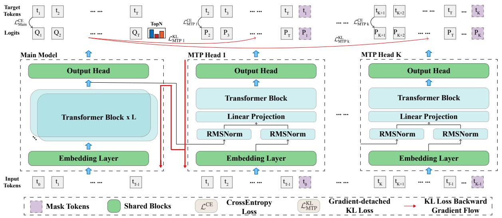
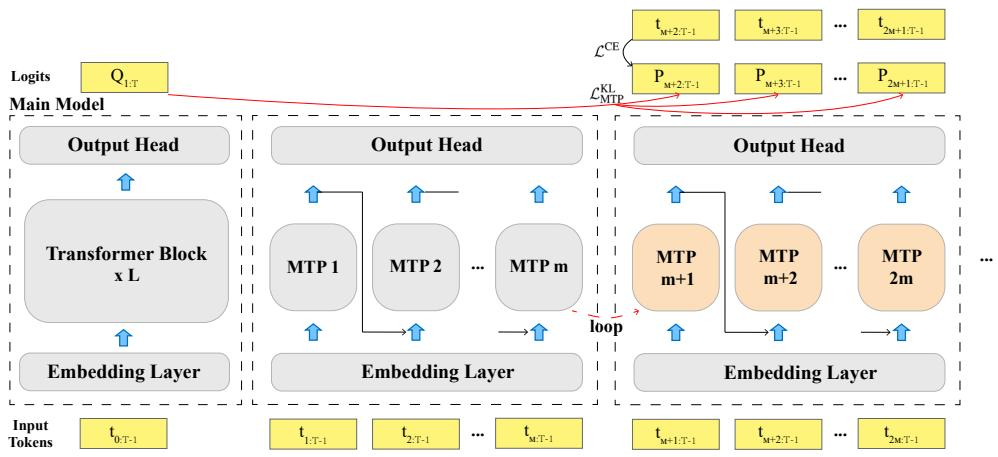
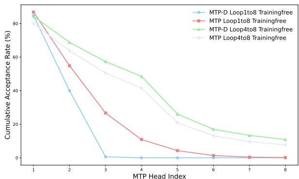
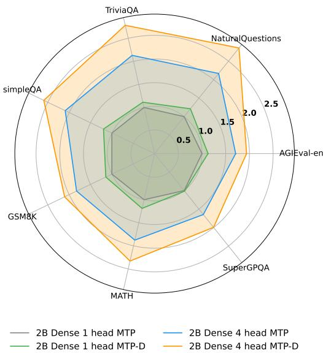
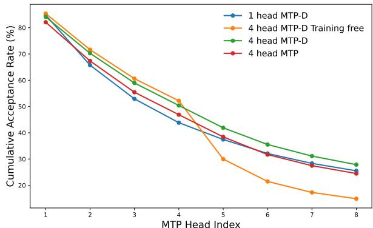
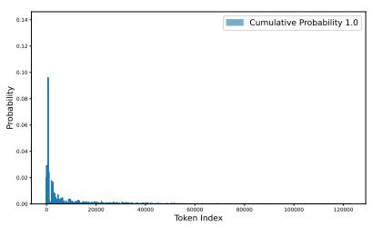

# Self-Distillation for Multi-Token Prediction: 通过自蒸馏提升多token预测效率

## 一、论文概述

| 项目 | 内容 |
|------|------|
| **标题** | Self-Distillation for Multi-Token Prediction |
| **作者** | Guoliang Zhao, Ruobing Xie, An Wang, Shuaipeng Li, Huaibing Sun, Xingwu Sun |
| **机构** | Xiaomi |
| **论文** | [arXiv:2603.23911](https://arxiv.org/abs/2603.23911) |
| **代码** | - |
| **发布** | 2026年3月 |
| **许可** | - |

## 二、核心思想

### 问题定义

随着大语言模型（LLM）规模的扩大，推理效率成为关键瓶颈。多token预测（MTP）可以通过并行预测多个未来token来加速LLM推理，但现有MTP方法面临两个挑战：

1. **MTP头接受率有限**：MTP头与主头之间存在持续的性能差距，限制了接受率，从而限制了推理加速。如Figure 7所示，MTP头在预训练期间产生显著更高的损失，且损失随MTP索引增长而增加。即使单头接受率适中，累积接受率也会迅速下降到不可接受的值。

2. **多MTP头联合训练困难**：添加更多MTP头会引入额外的损失项和超参数，可能阻碍主头优化并使大规模预训练复杂化。大多数实用LLM在训练中仅有1-4个MTP头。

### 解决方案概述

本文提出**MTP-D**，一种简单有效的自蒸馏方法，具有最小的额外训练成本：

1. **梯度脱离的TopN-logits选择自蒸馏**：引入额外的蒸馏监督信号，将MTP头的logit分布与主头对齐，强制MTP头与主头之间的logit分布一致性，从而显著提高MTP头的性能（+7.5%接受率）。

2. **循环扩展策略**：利用DeepSeek MTP架构的结构一致性和输入输出相似性，通过循环初始化和继续预训练来扩展MTP头数量，实现进一步推理加速（+220.4%）。

## 三、技术架构

### 整体框架图

**Figure 1**: 梯度脱离的TopN-logits选择自蒸馏方法概述。红色路径表示梯度传播路径，仅通过MTP头的预测分布P̂进行反向传播，不通过主头的logits Q̂。

### 核心公式

#### 多token预测损失

MTP的总训练损失由主头的交叉熵损失和所有MTP头的损失组成：

$$\mathcal{L}_{total} = \mathcal{L}_{main} + \sum_{k=1}^{K} \mathcal{L}_{mtp_k}$$

其中K是MTP头的数量。

#### MTP头损失

对于第k个MTP头，损失包括交叉熵损失和KL散度损失：

$$\mathcal{L}_{mtp_k} = \alpha_k \mathcal{L}_{mtp_k}^{CE} + \beta_k \mathcal{L}_{mtp_k}^{KL}$$

其中：
- $\mathcal{L}_{mtp_k}^{CE}$ 是标准交叉熵损失
- $\mathcal{L}_{mtp_k}^{KL}$ 是自蒸馏KL散度损失
- $\alpha_k$ 和 $\beta_k$ 是加权系数

#### 自蒸馏KL散度损失

$$\mathcal{L}_{mtp_k}^{KL} = \text{KL}(\hat{P}_k \| \hat{Q})$$

其中：
- $\hat{P}_k$ 是第k个MTP头的预测分布
- $\hat{Q}$ 是主头的预测分布（经过stop-gradient操作）

### 关键设计

#### 梯度脱离（Gradient-Detached）

为了最小化自蒸馏对主头的影响，对主头logits $\hat{Q}$ 应用stop-gradient操作：

- 在反向传播期间，$\mathcal{L}_{mtp_k}^{KL}$ 仅通过 $\hat{P}_k$ 传播梯度
- 这与MTP头的交叉熵损失 $\mathcal{L}_{mtp_k}^{CE}$ 的反向路径完全相同
- 因此，MTP-D可以最大限度地提高MTP头性能，同时保持主头的可比性能

#### TopN选择的Logits

现代LLM通常使用极大的词汇表（如本文设置中的122,880），全词汇自蒸馏计算成本高昂。如Figure 6所示，主头logits在softmax后遵循长尾分布，大多数token概率接近零。

**关键观察**：
- Top N = 10,000 token的累积概率达到0.9952
- Top N = 1,000 token的累积概率为0.8341

**解决方案**：选择Top N = 10,000个token进行高效稳定的自蒸馏。

### 循环扩展策略

**Figure 2**: MTP-D循环扩展训练策略。灰色块表示冻结的主模型和已训练的MTP头（1到m）。橙色块表示可训练的MTP头。

**循环扩展定义**：将先前训练的一组m个MTP头用于初始化下一组m个头，然后继续在扩展的MTP头上进行预训练。重复此操作可以逐步扩展MTP头数量。

**训练策略**：
- 主模型和先前训练的MTP头保持冻结
- 仅训练新初始化的MTP头
- 使用相同的自蒸馏策略
- 保持所有头之间输出分布的一致性

### 模型组件

| 组件 | 说明 | 关键参数 |
|------|------|----------|
| 主头（Main Head） | 标准的下一个token预测头 | 冻结 |
| MTP头（MTP Heads） | 额外的多token预测头 | 可训练 |
| 自蒸馏模块 | KL散度监督信号 | Top N = 10,000 |
| 循环扩展模块 | MTP头扩展策略 | m个头一组 |

## 四、核心创新

| 创新点 | 说明 | 理论/实验依据 |
|--------|------|---------------|
| **梯度脱离自蒸馏** | 使用stop-gradient防止蒸馏影响主头性能 | 主头性能保持不变 |
| **TopN-logits选择** | 仅选择Top N个token进行蒸馏，提高效率 | 累积概率0.9952 |
| **循环扩展策略** | 通过循环初始化扩展MTP头数量 | 推理加速+220.4% |
| **最小训练成本** | 自蒸馏引入的额外训练开销极小 | 训练时间增加<5% |

## 五、实验结果

### 实验配置

**模型规模**：
- 2B Dense模型
- A1B MoE模型

**评估基准**：
- AGIEval-en
- 其他6个推理基准

**MTP配置**：
- K = 1（单头MTP）
- K = 4（四头MTP）

### 接受率分析

**Figure 3**: 不同模型在无训练循环扩展下的MTP头接受率和累积接受率。(a) 显示扩展到8个MTP头的累积接受率，(b) 显示每个MTP头的接受率。

**关键发现**：
- MTP-D在K=1时，接受率比MTP提高3.6%，对应约14%的推理加速
- MTP-D在K=4时，第四MTP头的累积接受率提高7.5%，对应22.9%的加速
- 四头MTP-D相比单头配置，加速高达107.4%

### 推理加速

**Figure 4**: 2B Dense模型在不同MTP方法和K设置下的加速比，以1头MTP的推理速度为基线。

### 循环扩展性能

**Figure 5**: 不同循环扩展策略在最多8个循环下的性能比较，以1头MTP为基线。

**关键发现**：
- 循环扩展可以有效扩展MTP头数量
- 继续预训练的循环扩展在8个循环下表现最佳
- MTP-D在所有配置下都优于基线MTP

### Logit分布分析

**Figure 6**: 主头logits在不同TopN设置下的概率分布。

**关键发现**：
- 主头logits遵循长尾分布
- Top N = 10,000的累积概率为0.9952
- 选择Top N可以避免低概率token的干扰

## 六、相关工作

### 多token预测

| 方法 | 关键特性 | 本文对比 |
|------|----------|----------|
| **DeepSeek MTP** | 原生MTP架构，结构一致性 | 基线架构 |
| **Meta MTP** | 多头并行预测 | 相关工作 |
| **Medusa** | 推理时多头预测 | 相关工作 |

### 推理加速

| 方法 | 关键特性 | 本文对比 |
|------|----------|----------|
| **推测解码** | 小模型草稿+大模型验证 | 相关工作 |
| **并行解码** | 多头并行预测 | 核心方法 |
| **自蒸馏** | 知识蒸馏变体 | 核心创新 |

## 七、总结

### 核心贡献

1. **MTP-D自蒸馏方法**：提出梯度脱离的TopN-logits选择自蒸馏，显著提高MTP头接受率（+7.5%），同时保持主头性能

2. **循环扩展策略**：利用MTP架构的结构一致性，通过循环初始化扩展MTP头数量，实现进一步推理加速（+220.4%）

3. **系统性探索**：通过大量实验在七个基准上验证蒸馏策略和MTP的潜在可扩展性

4. **实用价值**：MTP-D具有最小的额外训练成本，促进MTP在LLM中的实际应用

### 技术影响

- **推理加速**：为LLM推理提供了一种高效的多token预测方法
- **训练效率**：自蒸馏方法引入最小的额外训练开销
- **架构设计**：为MTP头的设计和扩展提供了指导
- **实际部署**：促进MTP技术在实际LLM系统中的应用

### 局限性

- **模型规模**：主要在2B和A1B模型上验证
- **基准覆盖**：主要在推理基准上评估
- **计算资源**：循环扩展需要额外的预训练计算
- **接受率上限**：累积接受率仍限制最终加速比

## 八、参考资源

- **论文**: https://arxiv.org/abs/2603.23911
- **DeepSeek MTP**: 原生MTP架构
- **推测解码**: 相关推理加速技术
