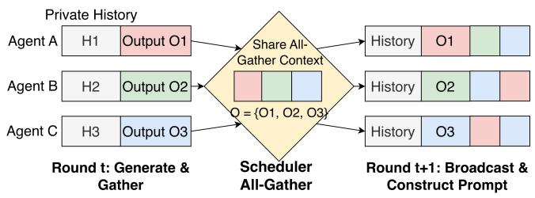
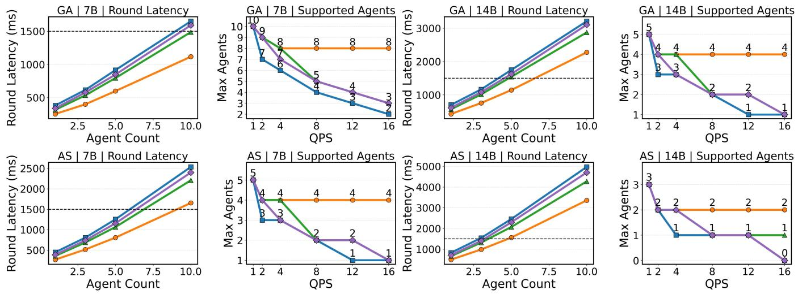
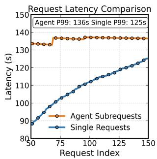
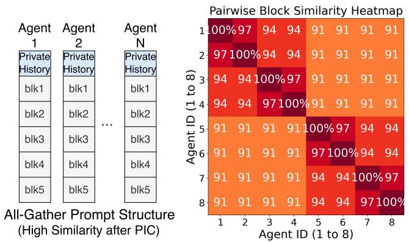

# TokenDance: Scaling Multi-Agent LLM Serving via Collective KV Cache Sharing

## 一、论文概述

| 项目 | 内容 |
|------|------|
| **标题** | TokenDance: Scaling Multi-Agent LLM Serving via Collective KV Cache Sharing |
| **作者** | Zhuohang Bian, Feiyang Wu, Chengrui Zhang, Hangcheng Dong, Yun Liang, Youwei Zhuo |
| **机构** | Peking University, Shanghai Jiao Tong University |
| **论文** | [arXiv:2604.03143](https://arxiv.org/abs/2604.03143) |
| **代码** | - |
| **发布** | 2024年4月 |
| **许可** | - |

## 二、核心思想

### 问题定义

多智能体LLM应用在同步轮次中组织执行，中央调度器收集所有智能体的输出并重新分配组合上下文。这种All-Gather通信模式导致**巨大的KV缓存冗余**，因为每个智能体的提示包含相同的共享输出块，但现有重用方法无法高效利用这一特性。

**关键问题**：
1. **低效重用**：由于私有历史长度不同，相同共享块在不同请求中出现在不同绝对位置，前缀缓存无法检测重叠
2. **低效存储**：重用后的KV缓存几乎相同（91-97%相似度），但每个智能体仍持有完整副本

### 解决方案概述

本文提出TokenDance，一个通过集体KV缓存共享来扩展并发智能体数量的系统：

1. **KV收集器（KV Collector）**：在一个集体步骤中执行全轮次的KV缓存重用，重用成本仅支付一次
2. **差异感知存储（Diff-Aware Storage）**：将兄弟缓存编码为相对于单一主副本的块稀疏差异，实现11-17倍压缩
3. **vLLM集成**：与vLLM无缝集成，支持生产级部署

**核心优势**：
- 支持比vLLM前缀缓存多2.7倍的并发智能体
- 每个智能体KV缓存存储减少最多17.5倍
- 预填充加速最多1.9倍

## 三、技术架构

### 整体框架图

**Figure 1**: All-Gather提示结构。所有智能体接收相同的输出块（O），但由于每个提示有自己的私有历史（H）且可能使用不同的块顺序，这些块出现在不同位置。

### 核心公式

#### All-Gather模式形式化

对于N个智能体的系统，每个智能体i在轮次t维护私有历史 $H_i^t$。在轮次t，每个智能体j产生输出块 $O_j^t$。共享输出集为：

$$
O^t = \{O_1^t, O_2^t, \dots, O_N^t\} \tag{1}
$$

智能体i在轮次t+1的提示为：

$$
P_i^{t+1} = H_i^t \| \Pi_i(O^t) \tag{2}
$$

其中 $\Pi_i$ 是调度器为智能体i定义的共享输出块布局。

### KV收集器（KV Collector）

**核心思想**：将重用计算分摊到轮次中的所有智能体，使共享块的重用成本仅支付一次。

**与现有方法的对比**：
- **前缀缓存**：仅当新请求与存储序列共享精确token前缀时才能重用
- **位置无关缓存（PIC）**：可恢复任意偏移的共享块，但仍按请求处理
- **TokenDance**：在轮次级别处理重用，一次集体步骤完成所有智能体的重用

### 差异感知存储（Diff-Aware Storage）

**核心观察**：在All-Gather工作负载中，智能体共享大部分轮次上下文，重用后的KV缓存几乎相同。

**量化证据**：在8个智能体的GenerativeAgents轮次中，成对块相似度范围为91%到97%。

**存储策略**：
- 维护单一主副本
- 兄弟缓存编码为块稀疏差异
- 实现11-17倍压缩

### 扩展性分析

**Figure 10**: 两个工作负载（GenerativeAgents、AgentSociety）和两个模型（Qwen2.5-7B、Qwen2.5-14B）的扩展能力概述。

## 四、核心创新

| 创新点 | 说明 | 理论/实验依据 |
|--------|------|---------------|
| **集体KV重用** | 一个集体步骤完成全轮次重用 | 成本与智能体数量无关 |
| **差异感知存储** | 块稀疏差异编码 | 11-17倍压缩 |
| **轮次级优化** | 检测智能体间的上下文重叠 | 91-97%相似度 |
| **vLLM集成** | 与现有推理引擎无缝集成 | 生产级部署 |

## 五、实验结果

### 扩展性评估

**评估框架**：
- GenerativeAgents
- AgentSociety

**评估模型**：
- Qwen2.5-7B
- Qwen2.5-14B

**关键结果**：
- 支持比vLLM前缀缓存多2.7倍的并发智能体（在SLO要求下）
- 每个智能体KV缓存存储减少最多17.5倍
- 预填充加速最多1.9倍（相比每请求位置无关缓存）

### 延迟分析

**Figure 2**: 单个A100-80GB GPU上多智能体与独立工作负载的扩展差距。两者发出相同总数的子请求（250个），但多智能体工作负载几乎耗尽KV缓存池。

**关键发现**：
- 多智能体会话消耗41.5 GiB KV缓存存储（99.3%），独立请求仅使用24.8 GiB（59.2%）
- 多智能体会话P99延迟为136秒，独立请求为125秒
- 内存池饱和迫使调度器抢占和交换

### 缓存相似度分析

**Figure 3**: PIC重用后KV缓存的高相似度。因为所有智能体重用相同的共享块，它们的KV缓存仅在私有重新计算的位置不同。

## 六、相关工作

### 多智能体LLM服务

| 方法 | 关键特性 | 本文对比 |
|------|----------|----------|
| **Parrot** | 智能体感知调度 | 不改变缓存存储 |
| **Autellix** | 智能体感知调度 | 不改变缓存存储 |
| **Tokencake** | 智能体感知调度 | 不改变缓存存储 |

### KV缓存重用

| 方法 | 关键特性 | 本文对比 |
|------|----------|----------|
| **前缀缓存（vLLM/SGLang）** | 精确前缀匹配 | 无法检测偏移重叠 |
| **位置无关缓存（PIC）** | 任意偏移重用 | 按请求处理，成本高 |
| **CacheBlend** | KV缓存混合 | 基准对比 |

### 分布式计算

| 方法 | 关键特性 | 本文对比 |
|------|----------|----------|
| **All-Gather** | 集体通信原语 | 模式启发 |

## 七、总结

### 核心贡献

1. **识别All-Gather模式**：识别多智能体LLM服务中的All-Gather通信模式及其导致的KV缓存冗余
2. **KV收集器**：设计集体KV缓存重用机制，一个步骤完成全轮次重用
3. **差异感知存储**：设计块稀疏差异编码，实现11-17倍压缩
4. **vLLM集成**：与vLLM无缝集成，支持生产级部署
5. **显著扩展性提升**：支持最多2.7倍并发智能体

### 技术影响

- **多智能体服务**：为多智能体LLM应用提供了高效的扩展方案
- **KV缓存管理**：展示了轮次级KV缓存优化的潜力
- **内存效率**：显著减少GPU内存占用
- **工程实践**：提供了完整的vLLM集成方案

### 局限性

- **模式依赖**：主要针对All-Gather模式优化
- **相似度假设**：假设智能体间的KV缓存高度相似
- **工作负载限制**：主要在社会模拟框架上验证
- **模型规模**：主要在7B-14B模型上评估

## 八、参考资源

- **论文**: https://arxiv.org/abs/2604.03143
- **vLLM**: https://github.com/vllm-project/vllm
- **SGLang**: https://github.com/sgl-project/sglang
- **GenerativeAgents**: https://arxiv.org/abs/2304.03442
- **AgentSociety**: https://arxiv.org/abs/2401.01392
