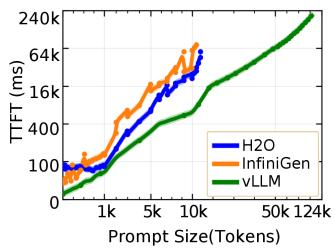
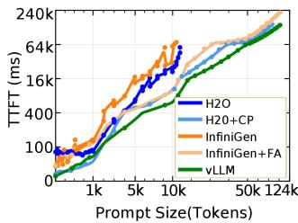
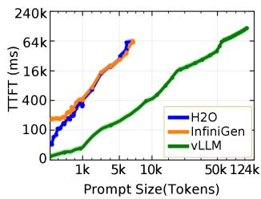
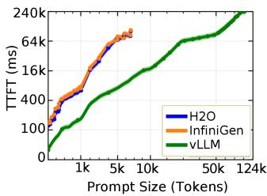
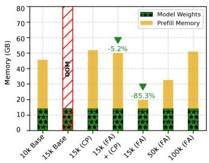

# Comparative Characterization of KV Cache Management Strategies for LLM Inference

## 一、论文概述

| 项目 | 内容 |
|------|------|
| **标题** | Comparative Characterization of KV Cache Management Strategies for LLM Inference |
| **作者** | Oteo Mamo, Olga Kogiou, Hyunjin Yi, Weikuan Yu |
| **机构** | Florida State University |
| **论文** | [arXiv:2604.05012](https://arxiv.org/abs/2604.05012) |
| **代码** | - |
| **发布** | 2024年4月 |
| **许可** | - |

## 二、核心思想

### 问题定义

大语言模型（LLM）推理越来越依赖键值（KV）缓存来存储每层先前计算的键和值向量。然而，KV缓存的增长带来了显著的系统级挑战，特别是随着模型大小增加、上下文长度增长和并发请求竞争有限内存资源。尽管最近出现了多个KV缓存管理框架，但它们在内存消耗和推理性能方面的**比较权衡尚未完全理解**。

### 解决方案概述

本文对三个最先进的KV缓存管理框架进行实证研究：

1. **vLLM**：内存管理框架，使用PagedAttention优化内存分配
2. **H2O**：静态稀疏化框架，基于注意力分数永久驱逐token
3. **InfiniGen**：动态选择框架，将完整KV缓存卸载到CPU，动态选择传输到GPU

**研究目标**：
- 跨延迟、吞吐量和内存使用评估性能
- 识别每个框架表现最佳的条件
- 提供内存和性能约束下的框架选择指导

## 三、技术架构

### KV缓存管理范式

| 范式 | 代表框架 | 核心策略 |
|------|----------|----------|
| **内存管理** | vLLM, ORCA, vTensor | 分页内存、连续批处理、无稀疏化 |
| **静态稀疏化** | H2O, Scissorhands, StreamingLLM | 永久驱逐、注意力分数选择 |
| **动态选择** | InfiniGen, InfLLM, Quest | 分层存储、解码时选择、可恢复驱逐 |

### 核心公式

#### KV缓存内存计算

$$
\operatorname{Mem}_{KV} = D \times H_{kv} \times (L_0 + t) \times d_h \times \text{sizeof}(\text{dtype}) \times 2
$$

其中D是层数，$H_{kv}$ 是键/值头数，$d_h$ 是每头维度，t是已生成token数。

**示例**：OPT-6.7B（D=32, Hkv=32, $d_h$=128）在FP16/BF16下，每个序列在2048 token时约1.0 GB，批量8时约8 GB。

### 框架特性

#### vLLM

**核心技术**：
- PagedAttention：将KV缓存划分为固定大小块，存储在非连续GPU内存中
- 减少碎片化，提高批处理效率
- 通过写时复制语义共享公共前缀token
- 集成FlashAttention-2优化注意力计算

#### H2O（Heavy Hitter Oracle）

**核心技术**：
- 观察：注意力权重高度偏向token小子集
- 识别"重击者"：累积最高注意力分数的token
- 仅保留其KV向量
- 形成最近token的滑动窗口
- 框架为动态子模块最大化问题

#### InfiniGen

**核心技术**：
- 将完整KV缓存从GPU卸载到CPU内存
- 在每个解码步骤动态选择要传输到GPU的条目
- 离线偏斜阶段：对查询和键权重矩阵进行SVD
- 运行时：维护紧凑的部分键矩阵
- 推测哪些token将获得高注意力分数

### 实验配置

**硬件环境**：
- 4× NVIDIA H100 GPU（80GB HBM3）
- 双Intel Sapphire Rapids处理器（每插槽56核）

**评估模型**：
- Llama-3.1-8B
- Llama-3.1-70B
- GPT-OSS-20B

**评估数据集**：
- LMSYS-Chat-1M：真实对话工作负载
- English Wikipedia：极端序列长度压力测试
- 6个推理基准：PIQA, HellaSwag, COPA, WinoGrande, OpenBookQA, BoolQ

## 四、核心创新

| 创新点 | 说明 | 理论/实验依据 |
|--------|------|---------------|
| **跨范式比较** | 首次跨不同KV缓存管理范式的比较评估 | 三个框架的系统评估 |
| **条件识别** | 识别每个框架表现最佳的条件 | 跨参数变化的实验 |
| **实践指导** | 提供框架选择的实践指导 | 实验结果分析 |
| **精度影响量化** | 量化KV缓存稀疏化的精度影响 | 基准测试结果 |

## 五、实验结果

### TTFT分析

**Figure 1a**: TTFT随提示长度缩放（Llama-3.1-8B, 1×H100）。

**关键发现**：
- vLLM在所有提示长度下保持最低TTFT，成功缩放到128K上下文窗口
- 基线H2O和InfiniGen在约10K token时遇到OOM失败（不到模型支持上下文长度的10%）
- 预填充内存需求（非KV缓存容量）是支持长上下文输入的约束

### 扩展上下文范围

**Figure 1b**: 使用FA和CP优化的扩展TTFT。

**关键发现**：
- FlashAttention-2（FA）和分块预填充（CP）是两种互补策略
- FA将注意力操作融合到单个GPU内核中
- CP将长提示分成更小块处理

### 多GPU缩放

**Figure 1c**: TTFT（GPT-OSS-20B, 2×H100）。

**Figure 1d**: TTFT（Llama-3.1-70B, 4×H100）。

**关键发现**：
- 反直觉的发现：尽管总内存更大，多GPU配置下OOM失败更早发生
- 在张量并行下，模型参数分布在设备间，但注意力计算仍定位在单个GPU
- 每设备可用于O(n²)注意力矩阵的内存随模型分布增加而减少

### 内存分解

**Figure 2**: GPU内存分解。

**关键发现**：
- FA显著减少预填充内存需求
- FA+CP组合提供最佳内存效率
- 模型权重和预填充内存的比例随配置变化

## 六、相关工作

### KV缓存管理框架

| 框架 | 关键特性 | 本文对比 |
|------|----------|----------|
| **vLLM** | PagedAttention、连续批处理 | 内存管理代表 |
| **H2O** | 重击者Oracle、永久驱逐 | 静态稀疏化代表 |
| **InfiniGen** | 分层存储、动态选择 | 动态选择代表 |
| **SnapKV** | 注意力分数选择 | 相关工作 |
| **StreamingLLM** | 滑动窗口 | 相关工作 |

### 优化技术

| 技术 | 关键特性 | 本文对比 |
|------|----------|----------|
| **FlashAttention-2** | 融合注意力内核 | 优化技术 |
| **分块预填充** | 长提示分块处理 | 优化技术 |
| **PagedAttention** | 分页内存管理 | 核心技术 |

## 七、总结

### 核心贡献

1. **跨范式比较**：首次跨不同KV缓存管理范式（内存管理、静态稀疏化、动态选择）的比较评估
2. **条件识别**：识别每个框架表现最佳的条件，包括请求速率、模型大小和稀疏度水平
3. **实践指导**：提供内存和性能约束下的框架选择指导
4. **精度影响量化**：量化KV缓存稀疏化对标准基准和自定义保留任务的精度影响
5. **瓶颈分析**：识别性能瓶颈和可扩展性限制

### 技术影响

- **框架选择**：为实践者提供了框架选择的实证指导
- **系统设计**：为设计更高效的KV缓存管理系统提供了见解
- **优化方向**：识别了各范式的优化方向和限制
- **研究基础**：为未来KV缓存管理研究提供了比较基础

### 局限性

- **框架覆盖**：仅评估了三个代表性框架
- **模型规模**：主要在8B-70B模型上评估
- **工作负载**：主要在对话和推理工作负载上验证
- **配置固定**：使用默认或固定配置，未充分探索配置空间

## 八、参考资源

- **论文**: https://arxiv.org/abs/2604.05012
- **vLLM**: https://github.com/vllm-project/vllm
- **H2O**: https://github.com/FMInference/H2O
- **InfiniGen**: https://github.com/efeslab/InfiniGen
- **FlashAttention-2**: https://arxiv.org/abs/2307.08691
