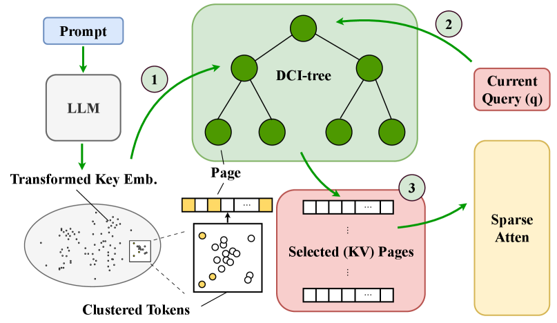
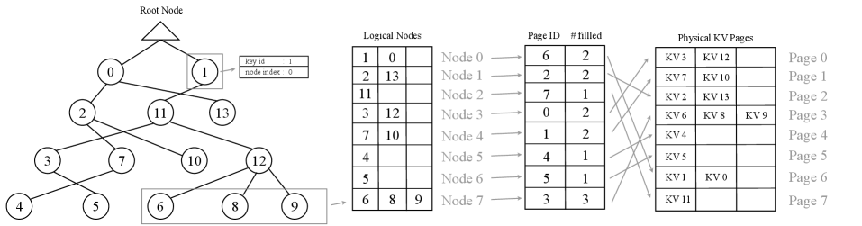
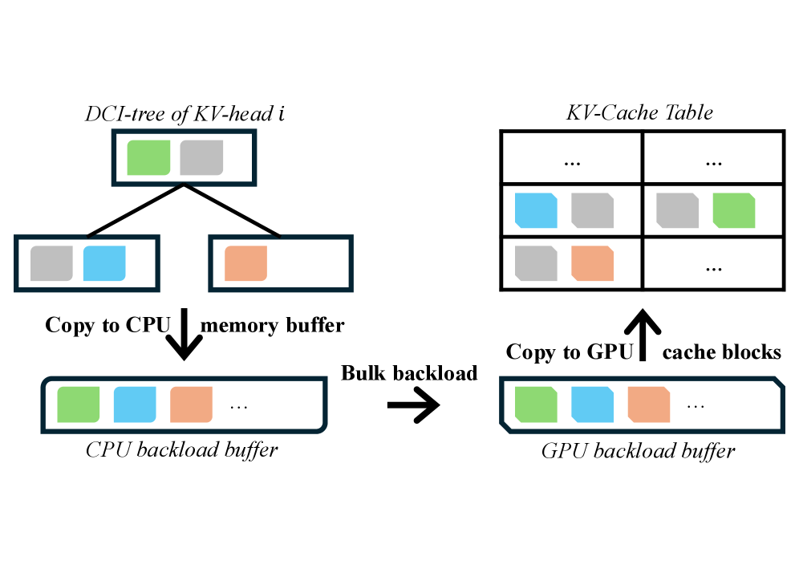
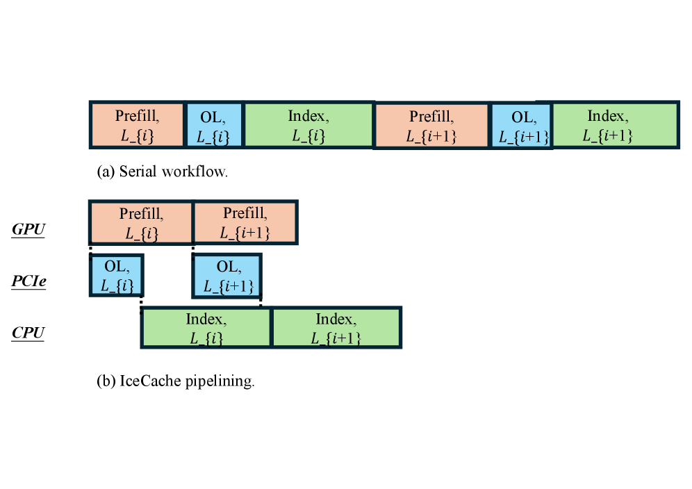
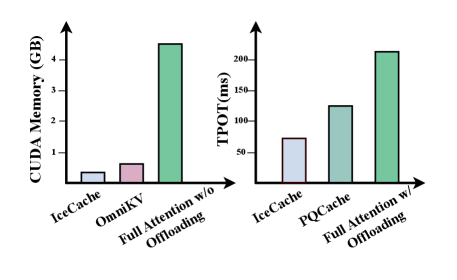
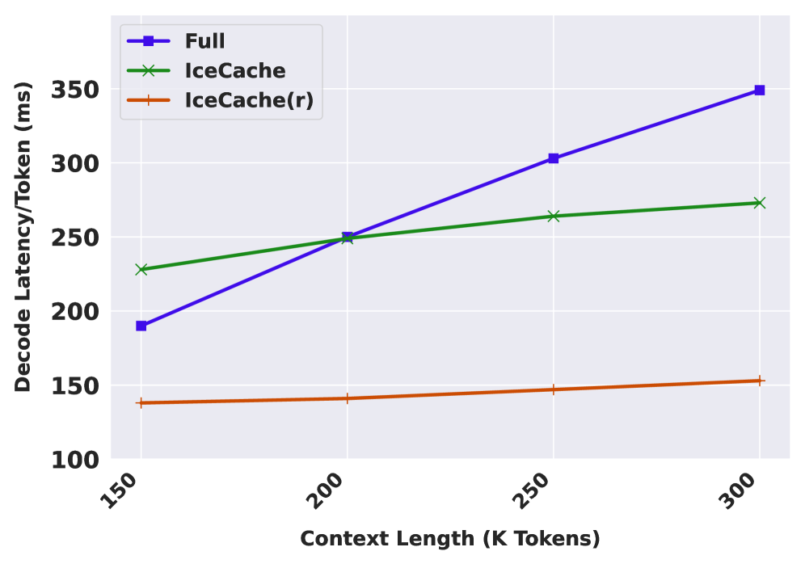

# IceCache: Memory-efficient KV-cache Management for Long-Sequence LLMs

## 一、论文概述

| 项目 | 内容 |
|------|------|
| **标题** | IceCache: Memory-efficient KV-cache Management for Long-Sequence LLMs |
| **作者** | Yuzhen Mao, Qitong Wang, Martin Ester, Ke Li |
| **机构** | Simon Fraser University, Harvard University |
| **论文** | [arXiv:2604.10539](https://arxiv.org/abs/2604.10539) |
| **代码** | [项目主页](https://yuzhenmao.github.io/IceCache/) |
| **发布** | 2024年4月 |
| **许可** | - |

## 二、核心思想

### 问题定义

键值（KV）缓存在大语言模型（LLM）推理中通过存储中间注意力状态和避免自回归生成期间的冗余计算来加速推理。然而，其内存占用随序列长度线性增长，通常在资源受限硬件上导致严重的内存瓶颈。

### 解决方案概述

本文提出IceCache，一种新颖的KV缓存管理策略，将语义token聚类与PagedAttention集成。通过将语义相关的token组织到由分层、可动态更新的数据结构管理的连续内存区域中，实现了更高效的token选择和更好的CPU-GPU传输期间的内存带宽利用率。

**核心优势**：
- **语义聚类**：将语义相似的token分组到相同内存页
- **分层数据结构**：支持高效索引、快速检索和动态更新
- **流水线优化**：重叠CPU和GPU计算，隐藏索引和检索延迟

**关键结果**：
- 256 token预算下保持全KV缓存模型99%的精度
- 仅使用25% KV缓存token预算即可实现竞争性甚至更优的延迟和精度

## 三、技术架构

### 整体框架图

**Figure 2**: IceCache概述。(1) 预填充阶段：token根据其在变换后的键嵌入空间中的语义相似性被索引到分层数据结构（DCI-tree）中。(2) 解码阶段：给定查询q，IceCache执行树搜索以识别与q最相关的top-k token。(3) 查询感知检索后，选择包含相关token的页面，这些页面中的所有token用于后续的稀疏注意力。

### 核心设计

#### DCI-tree数据结构

**Figure 3**: DCI-tree和IceCache概述：左侧的分层数据结构可视化了索引键嵌入的结果。

**关键特性**：
- 每个注意力头构建单独的DCI-tree
- 每个节点代表一小组语义相关的token
- 节点直接映射到内存页
- 支持高效增量更新

#### 核心公式

**键和查询变换**：

$$
T_{K}(\mathbf{k}_{j}) = \begin{bmatrix}\mathbf{k}_{j}/c & \sqrt{1-\|\mathbf{k}_{j}\|_{2}^{2}/c^{2}}\end{bmatrix}^{\top}
$$

$$
T_{Q}(\mathbf{q}_{i}) = \begin{bmatrix}\mathbf{q}_{i}/\|\mathbf{q}_{i}\|_{2} & 0\end{bmatrix}^{\top}
$$

其中 $c \geq \max_{j^{\prime}}\|\mathbf{k}_{j^{\prime}}\|_{2}$ 至少是所有键的最大范数。

**注意力权重计算**：

$$
a_{i,j} = \frac{s_{i,j}\exp\left(\frac{\mathbf{q}_{i}^{\top}\mathbf{k}_{j}}{\sqrt{d}}\right)}{\sum_{j^{\prime}=1}^{m}s_{i,j^{\prime}}\exp\left(\frac{\mathbf{q}_{i}^{\top}\mathbf{k}_{j^{\prime}}}{\sqrt{d}}\right)}
$$

### 批量加载与流水线

**Figure 4**: IceCache选择重要KV页面后，将所有选定页面聚合到连续的CPU预加载缓冲区中。然后通过高吞吐量PCIe事务传输到预分配的GPU缓冲区。

**Figure 5**: (a) 基线串行工作流。(b) IceCache流水线：GPU预填充与KV卸载和CPU端DCI索引重叠。

### 性能权衡

**Figure 1**: IceCache在A100上36k序列长度下CUDA内存占用和每输出token时间（TPOT）之间具有最佳权衡。

## 四、核心创新

| 创新点 | 说明 | 理论/实验依据 |
|--------|------|---------------|
| **语义token聚类** | 将语义相似的token分组到相同内存页 | 检索命中率提升 |
| **DCI-tree结构** | 分层、可动态更新的数据结构 | 高效索引和检索 |
| **M-DCI算法** | 多级动态连续索引 | 快速近似最近邻搜索 |
| **批量加载** | 聚合页面进行高效PCIe传输 | 内存带宽利用率提升 |
| **流水线优化** | 重叠CPU和GPU计算 | 延迟隐藏 |

## 五、实验结果

### LongBench性能

**实验配置**：
- 模型：Llama3.1-8B-Instruct, Mistral-7B-Instruct-v0.2, LongChat-7B-v1.5, Qwen3-32B
- KV缓存预算：64, 128, 256 tokens

**关键结果**：
- 256 token预算下保持全KV缓存模型99%的精度
- 仅使用25% KV缓存token预算即可实现竞争性甚至更优的延迟和精度
- 在所有基准测试中 consistently 优于六个最先进的KV缓存基线

### GSM8K CoT推理

**关键发现**：
- 在长生成任务（如链式思维推理）中有效缓解性能退化
- 利用分层和可动态更新的数据结构

### 延迟分析

**Figure 8**: 不同上下文长度（150k, 200k, 250k, 300k）下的延迟缩放。

**关键发现**：
- IceCache在长上下文场景中表现出色
- 延迟随上下文长度线性增长

## 六、相关工作

### KV缓存驱逐方法

| 方法 | 关键特性 | 本文对比 |
|------|----------|----------|
| **H2O** | 基于注意力分数的token选择 | 基准对比 |
| **StreamingLLM** | 保留汇聚token和最近token | 基准对比 |
| **SnapKV** | 从提示尾部选择键嵌入 | 基准对比 |

### KV缓存卸载方法

| 方法 | 关键特性 | 本文对比 |
|------|----------|----------|
| **MagicPiG** | 基于LSH的采样技术 | 基准对比 |
| **OmniKV** | 跨层重用重要token | 基准对比 |
| **PQCache** | 乘积量化压缩 | 基准对比 |

### PagedAttention

| 方法 | 关键特性 | 本文对比 |
|------|----------|----------|
| **PagedAttention** | 分页内存管理 | 基础技术 |
| **Quest** | 查询感知页面选择 | 基准对比 |
| **ArkVale** | GPU-CPU卸载集成 | 基准对比 |

## 七、总结

### 核心贡献

1. **IceCache策略**：提出将语义token聚类与PagedAttention集成的KV缓存管理策略
2. **DCI-tree结构**：开发支持高效索引、快速检索和动态更新的分层数据结构
3. **M-DCI算法**：设计多级动态连续索引算法用于快速近似最近邻搜索
4. **批量加载优化**：设计高效的批量加载和流水线方案
5. **显著性能提升**：在高压缩比率下实现最先进的精度和效率

### 技术影响

- **KV缓存管理**：为长序列LLM推理提供了高效的KV缓存管理方案
- **语义聚类应用**：展示了语义聚类在缓存管理中的潜力
- **内存效率**：显著减少了GPU内存占用
- **工程实践**：提供了完整的优化和部署方案

### 局限性

- **索引开销**：构建DCI-tree需要额外的计算开销
- **动态更新**：新token的插入需要更新树结构
- **超参数敏感**：提升比率等超参数需要调优
- **模型依赖**：需要为每个注意力头构建单独的树

## 八、参考资源

- **论文**: https://arxiv.org/abs/2604.10539
- **项目主页**: https://yuzhenmao.github.io/IceCache/
- **PagedAttention**: https://arxiv.org/abs/2309.06180
- **Quest**: https://arxiv.org/abs/2406.10774
- **ArkVale**: https://arxiv.org/abs/2409.07146
