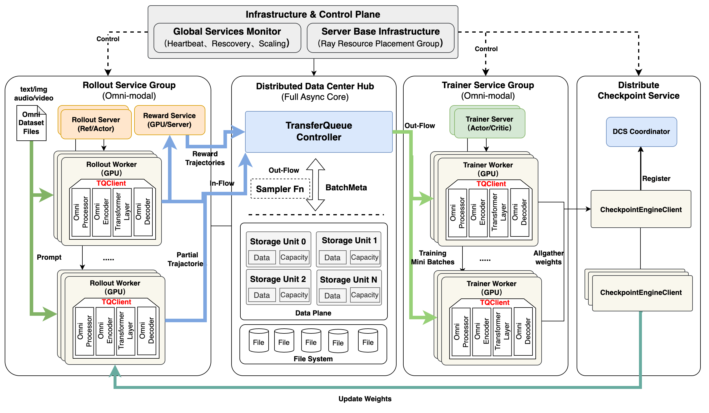
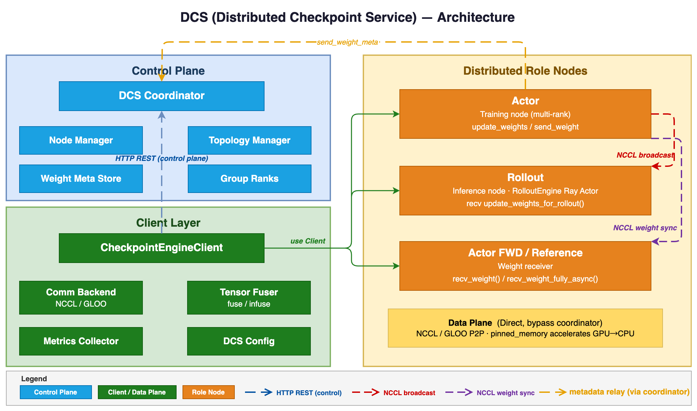
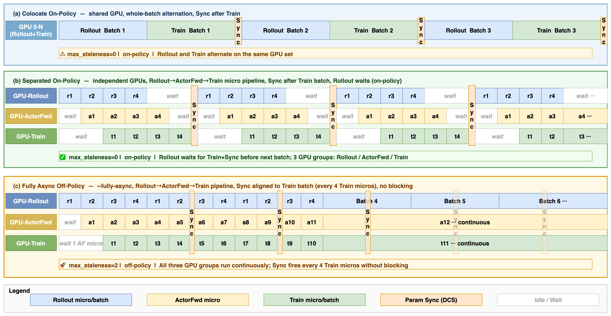
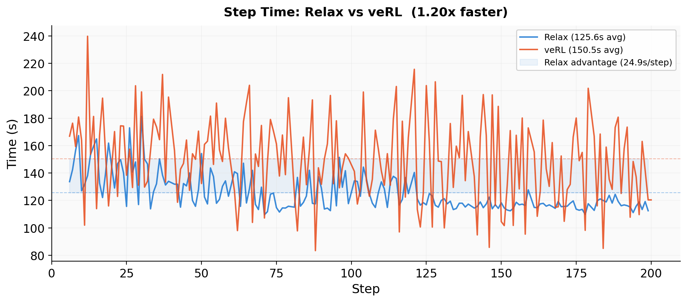
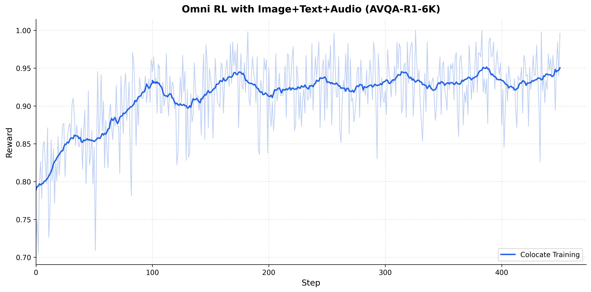
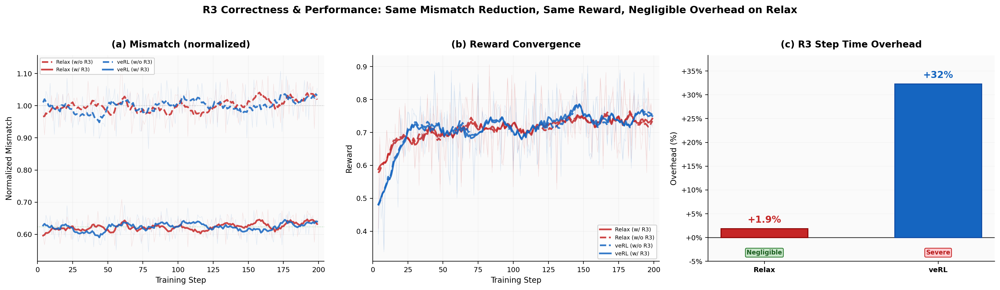

# Relax: 面向全模态后训练的异步强化学习引擎

## 一、论文概述

| 项目 | 内容 |
|------|------|
| **标题** | Relax: An Asynchronous Reinforcement Learning Engine for Omni-Modal Post-Training at Scale |
| **作者** | Liujie Zhang, Benzhe Ning, Rui Yang, Xiaoyan Yu, Jiaxing Li, Lumeng Wu, Jia Liu, Minghao Li, Weihang Chen, Weiqi Hu, Lei Zhang |
| **机构** | 小红书 AI 平台团队 (Xiaohongshu Inc)、香港大学、中国科学技术大学 |
| **论文** | [arXiv:2604.11554](https://arxiv.org/abs/2604.11554) |
| **代码** | [GitHub: redai-infra/Relax](https://github.com/redai-infra/Relax) |
| **发布** | 2026年4月13日 |
| **许可** | arXiv 非排他性分发许可 |

## 二、核心思想

### 问题定义

随着大语言模型向全模态（图像、视频、音频 + 文本）和智能体多轮交互方向发展，RL 训练系统面临三个相互耦合的核心挑战：

1. **异构数据流**：不同模态的数据在表示、大小、预处理延迟和内存占用上差异巨大（一张高分辨率图像的 token 数可能是文本 prompt 的 50 倍）
2. **大规模运行鲁棒性**：全模态工作负载存在严重的长尾延迟分布，且更容易出现 OOM 故障
3. **陈旧性-吞吐量权衡**：同步训练中 trainer GPU 等待最慢 rollout 的空闲时间问题

### 解决方案概述

Relax 的核心洞察是这三个挑战紧密耦合，需要**协同设计**解决：

- 全模态数据引入工作负载异构性 → 需要服务级故障隔离
- 服务解耦使得异步数据总线成为可能 → 解决吞吐量与策略新鲜度的矛盾
- 异步总线的字段级存储模型自然适配异构模态字段 → 回到第一个挑战

## 三、技术架构

### 整体框架图

Relax 将 RL 训练系统分解为三个正交平面：

| 平面 | 职责 | 技术实现 |
|------|------|----------|
| **控制平面 (Control Plane)** | Controller 编排训练循环，发出高级指令 | Ray Serve Deployment |
| **计算平面 (Computation Plane)** | 每个 RL 角色在独立后端执行 | Megatron-LM (训练) + SGLang (推理) |
| **数据平面 (Data Plane)** | TransferQueue 总线管理所有角色间数据交换 | TransferQueue (TQ) |

### 服务导向架构

每个 RL 角色作为独立的 Ray Serve Deployment 运行，提供三个核心优势：

1. **故障隔离**：通过两级恢复机制（就地重启 vs 全局重启）
2. **独立扩展**：可单独扩展 rollout 副本而不调整 critic 集群
3. **角色级生命周期管理**：初始化、检查点、重启均在服务级别管理

**分布式检查点服务 (DCS)**：
- Coordinator：控制平面，执行拓扑发现、协调同步屏障
- CheckpointEngineClient：统一接口，抽象传输细节
- 支持两种传输后端：NCCL（集群内 GPU-GPU）和 TCP（跨集群）

### 异步训练机制

**陈旧度统一控制**：

$$s = v_t - v_r$$

其中 $v_t$ 为训练侧当前权重版本，$v_r$ 为 rollout worker 生成数据时使用的权重版本。通过单一参数 `max_staleness` 控制：

- `max_staleness = 0`：严格 on-policy
- `max_staleness = 1`：近 on-policy
- `max_staleness > 1`：完全异步 off-policy

**流式数据流**：
- 将全局 batch 划分为微批次（如 32 个样本）
- 微批次完成后立即写入 TQ，供下游消费
- 训练侧流式数据加载器持续监控分区就绪事件

**多模态字段级解耦**：
- TQ 的字段级存储支持不同模态字段独立读写
- 图像字段毫秒级就绪，视频字段秒级解码
- 依赖文本和图像字段的下游服务可立即开始处理

### 模型组件

| 组件 | 说明 | 关键参数 |
|------|------|----------|
| **Actor** | 策略模型训练 | Megatron-LM 3D 并行 (TP/PP/CP/EP) |
| **Rollout** | 推理生成 | SGLang 高吞吐推理引擎 |
| **Critic** | 价值网络（可选） | 独立 Ray Serve Deployment |
| **ActorFwd** | 前向推理计算 log-prob | 资源分离部署 |
| **Reference** | 参考模型 log-prob 计算 | 独立 GPU 资源 |
| **Advantages** | 优势估计 | 无状态角色，可就地重启 |
| **GenRM** | 生成式奖励模型 (LLM-as-Judge) | 独立服务，可独立扩缩容 |

### 训练流程

1. Controller 发出 "generate rollouts" 指令
2. Rollout 服务通过 SGLang 生成响应，流式写入 TQ
3. Reward 服务（规则型或 GenRM）计算奖励
4. Advantages 服务估计优势函数
5. Actor 服务执行策略梯度更新
6. DCS 将更新权重同步到所有推理引擎

## 四、核心创新

| 创新点 | 说明 | 理论/实验依据 |
|--------|------|---------------|
| **角色隔离服务架构** | 每个 RL 角色作为独立 Ray Serve Deployment | 故障不传播，角色可独立扩缩容 |
| **陈旧度统一异步训练** | 单一 `max_staleness` 参数统一 on-policy/off-policy | 同一代码库支持所有训练模式 |
| **流式微批次调度** | 替代全局 batch 同步，消除长尾阻塞 | 训练引擎数据等待仅 0.11s/step |
| **全模态原生架构** | 从数据预处理到推理生成全栈多模态支持 | 支持图像/文本/音频/视频 RL 训练 |
| **近零开销 R3** | MoE 模型路由重放，仅 1.9% 开销（veRL 32%） | NCCL 零拷贝广播，GPU 常驻 |
| **DCS 分布式检查点** | 独立权重同步服务 | 支持 NCCL 和 TCP 两种传输后端 |

## 五、全模态智能体 RL

### 统一数据管道

Relax 的全模态管道跨越三个阶段：

1. **统一数据管道**：将包含异构媒体的原始 JSON 记录转换为模型就绪的 batch 张量
   - 模态特定加载器解析媒体引用
   - 二进制 mask 区分用户输入和助手输出（RL 策略损失仅计算助手 token）
   - 动态变换注入：通过偏应用组装编码函数，支持不同模型族

2. **多模态并行策略**：
   - **ViT 张量并行**：在所有 TP 副本上复制视觉编码器（ViT 参数仅占总模型 1-5%）
   - **编码器感知流水线并行**：所有模态编码器放置在第一个 PP 阶段 (PP0)

3. **Megatron Bridge 集成**：HuggingFace ↔ Megatron 检查点自动双向转换

### 智能体 RL 扩展性

- **自定义 rollout 和奖励**：支持多轮智能体工作流，奖励计算作为可插拔服务
- **工具和沙箱集成**：工具调用视为异步服务调用，沙箱实例作为临时服务管理

## 六、实验结果

### 基准测试

#### 端到端性能对比（Qwen3-4B / DAPO-MATH-17k / 16×H800）

| 指标 | Relax | veRL | 提升 |
|------|-------|------|------|
| **Step Time** | 125.6s | 150.5s | 1.20× 加速 |
| **Steps/Hour** | 28.7 | 23.9 | +20% |
| **Rollout 开销** | 0s（完全掩码） | 38.2s（关键路径） | - |
| **Ref LogP 额外开销** | 0s（资源分离） | 27.3s（顺序阶段） | - |

#### 训练模式对比（Qwen3-4B / DAPO-MATH-17k）

| 指标 | Colocate | Async On-Policy | Async Off-Policy |
|------|----------|-----------------|------------------|
| **Step Time** | 225.9s | 201.0s | 128.6s |
| **Steps/Hour** | 15.9 | 17.9 | 28.0 |
| **vs Colocate 加速** | 1.00× | 1.12× | **1.76×** |
| **Sleep/Wakeup 开销** | 10s/step | 0s | 0s |

三种模式收敛到相同奖励水平，确认陈旧度不影响训练质量。

#### 全模态性能（Qwen3-Omni-30B / Echo Ink / 16×H20）

| 指标 | Colocate | Fully Async |
|------|----------|-------------|
| **Step Time** | 267.4s | 133.6s |
| **Steps/Hour** | 13.5 | 26.9 |
| **加速比** | 1.00× | **2.00×** |
| **最终奖励** | ~0.93 | ~0.93 |

### 全模态收敛验证

- **Echo Ink (图像+文本+音频)**：Qwen3-Omni-30B 从初始奖励 0.72 收敛到 ~0.93（450 步内）
- **NextQA (视频)**：2000+ 连续训练步骤，奖励从 ~0.75 单调提升到 ~0.93，方差稳定在 0.04-0.06

### 消融实验

#### R3 路由重放（Qwen3-30B-A3B / 16×H800）

| 配置 | 路由不匹配减少 | Step Time 开销 |
|------|----------------|----------------|
| **veRL + R3** | ~38% | **+32%** |
| **Relax + R3** | ~38% | **+1.9%** |

Relax 通过重写序列化路径（NCCL 零拷贝广播）实现近零开销 R3。

### 与现有方法对比

| 特性 | Relax | veRL | OpenRLHF | AReaL |
|------|-------|------|----------|-------|
| **全模态支持** | ✅ 图像/文本/音频/视频 | 部分 (VLM) | 部分 | 文本为主 |
| **异步训练** | ✅ 统一陈旧度控制 | 同步为主 | 异步 | 异步 |
| **服务隔离** | ✅ Ray Serve 独立部署 | 单体循环 | Ray 调度 | 部分 |
| **R3 支持** | ✅ 1.9% 开销 | 32% 开销 | - | - |
| **故障恢复** | ✅ 两级恢复 | 全局重启 | 部分 | 部分 |

## 七、相关工作

| 框架 | 特点 | 与 Relax 的关系 |
|------|------|-----------------|
| **veRL** | HybridFlow 编程模型，3D-HybridEngine 重分片 | Relax 在相同技术栈上实现 1.20× 加速 |
| **OpenRLHF** | Ray 调度 + DeepSpeed 集成 | Relax 借鉴其异步 RL + 智能体工作流 |
| **AReaL** | 大规模异步训练，陈旧度感知策略优化 | Relax 统一陈旧度参数简化配置 |
| **ProRL** | Rollout-as-a-Service 抽象 | Relax 扩展到全模态智能体 RL |
| **Slime** | Megatron + SGLang + 集中式数据缓冲 | Relax 使用 TransferQueue 替代集中式缓冲 |

## 八、总结

### 核心贡献

1. **角色隔离服务架构**：基于 Ray Serve 的独立部署，提供故障隔离、独立扩缩容和角色级生命周期管理
2. **陈旧度统一异步训练**：通过 TransferQueue 和单一 `max_staleness` 参数统一 on-policy/off-policy 训练
3. **全模态智能体 RL**：原生支持图像/文本/音频/视频，提供智能体 RL 扩展接口

### 技术影响

- **性能提升**：1.76× (4B) 到 2.00× (30B) 的加速比，且随模型规模增大优势更明显
- **训练稳定性**：支持 2000+ 步全模态 RL 训练无退化
- **工程实践**：近零开销 R3 使 MoE 模型 RL 训练更加实用
- **开源贡献**：为全模态和智能体 RL 训练提供可用基础

### 局限性

- 论文主要聚焦于 Qwen 系列模型，其他模型族的适配性待验证
- 全模态实验主要在感知任务上验证，复杂推理任务的全模态 RL 待深入探索
- 异步训练的陈旧度对更复杂任务（如长链推理）的影响需进一步研究

## 九、参考资源

- **论文**: https://arxiv.org/abs/2604.11554
- **代码**: https://github.com/redai-infra/Relax
- **TransferQueue**: https://github.com/Ascend/TransferQueue
- **Megatron Bridge**: https://github.com/NVIDIA-NeMo/Megatron-Bridge
