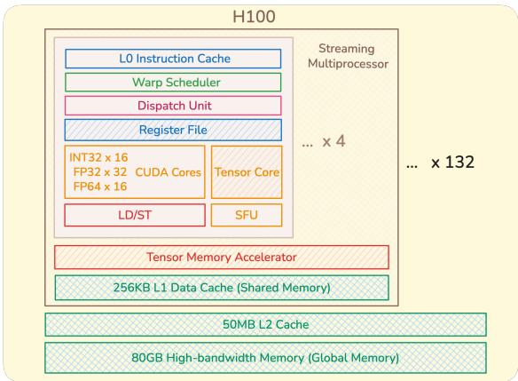
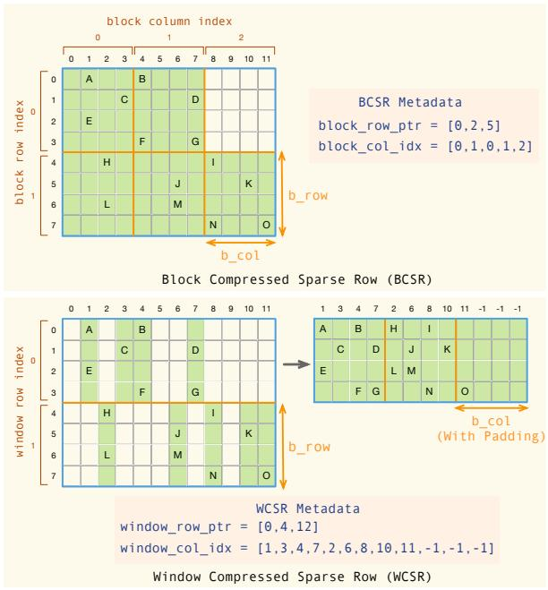
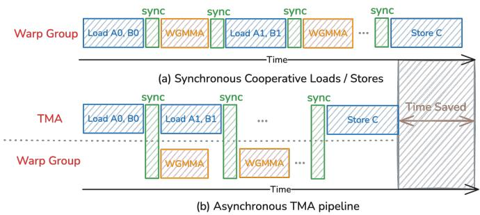
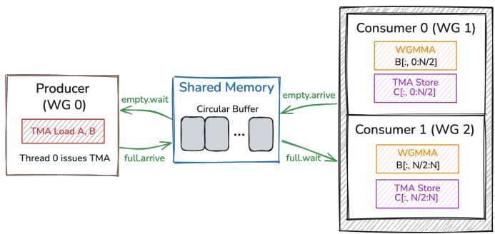
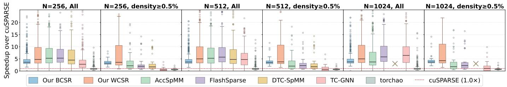
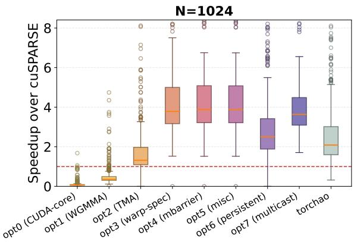
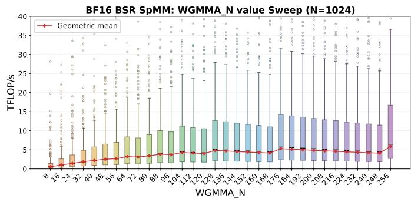
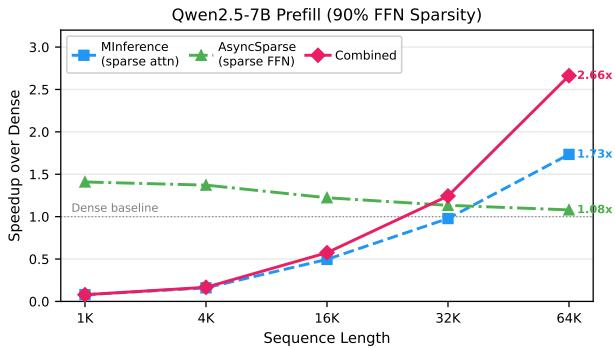

# AsyncSparse: Accelerating Sparse Matrix-Matrix Multiplication on Asynchronous GPU Architectures

## 一、论文概述

| 项目 | 内容 |
|------|------|
| **标题** | AsyncSparse: Accelerating Sparse Matrix-Matrix Multiplication on Asynchronous GPU Architectures |
| **作者** | Jie Liu, Huanzhi Pu, Zhiru Zhang |
| **机构** | - |
| **论文** | [arXiv:2604.17834](https://arxiv.org/abs/2604.17834) |
| **代码** | - |
| **发布** | 2026年4月 |
| **许可** | - |

## 二、核心思想

### 问题定义

稀疏矩阵-矩阵乘法（SpMM）是科学计算和机器学习中的基本内核。虽然先前的工作使用Tensor Core加速SpMM，但没有现有的稀疏内核利用现代GPU架构的异步特性，如NVIDIA的Tensor Memory Accelerator（TMA）和warp specialization。

**现有问题**：
1. **同步模型限制**：现有SpMM内核使用同步的线程协作编程模型
2. **未利用TMA**：没有充分利用TMA进行数据传输
3. **未利用warp specialization**：没有利用warp specialization进行角色分工

### 解决方案概述

本文系统研究了这些特性如何影响SpMM性能，并引入两个共同设计的内核：

1. **BCSR内核**（结构化稀疏）：优化warp-specialized生产者-消费者流水线，使用BCSR格式，将TMA数据传输与WGMMA计算重叠

2. **WCSR内核**（不规则稀疏）：设计Window Compressed Sparse Row（WCSR）格式，通过TMA加载稀疏操作数，并将大行窗口分割到线程块间以实现负载均衡

**实验结果**：
- WCSR内核在SuiteSparse矩阵上超越所有先前SpMM内核（比AccSpMM快1.47倍，比cuSPARSE快6.24倍）
- BCSR内核在Qwen2.5-7B预填充中实现2.66倍端到端加速（90%块稀疏度，64K token）

## 三、技术架构

### 整体框架图

**Figure 1**: NVIDIA H100（Hopper，SM90）架构。从先前架构（Ampere，Ada Lovelace）的同步线程协作编程模型转变为异步的角色专业化模型，将数据移动与计算解耦。

### 核心特性

#### TMA（Tensor Memory Accelerator）

**关键特性**：
- 硬件加速的异步数据传输
- 支持2D批量传输
- 硬件应用的swizzle模式
- 与计算重叠执行

#### Warp Specialization

**关键特性**：
- 不同warp承担不同角色（生产者/消费者）
- 生产者负责数据加载
- 消费者负责计算
- 角色分工提高效率

### 稀疏格式

**Figure 2**: 两种稀疏格式的比较：BCSR和WCSR。

#### BCSR（Block Compressed Sparse Row）

**格式设计**：
- 将矩阵A分成b_row × b_col的块
- 仅存储包含非零元素的块
- 使用三个数组编码结构

**存储开销**：
- 值存储：O(nnz_blocks × b_row × b_col)
- 索引开销：O(m/b_row + nnz_blocks)

**TMA优化**：
- 每个非零块占据连续的b_row × b_col内存区域
- TMA可以在单个2D批量传输中加载
- 硬件应用swizzle模式

**局限性**：
- 块内零值条目也被存储和计算
- 稀疏矩阵填充率低时存储开销大

#### WCSR（Window Compressed Sparse Row）

**格式设计**：
- 行分组为固定高度的窗口（b_row行）
- 每个窗口存储所有行中出现的列索引的并集
- 值打包到密集2D数组

**优势**：
- 避免BCSR的刚性块结构
- 更细粒度的压缩
- 适用于不规则稀疏矩阵

**挑战**：
- 需要间接地址翻译来获取B
- 列并集可能导致额外填充

### 流水线优化

**Figure 3**: TMA多阶段软件流水线。

**同步模型问题**：
- 地址算术消耗寄存器和发射槽
- 共享内存bank冲突需要手动避免
- 加载和计算阶段严格序列化

**异步流水线优化**：
- 分配Q阶段的循环缓冲区
- TMA加载阶段i+1与WGMMA计算阶段i并发执行
- 全局内存延迟与Tensor Core执行重叠

### BCSR内核设计

**Figure 4**: BCSR内核设计。

**内核配置**：
- 每个线程块分配3个warpgroup（384线程）
- Warpgroup 0作为生产者
- Warpgroup 1和2作为消费者

**生产者-消费者流水线**：
- 生产者：通过TMA加载A和B块
- 消费者：执行WGMMA计算
- 通过共享内存循环缓冲区通信

**同步机制**：
- 两个共享内存屏障数组（full[Q]和empty[Q]）
- 使用相位位跟踪
- 生产者等待empty[q]，设置预期事务字节数
- 消费者等待full[q]，执行WGMMA，完成后信号empty[q]

### WCSR内核设计

**设计策略**：
- 通过TMA加载稀疏操作数
- 将大行窗口分割到线程块间以实现负载均衡
- 处理不规则稀疏模式

## 四、核心创新

| 创新点 | 说明 | 理论/实验依据 |
|--------|------|---------------|
| **异步特性利用** | 首次利用TMA和warp specialization加速SpMM | 性能显著提升 |
| **BCSR内核** | 结构化稀疏的warp-specialized流水线 | 2.66倍端到端加速 |
| **WCSR格式** | 不规则稀疏的窗口压缩格式 | 6.24倍速度提升 |
| **流水线优化** | TMA加载与WGMMA计算重叠 | 延迟隐藏 |

## 五、实验结果

### 实验配置

**硬件环境**：
- NVIDIA H100 GPU（Hopper，SM90）

**评估数据集**：
- SuiteSparse矩阵集合（414个矩阵）

**评估模型**：
- Qwen2.5-7B（预填充阶段）

**基线**：
- cuSPARSE
- AccSpMM
- FlashSparse
- TorchAO

### 性能分布

**Figure 5**: 与cuSPARSE相比的逐矩阵速度分布。

**关键结果**：
- WCSR内核在SuiteSparse矩阵上超越所有先前SpMM内核
- 比AccSpMM快1.47倍
- 比cuSPARSE快6.24倍
- 在密度≥0.5%的矩阵上表现尤其出色

### 优化阶段分析

**Figure 6**: 每个渐进优化阶段的逐矩阵速度分布。

**优化阶段**：
1. 基线CUDA核心实现
2. 启用TMA
3. 启用warp specialization
4. 启用WGMMA
5. 流水线优化
6. 其他优化

**关键发现**：
- 每个优化阶段都带来性能提升
- TMA和warp specialization的贡献最大
- 异步特性是性能提升的关键

### 吞吐量分析

**Figure 7**: 不同WGMMA_N设置下的吞吐量分布。

**关键结果**：
- WGMMA_N从8增加到256时，几何平均吞吐量从0.56 TFLOP/s提升到5.90 TFLOP/s
- 10.5倍的改进
- 更大的tile摊销TMA加载开销和屏障同步成本

### 端到端性能

**Figure 8**: 与密集基线相比的端到端预填充加速。

**关键结果**：
- BCSR内核在Qwen2.5-7B预填充中实现2.66倍端到端加速
- 90%块稀疏度，64K token
- 与MInference稀疏注意力结合效果更好

## 六、相关工作

### 稀疏矩阵乘法

| 方法 | 关键特性 | 本文对比 |
|------|----------|----------|
| **cuSPARSE** | NVIDIA标准稀疏库 | 基线对比 |
| **AccSpMM** | 加速SpMM | 性能超越 |
| **FlashSparse** | 闪存稀疏 | 相关工作 |

### GPU架构优化

| 方法 | 关键特性 | 本文对比 |
|------|----------|----------|
| **TMA** | 异步数据传输 | 核心利用 |
| **WGMMA** | Warp组矩阵乘法 | 核心利用 |
| **Warp Specialization** | 角色专业化 | 核心创新 |

## 七、总结

### 核心贡献

1. **异步特性利用**：首次系统研究并利用TMA和warp specialization加速SpMM

2. **BCSR内核**：为结构化稀疏设计的warp-specialized生产者-消费者流水线

3. **WCSR格式**：为不规则稀疏设计的窗口压缩格式

4. **显著性能提升**：WCSR比cuSPARSE快6.24倍，BCSR实现2.66倍端到端加速

### 技术影响

- **稀疏计算**：为稀疏矩阵乘法提供了新的优化方向
- **GPU编程**：展示了异步GPU架构的潜力
- **深度学习**：加速LLM预填充中的稀疏计算
- **系统优化**：为GPU内核优化提供了指导

### 局限性

- **硬件依赖**：需要H100或更新的GPU架构
- **稀疏模式**：不同稀疏模式需要不同的格式
- **实现复杂度**：异步编程模型增加实现复杂度
- **内存开销**：某些格式可能增加内存开销

## 八、参考资源

- **论文**: https://arxiv.org/abs/2604.17834
- **NVIDIA H100**: Hopper架构GPU
- **SuiteSparse**: 稀疏矩阵测试集
- **Qwen2.5-7B**: 阿里巴巴的语言模型
