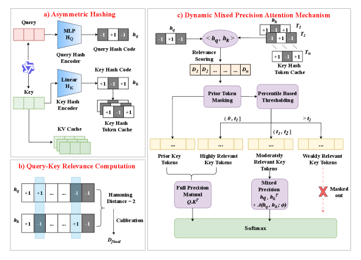
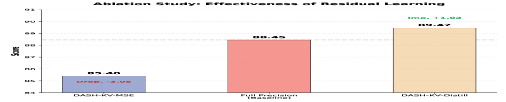
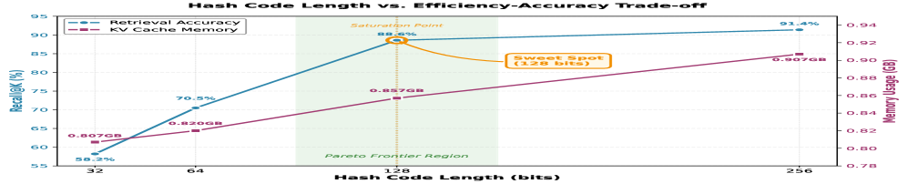
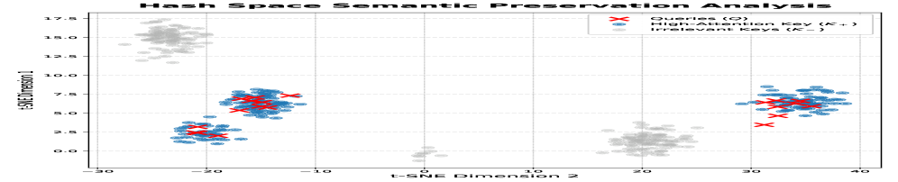
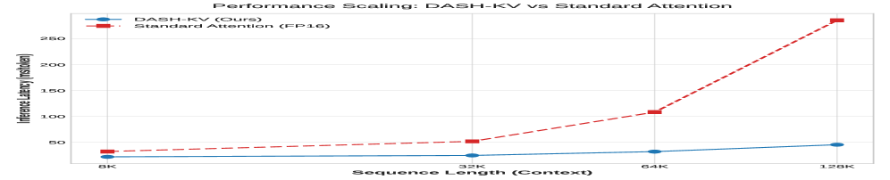
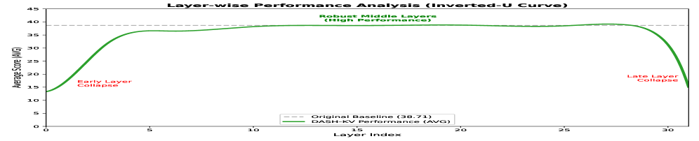

# DASH-KV: Accelerating Long-Context LLM Inference via Asymmetric KV Cache Hashing

## 一、论文概述

| 项目 | 内容 |
|------|------|
| **标题** | DASH-KV: Accelerating Long-Context LLM Inference via Asymmetric KV Cache Hashing |
| **作者** | Jinyu Guo, Zhihan Zhang, Jiehui Xie, Md. Tamim Iqbal, Dongshen Han, Lik-Hang Lee, Sung-Ho Bae, Jie Zou, Yang Yang, Chaoning Zhang |
| **机构** | University of Electronic Science and Technology of China, Hong Kong Polytechnic University, Kyung Hee University |
| **论文** | https://arxiv.org/abs/2604.19351 |
| **发布** | 2026-04-21 (v1), 2026-05-05 (v4) |

## 二、核心思想

### 问题定义

标准注意力机制的二次计算复杂度是大语言模型长上下文推理的根本瓶颈。现有KV缓存压缩方法虽然缓解了内存压力，但往往牺牲生成质量，且无法解决浮点运算的高开销问题。

**现有方法的局限**：
- **量化压缩**：低位宽导致性能显著下降，需要反量化开销
- **选择性驱逐**：确定性驱逐导致永久信息丢失
- **结构化共享**：未考虑不同头或层的异构特性

### 解决方案概述

DASH-KV提出了一种创新的加速框架，将注意力机制重新表述为通过非对称深度哈希的近似最近邻搜索：

1. **非对称编码架构**：差异化地映射查询(Query)和键(Key)，考虑它们在精度和重用特性上的差异
2. **动态混合精度机制**：自适应地为关键token保留全精度计算
3. **复杂度降低**：将推理复杂度从O(N²)降低到线性O(N)

**核心优势**：
- 将推理复杂度从O(N²)降低到线性O(N)
- 在LongBench上显著优于SOTA基线
- 匹配全注意力性能
- 使用位操作实现数百倍加速（1-bit vs FP16）

## 三、技术架构

### 整体框架图

**Figure 2**: DASH-KV框架概述。包含三个关键阶段：
- (a) **非对称哈希**：查询通过轻量级MLP动态编码，键静态映射以高效存储
- (b) **查询-键相关性计算**：使用汉明距离进行快速粗粒度过滤
- (c) **动态混合精度注意力机制**：为关键token保留全精度，为中等相关token应用残差补偿，屏蔽不相关键

### 核心公式

#### 1. 哈希距离计算

将注意力机制重新表述为检索问题，使用汉明距离替代浮点点积：

$$\text{dist}_{H}(h_{q}, h_{k}) = \frac{1}{2}(l - \langle h_{q}, h_{k} \rangle)$$

其中 $\langle \cdot, \cdot \rangle$ 表示内积，$l$ 是哈希码长度。较小的汉明距离对应较高的相似度。

#### 2. 跨头共识校准 (Cross-Head Consensus)

利用Transformer的多头注意力机制，聚合所有注意力头对第$i$个Key的选择偏好：

$$\text{Vote}_{i} = \sum_{h'=1}^{H} \mathbb{I}(D_{raw}^{(l,h')}(i) < T_{vote})$$

$$\Delta_{spatial}(i) = -\beta_{spatial} \cdot \frac{\text{Vote}_{i}}{H}$$

其中$\beta_{spatial}$是可学习参数，控制跨头共识的强度。如果Vote_i较大，表示头之间存在共识，应用负校正以增加其重要性。

#### 3. 跨层动量校准 (Cross-Layer Momentum)

利用前一层的注意力分布作为先验信息：

$$\Delta_{temporal}(i) = -\gamma_{temporal} \cdot \sigma(A_{i}^{(l-1)})$$

其中$A_{i}^{(l-1)}$是前一层第$i$个Key的注意力分数，$\sigma(\cdot)$是归一化函数(如Sigmoid)，$\gamma_{temporal}$是可学习参数。

#### 4. 最终校准距离

$$D_{final}(i) = D_{raw}(i) + \Delta_{spatial}(i) + \Delta_{temporal}(i)$$

通过设置$\beta_{spatial}$和$\gamma_{temporal}$为可学习参数，模型可以自适应地融合空间(多头)和时间(多层)结构先验。

### 非对称哈希编码

#### Query编码器 (轻量级MLP)

$$h_{q}^{(1)} = \text{GELU}(\text{LayerNorm}(W_1 Q))$$
$$h_{q}^{(2)} = \text{GELU}(W_2 h_{q}^{(1)})$$
$$v_q = W_3 h_{q}^{(2)} \in \mathbb{R}^l$$

其中$W_1 \in \mathbb{R}^{d \times 256}$, $W_2 \in \mathbb{R}^{256 \times 256}$, $W_3 \in \mathbb{R}^{256 \times l}$。

#### 训练时使用Scaled tanh策略

$$\tilde{h}_q = \tanh(\beta \cdot v_q)$$

动态退火调度：$\beta = \min(10.0, 1.0 + \text{global\_step} \times 0.001)$

#### Key编码器 (线性投影)

$$z_k = W_k K$$
$$h_k = \text{sign}(z_k) \in \{-1, +1\}^l$$

其中$W_k \in \mathbb{R}^{d \times l}$是可学习权重矩阵。

### 动态混合精度注意力

基于校准距离$D_{final}$，将Key分为三个层级：

1. **高度相关** ($D \leq t_1$): 保留全精度计算 $Q \cdot K^T$
2. **中度相关** ($t_1 < D \leq t_2$): 采用"哈希+残差"混合方案
3. **弱相关** ($D > t_2$): 排除计算但不丢弃

自适应百分位阈值：
$$t_1 = \text{percentile}(D_{final}, p_1)$$
$$t_2 = \text{percentile}(D_{final}, p_2)$$

#### 残差补偿机制

$$\mathcal{S} = \frac{h_q h_k^T}{d_h} + \Delta(h_q, h_k; \phi)$$

其中$h_q \cdot h_k^T$提供快速粗略估计，$\Delta$负责拟合哈希近似分布与真实分布之间的残差。实现零初始化策略(Goyal et al., 2017)。

### 损失函数设计

#### 主损失函数 (列表级蒸馏)

$$\mathcal{L}_{\text{distill}} = \text{KL}(P_{\text{student}} \| P_{\text{teacher}})$$

引入非对称温度缩放机制，放大相关和不相关key之间的数值区分。

#### 辅助约束

**位平衡损失** (最大化信息熵)：
$$\mathcal{L}_{\text{bal}} = \|\text{mean}(h_q)\| + \|\text{mean}(h_k)\|$$

**量化损失** (约束输出逼近{-1, +1})：
$$\mathcal{L}_{\text{quant}} = \mathbb{E}[(|h_q| - 1)^2] + \mathbb{E}[(|h_k| - 1)^2]$$

#### 总损失

$$\mathcal{L} = \mathcal{L}_{\text{distill}} + \alpha \cdot \mathcal{L}_{\text{bal}} + \beta \cdot \mathcal{L}_{\text{quant}}$$

其中$\alpha = \beta = 0.1$，确保主导梯度信号来自与教师模型分布的对齐。

## 四、核心创新

| 创新点 | 说明 | 理论/实验依据 |
|--------|------|---------------|
| 非对称哈希框架 | Query使用MLP动态编码，Key使用线性投影静态编码 | 考虑Query动态性和Key持久性的本质差异 |
| 跨头共识校准 | 利用多头注意力的"多数投票"机制 | 缓解单个头误判的影响 |
| 跨层动量校准 | 利用前一层注意力分布作为先验 | 捕获Transformer深层结构的时间依赖性 |
| 动态混合精度 | 自适应百分位阈值分类Key | 适应不同序列长度的分布变化 |
| 残差补偿 | "哈希+残差"混合方案 | 校正哈希量化误差 |

## 五、实验结果

### 实验设置

**骨干模型**：
- Qwen2-7B-Instruct
- Llama-3.1-8B-Instruct
- Qwen2.5-14B-Instruct

**评估任务** (LongBench)：
- NarrativeQA (单文档摘要)
- HotpotQA (多跳推理)
- Qasper (学术论文问答)
- MultiNews (多文档摘要)
- GovReport (政府报告理解)
- TriviaQA (事实问答)

**实现细节**：
- 训练序列长度：3k tokens
- 推理序列长度：32k tokens
- 哈希码格式：FP16模拟(基于1-bit打包存储模型)

### 基准测试结果 (LongBench)

| 方法 | 类型 | NarrativeQA | HotpotQA | Qasper | MultiNews | GovReport | TriviaQA | 平均 |
|------|------|-------------|----------|--------|-----------|-----------|----------|------|
| **Qwen2-7B-Instruct** | | | | | | | | |
| Full Attn | Dense | 25.13 | 44.04 | 46.13 | 15.42 | 18.06 | 83.47 | 38.71 |
| StreamLLM | Eviction | 20.47 | 14.31 | 26.97 | 24.88 | 25.70 | 76.56 | 31.48 |
| H2O | Eviction | 22.88 | 13.30 | 34.28 | 22.72 | 23.69 | 88.75 | 34.27 |
| SnapKV | Retrieval | 23.86 | 15.60 | 38.61 | 23.07 | 24.56 | 89.31 | 35.84 |
| **DASH-KV** | Retrieval | **24.65** | **44.50** | **45.34** | **15.40** | **19.13** | **83.33** | **38.73** |
| **Llama-3.1-8B-Instruct** | | | | | | | | |
| Full Attn | Dense | 28.11 | 57.43 | 45.29 | 15.20 | 19.97 | 90.22 | 42.70 |
| StreamLLM | Eviction | 13.60 | 11.70 | 20.10 | 24.70 | 21.50 | 71.10 | 27.12 |
| H2O | Eviction | 23.10 | 16.00 | 21.30 | 23.40 | 22.30 | 90.20 | 32.72 |
| SnapKV | Retrieval | 21.30 | 16.60 | 30.80 | 26.30 | 22.20 | 90.20 | 34.57 |
| **DASH-KV** | Retrieval | 27.61 | **58.01** | **45.35** | 14.90 | 19.25 | 89.47 | **42.43** |
| **Qwen2.5-14B-Instruct** | | | | | | | | |
| Full Attn | Dense | 28.20 | 61.98 | 45.52 | 14.19 | 16.78 | 86.91 | 42.26 |
| StreamLLM | Eviction | 18.30 | 16.40 | 23.40 | 16.04 | 19.01 | 74.10 | 27.87 |
| H2O | Eviction | 24.40 | 18.00 | 27.60 | 20.99 | 18.96 | 89.70 | 33.28 |
| SnapKV | Retrieval | 24.10 | 20.00 | 34.60 | 20.90 | 18.97 | 90.00 | 34.76 |
| **DASH-KV** | Retrieval | **29.52** | 61.83 | **45.79** | 14.44 | 18.06 | 87.88 | **42.92** |

### 效率vs精度权衡分析

| 变体 | Recall@100 | KL(Ph\|\|Pf) | 每Token延迟(%) |
|------|------------|--------------|----------------|
| DASH-KV-Naive | 8.91 | 3.2000 | 28 |
| DASH-KV-Sym | 68.28 | 1.3200 | 38 |
| **DASH-KV (Ours)** | **86.06** | **0.4054** | **22** |

### 消融研究

**残差学习有效性**：
- Pure Hash (无残差补偿) vs DASH-KV-MSE vs DASH-KV-Distill
- 蒸馏训练显著优于MSE训练

**组件有效性**：
- 非对称设计大幅优于对称哈希
- LSH检索精度显著低于训练的哈希编码器

### 关键分析

**关键发现**：
1. **性能匹配全注意力**：DASH-KV在多个任务上匹配甚至超越全精度注意力的性能
2. **显著效率提升**：通过汉明距离计算实现数百倍加速 (1-bit vs FP16)
3. **非对称设计优势**：相比对称哈希，非对称设计大幅提升精度
4. **残差补偿有效性**：KL散度从1.3200降低到0.4054
5. **层敏感性**：呈现U型曲线，浅层和深层更敏感

## 六、相关工作

### KV缓存优化方法

| 方法类别 | 代表方法 | 特点 | 局限 |
|----------|----------|------|------|
| 量化压缩 | KIVI, Atom, MARLIN | 降低数值精度 | 超低比特性能下降，反量化开销 |
| 选择性驱逐 | StreamingLLM, H2O, SnapKV | 保留重要token | 永久信息丢失 |
| 结构化共享 | GQA, MQA | 跨头/层共享参数 | 缺乏适应性 |

### 深度哈希方法

| 方法 | 特点 |
|------|------|
| LSH | 局部敏感哈希，随机投影 |
| ITQ | 迭代量化 |
| DSH | 深度监督哈希 |

### DASH-KV的定位

DASH-KV属于**检索式方法**，通过深度哈希实现近似最近邻搜索，在保持信息完整性的同时实现高效检索。

## 七、总结

### 核心贡献

1. **新颖的问题重构**：将注意力计算重新表述为通过深度哈希的近似最近邻搜索
2. **非对称编码架构**：差异化处理Query和Key，考虑其本质特性差异
3. **动态混合精度机制**：自适应保留关键token的全精度计算
4. **显著性能提升**：在LongBench上匹配全注意力性能，同时将复杂度从O(N²)降至O(N)

### 技术影响

- **注意力加速**：为长上下文推理提供了新的加速范式
- **哈希应用**：展示了深度哈希在注意力机制中的潜力
- **系统优化**：为设计更高效的推理系统提供了新思路
- **理论基础**：建立了注意力与检索之间的理论联系

### 局限性

1. 需要额外的哈希编码训练开销
2. 残差补偿网络增加了一定的计算复杂度
3. 在极短序列上可能无法充分体现优势
4. 需要为每个模型训练哈希编码器

## 八、参考资源

- 论文: https://arxiv.org/abs/2604.19351
- FlashAttention: https://arxiv.org/abs/2205.14135
- H2O: https://github.com/FMInference/H2O
- SnapKV: https://arxiv.org/abs/2404.02112
- LongBench: https://arxiv.org/abs/2308.14508

## 九、图片索引

| 图片 | 说明 | 文件名 |
|------|------|--------|
| Figure 1 | 标准注意力机制与大规模检索的对齐关系 | `attention-retrieval-alignment.jpg` |
| Figure 2 | DASH-KV框架概览 | `dash-kv-framework-overview.jpg` |
| Figure 3 | TriviaQA消融研究F1分数对比 | `ablation-triviaqa-f1.jpg` |
| Figure 4 | 效率与精度的Pareto前沿 | `pareto-efficiency-accuracy.jpg` |
| Figure 5 | 哈希码的t-SNE可视化 | `tsne-hash-codes.jpg` |
| Figure 6 | 延迟扩展曲线 | `latency-scaling-curves.jpg` |
| Figure 7 | 层敏感性的U型曲线 | `layer-sensitivity-ucurve.jpg` |
| Figure 8 | 数值大小差异分析 | `numerical-magnitude-divergence.jpg` |
| Figure 9 | Query和Key分布特征可视化 | `query-key-distribution-visualization.jpg` |
