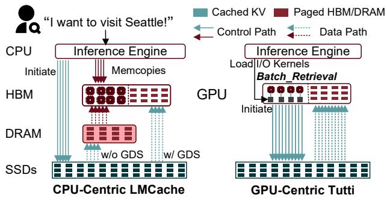
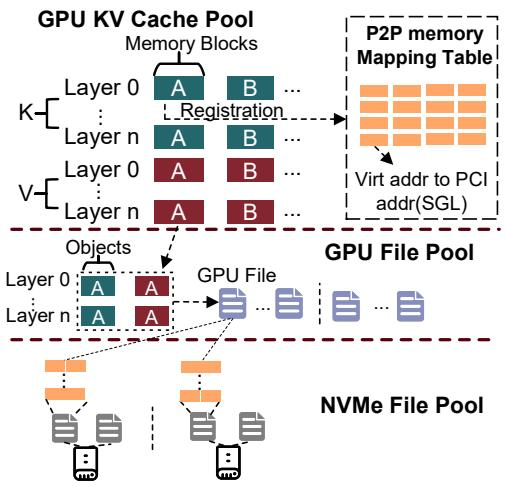
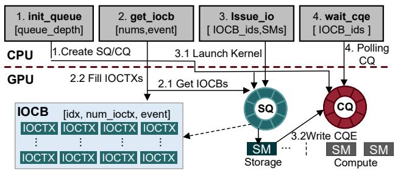
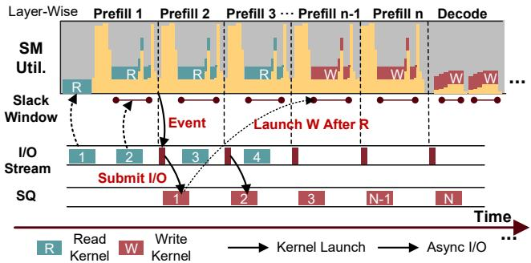
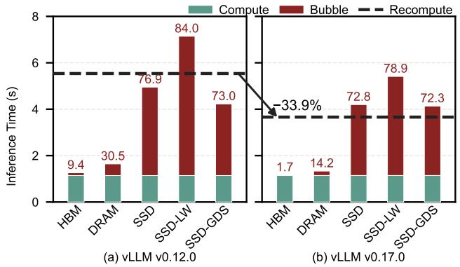
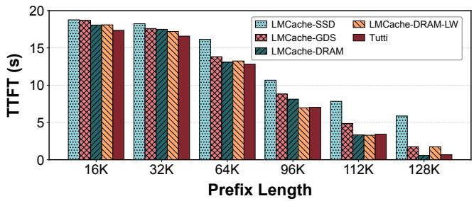
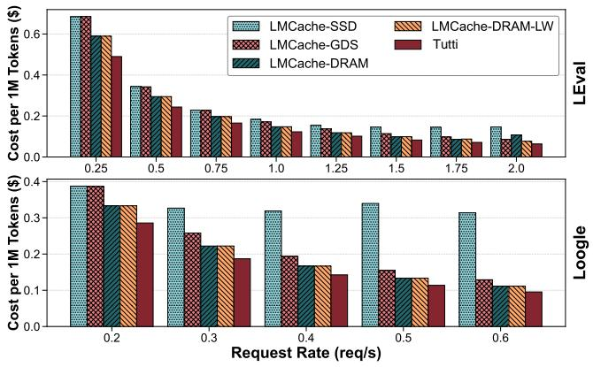

# Tutti: Making SSD-Backed KV Cache Practical for Long-Context LLM Serving

## 一、论文概述

| 项目 | 内容 |
|------|------|
| **标题** | Tutti: Making SSD-Backed KV Cache Practical for Long-Context LLM Serving |
| **作者** | Shi Qiu, Wenhao Zhu, Kaiqiang Xu, Yifan Hu, Jianqin Yan, Kai Chen, Xintao Wang, Hao Chen, Yiming Zhang |
| **机构** | Xiamen University, HKUST, Shanghai Jiao Tong University |
| **论文** | [arXiv:2605.03375](https://arxiv.org/abs/2605.03375) |
| **代码** | - |
| **发布** | 2025年5月 |
| **许可** | - |

## 二、核心思想

### 问题定义

LLM服务依赖前缀缓存来提高推理性能。随着不断增长的上下文将键值（KV）缓存占用推到远超GPU HBM和CPU DRAM容量，KV缓存越来越多地卸载到NVMe SSD。不幸的是，从SSD恢复KV缓存存在**严重的I/O性能问题**，导致显著的GPU停顿。

**根本原因**：
1. **碎片化GPU内存布局**：导致大量微小随机I/O
2. **CPU瓶颈**：即使使用GPU Direct Storage（GDS），仍需CPU干预启动每个I/O
3. **CPU中心设计**：GDS仍以CPU为中心，成为严重瓶颈

### 解决方案概述

本文提出Tutti，一个高效的SSD支持KV缓存解决方案，**从HBM和SSD之间的关键数据和I/O控制路径中消除CPU干预**：

1. **GPU中心KV缓存对象存储**：CPU仅负责每层异步加载I/O内核到GPU
2. **GPU原生对象抽象**：支持批量KV缓存传输和管理
3. **GPU io_uring**：支持异步GPU直接对象I/O
4. **松弛感知I/O调度**：避免GPU资源争用

**核心优势**：
- 饱和NVMe SSD带宽，将GPU停顿减少到接近零
- 相比SOTA GDS支持的LMCache，TTFT减少78.3%
- 可实现请求率提高2倍
- 服务成本降低27%
- 实现与DRAM支持的LMCache几乎相同的推理性能，同时提供几乎无限的容量

## 三、技术架构

### 整体框架图

**Figure 1**: CPU中心KV缓存存储（LMCache w/和w/o GDS）与GPU中心Tutti的比较。Tutti从HBM和SSD之间的关键数据和I/O控制路径中消除CPU干预。

### 核心设计

#### GPU中心KV缓存对象存储

**核心思想**：CPU仅负责每层异步加载I/O内核到GPU，消除CPU从关键路径。

**Figure 4**: GPU中心KV缓存存储的布局。

#### GPU原生对象抽象

**设计目标**：支持批量KV缓存传输和管理。

**关键特性**：
- 批量传输：减少I/O操作数量
- 对象管理：高效的元数据管理
- 内存布局优化：减少碎片化

#### GPU io_uring

**Figure 5**: GPU io_uring的架构和I/O过程。

**设计目标**：支持异步GPU直接对象I/O。

**关键特性**：
- 异步I/O：避免阻塞GPU
- 直接存储：绕过CPU干预
- 高效调度：优化I/O队列管理

#### 松弛感知I/O调度

**Figure 7**: 松弛感知I/O调度器。

**设计目标**：避免GPU资源争用。

**关键特性**：
- 松弛感知：根据GPU计算松弛调度I/O
- 资源隔离：避免I/O与计算争用
- 带宽饱和：充分利用SSD带宽

### 推理性能

**Figure 2**: vLLM在Llama3-8B上使用LMCache的推理性能，跨HBM、DRAM和SSD层（序列长度=64K，命中率=75%）。DRAM接近HBM，而SSD和GDS导致大量GPU气泡。

**关键发现**：
- DRAM保持接近HBM的性能
- SSD和GDS导致严重GPU停顿
- 随LLM引擎持续优化推理计算，从SSD恢复KV缓存不再有益（vLLM v0.12.0 vs. v0.17.0）

### TTFT比较

**Figure 11**: 在Llama3-8B-Instruct上跨不同前缀长度的TTFT性能比较（单GPU）。Tutti展示了卓越的I/O效率，相比LMCache-GDS实现最多61.4%的TTFT降低。

### 成本比较

**Figure 14**: 跨LEval和LooGL工作负载的每百万token推理成本。Tutti通过利用SSD实现最低成本。

## 四、核心创新

| 创新点 | 说明 | 理论/实验依据 |
|--------|------|---------------|
| **GPU中心架构** | 从关键路径消除CPU干预 | 架构比较分析 |
| **GPU原生对象抽象** | 批量KV缓存传输和管理 | 带宽测试 |
| **GPU io_uring** | 异步GPU直接对象I/O | I/O性能测试 |
| **松弛感知调度** | 避免GPU资源争用 | 调度器分析 |
| **vLLM集成** | 集成到vLLM推理引擎 | 端到端评估 |

## 五、实验结果

### TTFT性能

**评估配置**：
- 模型：Llama3-8B-Instruct, GLM-4-9B-1M
- 序列长度：64K-640K
- GPU：单GPU和多GPU配置

**关键结果**：
- 相比LMCache-GDS，TTFT减少78.3%（在严格SLO约束下）
- 可实现请求率提高2倍
- 服务成本降低27%

### 分布式可扩展性

**关键发现**：
- 在512K/640K序列长度下，LMCache-GDS出现OOM失败
- Tutti通过避免暂存缓冲区开销克服了此问题
- 在640K序列长度下实现最佳TTFT 1.2秒

### 延迟分解

**关键发现**：
- 层异步机制将关键交叉点推到98.3%的极高缓存命中率
- 在测试范围内保持接近最优的计算受限状态

### 成本效益

**关键发现**：
- 跨LEval和LooGL工作负载，Tutti实现最低成本
- 通过利用SSD提供几乎无限容量

## 六、相关工作

### KV缓存卸载

| 方法 | 关键特性 | 本文对比 |
|------|----------|----------|
| **LMCache** | KV缓存卸载框架 | 主要对比基准 |
| **GDS** | GPU Direct Storage | 基准对比 |
| **Mooncake** | KVCache-centric分离架构 | 相关工作 |

### I/O优化

| 方法 | 关键特性 | 本文对比 |
|------|----------|----------|
| **io_uring** | Linux异步I/O接口 | 设计启发 |
| **GPU Direct** | GPU直接内存访问 | 基础技术 |

### 推理引擎

| 方法 | 关键特性 | 本文对比 |
|------|----------|----------|
| **vLLM** | 高效推理引擎 | 集成目标 |
| **SGLang** | 结构化生成语言 | 相关工作 |

## 七、总结

### 核心贡献

1. **GPU中心架构**：从HBM和SSD之间的关键数据和I/O控制路径中消除CPU干预
2. **GPU原生对象抽象**：支持批量KV缓存传输和管理
3. **GPU io_uring**：支持异步GPU直接对象I/O
4. **松弛感知I/O调度**：避免GPU资源争用，饱和SSD带宽
5. **显著性能提升**：相比LMCache-GDS，TTFT减少78.3%，请求率提高2倍，成本降低27%

### 技术影响

- **KV缓存管理**：为长上下文LLM服务提供了实用的SSD支持KV缓存方案
- **I/O优化**：展示了GPU中心I/O架构的潜力
- **系统设计**：为设计高效的存储层次提供了新思路
- **工程实践**：提供了完整的vLLM集成方案

### 局限性

- **硬件依赖**：需要支持GPU Direct Storage的硬件
- **SSD性能**：依赖NVMe SSD的带宽和延迟
- **模型规模**：主要在8B-9B模型上评估
- **工作负载**：主要在长上下文工作负载上验证

## 八、参考资源

- **论文**: https://arxiv.org/abs/2605.03375
- **vLLM**: https://github.com/vllm-project/vllm
- **LMCache**: https://github.com/LMCache/LMCache
- **GPU Direct Storage**: https://developer.nvidia.com/gpudirect-storage
- **io_uring**: https://kernel.dk/io_uring.pdf
