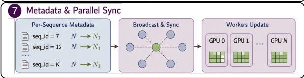
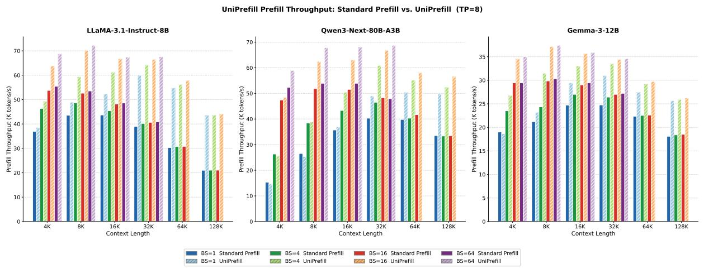

# UniPrefill: Universal Long-Context Prefill Acceleration via Block-wise Dynamic Sparsification

## 一、论文概述

| 项目 | 内容 |
|------|------|
| **标题** | UniPrefill: Universal Long-Context Prefill Acceleration via Block-wise Dynamic Sparsification |
| **作者** | Qihang Fan, Huaibo Huang, Zhiying Wu, Bingning Wang, Ran He |
| **机构** | CASIA, UCAS, WeChat/Tencent |
| **论文** | [arXiv:2605.06221](https://arxiv.org/abs/2605.06221) |
| **代码** | [GitHub](https://github.com/qhfan/UniPrefill) |
| **发布** | 2025年5月 |
| **许可** | - |

## 二、核心思想

### 问题定义

随着大语言模型（LLM）的快速发展，上下文长度需求急剧增长。为提高长上下文推理效率，研究者提出了多种低复杂度混合架构（如线性/全注意力混合、滑动窗口/全注意力混合）。然而，现有的长上下文预填充加速研究主要集中在稀疏注意力机制上，这些方法：

1. **架构限制**：仅在全注意力模型上达到最大加速效果，迁移到混合架构时性能显著下降
2. **批处理不兼容**：通常不兼容连续批处理（continuous batching），难以集成到vLLM等现代推理引擎

### 解决方案概述

本文提出UniPrefill，一个适用于任何模型架构的预填充加速框架：

1. **token级加速**：直接在token级别加速模型计算，而非仅加速注意力层
2. **块级动态稀疏化**：在全注意力层估计token重要性，然后将稀疏性传播到所有后续层
3. **vLLM深度集成**：实现为连续批处理算子，扩展vLLM调度策略支持预填充-解码协同处理

**核心优势**：
- 架构无关：适用于全注意力、线性/全注意力混合、滑动窗口/全注意力混合等架构
- 最高2.1倍TTFT加速，随并发请求数增加加速效果更明显
- 与vLLM无缝集成，支持张量并行
- 几乎无精度损失

## 三、技术架构

### 整体框架图

**Figure 2**: UniPrefill概述。左：UniPrefill通过最后n个查询的块级注意力分数估计token重要性(1)，保留累积重要性达到p的最小token块集(2)，并将稀疏性传播到每个重复层模式内的所有后续子层(3)。右：UniPrefill通过融合内核流水线(4)深度集成到vLLM中，KV缓存块表(5)、每层序列长度跟踪(6)和张量并行元数据同步(7)相应更新。

### 核心公式

#### Token重要性估计

在块b的全注意力层，token i对下一个token预测的贡献：

$$
\mathbf{h}_N^{(b,1)} = \sum_{i=1}^N \mathbf{A}_{N,i}^{(b)} \cdot \mathbf{v}_i^{(b)} + \mathbf{h}_N^{(b,0)} \tag{2}
$$

为减少估计方差，聚合最后n个查询位置：

$$
s_i^{(b)} = \frac{1}{n} \sum_{j=N-n+1}^N \mathbf{A}_{j,i}^{(b)} \tag{3}
$$

#### 块级评分

将输入序列划分为大小为G的非重叠块 $\mathcal{B}_g$，计算块级分数：

$$
\bar{s}_g^{(b)} = \frac{1}{G} \sum_{i \in \mathcal{B}_g} \frac{1}{n} \sum_{j=N-n+1}^N \mathbf{A}_{j,i}^{(b)} \tag{4}
$$

#### Top-p Token选择

保留累积重要性达到p的最小块集：

$$
\mathcal{S}^{(b)} = \{\pi(1), \dots, \pi(k^*)\}, \quad k^* = \min k \text{ s.t. } \frac{\sum_{j=1}^k \bar{s}_{\pi(j)}^{(b)}}{\sum_g \bar{s}_g^{(b)}} \geqslant p \tag{5}
$$

**误差界**：丢弃集 $\bar{\mathcal{S}}^{(b)}$ 对保留位置j的扰动满足：

$$
\|\Delta \mathbf{h}_j^{(b,1)}\| \leqslant (1-p) \cdot V_{\max}^{(b)} \tag{6}
$$

设置p=0.99保证最多丢弃1%的总注意力质量。

#### 稀疏性传播

在块b的全注意力层进行token选择后，丢弃的token被排除在所有后续子层之外：

$$
\mathbf{H}_{\mathcal{S}}^{(b,m+1)} = f_m(\mathbf{H}_{\mathcal{S}}^{(b,m)}), \quad m = 1, \dots, M_b \tag{7}
$$

在块b+1，通过携带丢弃token状态前向传播来重建完整序列：

$$
\mathbf{H}_i^{(b+1,0)} = \begin{cases} \mathbf{H}_i^{(b,M_b+1)} & i \in \mathcal{S}^{(b)} \\ \mathbf{H}_i^{(b,0)} & i \in \bar{\mathcal{S}}^{(b)} \end{cases} \tag{8}
$$

#### FLOPs分析

设 $\mathcal{L}_{\text{drop}} = \{\ell_1, \ell_2, ...\}$ 为应用丢弃的层集，$\rho_k$ 为第k次丢弃后的保留率。总FLOPs节省：

$$
\Delta\text{FLOPs} = \sum_k (1-\rho_k) \cdot \sum_{\ell > \ell_k} \text{FLOPs}_\ell(N) \tag{9}
$$

与稀疏注意力的FLOPs节省比：

$$
\frac{\Delta\text{FLOPs}_{\text{UniPrefill}}}{\Delta\text{FLOPs}_{\text{SparseAttn}}} = \frac{(L-\ell_1) \cdot N d^2}{N^2 d_k} \xrightarrow{N \to \infty} \infty \tag{11}
$$

在长上下文场景（$N \gg d$）中，UniPrefill的GEMM节省占主导地位。

### 融合内核设计

内核流水线：

$$
\mathbf{S} = \mathbf{Q}_{[N-n:N]} \mathbf{K}^\top \xrightarrow{\text{online softmax}} \mathbf{o} \xrightarrow{\text{block reduce}} \mathbf{b} \xrightarrow{\text{top-p}} \mathcal{M} \tag{13}
$$

**Top-p内核**：在GPU上完全执行排序和阈值操作，无需CPU往返。使用IEEE-754位转换映射将(score, index)对编码为单个int64字：

$$
\varphi(x) = \begin{cases} \text{bits}(x) \oplus \text{0x80000000} & x \geqslant 0 \\ \text{bits}(x) \oplus \text{0xFFFFFFFF} & x < 0 \end{cases} \Rightarrow \text{packed} = (\varphi(b_g) \ll 32) | g \tag{14}
$$

### 张量并行支持

在张量并行度T下，每个rank仅观察1/T的注意力头，产生部分块分数 $\mathbf{b}^{(t)}$。通过all-reduce同步：

$$
\mathbf{b} = \sum_{t=1}^T \mathbf{b}^{(t)} \tag{15}
$$

确保所有TP rank的一致丢弃决策。

## 四、核心创新

| 创新点 | 说明 | 理论/实验依据 |
|--------|------|---------------|
| **架构无关加速** | token级加速而非仅注意力层加速 | 混合架构上的实验结果 |
| **稀疏性传播** | 全注意力层的丢弃决策传播到所有后续层 | FLOPs分析公式(9)-(11) |
| **Top-p选择** | 自适应保留集大小，提供均匀误差界 | 误差界公式(6) |
| **连续批处理集成** | 实现为vLLM连续批处理算子 | vLLM调度策略扩展 |
| **融合内核** | 4个融合内核的流水线设计 | GPU上的完整实现 |

## 五、实验结果

### 吞吐量比较

**Figure 1**: Standard Prefill与UniPrefill在三种模型架构和不同批量大小下的预填充吞吐量比较（张量并行大小设为8）。

**评估模型**：
- LLaMA-3.1-Instruct-8B（全注意力）
- Qwen3-Next-80B-A3B（线性/全注意力混合）
- Gemma-3-12B（滑动窗口/全注意力混合）

**关键结果**：
- 在所有三种架构上，UniPrefill consistently achieves higher throughput
- 随上下文长度增加和批量大小增大，加速效果更明显
- 最高2.1倍TTFT加速

### 精度评估

**评估基准**：RULER长上下文基准

**关键发现**：
- UniPrefill不引入显著精度退化
- 在各种上下文长度下保持稳定性能
- 与全注意力模型性能相当

### 并发扩展性

**关键发现**：
- 加速随并发请求数增加而提升
- 特别适合高并发生产服务场景
- 预填充成本是主导瓶颈时效果最佳

## 六、相关工作

### 混合LLM架构

| 方法 | 关键特性 | 本文对比 |
|------|----------|----------|
| **线性/全注意力混合** | 用线性递归机制替换部分注意力层 | 目标架构 |
| **滑动窗口/全注意力混合** | 大多数层限制在局部上下文窗口 | 目标架构 |
| **Mamba/RWKV** | 状态空间模型/线性注意力 | 潜在应用 |

### 稀疏注意力预填充加速

| 方法 | 关键特性 | 本文对比 |
|------|----------|----------|
| **MInference** | 识别静态/动态稀疏模式 | 主要对比基准 |
| **FlexPrefill** | 单个请求独立操作 | 对比基准 |
| **SnapKV** | 观察窗口识别重要token | 关系分析 |

### 推理引擎

| 方法 | 关键特性 | 本文对比 |
|------|----------|----------|
| **vLLM** | 高效推理引擎，连续批处理 | 集成目标 |
| **TensorRT-LLM** | NVIDIA推理优化 | 潜在集成 |

## 七、总结

### 核心贡献

1. **UniPrefill框架**：提出token级预填充加速框架，在全注意力层丢弃token并将稀疏性传播到所有后续层，同时减少注意力和GEMM FLOPs
2. **架构无关设计**：适用于全注意力、线性/全注意力混合、滑动窗口/全注意力混合等架构
3. **vLLM深度集成**：实现为连续批处理算子，扩展vLLM调度策略支持预填充-解码协同处理和张量并行
4. **融合内核实现**：4个融合内核的流水线设计，GPU上完整执行
5. **显著加速效果**：最高2.1倍TTFT加速，随并发请求数增加加速效果更明显

### 技术影响

- **推理效率**：为长上下文推理提供了通用的预填充加速方案
- **混合架构支持**：首次为新兴混合架构提供有效的预填充加速
- **生产部署**：与vLLM无缝集成，支持生产级部署
- **工程实践**：提供了完整的vLLM集成方案

### 局限性

- **稀疏性传播假设**：假设丢弃token的状态可以简单携带前向传播
- **重要性估计开销**：需要额外的注意力计算来估计token重要性
- **块大小敏感**：块大小G的选择可能影响性能
- **模型依赖**：需要为每个模型架构调优参数

## 八、参考资源

- **论文**: https://arxiv.org/abs/2605.06221
- **代码**: https://github.com/qhfan/UniPrefill
- **vLLM**: https://github.com/vllm-project/vllm
- **MInference**: https://arxiv.org/abs/2407.02490
- **SnapKV**: https://arxiv.org/abs/2404.02112
