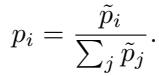
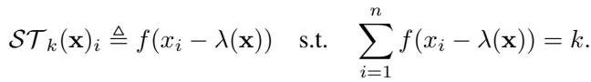
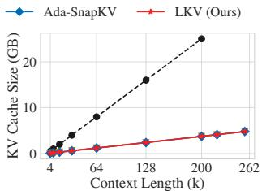
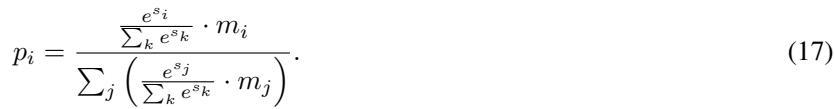
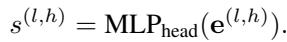

# LKV: End-to-End Learning of Head-wise Budgets and Token Selection for LLM KV Cache Eviction

## 一、论文概述

| 项目 | 内容 |
|------|------|
| **标题** | LKV: End-to-End Learning of Head-wise Budgets and Token Selection for LLM KV Cache Eviction |
| **作者** | Enshuai Zhou, Yifan Hao, Chao Wang, Rui Zhang, Di Huang, Jiaming Guo, Xing Hu, Zidong Du, Qi Guo, Yunji Chen |
| **机构** | Chinese Academy of Sciences |
| **论文** | [arXiv:2605.06676](https://arxiv.org/abs/2605.06676) |
| **代码** | - |
| **发布** | 2025年5月 |
| **许可** | - |

## 二、核心思想

### 问题定义

大语言模型（LLM）中的长上下文推理受限于键值（KV）缓存内存的线性增长。现有KV缓存压缩范式根本受限于启发式方法：启发式预算分配依赖于统计先验而非任务目标，导致资源分配不当；启发式选择依赖于耦合的查询-键交互或静态归纳偏置（如注意力汇聚）。

### 解决方案概述

本文引入LKV（Learned KV Eviction），将KV压缩表述为端到端可微优化问题。LKV集成两个组件：

1. **LKV-H**：学习任务优化的全局预算
2. **LKV-T**：无需物化注意力矩阵即可推导内在KV重要性

**核心优势**：
- 绕过启发式代理，严格将压缩与任务目标对齐
- 在高压缩比率下实现最先进的性能
- 在LongBench上仅保留15% KV缓存即可实现近无损性能

## 三、技术架构

### 核心设计

#### LKV-H：全局学习预算分配

**Figure 1**: KV预算分配策略（15%保留率）。(a) SnapKV：均匀分配。(b) PyramidKV：逐层衰减。(c) DuoAttention：刚性二分类（检索 vs 流式）。(d) Ada-SnapKV：层内自适应但具有均匀层先验。(e) LKV（本文）：学习全局、细粒度策略，无刚性先验优化任务目标。

**关键设计**：
- 通过展平头部结构实现全局竞争
- 允许每个头部通过可学习嵌入竞争总预算
- 打破"金字塔"陷阱：如果任务需要，LKV可以自由地为更深层分配高预算
- 分配完全从数据中学习，不依赖启发式或安全超参数

#### LKV-T：无矩阵选择

- 直接从KV状态通过轻量级网络预测token效用
- 实现无矩阵选择，具有可忽略的线性O(t)开销
- 避免昂贵的O(t²)注意力计算

### 整体框架

**Figure 2**: LKV概述。左（LKV-H）：从头部嵌入学习全局预算比率r。中（LKV-T）：通过Soft-TopK执行可微、查询无关的token选择。右：通过自蒸馏对冻结教师进行端到端优化。

### 核心公式

**蒸馏损失函数**：

$$
\mathcal{L} = \text{distillation\_loss}(\text{student\_output}, \text{teacher\_output})
$$

其中 $\phi$ 表示LKV的可学习参数。

## 四、核心创新

| 创新点 | 说明 | 理论/实验依据 |
|--------|------|---------------|
| **端到端可微优化** | 将KV压缩表述为可微优化问题 | 任务目标对齐 |
| **全局学习预算** | LKV-H学习全局预算分配 | 无刚性先验 |
| **无矩阵选择** | LKV-T无需物化注意力矩阵 | O(t)开销 |
| **自蒸馏训练** | 通过自蒸馏进行端到端优化 | 知识蒸馏 |
| **逐层驱逐** | 在预填充阶段逐层执行 | 降低峰值内存 |

## 五、实验结果

### LongBench性能

**Figure 3**: 不同KV缓存保留比率下的LongBench性能。LKV在低资源环境下表现出鲁棒性。

**关键结果**：
- 在15% KV预算下实现近无损性能
- 在低预算（如10%）下仍保持显著优势
- 在所有预算下都优于基线方法

### RULER基准鲁棒性

**Figure 4**: RULER上的鲁棒性评估（Llama-3.1-8B-Instruct）。

**关键发现**：
- **长上下文扩展性**：上下文从4k扩展到32k时性能稳定（R = 0.15）
- **极端压缩性能**：保留比率从0.5降至0.1时优势更加明显
- **泛化能力**：尽管在16k内训练，但能鲁棒地泛化到未见长度（32k）

### 内存效率

**Figure 5**: Llama-3.1-8B-Instruct上的内存分析（R = 0.15）。

**关键结果**：
- Full Cache在225k tokens时因OOM错误崩溃
- LKV成功扩展到262k及更高
- 通过保持15%预算，将200k长度的实际存储成本从25.0 GB（Full）降至3.75 GB（Ours），实现6.6×减少

### Qwen模型泛化

**Figure 6**: Qwen3-8B在RULER上的性能。(a) 有效上下文长度评估。(b) 激进压缩比率下的性能退化分析。

**关键发现**：LKV在两个维度上都保持优越的稳定性

## 六、相关工作

### KV缓存压缩

| 方法 | 关键特性 | 本文对比 |
|------|----------|----------|
| **SnapKV** | 均匀预算分配 | 基准对比 |
| **PyramidKV** | 逐层衰减预算 | 基准对比 |
| **DuoAttention** | 刚性二分类 | 基准对比 |
| **Ada-SnapKV** | 层内自适应 | 基准对比 |

### Token选择

| 方法 | 关键特性 | 本文对比 |
|------|----------|----------|
| **注意力分数** | 基于注意力权重 | 启发式方法 |
| **注意力汇聚** | 静态归纳偏置 | 启发式方法 |
| **查询-键交互** | 耦合交互 | 启发式方法 |

### 端到端优化

| 方法 | 关键特性 | 本文对比 |
|------|----------|----------|
| **知识蒸馏** | 教师-学生框架 | 训练方法 |
| **可微分优化** | 端到端训练 | 核心方法 |

## 七、总结

### 核心贡献

1. **LKV框架**：提出端到端可微的KV缓存压缩框架
2. **LKV-H**：学习任务优化的全局预算分配，无刚性先验
3. **LKV-T**：无矩阵token选择，O(t)开销
4. **自蒸馏训练**：通过自蒸馏进行端到端优化
5. **显著性能提升**：在15%保留率下实现近无损性能

### 技术影响

- **KV缓存压缩**：为KV缓存压缩提供了端到端学习的方法
- **资源分配**：展示了数据驱动分配的优势
- **长上下文推理**：显著扩展了LLM的上下文长度
- **工程实践**：提供了高效的压缩和推理方案

### 局限性

- **训练开销**：需要额外的训练步骤
- **超参数敏感**：蒸馏损失和学习率需要调优
- **模型依赖**：需要针对不同模型重新训练
- **任务泛化**：不同任务可能需要不同的预算分配

## 八、参考资源

- **论文**: https://arxiv.org/abs/2605.06676
- **SnapKV**: https://arxiv.org/abs/2404.14469
- **PyramidKV**: https://arxiv.org/abs/2406.02069
- **DuoAttention**: https://arxiv.org/abs/2410.10819
- **LongBench**: https://arxiv.org/abs/2308.14508
- **RULER**: https://arxiv.org/abs/2404.06654
